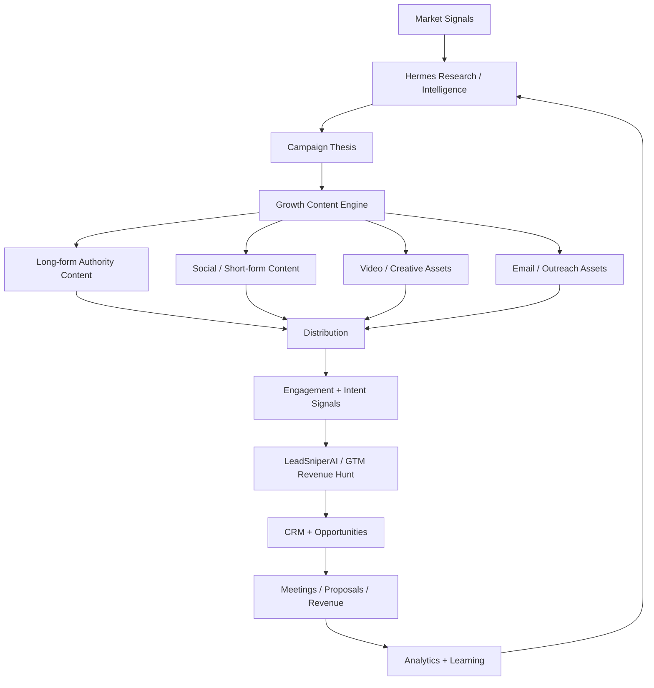

# Content Growth Strategies — 1:many Demand-Generation Workflow

> **Status: POTENTIAL WORKFLOW** — captured from Notion as a candidate operating model. Not yet installed as a live Hermes capability. Review before adopting.

## Purpose
Build a repeatable growth program that converts market intelligence into authority, demand, qualified opportunities, and measurable revenue. Hermes is the orchestrator. The `cporter202/automate-for-growth` repository is adopted as a **practical content-production and distribution reference layer — not the core operating system.**

## Executive Objective
Connects the existing GTM Revenue Hunt (1:1) to a scalable **1:many demand-generation engine**.

> **Signals → Intelligence → Campaign Thesis → Content → Distribution → Engagement → Opportunity → Revenue → Learning**

Content is created because market evidence indicates what the audience currently cares about, fears, needs, searches for, or is preparing to buy — not because a calendar says a post is due.

## Strategic Outcome — Five Compounding Outcomes
1. **Authority** — establish the client/operator as a credible source of useful market knowledge.
2. **Visibility** — consistent presence across search, social, video, local channels, and owned media.
3. **Demand** — turn relevant market problems and signals into commercial conversations.
4. **Pipeline** — connect engagement and intent to CRM records, opportunities, meetings, proposals, and revenue.
5. **Learning** — continuously identify which messages, offers, channels, signals, and formats produce business results.

## Growth Operating Model

## Role of `automate-for-growth`
Treat as a **Growth Marketing Skills and Execution Library** for the Hermes Content Agent. Useful concepts:
- content-system design rather than one-off publishing
- content pillars and repurposing
- bulk content generation
- AI-assisted video workflows
- multi-platform distribution
- brand-authority content
- SEO and long-form publishing
- analytics and optimization
- API-driven content automation
- agency/team operating practices

**Not** the system of record, CRM, intelligence layer, or revenue engine. Those remain with Hermes, GTM Revenue Hunt, LeadSniperAI, the CRM, and the analytics/attribution stack.

## Growth Content Engine (proposed Hermes capability)
Recommended internal skills:
- `/content-research` — identify current audience questions, market signals, competitor themes, review issues, search intent, emerging opportunities.
- `/content-strategy` — turn evidence into campaign themes, audience segments, offers, narratives, content pillars.
- `/content-factory` — produce long-form, short-form, video scripts, emails, FAQs, case-study structures, derivatives.
- `/content-distribute` — format and route approved assets to relevant channels.
- `/content-optimize` — analyze performance and feed winning patterns back into future campaigns.

Recommended master command: `/growth-campaign <client>`

## Standard Growth Campaign Workflow
1. **Collect Signals** — market news, customer reviews, Google/Localo intelligence, search behavior, competitor activity, community sentiment, hiring/expansion signals, CRM questions and objections.
2. **Select the Commercial Theme** — What is changing? Why does the target audience care? What business consequence exists? What point of view can the client credibly own?
3. **Define the Campaign Objective** — awareness, authority, education, lead generation, meeting generation, reputation defense, market-entry support, sales enablement.
4. **Create the Core Authority Asset** — executive article, market briefing, case study, research report, FAQ/buyer guide, video thesis.
5. **Generate Derivative Assets** — LinkedIn/Facebook/Instagram posts, short-form video scripts, YouTube concepts, email sequences, sales talking points, website sections, FAQs, infographic briefs.
6. **Human Approval Gate** — claims, legal/reputational sensitivity, brand voice, client-specific facts, offer and CTA.
7. **Publish and Distribute.**
8. **Capture Engagement and Intent.**
9. **Route Commercial Signals into GTM Revenue Hunt / CRM.**
10. **Measure Revenue Contribution.**
11. **Record Learnings.**
12. **Use Learnings to design the next campaign.**

## Intelligence-to-Content Principle
Deliberately connect existing intelligence agents to content production:
- **Localo / Local Growth Monitor** detects weak rankings, review themes, unanswered reviews, competitor advantages → local-authority content and service-specific campaigns.
- **Agent Reach / web intelligence** detects industry conversation and emerging topics → timely thought leadership.
- **LeadSniperAI** identifies recurring pain patterns across prospects → educational and demand-generation campaigns.
- **Reputation Agent** detects community concern or negative sentiment → evidence-based reputation and stakeholder communication assets.
- **CRM** reveals recurring objections → FAQs, comparison pages, videos, case studies, salesperson enablement material.

## Revenue Integration
Every campaign should contain a commercial path:
> **Content → CTA → Landing Page / Conversation → Qualified Lead → CRM → Meeting → Proposal → Revenue**

Recommended CTA classes: request an assessment, book a strategy call, request a market analysis, download a briefing, request an audit, compare options, ask a project question, join a webinar/briefing.

## Core KPI Framework
| Layer | Primary KPIs |
|-------|--------------|
| Intelligence | Signals captured, qualified themes, evidence quality |
| Production | Core assets produced, derivative assets produced, cycle time |
| Distribution | Publishing consistency, channel coverage, reach |
| Engagement | Views, watch time, comments, saves, shares, replies |
| Intent | CTA clicks, inbound questions, downloads, assessment requests |
| Pipeline | Qualified leads, meetings, opportunities, proposals |
| Revenue | Closed-won revenue, pipeline value, campaign-attributed revenue |
| Learning | Winning themes, formats, channels, CTAs, offers, audiences |

## 30 / 60 / 90 Day Implementation
### First 30 Days — Foundation
- Define the first client/brand pilot.
- Create 3–5 content pillars tied directly to commercial services and customer problems.
- Install the Growth Content Engine skill structure inside Hermes.
- Define one standard `/growth-campaign` workflow.
- Establish approval rules and brand voice.
- Select the primary distribution channels.
- Create a simple campaign scorecard.
- Run two complete signal-to-content campaigns manually or semi-automatically.
- **Success condition:** prove Hermes can move from market evidence to a coherent multi-asset campaign without losing factual accuracy or commercial purpose.

### Days 31–60 — Distribution + Pipeline
- Add scheduled/bulk production where appropriate.
- Connect content output to chosen publishing tools.
- Add clear CTA and landing-page paths.
- Capture inbound engagement and lead intent.
- Connect relevant signals to CRM opportunities.
- Build a repeatable weekly growth operating cadence.
- **Success condition:** campaigns generate measurable conversations, inquiries, or qualified lead activity — not merely content volume.

### Days 61–90 — Optimization + Scale
- Compare themes and channels against pipeline outcomes.
- Identify winning content patterns.
- Create reusable campaign templates by vertical.
- Add client-specific content memory and voice rules.
- Automate routine derivative generation and reporting.
- Integrate campaign learnings into Hermes/Qdrant knowledge.
- Begin offering the system as a repeatable managed growth service.
- **Success condition:** the program can be replicated for another client with limited additional setup.

## Weekly Executive Operating Cadence
- **Monday — Intelligence & Priorities:** review market signals, select 1–3 campaign themes, define commercial objectives and CTA.
- **Tuesday–Wednesday — Production:** create core authority asset, produce derivatives, review facts/brand voice/offers.
- **Thursday — Distribution & Sales Activation:** publish/schedule content, provide sales team with talking points and target-account context, activate relevant 1:1 outreach where a strong commercial signal exists.
- **Friday — Performance & Learning:** review engagement, review new conversations and leads, attribute meetings/opportunities where possible, record winning themes/objections/hooks/CTAs, feed findings into the next cycle.

## Governance Rules
1. **Evidence before content.** Avoid unsupported claims and generic AI thought leadership.
2. **Commercial purpose before volume.** More posts are not automatically more growth.
3. **One core idea, many derivatives.** Maximize reuse of high-value research.
4. **Human approval for sensitive material.** Reputation, legal, financial, community, and client-specific claims require review.
5. **Measure downstream outcomes.** Engagement is useful; pipeline and revenue determine commercial success.
6. **Store learning.** Winning patterns must become institutional knowledge rather than disappearing after a campaign.
7. **Client isolation.** Brand voice, customer data, campaign history, and confidential information must remain separated by client.

## Recommended Technology Alignment
| Capability | Primary Role |
|------------|--------------|
| Hermes | Orchestration and campaign management |
| Agent Reach / Web Intelligence | Public market and source intelligence |
| Localo | Local SEO, rankings, reviews, competitor intelligence |
| LeadSniperAI | Opportunity discovery and qualification |
| automate-for-growth | Content automation and distribution reference playbook |
| Zeely / creative tooling | Performance creative, ad and video variants |
| CRM / Supabase | Leads, opportunities, outcomes, history |
| Attribution / analytics | Campaign-to-pipeline and revenue measurement |
| Qdrant / Knowledge Layer | Persistent campaign and market learning |

## Initial Executive Priorities (checklist)
- [ ] Select one client as the first Growth Program pilot.
- [ ] Define that client's top 3 commercial outcomes.
- [ ] Define 3–5 evidence-backed content pillars.
- [ ] Create the Hermes Growth Content Engine skills.
- [ ] Implement `/growth-campaign <client>`.
- [ ] Define the approval gate.
- [ ] Define CTA and lead-capture paths.
- [ ] Build the campaign KPI scorecard.
- [ ] Complete the first two campaigns.
- [ ] Review pipeline contribution before increasing automation.

## Strategic Positioning
> **It is an AI-enabled Growth Operating System that continuously discovers what the market cares about, converts those insights into authority and demand, routes buying intent into the revenue engine, and learns which messages actually produce business outcomes.**

This closes an important gap in GTM Revenue Hunt: **1:1 opportunity hunting creates conversations with targeted accounts, while the Growth Program creates 1:many authority and demand. Together they create a unified signal-to-revenue system.**

## Reference
- [cporter202/automate-for-growth](https://github.com/cporter202/automate-for-growth) — reference library for content systems, AI-assisted content production, video, multi-platform distribution, brand authority, SEO/blog automation, analytics, and workflow automation.
