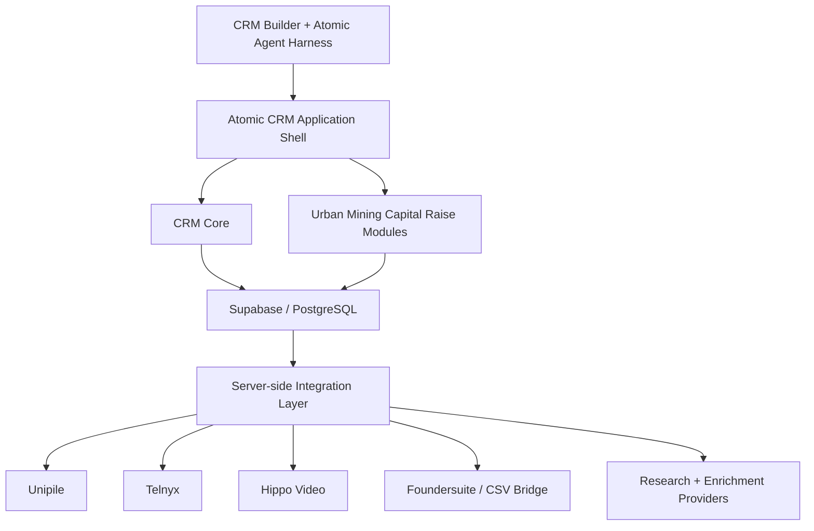
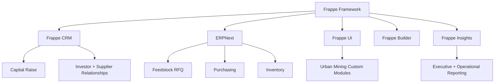

# Urban Mining CRM — Atomic CRM Capital Raise PRD & Implementation Plan

> Mirrored from Notion page `3b49e94cf0a48152b0a2f7e8703a5120` on 2026-09-07. Source: https://app.notion.com/p/3b49e94cf0a48152b0a2f7e8703a5120?pvs=204

null

> 🧭 **Decision record — August 10, 2026.** Following the Frappe CRM vs. Atomic CRM platform evaluation added August 9, the client has confirmed: **Frappe CRM + ERPNext + Frappe Framework is the preferred architecture** for the Urban Mining Capital Raising Operating System. Atomic CRM is retired from the build path and retained only as a UI/UX reference from prototyping.
>
> A full revised implementation plan (architecture, data model mapping, revised tech/communications stack, build stages, phased plan, risks, and an accuracy-checked MCP section) has been drafted separately: **"Urban Mining CRM — Frappe CRM + ERPNext Capital Raise & Feedstock Operating System."** It supersedes Phases 2–7 and the technology stack tables below; governance, compliance, and business sections in this page carry forward unchanged. Biggest structural change: the PCB Feedstock Acquisition module (previously scoped as future custom build) is now largely stock ERPNext (Supplier, RFQ, Purchase Order, Warehouse) rather than application code.
> 
	**PRD revision — August 7, 2026:** Urban Mining CRM will be built as a **custom modular capital-raise workspace on Atomic CRM**, using the existing Atomic/ShadCN application pattern rather than building a CRM from scratch. Atomic CRM is the application shell and shared CRM core; Supabase/PostgreSQL is the backend and system of record; ShadCN is the modular UI layer; CRM Builder + Claude Code + the Atomic Agent Harness are the primary development workflow. The Atomic CRM MCP/API layer is an architectural requirement for AI-assisted CRM operations and external integrations. Wispr is the client-preferred voice-input layer for rapid note capture. Smartlead, Foundersuite, Unipile, Telnyx, Data Room, Gold/Market Intelligence, enrichment, reporting, and AI are added as bounded modules or integrations in stages.

## Product Direction — Modular Urban Mining CRM
The Urban Mining implementation should be treated as a **capital-raise CRM plus modular business application**, not merely a customized contact database.
The shared Atomic CRM layer provides:
- authentication and users;
- companies and contacts;
- opportunities/deals;
- pipelines;
- tasks;
- notes;
- activity history;
- navigation and layout conventions;
- Supabase/Postgres data access;
- reusable ShadCN UI components.
Urban Mining-specific capabilities are added beside the CRM as modular screens and domain entities rather than forcing every concept into generic CRM tables.
```plain text
Atomic CRM Core
├── Companies
├── Contacts
├── Deals / Opportunities
├── Tasks
├── Notes
├── Activities
└── Users

Urban Mining Modules
├── Capital Raise
├── Investors
├── Investor Pipeline
├── Commitments
├── Diligence
├── Data Room
├── Meetings
├── Outreach
└── Reporting
```
### Reuse rule
Where a standard CRM entity already exists, reuse it instead of duplicating data:
```plain text
Investor organization → CRM Company
Investor decision-maker → CRM Contact
Investor conversation → CRM Activity
Investor follow-up → CRM Task
Raise relationship → CRM Opportunity + Capital Raise relation
```
Create new domain tables only where Urban Mining requires concepts that do not naturally belong in standard CRM records, such as `capital_raises`, `commitments`, `diligence_requests`, and `data_room_items`.
## Revised Product Architecture

### Architectural principle
**Atomic CRM is the application foundation, not a limitation on the product.** ShadCN components can be used to add new dashboards, forms, tables, tabs, workflows, intelligence views, data-room screens, outreach screens, and vertical-specific modules while sharing the same CRM records, authentication, design language, and Supabase backend.
The system must remain extensible through four interfaces:
- **Human UI:** Atomic CRM + ShadCN workspace for CRM and capital-raise operations.
- **Developer interface:** Claude Code + CRM Builder + Atomic Agent Harness for bounded custom coding and feature delivery.
- **AI interface:** Atomic CRM MCP for permissioned AI access to CRM operations and data.
- **Integration interface:** REST/PostgREST APIs + Supabase Edge Functions for external systems such as Smartlead, Foundersuite, Unipile, Telnyx, enrichment, market/news providers, and other services.
The implementation principle is **configure and extend, do not rebuild**. Atomic CRM supplies the generic CRM capabilities; custom engineering should be concentrated on the Urban Mining-specific 15–30% of the application.
## Revised Build Stages
### Stage 1 — Atomic CRM + Foundersuite Bridge Foundation
**Primary implementation goal:** get a stock Atomic CRM deployment operational and establish a governed Foundersuite ↔ Atomic CRM bridge before deeper customization.
- [ ] Deploy Atomic CRM from a pinned release/tag.
- [ ] Configure Supabase, authentication, SMTP, production environment, and backups.
- [ ] Validate companies, contacts, deals, tasks, notes, activities, search, and import/export.
- [ ] Apply lightweight Urban Mining branding only.
- [ ] Export representative Foundersuite CSV data and document its schema.
- [ ] Define Foundersuite → Atomic field mapping for companies, contacts, opportunities, owners, stages, amounts, and supported notes/activity fields.
- [ ] Preserve stable external IDs where available.
- [ ] Implement `raiseops` validation, normalization, deduplication, dry-run import, controlled import, export, reconciliation, and audit reporting.
- [ ] Import a 20-row test sample before any full migration.
- [ ] Confirm round-trip Foundersuite → Atomic → Foundersuite-compatible CSV behavior.
- [ ] Configure the minimum investor pipeline and task/next-action workflow required to operate the raise.
**Exit criteria:** Urban Mining can import Foundersuite investor data into Atomic CRM, work those records using companies, contacts, opportunities, tasks, notes, owners, stages, and next actions, then produce a governed Foundersuite-compatible export with reconciliation reporting.
### Stage 2 — Stock Atomic CRM Baseline and Client Walkthrough
- [ ] Deploy Atomic CRM from a pinned release/tag.
- [ ] Configure Supabase, authentication, SMTP, production environment, and backups.
- [ ] Validate companies, contacts, deals, tasks, notes, activities, search, and import/export.
- [ ] Apply lightweight Urban Mining branding only.
- [ ] Complete client walkthrough before substantial customization.
**Exit criteria:** Urban Mining can operate a basic investor/contact pipeline using standard Atomic CRM.
### Stage 2 — Urban Mining CRM Configuration + Voice-First Notes
- [ ] Configure investor/company classifications.
- [ ] Add investor contact roles.
- [ ] Configure capital-raise opportunity types.
- [ ] Configure investor pipeline stages and probabilities.
- [ ] Add ownership, next action, next-action date, source, target cheque size, and fit fields.
- [ ] Create Urban Mining dashboard defaults.
- [ ] Optimize Contact, Company, Investor, Activity, and Meeting note fields for **Wispr dictation**.
- [ ] Provide a large, low-friction Quick Note / Add Activity workflow.
- [ ] Automatically associate dictated notes with the active contact/company/investor, author, and timestamp.
- [ ] Allow dictated text to be edited before saving.
- [ ] Support one-click conversion of a note into a follow-up task or next action.
- [ ] Make saved notes searchable and visible in the unified activity timeline.
**Exit criteria:** Standard CRM records accurately represent Urban Mining's investor relationship workflow and a user can open a record, dictate a note with Wispr, save it, and create a follow-up with minimal clicks.
### Stage 3 — Capital Raise Module
Create a dedicated Capital Raise module in the main application navigation.
Required screens/components:
- Raise Overview;
- Investor Pipeline;
- Investors;
- Commitments;
- Meetings;
- Diligence;
- Data Room;
- Raise Reporting.
Core `capital_raises` fields should include:
- name;
- raising entity;
- target amount;
- instrument;
- minimum investment;
- target close date;
- amount identified;
- soft committed;
- committed;
- funded;
- status;
- approved use of funds;
- owner.
**Exit criteria:** a raise can be managed as its own business object while reusing Atomic CRM companies, contacts, activities, tasks, and opportunities.
### Stage 4 — Investor 360
Extend the Company and Contact detail experience for capital raising.
Investor Organization page should show:
- organization profile;
- investor category;
- mandate and sector fit;
- geography;
- cheque-size range;
- relevant contacts;
- related raise opportunities;
- current stage;
- commitment status;
- tasks;
- activities;
- notes;
- meetings;
- diligence status.
**Exit criteria:** the investment team can understand the complete investor relationship from one workspace.
### Stage 5 — Unipile Communications
Add Unipile as the preferred unified relationship-communications layer for supported channels.
Scope:
- email sync;
- LinkedIn messaging/history;
- WhatsApp where appropriate;
- Google/Microsoft calendar;
- connected-account settings;
- webhooks;
- normalized CRM activities;
- message/contact/company association.
**Exit criteria:** investor communications are visible from the related CRM record without requiring a separate inbox for normal relationship management.
### Stage 6 — Meetings, Calling and Video
Add communications selectively:
- Telnyx for dedicated telephony/call history where required;
- Hippo Video for personalized investor presentations/video follow-up;
- meeting synchronization and activity capture.
All communication outcomes should write back to Atomic CRM activities and related investor/raise records.
### Stage 7 — Foundersuite Bridge Automation and Hardening
The basic Foundersuite ↔ Atomic bridge is delivered in Stage 1. This later stage improves the proven bridge rather than creating it for the first time.
- [ ] Reduce manual CSV handling where operationally justified.
- [ ] Add scheduled or assisted synchronization only after the mapping and reconciliation model is stable.
- [ ] Expand supported fields based on actual client use.
- [ ] Add conflict-resolution workflows and operator review screens where useful.
- [ ] Add direct API automation only if Foundersuite capabilities and measurable operational benefit justify it.
- [ ] Preserve stable external IDs, audit history, dry-run capability, reconciliation, and rollback-safe behavior.
### Stage 8 — Outreach, Smartlead and Campaign Tracking
Add campaign and campaign-member entities only after the relationship CRM is stable. **Smartlead is the preferred cold-email execution engine; Atomic CRM/Supabase remains the system of record.**
Track:
- investor list;
- Smartlead campaign and external lead IDs;
- channel;
- owner;
- messages sent;
- reply status;
- positive/negative reply classification;
- meeting outcome;
- opportunity progression;
- commitment outcome;
- unsubscribe/suppression state.
Initial Smartlead integration scope:
- push qualified CRM investors/leads into selected Smartlead campaigns;
- map CRM/custom fields into Smartlead lead variables;
- synchronize campaign membership and status;
- receive webhook events for sends, replies, bounces, and relevant lead state changes;
- write outreach activity back to the related investor/contact/company timeline;
- surface basic campaign performance inside a ShadCN Outreach module;
- hand positive replies from automated outreach into the normal human relationship-management workflow.
Do **not** rebuild mailbox rotation, warm-up, deliverability, sequence sending, or sending schedules inside Atomic CRM. These remain Smartlead responsibilities.
### Stage 9 — Enrichment and Research
Add provider-neutral services for:
- investor/company enrichment;
- contact discovery;
- email verification;
- investor mandate research;
- market research;
- diligence research.
Returned data must update or attach to canonical CRM records rather than create a second system of record.
### Stage 10 — Reporting and Attribution
Required reporting:
- raise target versus identified capital;
- qualified investor pipeline;
- weighted pipeline;
- soft commitments;
- signed commitments;
- funded capital;
- investor stage conversion;
- meetings by source;
- follow-up risk;
- diligence status;
- channel and campaign attribution.
### Stage 11 — MCP + AI Assistance
AI is assistance, not the CRM foundation, but **MCP-readiness is an architectural requirement from the beginning**.
Atomic CRM MCP should provide permissioned AI access to supported CRM operations and data so ChatGPT, Claude, Claude Code, and other authorized clients can work against the same Supabase-backed system of record.
Potential AI capabilities:
- investor/company summary;
- conversation/note summary;
- extraction of next actions, dates, investor interest, questions, and potential commitment amounts from Wispr-dictated notes;
- meeting brief;
- follow-up draft;
- investor research summary;
- diligence summary;
- pipeline analysis;
- stale-investor and follow-up identification;
- recommended questions and next-best actions;
- raise-status reporting.
All material investor-facing content remains reviewable before sending. MCP and API permissions must respect Supabase authentication, RLS, user roles, and audit requirements.
## CRM Builder / Harness Development Rule
The primary customization workflow is **Prototype/PRD → Claude Code → CRM Builder / Agent Harness → preview → diff/review → test → accept/revert → next bounded feature**.
Use one bounded implementation request at a time. For example:
> Create a Capital Raise module in Atomic CRM. Add it to the main navigation. Reuse existing CRM companies as investor organizations and existing contacts as investor decision-makers. Add capital raises, commitments, diligence requests and data-room item entities in Supabase. Follow existing Atomic CRM and ShadCN design conventions. Do not modify communications, enrichment, AI or automation in this phase. Add migrations and tests.
Then build Investor 360, Unipile, Telnyx, Hippo Video, Foundersuite synchronization, and reporting as separate harness sessions.
## Updated MVP Boundary
The MVP is complete when Urban Mining can:
1. manage investor organizations and contacts;
2. manage one active capital raise;
3. move investors through a defined pipeline;
4. assign owners and next actions;
5. record meetings, tasks, notes, and activity;
6. track target cheque size and investor fit;
7. record soft commitments, commitments, and funded amounts;
8. manage basic diligence status;
9. import/export investor data reliably;
10. report raise pipeline and commitment progress.
**Unipile, Telnyx, Hippo Video, enrichment, LeadSniperAI, Hermes, and advanced automation are staged enhancements and are not required for the core MVP.**
---
> 
	**Project outcome:** Deploy a governed Capital Raising Operating System for Mineteck / Urban Mining using **Atomic CRM + Supabase as the client CRM and operational system of record**, with [KlickSmartAI.com](http://KlickSmartAI.com) / [Klick2Client.com](http://Klick2Client.com) operating the raise. Convex is retained only as a future multi-client control-plane option if centralized orchestration, metering, or provisioning later requires it.

# Executive Summary
Mineteck is developing its Urban Mining business and requires more than a conventional CRM. The proposed solution is a **Capital Raising Operating System** coordinating raise readiness, investor research, outreach, relationship management, diligence, commitments, closing, capital deployment, and stakeholder reporting.
[**KlickSmartAI.com**](http://KlickSmartAI.com), operating through [**Klick2Client.com**](http://Klick2Client.com), will configure and manage the system on behalf of Mineteck / Urban Mining. The implementation strategy is to deploy a stock **Atomic CRM** instance first, validate the real workflow with the client, and then add only the capital-raise customizations that prove necessary.
**Atomic CRM + Supabase** become the human operating workspace and durable client system of record for companies, investor contacts, opportunities, tasks, notes, activities, pipeline stages, ownership, and CRM reporting. The Urban Mining implementation is treated as a reusable **Capital Raise deployment profile**, not a bespoke fork: taxonomy, pipeline stages, scoring rules, dashboard defaults, and client-specific values live in configuration or seed data rather than hardcoded application logic.
**Foundersuite** remains an optional specialist fundraising workspace and investor-source channel. The first integration path is controlled CSV import/export with validation, deduplication, dry runs, reconciliation, and audit reporting through a reusable **raiseops CLI**. Direct API integration should only be added when it produces a measurable operational benefit.
**Hermes Agent**, **LeadSniperAI CLI**, Deepline, Exa/Parallel, and other research/enrichment services operate behind provider-neutral service interfaces. They may enrich or recommend actions against canonical CRM records but do not own permanent client data.
Transactional email is delivered through **Postmark** or another production SMTP/API provider connected to Supabase/Atomic workflows. Relationship communications can use Gmail and later Unipile. Outbound email and voice remain behind replaceable provider interfaces.
The first objective is one production Urban Mining capital-raise deployment that the client can use immediately. Only after that workflow is stable should Klick2Client add centralized multi-client provisioning, metering, billing, and orchestration—where Convex may be introduced as a separate control plane rather than the CRM database.
# Client and Operating Model

Role
Organization
Primary responsibility

Client and represented company
**Mineteck — **[**mineteck.com**](http://mineteck.com)
Mandate, approvals, claims, evidence, investor-facing decisions, and closing authority

Operating business
**Urban Mining**
Urban-mining strategy, feedstock, processing, offtake, milestones, and use of capital

GTM and raise operator
**KlickSmartAI — **[**klicksmartai.com**](http://klicksmartai.com)
Strategy, research, campaign operations, reporting, and workflow management

Multi-tenant operator platform
**Klick2Client — **[**klick2client.com**](http://klick2client.com)
Client workspace, repeatable operating model, permissions, and future commercialization

# Strategic Objectives
1. Establish one authoritative record for the raise, investors, evidence, approvals, activities, commitments, and capital deployment.
2. Convert the opportunity into an evidence-backed investment case and controlled claims registry.
3. Prioritize investors by mandate, stage, geography, cheque size, strategic fit, and relationship path.
4. Enforce clear pipeline stages, next actions, stale-record alerts, and commitment forecasting.
5. Govern outreach, documents, and investor communications through approvals and audit controls.
6. Accelerate diligence with a permissioned data room and request tracking.
7. Preserve a provider-neutral architecture.
8. Validate the model on one raise before multi-tenant expansion.
# MVP Success Measures

Area
Success measure

Raise readiness
Approved thesis, use-of-funds plan, evidence registry, and diligence checklist

Investor data
All active investors have stable IDs, source, fit score, owner, stage, last activity, and next action

Synchronization
Foundersuite CSV round trip completes with validation, dry run, reconciliation, and audit report

Follow-up
No qualified investor lacks an owner and dated next action

Communications
Transactional sends correlate to Postmark Message IDs and delivery events stored against canonical Supabase / Atomic CRM activity records

Diligence
Every request has an owner, due date, status, source document, and history

Governance
Sensitive claims, outreach, and documents require the correct approval

Commercial proof
One live raise is operated end-to-end with a lessons-learned report

# Approved Technology Stack

Layer
Technology
Purpose

CRM product layer
**Atomic CRM**
Companies, investor contacts, opportunities, pipeline, tasks, notes, activities, ownership, import/export, and client-facing CRM UX

Database, auth and API
**Supabase + PostgreSQL**
Durable CRM records, authentication, row-level security, PostgREST API, storage, edge functions, and audit-supporting data

Capital Raise module
**Reusable Atomic CRM extension**
Investor taxonomy, configurable raise pipeline, investor 360, commitment fields, diligence workflow, scoring, and capital-raise dashboards

Urban Mining deployment profile
**Seed data + configuration**
Client-specific taxonomy, pipeline stages, scoring rules, dashboard defaults, branding, document categories, and workflow settings without hardcoding

Public web
**Astro**
Corporate, project, campaign, and approved investor-facing content

Hosting
**Vercel + Supabase Cloud**
Atomic CRM frontend and Supabase production services

Future SaaS control plane
**Convex — optional later phase**
Centralized client provisioning, service entitlements, usage, agent/workflow runs, billing metadata, and system health across deployments

Documents
**S3-compatible storage**
Data-room files, evidence, models, agreements, and reports

Fundraising CRM
**Foundersuite initially; Fundingstack option**
Investor discovery and working fundraising pipeline

CRM bridge
**raiseops CLI + CapitalRaiseCRMAdapter**
CSV validation, reconciliation, reporting, and future API connectivity

CLI accelerator
**CLI Printing Press**
Go CLI, agent skill, and optional safe MCP wrapper

Research
**Hermes Agent**
Investor, market, diligence, and opportunity reports

Signals
**LeadSniperAI CLI**
Investor, company, feedstock, offtake, and growth signals

Model gateway
**OpenRouter**
Model routing, fallback, and cost controls

Authorized integrations
**Composio**
Google Workspace OAuth and approved actions

External automation
**n8n selectively**
Scheduled or long-running deterministic workflows

# Communications Stack

Lane
Technology
Use

Transactional email
**Postmark API/SDK**
Invitations, alerts, approvals, diligence notices, and reports

Delivery events
**Postmark webhooks → Supabase / CRM activity layer**
Delivery, bounce, complaint, suppression, and auditable communication events associated with canonical CRM records

AI email operations
**Postmark MCP**
Authorized diagnostics, template administration, and suppressions

Implementation support
**Postmark Skills**
Agent-ready build instructions and best practices

Relationship email
**Gmail via Composio**
Individual investor, supplier, partner, and diligence conversations

Stakeholder updates
**Postmark Broadcast Streams**
Permission-based approved updates

Targeted outbound
**Provider-neutral OutboundEmailProvider**
Approved campaigns managed by KlickSmartAI

# MVP Scope
## Included
- One production **Mineteck / Urban Mining Atomic CRM deployment** and one active raise
- Stock Atomic CRM capabilities validated before customization: companies, contacts, opportunities, tasks, notes, activity history, users, ownership, and CSV import/export
- Capital Raise deployment profile stored as seed/config data rather than hardcoded client logic
- Configurable investor taxonomy and opportunity taxonomy
- Configurable capital-raise pipeline with stage probabilities
- Company / Investor 360 and Contact 360 views
- Raise dashboard for target, identified capital, qualified capital, active discussions, weighted pipeline, soft commitments, committed capital, funded capital, tasks, and follow-up risk
- Investor, organization, activity, task, diligence, and commitment records
- Owners, next actions, stale-record alerts, and recent activity
- Production SMTP / Postmark transactional setup with tested password-reset and delivery flow
- Foundersuite-compatible CSV export/import through raiseops, beginning with manual governed round trips
- Dry run, duplicate detection, reconciliation, and sync reports
- Reviewed Hermes and LeadSniperAI research handoffs through service interfaces
- Role-based access and audit-supporting history
- Basic executive reporting
## Deferred
- Direct Foundersuite/Fundingstack API integration
- Automated browser upload/download
- Full multi-client billing and white-label administration
- Multiple outbound providers
- Learned investor-conversion models
- Live voice agent
- Fully autonomous investor communications
- Complex accounting integration
# Implementation Plan
## Phase 0 — Governance and Discovery \| Week 1
- [ ] Confirm Mineteck's approved public positioning, legal raising entity, and use of the **Urban Mining** business name.
- [ ] Appoint the Mineteck executive sponsor and final approval authority.
- [ ] Appoint KlickSmartAI project and technical leads.
- [ ] Document the service mandate between Mineteck and [KlickSmartAI.com](http://KlickSmartAI.com) / [Klick2Client.com](http://Klick2Client.com).
- [ ] Define the raising entity, amount, instrument, investor types, geography, use of funds, and target close.
- [ ] Obtain qualified legal review of offering structure, solicitation boundaries, disclosures, and communications.
- [ ] Define approval levels for claims, lists, campaigns, documents, data-room access, and material changes.
- [ ] Inventory investor lists, pitch materials, models, evidence, contracts, and diligence files.
- [ ] Confirm Foundersuite plan capabilities and permitted CSV import/export.
- [ ] Approve MVP scope, budget, cadence, and decision gates.
**Acceptance:** Signed project charter, named owners, confirmed raise parameters, approved communication boundaries, and source-material inventory.
## Phase 1 — Raise Readiness and Information Architecture \| Weeks 1–2
- [ ] Draft and approve the investment thesis and one-page raise narrative.
- [ ] Build the use-of-funds schedule with milestones and expected outcomes.
- [ ] Create an evidence and claims registry with source, owner, status, expiry, and approval.
- [ ] Create the diligence index and identify missing documents.
- [ ] Define the ideal investor profile and exclusions.
- [ ] Define canonical pipeline stages and exit criteria.
- [ ] Define records for tenants, raises, investors, contacts, activities, tasks, approvals, evidence, documents, and commitments.
- [ ] Define data classifications, retention, and the source-of-truth matrix.
**Acceptance:** Approved thesis, use of funds, schema, stage definitions, claims registry, and diligence gap list.
## Phase 2 — Atomic CRM Production Foundation \| Week 1
- [ ] Install the Node version defined by Atomic CRM and clone a **specific release tag, not ****`main`**.
- [ ] Record the Atomic CRM release tag and commit hash in the project README.
- [ ] Run Atomic CRM locally with local Supabase/Postgres and verify company, contact, opportunity, task, note, and activity workflows.
- [ ] Create the production Supabase project in the region closest to the client.
- [ ] Apply Atomic CRM migrations and deploy required edge functions.
- [ ] Configure Supabase authentication and production SMTP before inviting users.
- [ ] Trigger a password reset and verify successful inbox delivery and spam placement.
- [ ] Deploy the Atomic CRM frontend to Vercel and configure the client CRM domain.
- [ ] Apply only lightweight Urban Mining branding in Week 1.
- [ ] Export, clean, deduplicate, standardize, and map existing client CRM/investor data.
- [ ] Import a 20-row test sample before full migration and spot-check source records.
- [ ] Invite client users, verify login/password-reset workflows, and assign record ownership.
- [ ] Run a client-driven walkthrough covering company, contact, opportunity, pipeline movement, task, note, and activity history.
- [ ] Capture every complaint and `can it also…` request verbatim as the Week 2 backlog.
**Acceptance:** The client can complete the core CRM workflow in production, with real data, from its own devices before custom capital-raise development begins.
## Phase 3 — raiseops and Foundersuite Bridge \| Weeks 3–5
- [ ] Define the CapitalRaiseCRMAdapter contract.
- [ ] Document supported Foundersuite CSV schemas.
- [ ] Scaffold the Go-based raiseops CLI using CLI Printing Press.
- [ ] Implement export, validate, import dry-run, import apply, reconcile, and status commands.
- [ ] Add stable external IDs, record versions, timestamps, and tenant/raise isolation.
- [ ] Normalize names, domains, emails, currency, dates, and stages.
- [ ] Add duplicate detection and investor entity matching.
- [ ] Add field-level conflict detection and prevent stale overwrites.
- [ ] Produce inserted, updated, skipped, duplicate, and conflicted-record reports.
- [ ] Add audit events and test fixtures for malformed files and rollback scenarios.
- [ ] Create an agent skill and approval-gated MCP wrapper.
**Acceptance:** A sample pipeline completes a round-trip sync without silent loss, tenant leakage, or unreviewed mutation.
## Phase 4 — Communications and Integrations \| Weeks 4–6
- [ ] Configure a dedicated Postmark server and transactional stream.
- [ ] Verify sending domains and DKIM/SPF/DMARC alignment.
- [ ] Build the Convex TransactionalEmailProvider adapter.
- [ ] Implement idempotency and retry-safe workflows.
- [ ] Create versioned templates for invitations, approvals, diligence, documents, and reminders.
- [ ] Attach tenant, raise, contact, and communication IDs as metadata.
- [ ] Store Postmark Message IDs and provider states against canonical CRM communication/activity records in Supabase.
- [ ] Implement authenticated and idempotent webhook processing.
- [ ] Configure bounce, complaint, unsubscribe, and suppression behavior.
- [ ] Deploy Postmark MCP with a dedicated agent-control boundary.
- [ ] Connect authorized Gmail, Drive, and Calendar accounts through Composio.
- [ ] Implement communication approvals and a unified activity timeline.
**Acceptance:** Test messages, delivery events, suppressions, approvals, and human correspondence appear correctly against the relevant Atomic CRM records.
## Phase 5 — Capital Raise Module + Urban Mining Profile \| Weeks 2–3
- [ ] Add configurable taxonomy as database seed data: investor/company type, opportunity type, contact status, company status, lead source, and relationship source.
- [ ] Confirm which pipeline configuration Atomic CRM already supports before writing custom code.
- [ ] Extend pipeline configuration only where required: create, rename, reorder, probability, exit criteria, and reporting semantics.
- [ ] Extend Company detail into an Investor / Organization 360 view showing company information, associated contacts, active opportunities, upcoming tasks, notes, research, and paginated activity.
- [ ] Extend Contact detail into a Contact 360 view aligned with the Organization 360 structure.
- [ ] Add capital-raise fields such as investor thesis, target cheque range, geography, sector interest, stage preference, relationship strength, expected capital, commitment amount, diligence state, next action, and expected close.
- [ ] Add database-computed dashboard metrics: raise target, identified capital, qualified capital, active discussions, weighted pipeline, soft commitments, committed capital, funded capital, wins/losses, overdue tasks, tasks due today, and recent activity.
- [ ] Add stale-investor and missing-next-action alerts.
- [ ] Add raise-readiness, diligence, document, and data-room views only where the client validates the need.
- [ ] Keep all Urban Mining-specific values in `/deployment-profiles/urban-mining/` or equivalent seed/configuration structures.
- [ ] Keep reusable capital-raise functionality in `/modules/capital-raise/` rather than weaving client logic throughout Atomic core components.
**Acceptance:** Urban Mining operates a capital-raise-specific CRM without hardcoded client values, while the same module can be redeployed for a second fundraising client using a different configuration profile.
## Phase 6 — Intelligence Workflows \| Weeks 7–9
- [ ] Define research brief and opportunity-thesis templates.
- [ ] Connect Hermes investor, market, diligence, and partner research workflows.
- [ ] Connect LeadSniperAI investor, company, feedstock, offtake, and growth signals.
- [ ] Create a reviewed import/enrichment workflow into canonical Atomic CRM / Supabase records.
- [ ] Store source URLs, timestamps, confidence, and reviewer approval.
- [ ] Implement transparent investor-fit scoring with human override.
- [ ] Generate next-best-action suggestions without automatic external execution.
- [ ] Add freshness and evidence-expiry alerts.
**Acceptance:** Research is traceable, reviewed before use, and converted into actions attached to canonical records.
## Phase 7 — Pilot Raise and Validation \| Weeks 9–12
- [ ] Import the approved investor universe.
- [ ] Validate the first Foundersuite synchronization.
- [ ] Assign owners and next actions to all qualified investors.
- [ ] Approve segmentation, messages, documents, and contact strategy.
- [ ] Run the first controlled investor-engagement cohort.
- [ ] Track replies, meetings, diligence, stages, and commitments.
- [ ] Hold weekly pipeline and risk reviews.
- [ ] Test permissions, backups, audit export, webhook replay, and recovery.
- [ ] Record defects, friction, workarounds, and data-quality issues.
- [ ] Complete the pilot lessons-learned report.
- [ ] Make a scale, revise, or stop decision before expansion.
**Acceptance:** One raise is operated end-to-end and the team signs off on workflow reliability.
# Priority Backlog

Priority
Deliverable
Primary owner
Dependency

**P0**
Charter, raise parameters, legal boundaries, and approval matrix
Mineteck + counsel + KlickSmartAI
None

**P0**
Thesis, use of funds, evidence registry, and diligence gaps
Mineteck + KlickSmartAI
Charter

**P0**
Convex schema, tenancy, permissions, audit, and raise records
Technical lead
Information architecture

**P0**
raiseops Foundersuite CSV bridge
Technical lead
CSV schema + Convex

**P0**
Pipeline, tasks, next actions, diligence, and commitments UI
Product + technical lead
Core platform

**P1**
Postmark integration, templates, webhooks, and suppressions
Technical lead
Domains + policies

**P1**
Google Workspace via Composio
Technical lead + client admin
Authorized accounts

**P1**
Hermes and LeadSniperAI research workflows
Research lead
Canonical records

**P1**
Executive dashboard and weekly reporting
Product lead
Pipeline + commitments

**P2**
Outbound provider and adapter
GTM + technical lead
Approved outreach strategy

**P2**
Fundingstack or official API adapter
Technical lead
MVP proof + access

**P2**
Billing, white-labeling, and self-service onboarding
Platform owner
Successful pilot

# Client Decisions Required
- [ ] Confirm the public and legal naming of Mineteck and Urban Mining.
- [ ] Confirm the raising entity and authorized signatories.
- [ ] Confirm target, minimum investment, instrument, geography, timeline, and use of funds.
- [ ] Confirm permitted and prioritized investor types.
- [ ] Approve legal communication and solicitation boundaries.
- [ ] Approve the [KlickSmartAI.com](http://KlickSmartAI.com) / [Klick2Client.com](http://Klick2Client.com) mandate and data-processing authority.
- [ ] Name executive, legal, financial, technical, and investor-relations owners.
- [ ] Select Foundersuite plan and verify CSV capability.
- [ ] Approve email domains, Gmail accounts, Postmark verification, and stakeholder policy.
- [ ] Approve the first investor cohort and pilot launch criteria.
# Key Risks and Controls

Risk
Control

Unapproved investor claims
Evidence registry, source, expiry, status, and client approval

Offering or solicitation compliance
Qualified legal review, eligibility rules, communication gates, and human authorization

CSV conflict or data loss
Stable IDs, versions, dry run, conflicts, reconciliation, and backup

Cross-client exposure
Tenant-scoped queries, Clerk roles, authorization tests, and audit monitoring

Email reputation
Separate lanes, verified domains, suppressions, and provider-neutral outbound

AI output treated as fact
Sources, confidence, freshness, analyst review, and approved import

Premature overbuilding
One-raise MVP, weekly acceptance tests, and evidence-based scale gate

Vendor lock-in
Adapters for capital CRM, email, storage, AI, research, and enrichment

# Governance Cadence
- **Weekly delivery review:** completed work, blockers, acceptance tests, and next priorities.
- **Weekly capital pipeline review:** stage movement, next actions, stale investors, diligence, and forecast.
- **Biweekly executive review:** approvals, scope, budget, risks, and open client decisions.
- **Monthly security and data review:** access, audits, suppressions, backups, permissions, and retention.
- **Pilot closeout:** outcomes, defects, lessons learned, and scale/revise/stop decision.
# Definition of Done
- [ ] One raise operates through a secured Mineteck/Urban Mining workspace.
- [ ] Convex owns authoritative investor, evidence, activity, diligence, commitment, and audit records.
- [ ] Foundersuite data completes a validated two-way CSV cycle through raiseops.
- [ ] Every qualified investor has an owner, stage, last activity, and next action.
- [ ] Transactional emails and delivery events are correlated and auditable.
- [ ] Sensitive actions require the correct approval.
- [ ] Research is sourced, reviewed, and attached to canonical records.
- [ ] The dashboard reflects current raise state and forecast.
- [ ] Backup, recovery, permission, webhook replay, and conflict tests pass.
- [ ] The pilot produces a signed lessons-learned and next-phase decision.
# First 10 Business Days
- [ ] **Day 1–2:** Kickoff and confirm client, operator, and legal roles.
- [ ] **Day 1–3:** Confirm structure, target, instrument, timeline, and use of funds.
- [ ] **Day 2–4:** Inventory investor, pitch, financial, evidence, and diligence materials.
- [ ] **Day 3–5:** Approve thesis outline, investor profile, stages, and claims policy.
- [ ] **Day 4–6:** Finalize schema and source-of-truth matrix.
- [ ] **Day 5–7:** Initialize Convex, Clerk, environments, tenancy, and audit foundation.
- [ ] **Day 5–8:** Obtain Foundersuite sample CSVs and map fields.
- [ ] **Day 6–9:** Scaffold raiseops and implement validation plus dry-run reports.
- [ ] **Day 7–10:** Configure Postmark development server, domains, templates, and webhook.
- [ ] **Day 10:** Review foundations and authorize the next build phase.
# References
- [Foundersuite FAQ](https://foundersuite.com/faq)
- [CLI Printing Press](https://github.com/mvanhorn/cli-printing-press)
- [Postmark Skills](https://github.com/ActiveCampaign/postmark-skills)
- [Postmark MCP](https://github.com/ActiveCampaign/postmark-mcp)
---
**Status:** Draft for client confirmation  
**Prepared for:** Mineteck / Urban Mining  
**Operating partner:** KlickSmartAI / Klick2Client  
**Prepared:** August 6, 2026
---
# Future Implementation — PCB Feedstock Acquisition Module
> 
	**Future objective:** After the Foundersuite ↔ Atomic CRM capital-raise foundation is stable, extend the same Atomic CRM instance with a reusable **PCB Feedstock Acquisition Module**. The module will help Urban Mining identify, qualify, contact, evaluate, purchase, and track PCB/e-waste feedstock suppliers without creating a second CRM.

## Product Boundary
Reuse the existing Atomic CRM core:
- **Company** → supplier, recycler, ITAD company, electronics processor, manufacturer, aggregator, or other feedstock source;
- **Contact** → supplier decision-maker or commercial contact;
- **Deal / Opportunity** → PCB feedstock purchase opportunity;
- **Task** → next action, sample request, assay follow-up, pricing review, PO action, or logistics action;
- **Note / Activity** → calls, meetings, messages, commercial discussions, and supplier history.
Create feedstock-specific domain fields or related tables only where the generic CRM entities are insufficient.
## Target Workflow
```plain text
Target Identified
      ↓
Researched
      ↓
Qualified Supplier
      ↓
Contacted
      ↓
Feedstock Available
      ↓
Specifications Requested
      ↓
Sample / Assay
      ↓
Pricing Received
      ↓
Commercial Review
      ↓
Offer / PO
      ↓
Contracted
      ↓
Shipment Scheduled
      ↓
Received
      ↓
Completed
```
Pipeline stages must be configurable and must not be hardcoded into reusable components.
## Feedstock Opportunity Data
A PCB feedstock opportunity should be able to track, as required by actual operations:
- supplier company;
- supplier contact;
- feedstock category;
- PCB/e-waste type;
- estimated available tonnage;
- recurring tonnage per month where applicable;
- geography and source facility;
- material condition;
- supplier-provided composition/specification data;
- sample status;
- assay status;
- asking price / acquisition cost;
- logistics requirement;
- expected delivery date;
- commercial status;
- owner;
- last activity;
- next action;
- next-action due date;
- source/provenance.
Do not treat supplier-provided material specifications as independently verified without supporting assay/evidence.
## Goal and Task Hierarchy
The module should support measurable operating goals.
Example parent goal:
```plain text
Secure 30 tonnes/month of qualified PCB feedstock
```
Example milestones:
```plain text
100 supplier targets identified
40 qualified suppliers
20 supplier conversations
10 samples received
5 commercial offers
3 recurring suppliers contracted
```
Example execution tasks:
```plain text
Research supplier facility
Identify commercial decision-maker
Request PCB feedstock specifications
Request sample
Schedule sample shipment
Review assay
Negotiate purchase price
Issue PO
Schedule logistics
Confirm receipt
```
The operating model should remain:
```plain text
GOAL
  ↓
MILESTONE
  ↓
FEEDSTOCK OPPORTUNITY
  ↓
NEXT ACTION
  ↓
TASK
```
## Future Intelligence and Outbound Layer
Once the supplier workflow is stable, add provider-neutral research, enrichment, and outbound services.
Potential target categories include:
- electronics recyclers;
- e-waste processors;
- IT asset disposition companies;
- PCB manufacturers;
- telecom/electronics operators with retired equipment;
- industrial recyclers;
- asset liquidators;
- surplus inventory holders;
- aggregators and brokers of electronic scrap.
Potential signals may include:
- recurring e-waste generation;
- facility expansion or closure;
- equipment retirement;
- liquidation or surplus inventory;
- recycling permits;
- electronics manufacturing activity;
- ITAD operations;
- material availability announcements;
- supplier location relative to Urban Mining processing capacity.
Research and enrichment results must write back to canonical Atomic CRM Company, Contact, and Feedstock Opportunity records with source provenance.
## Outbound Service Boundary
Do not embed a specific email or calling provider throughout the CRM UI.
Use a provider-neutral interface conceptually similar to:
```typescript
interface FeedstockOutboundService {
  enrollSupplier(...): Promise;
  removeSupplier(...): Promise;
  getCampaignStatus(...): Promise;
  getSupplierActivity(...): Promise;
}
```
Future adapters may support cold email, human calling, LinkedIn, SMS, or other approved channels.
## Future Module Dashboard
A later Feedstock Acquisition dashboard may report:
- supplier targets identified;
- qualified suppliers;
- estimated available tonnes;
- active supplier conversations;
- samples requested;
- samples received;
- assays completed;
- offers received;
- contracted tonnes/month;
- weighted feedstock pipeline;
- expected acquisition cost;
- shipments scheduled;
- overdue supplier tasks;
- suppliers missing a next action.
## Implementation Sequence
This module is explicitly **not part of the initial Foundersuite bridge MVP**.
Recommended sequencing:
1. **Release 1 — Atomic CRM + Foundersuite bridge + basic capital-raise workflow**
2. **Release 2 — Capital-raise dashboard and investor workflow improvements**
3. **Release 3 — PCB Feedstock Acquisition core module**
4. **Release 4 — Supplier research, enrichment, and outbound execution**
5. **Release 5 — Communications, intelligence, data room, compliance, and advanced automation**
6. **Release 6 — broader Urban Mining operating intelligence and cross-module reporting**
## Future Exit Gate
The PCB Feedstock Acquisition module should not be considered operational until Urban Mining can answer from Atomic CRM:
1. Which suppliers are currently qualified?
2. How much PCB feedstock is potentially available?
3. Which suppliers need action today?
4. Which opportunities are waiting for specifications, samples, assays, pricing, or approval?
5. What tonnes/month are under active discussion?
6. What tonnes/month are contracted?
7. What material is scheduled for shipment?
8. What acquisition cost is expected?
9. Who owns the next action on every active supplier opportunity?
10. Which supplier data is sourced, verified, or still unverified?
This preserves one shared Atomic CRM while giving Urban Mining two distinct GTM engines: **Capital Acquisition** and **Feedstock Acquisition**.
---
# Frappe CRM Platform Evaluation — Open-Source CRM Comparison
> 
	**Architecture review — August 9, 2026:** Frappe CRM should now be evaluated not only as a sales CRM, but as the front end of a broader Frappe business-application ecosystem. The key decision is therefore not simply “which CRM has the best contact and deal screens?” but “which foundation best supports the long-term Urban Mining operating model: capital raising, suppliers, PCB/feedstock RFQs, quotations, purchasing, inventory, reporting, communications, and custom applications?”

## Open-Source CRM Comparison

Rank / Platform
Primary Strength
Frontend / Stack Fit
AI / Agent Fit
ERP / Operations
Custom App Potential
Urban Mining Fit

1 — **Twenty CRM**
Modern extensible CRM platform with flexible objects and strong developer orientation
Excellent modern TypeScript ecosystem
Very strong
Limited compared with ERP platforms
Excellent
Strong for CRM/platform work; additional operational systems required

2 — **Frappe CRM**
CRM sitting on a complete business-application framework and ERP ecosystem
Vue 3 + Frappe UI + Tailwind
Strong through APIs, custom apps and agent integrations
**Excellent through ERPNext**
**Excellent**
**Best overall fit when Urban Mining expands into RFQ, purchasing, inventory and supplier workflows**

3 — **trycomp CRM**
Agentic-first CRM where agents research, record evidence and schedule continued work
Next.js + shadcn/ui + NestJS + PostgreSQL
**Excellent / native**
Minimal
Excellent
Better candidate for LeadSniperAI / Revenue Hunt than for an ERP-oriented Urban Mining operating system

4 — **Atomic CRM**
Rapid React/ShadCN customization with Supabase/PostgreSQL
**Excellent React/ShadCN fit**
Strong, including MCP patterns
Minimal
Excellent for bounded custom modules
Fast prototype and capital-raise CRM, but ERP functions must be built or integrated separately

5 — **EspoCRM**
Mature conventional open-source CRM
Traditional CRM architecture
Moderate
Limited
Good
Strong CRM, weaker business-OS foundation for this roadmap

6 — **Odoo CRM**
Large integrated CRM + ERP business suite
Odoo-specific application framework
Moderate to strong
**Excellent**
Excellent, but tied closely to Odoo architecture
Primary ERP-oriented alternative to Frappe

7 — **aeml/open_crm**
Lean modular B2B CRM architecture
React + Go + PostgreSQL
Strong potential
Limited
Very good
Useful architectural reference; ecosystem/community still comparatively young

8 — **SuiteCRM**
Mature Salesforce-style enterprise CRM
Legacy-heavy compared with newer platforms
Moderate
Limited
Good
Capable CRM but not preferred for a new modular Urban Mining OS

9 — **Corteza**
Low-code business application and CRM platform
Platform-specific
Moderate
Moderate
Very good
Interesting alternative, but Frappe offers a stronger integrated ERP path

10 — **Krayin CRM**
Laravel-based extensible CRM
Laravel + Vue
Moderate
Limited
Good
Viable but no decisive advantage for this project

## Frappe Open-Source Ecosystem — Why the CRM Is More Than a CRM

Frappe Product / Layer
Role in Urban Mining
Potential Use

**Frappe Framework**
Application platform / backend foundation
DocTypes, database models, permissions, APIs, workflows, jobs, business logic and custom Urban Mining applications

**Frappe CRM**
Relationship and opportunity management
Organizations, contacts, leads, deals, activities, notes, tasks, investor relationships and supplier opportunities

**Frappe UI**
Modern application UI layer
Vue 3 + Tailwind reusable components for custom Capital Raise, Feedstock, RFQ, Intelligence and reporting modules

**ERPNext**
Operational and ERP layer
Suppliers, RFQs, supplier quotations, purchase orders, items, warehouses, inventory, accounting, projects and operational reporting

**Frappe Builder**
Website / landing-page layer
Campaign pages, investor information pages, supplier intake pages and targeted landing pages

**Frappe Helpdesk**
Service and request management
Supplier/client requests, internal support workflows, tickets and operational issue tracking where required

**Frappe Insights**
Analytics / BI layer
Capital-raise dashboards, feedstock analytics, supplier pipeline, RFQ metrics, procurement reporting and executive dashboards

**Frappe HR / HRMS ecosystem**
Future people operations
Employees, leave, attendance, recruiting and HR workflows if Urban Mining operational staffing expands

## Decision by Use Case

Use Case
Preferred Foundation
Reason

Urban Mining Capital Raise only
Atomic CRM / Frappe CRM
Both can support investor companies, contacts, deals, tasks and custom capital-raise modules.

Urban Mining Capital Raise + PCB/feedstock sourcing + RFQ + procurement
**Frappe CRM + ERPNext**
The business model is now crossing from CRM into ERP and supply-chain operations.

KlickSmartAI LeadSniperAI / GTM Revenue Hunt
**trycomp CRM or Twenty**
Agentic research, evidence, signals, custom revenue applications and AI-native workflow are the priority rather than ERP.

Fast React/ShadCN CRM prototype
**Atomic CRM**
Lowest-friction path when React/ShadCN familiarity and rapid customization dominate.

General modern extensible CRM SaaS foundation
**Twenty**
Strong balance of modern CRM, developer extensibility and platform architecture.

## Revised Architectural Direction
For **Urban Mining**, the growing operational requirements change the decision. If the roadmap remains limited to investor relations and capital raising, Atomic CRM remains a viable fast implementation. If PCB/feedstock sourcing, supplier management, RFQs, quotations, purchase workflows, inventory and eventual ERP functions become first-class requirements, **Frappe CRM + ERPNext + Frappe Framework becomes the preferred long-term foundation**.

**Working recommendation:** treat Frappe as the preferred **operational business platform** for Urban Mining, while preserving trycomp CRM / Twenty as reference platforms for KlickSmartAI's separate agentic Revenue Hunt and LeadSniperAI architecture. Do not force one CRM foundation to serve both fundamentally different product requirements.