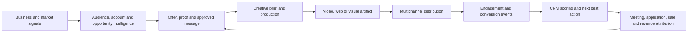

# Source: Notion (page 3a29e94c-f0a4-8151-80aa-d12b4a92c666)

# Purpose
This document defines the vertical-agnostic operating system for producing high-quality websites, UI systems, visual assets, video advertisements, personalized B2B sales videos, motion content, and measurable revenue campaigns with AI agents.
It is designed for KlickSmartAI, LeadSniperAI, Mortgage CoPilot, commercial-financing intelligence, client marketing systems, landing pages, CRM-integrated sales engagement, and future white-label AI design and video services.
<callout icon="🎯" color="purple_bg">
	**Updated operating principle:** build the horizontal production and engagement engine once, then adapt it through interchangeable brand systems, offer libraries, proof registries, compliance rules, audience definitions, buying signals, and vertical packs.
</callout>
> **Skill-routing principle:** use the smallest set of specialized capabilities required for the business outcome. Research establishes truth; strategy determines the message; design systems establish the rules; creative tools generate the experience; deterministic renderers protect exact facts; CRM and automation tools distribute, measure, and act on engagement; verification approves the output.
# Strategic Model — From Creative Production to Video Revenue System
The system is no longer limited to creating attractive artifacts. It should connect business signals, verified knowledge, creative production, distribution, engagement intelligence, sales follow-up, and revenue attribution.

## Two Operating Layers
### Universal platform layer
- Brand ingestion and design-token management
- Campaign and artifact briefing
- Script, storyboard and creative generation
- Avatar, voice, B-roll and motion production
- Deterministic captions, facts, charts and disclosures
- Quality assurance and human approval
- Multichannel delivery and landing pages
- Engagement-event collection
- CRM scoring, workflows and attribution
- Performance learning and reusable templates
### Vertical configuration layer
- Industry personas and terminology
- Customer problems and desired outcomes
- Observable buying signals
- Offer and CTA library
- Approved claims and proof sources
- Restricted claims and disclosure rules
- Qualification questions
- CRM stage mapping
- Vertical-specific script and campaign templates
> Build the production engine horizontally; sell and deploy it through focused vertical use cases.
# Recommended Core Stack
## Tier 1 — Install First
<table header-row="true">
<tr>
<td>Repository</td>
<td>Primary role</td>
<td>Best use</td>
<td>Workflow position</td>
</tr>
<tr>
<td>[MengTo/Skills](https://github.com/MengTo/Skills)</td>
<td>Cinematic web-design workflows and reusable design skills</td>
<td>Landing pages, GSAP, WebGL, interaction extraction, reference-video analysis, full-page capture</td>
<td>Research, creative direction, motion specification</td>
</tr>
<tr>
<td>[nextlevelbuilder/ui-ux-pro-max-skill](https://github.com/nextlevelbuilder/ui-ux-pro-max-skill)</td>
<td>UI/UX design intelligence and design-system generation</td>
<td>Product-specific palettes, typography, layouts, UX rules, dashboards, websites and apps</td>
<td>Design-system planning and UX guardrails</td>
</tr>
<tr>
<td>[Leonxlnx/taste-skill](https://github.com/Leonxlnx/taste-skill)</td>
<td>Anti-generic visual taste and frontend art direction</td>
<td>Stronger hierarchy, typography, spacing, layout variation and controlled motion</td>
<td>Art direction and quality improvement</td>
</tr>
<tr>
<td>[thevangelist/dembrandt](https://github.com/thevangelist/dembrandt)</td>
<td>Website design-system extraction</td>
<td>Extract colors, typography, spacing, components, motion and design tokens from permitted reference sites</td>
<td>Reference analysis and token creation</td>
</tr>
<tr>
<td>[21st-dev/magic-mcp](https://github.com/21st-dev/magic-mcp)</td>
<td>Frontend component generation through MCP</td>
<td>Generate and refine production-ready interface components inside coding agents</td>
<td>UI implementation acceleration</td>
</tr>
<tr>
<td>[calesthio/OpenMontage](https://github.com/calesthio/OpenMontage)</td>
<td>Agentic video-production operating system</td>
<td>Research, scripting, storyboarding, asset generation, voice, editing, checkpoints and rendering</td>
<td>End-to-end video production</td>
</tr>
</table>
## Tier 2 — Add for Orchestration and Specialist Roles
<table header-row="true">
<tr>
<td>Repository</td>
<td>Primary role</td>
<td>Best use</td>
</tr>
<tr>
<td>[msitarzewski/agency-agents](https://github.com/msitarzewski/agency-agents)</td>
<td>Specialist creative and production agents</td>
<td>UI designer, UX researcher, UX architect, brand guardian, visual storyteller, image prompt engineer and QA roles</td>
</tr>
<tr>
<td>[vercel-labs/skills](https://github.com/vercel-labs/skills)</td>
<td>Portable skill installer and skill-management layer</td>
<td>Installing, maintaining and distributing agent skills across coding environments</td>
</tr>
<tr>
<td>[alibaba/page-agent](https://github.com/alibaba/page-agent)</td>
<td>Natural-language control of web interfaces</td>
<td>Agent-driven page interaction, embedded website assistants and browser-style UI actions</td>
</tr>
<tr>
<td>[remotion-dev/remotion](https://github.com/remotion-dev/remotion)</td>
<td>Code-based video rendering</td>
<td>Programmatic compositions, timelines, captions, animations and final MP4 rendering</td>
</tr>
<tr>
<td>[shadcn-ui/ui](https://github.com/shadcn-ui/ui)</td>
<td>Reusable accessible UI component foundation</td>
<td>Dashboards, SaaS applications, CRM interfaces and consistent frontend systems</td>
</tr>
<tr>
<td>[21st-dev/agent-elements](https://github.com/21st-dev/agent-elements)</td>
<td>Components for agentic interfaces</td>
<td>AI chat, tool activity, agent state and AI-native application interfaces</td>
</tr>
</table>
## Supporting Reference Sources — Not Skills, but Important Inputs
<table header-row="true">
<tr>
<td>Source</td>
<td>Use</td>
</tr>
<tr>
<td>[Aura Build](https://www.aura.build/browse/components)</td>
<td>Component and visual-pattern references</td>
</tr>
<tr>
<td>[Mobbin](https://mobbin.com/)</td>
<td>Proven mobile and web product-flow research</td>
</tr>
<tr>
<td>[21st.dev](https://21st.dev/)</td>
<td>Community UI component references</td>
</tr>
<tr>
<td>[Hallmark](https://www.usehallmark.com/)</td>
<td>Brand and design workflow reference</td>
</tr>
</table>
# What Each Core Repository Contributes
## MengTo/Skills — Creative Workflow Library
The repository contains a broad collection of portable skills for designers and builders. Its most valuable capabilities for this operating system include:
- `video-to-superprompt` — converts a reference screen recording into a detailed recreation prompt.
- `html-to-interaction-prompts` — converts an existing page into reusable prompts for sections, interactions, hover states and WebGL effects.
- `stitched-full-page-capture` — captures complete pages, including lazy-loaded and animated sections.
- `daily-ui-inspiration-capture` — builds recurring inspiration and prompt packs.
- `design-first-ui-prompting` — structures design prompts around goal, format, layout, typography, color and constraints.
- Landing page, pricing page, Tailwind, GSAP, ScrollTrigger, Lenis, Three.js, WebGL, animation and visual-style skills.
- Browser video recording and ElevenLabs voiceover workflows.
**Use it when:** the project requires a cinematic, highly visual, interactive or reference-led website.
## UI UX Pro Max — Design Intelligence Layer
Use this as the primary design-system planning skill. It helps the agent select product-appropriate styles, colors, fonts, chart treatments, technology stacks, UX patterns and accessibility rules.
**Use it when:** starting a website, dashboard, application, mobile experience or design system from a business brief.
**Best output:** a project-level design specification that includes tokens, components, responsive rules, interaction patterns and anti-patterns.
## Taste Skill — Art-Direction and Anti-Slop Layer
Use Taste Skill after the basic design system is established. Its job is not to replace the design system; its job is to strengthen hierarchy, composition, typography, motion and visual distinctiveness.
Recommended control dials:
- **Design variance:** 4–6 for business sites; 7–8 for premium campaign pages.
- **Motion intensity:** 2–4 for financial and mortgage products; 6–8 for cinematic brand experiences.
- **Visual density:** 5–7 for dashboards; 2–4 for premium landing pages.
## Dembrandt — Reference-to-Token Layer
Use Dembrandt only on websites you own or are permitted to analyze. It can extract:
- Brand colors and semantic colors
- Typography and font hierarchy
- Spacing, borders, radii and shadows
- Component styles
- Motion durations, easing and hover patterns
- Breakpoints, icons and frameworks
- W3C-compatible design tokens and a machine-readable `DESIGN.md`
**Best practice:** extract principles and tokens, not another company’s protected identity, logo or proprietary assets.
## Magic MCP — Component-Building Layer
Use Magic MCP when the design system and page specification are ready and the coding agent needs to generate components rapidly. It is most useful for producing section-level React and frontend components rather than deciding the business strategy or brand direction.
## OpenMontage — Video Production Orchestration Layer
OpenMontage should sit above individual image, avatar, voice and video models. It coordinates research, scripts, storyboards, assets, checkpoints, assembly and delivery rather than allowing disconnected tools to improvise the workflow.
OpenMontage is the **production orchestrator**, not necessarily the final renderer or the sales-engagement system.
### Recommended division of responsibility
- **OpenMontage:** pipeline orchestration, stage management, assets and production checkpoints
- **HeyGen:** avatar footage, presenter-led scenes, voice and rapid creative assembly
- **Remotion or HyperFrames:** exact captions, calculations, charts, names, rates, dates, disclosures, data-driven variants and final deterministic rendering
- **Convex:** customer, project, campaign, proof, approval and engagement data
- **n8n:** workflow triggers, batching, provider routing and system synchronization
- **Unipile:** Gmail, Outlook, LinkedIn, WhatsApp and supported calendar delivery
- **Twilio or Telnyx:** SMS, telephone and voice workflows
- **Human reviewer:** brand, factual, legal and compliance approval
### Core production sequence
1. Retrieve campaign objective, audience, offer and business signal.
2. Retrieve approved brand, proof, claims and compliance context.
3. Create the creative brief and select the campaign template.
4. Generate hook, script and CTA options.
5. Produce the storyboard and shot list.
6. Select the lowest-cost adequate assets.
7. Generate avatar, voice, B-roll or screen-recording components.
8. Render exact facts, captions, charts, disclosures and CTA elements deterministically.
9. Assemble and render the channel master.
10. Validate transcript, facts, visuals, duration and final CTA.
11. Obtain human approval where required.
12. Generate channel, aspect-ratio, language and personalization variants.
13. Distribute, collect engagement events and connect results to CRM outcomes.
# Master Routing Matrix
<table header-row="true">
<tr>
<td>Deliverable</td>
<td>Required skills</td>
<td>Optional skills</td>
<td>Final output</td>
</tr>
<tr>
<td>Standard business website</td>
<td>UI UX Pro Max → Taste Skill → Magic MCP → verification</td>
<td>Dembrandt, shadcn/ui</td>
<td>Responsive production website</td>
</tr>
<tr>
<td>Premium cinematic website</td>
<td>MengTo reference workflow → UI UX Pro Max → Taste Skill → GSAP/Three.js skills → implementation → performance audit</td>
<td>Dembrandt, Magic MCP</td>
<td>High-end interactive landing experience</td>
</tr>
<tr>
<td>SaaS dashboard or CRM</td>
<td>UI UX Pro Max → shadcn/ui → Magic MCP → accessibility and responsive QA</td>
<td>Taste Skill at moderate density</td>
<td>Production dashboard and component library</td>
</tr>
<tr>
<td>Website redesign from a reference</td>
<td>Authorized Dembrandt extraction → stitched capture → UI UX Pro Max synthesis → Taste Skill → implementation</td>
<td>HTML-to-interaction prompts</td>
<td>Original redesign using extracted principles</td>
</tr>
<tr>
<td>Landing page from a video reference</td>
<td>Video-to-superprompt → UI UX Pro Max → Taste Skill → landing-page/GSAP skills → implementation</td>
<td>Magic MCP</td>
<td>Recreated interaction language with original branding</td>
</tr>
<tr>
<td>Social visual or banner</td>
<td>Brand brief → UI UX Pro Max banner/design-system skill → image prompt engineer → visual QA</td>
<td>Taste Skill</td>
<td>Campaign visual in required aspect ratios</td>
</tr>
<tr>
<td>Product explainer video</td>
<td>Research → OpenMontage script/storyboard → asset and voice generation → Remotion render → QA</td>
<td>MengTo ElevenLabs and browser-recording skills</td>
<td>Branded explainer video</td>
</tr>
<tr>
<td>Website demo video</td>
<td>Browser recording → scripted cursor and page states → voiceover → captions → Remotion/OpenMontage</td>
<td>OpenMontage stock and music providers</td>
<td>Product walkthrough video</td>
</tr>
<tr>
<td>AI-generated campaign video</td>
<td>Brand strategy → visual storyteller → OpenMontage pipeline → image/video models → edit/render</td>
<td>Taste-driven image references</td>
<td>Multi-format campaign creative</td>
</tr>
</table>
# Standard Web Production Workflow
## Phase 1 — Business and Conversion Brief
Capture:
- Business objective
- Audience and use case
- Primary conversion
- Offer and positioning
- Required pages
- Proof, objections and trust elements
- Accessibility and compliance requirements
- Technology, CMS and hosting constraints
- Required analytics and integrations
**Output:** one-page creative and conversion brief.
## Phase 2 — Reference Research
Use Mobbin, Aura, [21st.dev](http://21st.dev), strong industry sites and existing brand materials. For each reference, label what is being borrowed at the principle level:
- Information architecture
- Visual hierarchy
- Typography
- Grid and spacing
- Motion language
- Conversion pattern
- Component behavior
Use full-page capture and reference-video analysis when static screenshots do not communicate the interaction.
**Output:** reference board with approved and rejected patterns.
## Phase 3 — Design-System Specification
Run UI UX Pro Max with the business brief, then improve the output with Taste Skill. Where an authorized existing site is relevant, use Dembrandt to create factual tokens.
Required specification:
- Color and semantic-token system
- Typography scale
- Spacing and grid
- Radius, border, shadow and surface rules
- Buttons, forms, cards, navigation and data-display components
- Motion principles
- Responsive breakpoints
- Accessibility requirements
- Examples of approved and prohibited patterns
**Output:** `DESIGN.md` plus token files.
## Phase 4 — Content Architecture and Copy
Create the page hierarchy before visual implementation:
1. Promise and value proposition
2. Problem and desired outcome
3. Solution and differentiators
4. Product or service explanation
5. Evidence and trust
6. Process
7. Objection handling
8. Primary CTA
**Output:** section-level copy deck and content map.
## Phase 5 — Wireframe and Visual Direction
Generate three meaningfully different directions rather than repeated rerolls:
- Direction A: conservative and conversion-led
- Direction B: premium and editorial
- Direction C: cinematic and differentiated
Select one direction and document the reasons before coding.
## Phase 6 — Frontend Implementation
Recommended default stack:
- Astro for fast content-led marketing websites
- Next.js for applications, portals and dynamic products
- Tailwind CSS for tokenized implementation
- shadcn/ui for accessible application components
- GSAP and Lenis only when advanced motion improves the story
- Three.js/WebGL only when the experience justifies performance and maintenance costs
Use Magic MCP or coding agents to build one section or component at a time against the approved specification.
## Phase 7 — Verification Gate
The website is not complete until it passes:
- Brief and conversion-goal alignment
- Brand consistency
- Desktop, tablet and mobile review
- Keyboard navigation and contrast checks
- Form and CTA testing
- Core Web Vitals and animation performance
- Broken-link and console-error checks
- Copy, factual and legal review
- Analytics and event validation
- Human visual approval
# Standard Visual Content Workflow
1. Define campaign goal, audience, channel and CTA.
2. Retrieve the current brand tokens and approved visual examples.
3. Choose a content family: social post, ad, hero, infographic, presentation visual or thumbnail.
4. Produce three art-direction concepts.
5. Generate or source imagery.
6. Typeset final copy separately when image models cannot guarantee accurate text.
7. Apply brand overlays, accessibility checks and channel-safe zones.
8. Export master plus platform adaptations.
9. Record the winning concept and performance results for reuse.
# Standard Video Revenue Workflow
## Stage 1 — Revenue Strategy
Define:
- Business outcome
- Audience or named account
- Funnel and CRM stage
- Buying signal or campaign trigger
- Offer and CTA
- Distribution channel
- Required proof
- Video duration and format
- Personalization level
- Desired sales action after engagement
## Stage 2 — Truth and Context Retrieval
Create a source-grounded context package containing:
- Verified company, product or project facts
- Approved statistics and proof
- Customer pains, objections and language
- Brand voice and visual rules
- Required disclosures
- Prohibited or restricted claims
- CRM history and previous engagement
<callout icon="🛡️" color="yellow_bg">
	**Truth rule:** generative models may communicate approved facts, but they must not originate, calculate, or visually fabricate truth-bearing information.
</callout>
## Stage 3 — Campaign Pattern and Script
Select the best reusable pattern:
- Problem → mechanism → CTA
- Trigger → insight → offer
- Myth → truth → action
- Before → after → bridge
- Evidence → interpretation → CTA
- Personalized observation → relevance → invitation
Then write:
- Hook or pattern interrupt
- Problem or trigger
- Main insight or mechanism
- Proof or demonstration
- CTA and next step
### Practical duration guidance
- **15 seconds:** one problem and one CTA
- **20 seconds:** problem, proof and CTA
- **30 seconds:** problem, mechanism, proof and CTA
- **45–60 seconds:** personalized sales explanation, proposal or educational video
## Stage 4 — Storyboard and Fact Map
For every scene specify:
- Duration
- Visual subject
- Camera or motion direction
- Voiceover
- On-screen text
- Fact source
- Rendering method
- Sound or music cue
- Transition
- Asset source
Every number, rate, date, name, price, address, specification, project fact and disclosure must identify its structured source and deterministic rendering method.
## Stage 5 — Asset Production
Choose the lowest-cost adequate source:
1. Existing brand assets
2. Screen recordings and product demonstrations
3. Licensed stock
4. Generated images
5. Generated video
6. Avatar footage where human ownership or trust is valuable
Use avatar-led scenes selectively—typically for the opening, expert interpretation or CTA—while B-roll, demonstrations and motion graphics carry the middle of the story.
## Stage 6 — Deterministic Assembly and Render
Separate the creative and truth-bearing layers.
### Creative layer
- B-roll and generated scenes
- Avatar delivery
- Mood and atmosphere
- Camera motion
- Music and transitions
- Decorative graphics
### Truth-bearing layer
- Captions and quotations
- Names, dates, prices and rates
- Statistics and calculations
- Product and project facts
- Charts and tables
- Disclosures and compliance text
- Personalized CRM merge fields
Use OpenMontage to coordinate the workflow and Remotion or HyperFrames for deterministic, repeatable rendering where facts, personalization, multiple formats or high-volume variations are important.
## Stage 7 — Automated Verification
A successful render is not an approved artifact. The system should:
1. Confirm the file exists and passes minimum technical requirements.
2. Transcribe the finished audio.
3. Compare the transcript with the approved script.
4. Extract a contact sheet across the video.
5. Verify the final CTA frame.
6. Compare audio and video duration.
7. Match every spoken number with every displayed number.
8. Confirm required disclosures, safe zones and aspect ratios.
9. Retain source, rights and approval records.
## Stage 8 — Human Approval
Human review remains mandatory when the artifact includes regulated claims, financial information, legal implications, sensitive personalization, material customer promises or high-value account outreach.
## Stage 9 — Distribution and Sales Engagement
Videos may be delivered through:
- Social and paid-ad platforms
- Website and landing-page embeds
- Gmail or Outlook
- LinkedIn or WhatsApp
- SMS
- Branded prospect-specific video pages
For sales videos, record provider-independent engagement events such as:
- Page opened
- Video started
- 25%, 50%, 75% and 90% watched
- Completed or replayed
- CTA clicked
- Document opened
- Reply received
- Calendar opened
- Meeting booked
## Stage 10 — CRM Action and Revenue Attribution
The system should preserve the outcome chain:
```plain text
Video sent → viewed → replied → meeting booked → application or opportunity started → sale or funded deal → revenue attributed
```
Use engagement together with prospect fit, opportunity value, recency, video length and previous behaviour to recommend the next best action. Store scoring, deduplication, workflow decisions and revenue attribution inside the CRM rather than inside a temporary automation tool.
# Skill Selection Rules
1. **Start with the deliverable, not the tool.**
2. **Use UI UX Pro Max for structure and rules.**
3. **Use Taste Skill for differentiation, not as a substitute for strategy.**
4. **Use MengTo skills when references, cinematic motion or interaction recreation are central.**
5. **Use Dembrandt only for authorized design-system analysis.**
6. **Use Magic MCP after the design direction is approved.**
7. **Use OpenMontage as the video orchestrator, not as a single generation model.**
8. **Use Agency Agents for clear specialist roles and review handoffs.**
9. **Add WebGL and heavy motion only when they improve comprehension, trust or brand value.**
10. **Always maintain a human approval gate before publishing.**
# Recommended Agent Team
<table header-row="true">
<tr>
<td>Agent</td>
<td>Responsibility</td>
<td>Required output</td>
</tr>
<tr>
<td>Creative Director</td>
<td>Owns concept, references and visual coherence</td>
<td>Approved creative direction</td>
</tr>
<tr>
<td>UX Strategist</td>
<td>Aligns user journey and conversion</td>
<td>Page flow and UX requirements</td>
</tr>
<tr>
<td>Brand Guardian</td>
<td>Enforces brand consistency</td>
<td>Brand approval or correction list</td>
</tr>
<tr>
<td>Design-System Architect</td>
<td>Creates tokens and component rules</td>
<td>`DESIGN.md` and tokens</td>
</tr>
<tr>
<td>UI Designer</td>
<td>Produces layouts and component compositions</td>
<td>Approved visual frames</td>
</tr>
<tr>
<td>Frontend Builder</td>
<td>Implements the interface</td>
<td>Working code</td>
</tr>
<tr>
<td>Motion Designer</td>
<td>Defines purposeful motion</td>
<td>Motion specification</td>
</tr>
<tr>
<td>Visual Storyteller</td>
<td>Converts messages into imagery and sequences</td>
<td>Storyboard or visual narrative</td>
</tr>
<tr>
<td>Video Producer</td>
<td>Runs the OpenMontage pipeline</td>
<td>Render-ready project</td>
</tr>
<tr>
<td>QA and Performance Reviewer</td>
<td>Tests accessibility, responsiveness and performance</td>
<td>Pass/fail report</td>
</tr>
</table>
# File and Knowledge Structure
```plain text
/design-os
  /briefs
  /references
    /screenshots
    /videos
    /inspiration-notes
  /brand
    BRAND.md
    DESIGN.md
    tokens.json
  /content
    sitemap.md
    copy-deck.md
  /web
    /components
    /pages
    /motion
  /visuals
    /source
    /approved
    /exports
  /video
    /research
    /scripts
    /storyboards
    /assets
    /compositions
    /renders
  /qa
    accessibility.md
    performance.md
    release-checklist.md
```
# Adoption Roadmap
## Phase 1 — Foundation
- Install UI UX Pro Max, Taste Skill and MengTo/Skills in the primary coding-agent environment.
- Add Dembrandt MCP for authorized design analysis.
- Establish the shared `DESIGN.md`, token and reference folders.
- Create standard creative brief and QA templates.
## Phase 2 — Web Production
- Connect Magic MCP and standardize Astro, Next.js, Tailwind and shadcn/ui starter repositories.
- Create reusable sections for KlickSmartAI, LeadSniperAI and Mortgage CoPilot.
- Add browser-based visual regression and performance verification.
## Phase 3 — Visual Content
- Establish brand-specific prompt packs and visual reference boards.
- Build reusable social, ad, presentation and thumbnail templates.
- Track winning creative concepts by campaign and audience.
## Phase 4 — Video Production
- Install and test OpenMontage.
- Connect approved stock, voice and generation providers.
- Build product-demo, explainer, social-short and case-study pipelines.
- Use Remotion templates to produce multiple aspect ratios and data-driven variations.
## Phase 5 — Automation
- Trigger projects from a structured Notion brief.
- Route the job to the correct skill bundle.
- Store assets and approvals in a project workspace.
- Publish approved outputs through the correct deployment or social channel.
- Record results so future creative decisions use performance evidence.
# First Recommended Production Bundle
For the first implementation, use this controlled bundle:
1. **UI UX Pro Max** — generates the design-system starting point.
2. **Taste Skill** — improves visual quality and removes generic patterns.
3. **MengTo/Skills** — supplies landing-page, GSAP, capture and reference workflows.
4. **Dembrandt** — extracts permitted brand and reference tokens.
5. **Magic MCP + shadcn/ui** — accelerates implementation.
6. **OpenMontage + Remotion** — powers product demos and campaign videos.
7. **Agency Agents** — supplies specialist review roles.
This bundle covers the complete path from business brief → research → design system → website and visuals → video → QA → publishing without making the workflow dependent on one model or one platform.
# Sources and Repository Links
- [MengTo/Skills](https://github.com/MengTo/Skills)
- [UI UX Pro Max](https://github.com/nextlevelbuilder/ui-ux-pro-max-skill)
- [Taste Skill](https://github.com/Leonxlnx/taste-skill)
- [Magic MCP](https://github.com/21st-dev/magic-mcp)
- [Dembrandt](https://github.com/thevangelist/dembrandt)
- [OpenMontage](https://github.com/calesthio/OpenMontage)
- [Agency Agents](https://github.com/msitarzewski/agency-agents)
- [Vercel Skills](https://github.com/vercel-labs/skills)
- [Page Agent](https://github.com/alibaba/page-agent)
- [Remotion](https://github.com/remotion-dev/remotion)
- [shadcn/ui](https://github.com/shadcn-ui/ui)
- [Agent Elements](https://github.com/21st-dev/agent-elements)
*Last reviewed: July 19, 2026.*
# HyperFrames Integration
## [heygen-com/hyperframes](https://github.com/heygen-com/hyperframes) — Agent-Native HTML-to-Video Rendering
HyperFrames is an open-source framework for turning HTML, CSS, media and seekable animations into deterministic MP4 video. It is designed for coding agents and supports a production loop that plans the video, writes valid HTML, connects timeline-seekable animation, adds media, lints, previews and renders.
**Primary role:** fast, deterministic motion-graphics and visual-content rendering from web technologies.
**Best use cases:**
- Product-introduction and launch videos
- Animated explainers using typography, cards, charts and interface elements
- Social videos and short-form branded content
- Data-driven or template-driven video variants
- Website and application feature demonstrations
- Presentation or HTML composition conversion into video
- Rapid agent-generated motion prototypes
## Position in the Video Stack
<table header-row="true">
<tr>
<td>Layer</td>
<td>Tool</td>
<td>Responsibility</td>
</tr>
<tr>
<td>Production orchestration</td>
<td>OpenMontage</td>
<td>Research, script, storyboard, asset selection, voice, approval stages and delivery coordination</td>
</tr>
<tr>
<td>HTML-native motion production</td>
<td>HyperFrames</td>
<td>Turns HTML, CSS, media and seekable animation into deterministic MP4 video</td>
</tr>
<tr>
<td>React-native programmable rendering</td>
<td>Remotion</td>
<td>Builds complex React compositions, reusable timelines, data-driven scenes and multi-format renders</td>
</tr>
<tr>
<td>Generative visual assets</td>
<td>Image and video models</td>
<td>Creates footage, backgrounds, avatars, illustrations and scene assets used by the renderer</td>
</tr>
</table>
## Selection Rule: HyperFrames vs. Remotion
Use **HyperFrames** when the creative can be expressed efficiently as HTML, CSS, typography, UI components, SVG, browser media and seekable web animation. It is the preferred rapid-production route for agents creating polished motion graphics without requiring a full React video application.
Use **Remotion** when the project requires complex React logic, highly reusable programmatic compositions, deeper application integration, extensive data binding or an established Remotion component library.
Use both when HyperFrames is used for rapid scene creation or HTML-native segments and Remotion is used to assemble those segments into a larger production.
## Revised Standard Video Workflow
1. Define the audience, platform, duration, business outcome and CTA.
2. Use OpenMontage to coordinate research, scripting, storyboard creation and asset planning.
3. Classify each scene:
	- **HTML-native motion scene:** send to HyperFrames.
	- **Complex React or data-driven composition:** send to Remotion.
	- **Generative footage:** send to the selected image or video model.
	- **Avatar or presenter scene:** send to the appropriate HeyGen workflow.
4. Generate brand tokens, typography, layout rules and reusable scene components.
5. Produce assets and voiceover.
6. Build, lint, preview and render HyperFrames scenes.
7. Build and render Remotion compositions where additional orchestration is required.
8. Assemble scenes, captions, audio, transitions and CTA.
9. Run factual, visual, accessibility, audio and platform-format QA.
10. Export the master and adapted versions for website, YouTube, LinkedIn, Shorts and Reels.
## Updated Video Routing Matrix
<table header-row="true">
<tr>
<td>Deliverable</td>
<td>Recommended workflow</td>
</tr>
<tr>
<td>Fast branded product intro</td>
<td>Brief → storyboard → HyperFrames → audio/captions → QA</td>
</tr>
<tr>
<td>Typography-led social video</td>
<td>Brand tokens → copy → HyperFrames → aspect-ratio adaptations</td>
</tr>
<tr>
<td>Animated website or UI explainer</td>
<td>Screen/UI assets → HyperFrames → voiceover → captions → QA</td>
</tr>
<tr>
<td>Complex data-driven video</td>
<td>OpenMontage → Remotion → reusable data compositions → render</td>
</tr>
<tr>
<td>Mixed generative campaign video</td>
<td>OpenMontage → generated assets → HyperFrames/Remotion → final assembly</td>
</tr>
<tr>
<td>Avatar-led explainer</td>
<td>OpenMontage script → HeyGen avatar → HyperFrames overlays → final render</td>
</tr>
</table>
## Recommended Installation Strategy
Start with the HyperFrames core skills and its `/hyperframes` router rather than loading every available skill. The router selects the appropriate creation workflow on demand, consistent with this operating system’s principle of loading the smallest useful skill set.
## Updated Recommended Production Bundle
**UI UX Pro Max → Taste Skill → MengTo/Skills → Dembrandt → Magic MCP/shadcn → OpenMontage → HyperFrames or Remotion → verification and QA.**
# Open Design — Local-First Multiformat Design Workspace
[nexu-io/open-design](https://github.com/nexu-io/open-design) is positioned as the **agent-facing creative workspace and export layer** in this operating system. It is a local-first desktop application that lets coding agents act as the design engine for prototypes, landing pages, dashboards, slides, images and video, while producing real editable files and exports such as HTML, PDF, PPTX and MP4.
## Best Role in the Stack
Open Design should sit between the **creative-direction/design-system layer** and the **specialized production/rendering layer**:
**Business brief → reference research → UI UX Pro Max → Taste Skill → Open Design workspace → specialist implementation/rendering → QA**
Use Open Design to:
- Rapidly explore and compare visual directions in one workspace
- Generate prototypes, landing pages, dashboards and presentation concepts through connected coding agents
- Maintain local-first control over project assets and generated files
- Bridge web, slide, image and video production without switching tools for every early-stage concept
- Export reviewable HTML, PDF, PPTX and MP4 deliverables
- Hand approved concepts to Astro, Next.js, Magic MCP, HyperFrames, Remotion or Canva for deeper production
## Updated Routing Rules
1. **Use Open Design for cross-format ideation and prototyping.** It is strongest when one campaign needs a landing page, slides, visuals and video concepts derived from the same brief.
2. **Use UI UX Pro Max and Taste Skill before Open Design** when the project requires a controlled design system and distinct art direction.
3. **Use Open Design instead of isolated mockup tools** when the output must become real local files rather than static images.
4. **Use Magic MCP, shadcn/ui, Astro or Next.js after approval** for hardened production websites and application interfaces.
5. **Use HyperFrames after Open Design** for HTML/CSS-driven motion graphics, UI explainers and social video.
6. **Use Remotion after Open Design** for complex React-based, reusable or data-driven video compositions.
7. **Use OpenMontage above the video pipeline** when research, scripting, storyboarding, asset coordination and approvals must be orchestrated end to end.
## Revised Cross-Format Workflow
**Research and business strategy**
→ Mobbin, Aura, reference sites, market research
**Design-system and art direction**
→ UI UX Pro Max, Taste Skill, Dembrandt, MengTo/Skills
**Unified concept workspace**
→ Open Design
**Production route by deliverable**
- Website or app: Magic MCP → shadcn/ui → Astro/Next.js
- Presentation: Open Design export → PPTX refinement or Canva
- Static visual: Open Design export → brand QA and channel adaptation
- HTML/CSS video: HyperFrames
- Complex programmatic video: Remotion
- Full video campaign: OpenMontage orchestration → HyperFrames or Remotion
**Verification**
→ Brand, accessibility, performance, factual, legal and human visual approval
## Updated Recommended Production Bundle
**UI UX Pro Max → Taste Skill → MengTo/Skills or Dembrandt → Open Design → Magic MCP/shadcn for web, or OpenMontage → HyperFrames/Remotion for video → verification and QA**
## Why It Matters for KlickSmartAI and LeadSniperAI
Open Design can become the shared creative workbench for producing a coordinated client package from one business brief:
- Website or landing-page prototype
- Campaign visuals
- Sales presentation
- Product walkthrough concept
- Social video or explainer
- Export-ready assets for client approval
This reduces fragmentation between the web, presentation, visual and video workflows while keeping specialized production tools available for final implementation.
# Scrapling — Web Content Acquisition Layer
[Scrapling](https://github.com/D4Vinci/Scrapling) is the web-content acquisition and crawling layer for this operating system. It should sit before research synthesis, content strategy, design-system generation, and creative production.
## Primary role
Use Scrapling to acquire and normalize public web content such as:
- Page text, headings, metadata and structured content
- Product, service and pricing information
- Competitor positioning and offer structures
- Public FAQs, documentation and knowledge-base content
- Blog posts, news pages and resource libraries
- Internal links, page inventories and website architecture
- Repeated page patterns across directories or marketplaces
- Dynamic JavaScript-rendered content when browser fetching is required
Scrapling supports single-page extraction, concurrent spiders, session management, dynamic browser fetching, pause and resume, streaming results, proxy rotation, adaptive selectors and an MCP server for AI-assisted extraction. Its adaptive selectors are useful when a monitored website changes its page structure. citeturn878974search0turn878974search3
## Position in the workflow
**Discovery sources and seed URLs**
→ search engines, research tools, sitemaps, known competitor sites
**Acquisition**
→ Scrapling fetchers and spiders
**Normalization and governance**
→ clean HTML, remove navigation noise, deduplicate, retain URLs, dates and source metadata
**Knowledge and intelligence**
→ classify topics, extract entities, compare competitors, identify claims, gaps and reusable facts
**Creative strategy**
→ messaging architecture, content briefs, SEO/AEO plans, website information architecture and video research briefs
**Production**
→ UI UX Pro Max, Taste Skill, Open Design, Magic MCP, OpenMontage, HyperFrames or Remotion
## Scrapling versus the other tools
<table header-row="true">
<tr>
<td>Tool</td>
<td>Main purpose</td>
</tr>
<tr>
<td>Scrapling</td>
<td>Acquire page content and structured public-web data at page or crawl scale</td>
</tr>
<tr>
<td>Dembrandt</td>
<td>Extract visual design systems, tokens, typography, spacing and interaction patterns</td>
</tr>
<tr>
<td>MengTo capture skills</td>
<td>Capture screenshots, recordings and interaction references for creative recreation</td>
</tr>
<tr>
<td>Parallel, Exa and Serper</td>
<td>Discover and rank relevant sources across the web</td>
</tr>
<tr>
<td>DataForSEO</td>
<td>Provide structured search, keyword, SERP and SEO data</td>
</tr>
<tr>
<td>Open Design</td>
<td>Turn approved research and design direction into visual creative work</td>
</tr>
</table>
## Recommended use cases
1. **Competitor content intelligence** — crawl approved public competitor pages and compare offers, proof, FAQs, page structures and calls to action.
2. **Website migration** — inventory an existing client website, preserve URLs and extract content into a structured migration dataset.
3. **Knowledge-base construction** — ingest public documentation into a cited retrieval system.
4. **SEO and AEO research** — collect ranking-page structures, headings, questions, entities and content gaps after search tools identify the relevant URLs.
5. **Content refresh monitoring** — rerun adaptive selectors to detect meaningful page changes.
6. **Video research acquisition** — collect source material and verified claims before OpenMontage develops a script.
7. **Lead and market intelligence** — gather lawful public business information and signals, subject to privacy and platform rules.
## Routing rule
Use Scrapling when the task begins with **collecting or monitoring web-page content**. Use a search API first when the challenge is **discovering which pages matter**. Use Dembrandt or visual-capture skills when the requirement is **design extraction rather than textual or structured content acquisition**.
## Governance requirements
- Respect website terms, applicable privacy and data-protection laws, copyright, access controls and robots.txt policies.
- Prefer official APIs, feeds and licensed datasets when available.
- Do not collect private, authenticated, sensitive or unnecessary personal data.
- Retain source URL, retrieval date, page title and extraction method with every record.
- Separate acquired source material from generated copy so claims remain traceable.
- Use throttling, caching and change detection to avoid unnecessary requests.
## Updated end-to-end architecture
**Search and discovery**
→ Parallel / Exa / Serper / DataForSEO
**Web content acquisition**
→ Scrapling
**Visual and interaction acquisition**
→ Dembrandt / MengTo capture workflows
**Research intelligence**
→ source validation / entity extraction / comparison / knowledge base
**Creative and design intelligence**
→ UI UX Pro Max / Taste Skill
**Unified creative workspace**
→ Open Design
**Production**
→ Magic MCP and shadcn for web
→ OpenMontage for video orchestration
→ HyperFrames for HTML/CSS motion video
→ Remotion for complex React-based video
**Verification**
→ factual, brand, accessibility, performance, rights and human QA
# Vertical Packs and Reusable Campaign Architecture
## Vertical Pack Structure
Each industry should be implemented as configuration rather than a separate production platform.
```plain text
vertical-pack/
├── personas.json
├── pain-points.json
├── buying-signals.json
├── terminology.json
├── offer-library.json
├── claims-registry.json
├── prohibited-claims.json
├── proof-registry.json
├── compliance-rules.md
├── disclosure-library.json
├── qualification-questions.json
├── script-templates/
└── crm-stage-map.json
```
### Initial vertical packs
- Mortgage and lending
- Commercial financing
- Construction and development intelligence
- Real estate
- Insurance and regulated financial services
- SaaS and technology
- Professional services
- Manufacturing and industrial sales
## Three Personalization Modes
### Market-wide
One message for a broad audience. Best for paid ads, organic social, SEO video, YouTube and landing pages.
### Segment-specific
One message per persona, industry, problem, geography or funnel stage. Best for retargeting, nurture, account clusters and channel-specific campaigns.
### Account-specific
One message per company, prospect, property, project or opportunity. Best for account-based marketing, commercial financing, enterprise sales, proposals and high-value follow-up.
## Core Campaign Objects
Every campaign should be represented through a common data contract regardless of vertical:
```json
{
  "objective": "book_meeting",
  "audience": "commercial_developer",
  "signal": "new_building_permit",
  "offer": "project_financing_assessment",
  "channel": "email",
  "durationSeconds": 35,
  "format": "16:9",
  "creativeStyle": "avatar_intro_broll_cta",
  "personalizationLevel": "account",
  "approvalRequired": true
}
```
## Core Data Entities
The system of record should support:
- Organizations and tenants
- Brands and design systems
- Vertical packs
- Campaigns and audiences
- Signals and opportunities
- Offers and CTAs
- Claims, proof and disclosures
- Artifact briefs
- Scripts and storyboards
- Assets and templates
- Videos and landing pages
- Approvals
- Distribution records
- Engagement events
- Leads and opportunities
- Revenue outcomes
# Video Deliverable Routing Matrix
<table fit-page-width="true" header-row="true">
<tr>
<td>Deliverable</td>
<td>Primary workflow</td>
<td>Production roles</td>
<td>Business outcome</td>
</tr>
<tr>
<td>Short-form video advertisement</td>
<td>Offer and audience → proof → hook → script → storyboard → B-roll/avatar → deterministic overlays → verification</td>
<td>OpenMontage, HeyGen or footage model, Remotion, QA</td>
<td>Attention, click or conversion</td>
</tr>
<tr>
<td>Personalized B2B sales video</td>
<td>Signal and CRM context → personalized script → adviser or avatar opening → exact account facts → branded prospect page → tracked delivery</td>
<td>Convex, recording or avatar provider, Remotion, Unipile, n8n</td>
<td>Reply, meeting or opportunity advancement</td>
</tr>
<tr>
<td>Product demonstration</td>
<td>User problem → scripted product states → screen recording → narration → captions → CTA</td>
<td>Browser recording, OpenMontage, voice, Remotion</td>
<td>Understanding, activation or demo request</td>
</tr>
<tr>
<td>Data or financial explainer</td>
<td>Verified dataset → interpretation → deterministic charts and calculations → narration → disclosure review</td>
<td>Convex or source data, Remotion, human review</td>
<td>Education and decision support</td>
</tr>
<tr>
<td>Founder or expert video</td>
<td>Point of view → approved proof → presenter-led opening → supporting scenes → CTA</td>
<td>Human recording or HeyGen, OpenMontage, Remotion</td>
<td>Trust and authority</td>
</tr>
<tr>
<td>Database-reactivation campaign</td>
<td>CRM segmentation → message variant → personalized render → multichannel delivery → engagement scoring</td>
<td>Convex, n8n, video provider, Unipile or SMS</td>
<td>Re-engagement and pipeline recovery</td>
</tr>
</table>
# Updated Product Positioning
The system should not be positioned as a generic AI video generator.
> **Positioning:** a signal-driven creative and video revenue system that turns verified business intelligence into branded advertisements, personalized sales experiences, measurable engagement and prioritized revenue actions.
The internal architecture remains vertical-agnostic. Market entry should remain use-case and vertical specific, beginning with commercial financing, construction intelligence, mortgage engagement and other high-value B2B professional services.
