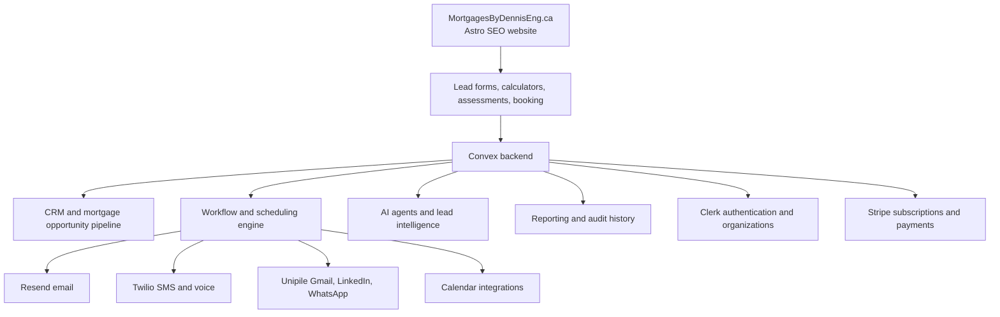
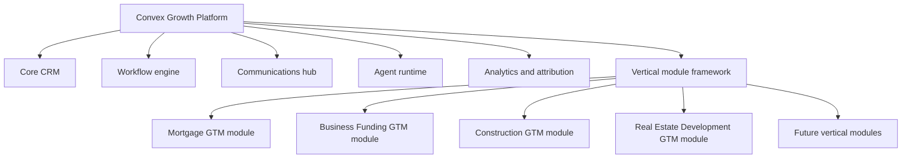
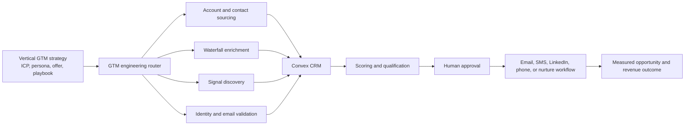

# Source: Notion (page 3ae9e94c-f0a4-81fd-90f4-fb88f3cb397e)

<callout icon="🎯" color="blue_bg">
	**Strategic objective:** Build an AI-native CRM, workflow, communication, and lead-management platform on [Convex.dev](http://Convex.dev) that replaces the core functions currently supplied by GoHighLevel. [MortgagesByDennisEng.ca](http://MortgagesByDennisEng.ca) will serve as the first production MVP and validation environment.
</callout>
# Executive Summary
[MortgagesByDennisEng.ca](http://MortgagesByDennisEng.ca) will be used as the initial test asset for developing a proprietary growth operating platform built on [Convex.dev](http://Convex.dev). The platform is intended to replace the core functions of GoHighLevel rather than integrate with it.
The immediate business objective is to eliminate approximately **\$500–\$600 per month** in bundled GoHighLevel costs while gaining direct ownership of the CRM data model, workflows, AI agents, integrations, customer experience, and future product roadmap.
The project should not attempt to reproduce every GoHighLevel feature. It should first replace the functions required to attract, qualify, nurture, convert, and manage mortgage prospects through [MortgagesByDennisEng.ca](http://MortgagesByDennisEng.ca). Once validated, the same platform can support LeadSniperAI, business-funding workflows, real-estate development outreach, and white-label advisor accounts.
# Strategic Rationale
GoHighLevel provides a broad collection of bundled tools, but the business only requires a focused subset of those capabilities. Rebuilding that subset on Convex creates four strategic advantages:
1. **Lower fixed platform cost** through modular, usage-based services.
2. **Ownership of data and workflows** instead of dependence on a third-party CRM structure.
3. **AI-native operations** where agents can qualify, prioritize, summarize, recommend, and automate work.
4. **Reusable intellectual property** that can become a SaaS or white-label growth platform.
The goal is therefore larger than replacing a subscription. The project converts a recurring software expense into a proprietary operating asset.
# MVP Business Use Case
[MortgagesByDennisEng.ca](http://MortgagesByDennisEng.ca) will act as the first complete operating environment. The MVP should manage the prospect journey from website visit through funded mortgage opportunity.

The website should continue to function as the public SEO and lead-capture asset. Convex will become the backend system of record and workflow engine behind it.
# Core GoHighLevel Functions to Replace
<table fit-page-width="true" header-row="true">
<tr>
<td>GoHighLevel Function</td>
<td>Convex-Based Replacement</td>
<td>MVP Priority</td>
</tr>
<tr>
<td>Contact CRM</td>
<td>Contacts, companies, households, tags, notes, custom fields, and consent records</td>
<td>Essential</td>
</tr>
<tr>
<td>Opportunity pipelines</td>
<td>Mortgage pipelines, stages, values, probabilities, assignments, and stage history</td>
<td>Essential</td>
</tr>
<tr>
<td>Forms and surveys</td>
<td>Astro or React forms connected to Convex HTTP functions and mutations</td>
<td>Essential</td>
</tr>
<tr>
<td>Workflow automation</td>
<td>Event triggers, conditions, actions, scheduled functions, approvals, retries, and logs</td>
<td>Essential</td>
</tr>
<tr>
<td>Email and SMS</td>
<td>Convex orchestration with Resend and Twilio</td>
<td>Essential</td>
</tr>
<tr>
<td>Unified conversations</td>
<td>Convex message timeline with Unipile for Gmail, LinkedIn, and WhatsApp</td>
<td>High</td>
</tr>
<tr>
<td>Calendar and appointments</td>
<td>Connected calendar availability, booking records, reminders, and rescheduling workflows</td>
<td>High</td>
</tr>
<tr>
<td>Campaign sequences</td>
<td>Audiences, steps, templates, delays, sending windows, reply detection, and suppression</td>
<td>High</td>
</tr>
<tr>
<td>Dashboards and reporting</td>
<td>Real-time Convex dashboards for leads, activities, pipeline, appointments, and conversions</td>
<td>High</td>
</tr>
<tr>
<td>AI tools</td>
<td>Qualification, prioritization, summaries, content drafting, and next-best-action agents</td>
<td>Differentiator</td>
</tr>
<tr>
<td>Membership and billing</td>
<td>Clerk organizations and Stripe subscriptions for future multi-tenant use</td>
<td>Later MVP</td>
</tr>
</table>
# Proposed Technology Architecture

## Core stack
- [**Convex.dev**](http://Convex.dev)**:** database, queries, mutations, actions, scheduling, workflow state, real-time application updates, search, files, and agent context.
- **Astro:** public website, SEO content, calculators, assessment pages, and landing pages.
- **React:** interactive CRM application and internal advisor dashboard.
- **Clerk:** authentication, organizations, roles, and tenant membership.
- **Resend:** transactional and campaign email delivery.
- **Twilio:** SMS, voice, phone numbers, and notification delivery.
- **Unipile:** connected Gmail, Outlook, LinkedIn, and WhatsApp accounts where supported.
- **Stripe:** future SaaS subscriptions, plan entitlements, and payment events.
- **Claude Code, Codex, and Cursor:** development agents using Convex plugins, MCP access, AI rules, and isolated deployments.
# Agent Operating Model
Two agent layers should be maintained separately.
## Development agents
Development agents build and improve the platform. They should operate against isolated Convex development deployments and use restricted deployment keys.
Primary responsibilities include schema design, feature development, test generation, migrations, debugging, log review, and pull-request preparation.
## Business agents
Business agents operate within the completed application and assist with revenue-producing workflows.
The initial agents should be:
1. **Lead Intake Agent** — validates, deduplicates, enriches, and categorizes new prospects.
2. **Mortgage Qualification Agent** — evaluates mortgage purpose, property type, income, equity, credit indicators, urgency, and document readiness.
3. **Lead Priority Agent** — ranks daily opportunities using intent, engagement, urgency, fit, and expected value.
4. **Follow-Up Agent** — recommends or schedules the next permitted action based on prospect history.
5. **Conversation Agent** — summarizes communication activity across connected channels.
6. **Pipeline Agent** — detects stale opportunities, missing tasks, incorrect stages, and unworked leads.
7. **Advisor Copilot** — prepares daily priorities, prospect briefs, call preparation, and response drafts.
<callout icon="🔐" color="yellow_bg">
	High-impact agent actions should initially require human approval. Autonomous sending, stage movement, or document requests should only be enabled after workflows have been validated through audit logs and test cases.
</callout>
# MVP Scope for [MortgagesByDennisEng.ca](http://MortgagesByDennisEng.ca)
## Lead acquisition
- Connect all website forms and assessments directly to Convex.
- Capture source, landing page, campaign, keyword, consent, and referral information.
- Create or update the contact without producing duplicate records.
- Generate an opportunity in the correct mortgage pipeline.
- Route the prospect based on mortgage type, location, urgency, and estimated fit.
## CRM and opportunity management
- Maintain a complete contact and household profile.
- Track mortgage purpose, property, requested amount, equity, income, credit indicators, lender category, status, and expected commission.
- Support pipelines for purchase, refinance, renewal, private lending, construction, commercial, and nurture.
- Record notes, tasks, files, communication events, stage changes, and ownership history.
## Follow-up and communications
- Send immediate acknowledgment after a new inquiry.
- Create channel-specific follow-up sequences.
- Pause sequences when the prospect replies or books an appointment.
- Generate tasks when automation should hand off to a person.
- Maintain consent, suppression, sending windows, and audit history.
## Appointments
- Provide booking from the public website.
- Send confirmations and reminders.
- Generate a pre-meeting prospect brief.
- Trigger no-show, reschedule, and post-meeting workflows.
## Reporting
The initial dashboard should display:
- Leads by source and landing page.
- New leads requiring contact.
- Speed-to-lead.
- Appointments booked and attended.
- Pipeline count and value by stage.
- Stale opportunities.
- Follow-up completion.
- Conversion from inquiry to appointment, application, approval, and funding.
- Expected and realized commission value.
# Recommended Mortgage Pipeline
```plain text
New Inquiry
→ Contact Attempted
→ Discovery Scheduled
→ Discovery Completed
→ Documents Requested
→ Documents Received
→ Application Prepared
→ Submitted to Lender
→ Conditional Approval
→ Approved
→ Funded
```
Additional terminal or alternate stages should include:
- Nurture
- Referred to Alternative Solution
- Unqualified
- Lost
- Withdrawn
- Future Renewal
# Implementation Phases
## Phase 1 — Foundation and CRM Core
**Outcome:** Establish a secure Convex application capable of receiving and managing mortgage leads.
- Multi-tenant-ready schema.
- Clerk authentication and roles.
- Contacts, households, organizations, opportunities, pipelines, tasks, notes, files, consent, and audit events.
- Website lead-form connection.
- Basic advisor dashboard.
- Isolated development, staging, and production deployments.
## Phase 2 — Communications and Workflow Replacement
**Outcome:** Replace the essential follow-up functions used in GoHighLevel.
- Resend email integration.
- Twilio SMS integration.
- Workflow triggers, conditions, delays, actions, approvals, retries, and logs.
- Lead acknowledgment and nurture sequences.
- Reply and booking suppression.
- Unified activity timeline.
## Phase 3 — Calendar and Campaign Operations
**Outcome:** Manage appointment conversion and structured outbound follow-up.
- Calendar connection and booking.
- Confirmations, reminders, rescheduling, and no-show workflows.
- Campaign audiences, templates, sequence steps, and performance metrics.
- Gmail, LinkedIn, and WhatsApp synchronization through Unipile where appropriate.
## Phase 4 — Agentic Mortgage Operations
**Outcome:** Improve advisor productivity and lead conversion beyond GoHighLevel's standard automation model.
- AI qualification.
- Daily lead prioritization.
- Conversation summaries.
- Next-best-action recommendations.
- Pipeline hygiene monitoring.
- Meeting preparation.
- Personalized draft generation with approval controls.
## Phase 5 — Multi-Tenant and White-Label Expansion
**Outcome:** Convert the validated internal system into a reusable product.
- Tenant onboarding.
- Custom domains and branding.
- Stripe plans and entitlements.
- Usage metering.
- Workflow templates.
- Mortgage-broker and advisor accounts.
- LeadSniperAI and business-funding modules.
# Economics and Expected Value
## Direct financial objective
- Estimated GoHighLevel expense eliminated: **\$500–\$600 per month**.
- Estimated annual gross savings: **\$6,000–\$7,200**.
The replacement will still incur usage-based costs for Convex, communications, connected accounts, AI models, authentication, and hosting. A reasonable initial target is to operate the focused internal platform below the cost of the bundled GoHighLevel subscription.
## Broader value creation
The largest return may come from capabilities that GoHighLevel does not provide in a sufficiently customized form:
- Mortgage-specific qualification and routing.
- Signal-based lead prioritization.
- Faster response times.
- Better advisor preparation.
- Reduced manual CRM administration.
- Improved follow-up consistency.
- Proprietary conversion data.
- Reusable workflows across multiple business assets.
- Future subscription or white-label revenue.
# MVP Success Criteria
The [MortgagesByDennisEng.ca](http://MortgagesByDennisEng.ca) MVP will be considered operationally successful when:
- [ ] Every website lead is captured in Convex with source and consent data.
- [ ] Duplicate contacts are identified and merged or linked safely.
- [ ] Every qualified inquiry creates a mortgage opportunity.
- [ ] Email and SMS acknowledgments run automatically.
- [ ] Replies and bookings pause inappropriate follow-up.
- [ ] Advisors can see one complete activity timeline.
- [ ] Opportunities can be managed through configurable stages.
- [ ] Tasks, reminders, and scheduled follow-ups are reliable.
- [ ] The dashboard identifies daily priority prospects and stale opportunities.
- [ ] Appointment and pipeline conversion can be measured.
- [ ] Audit logs show every automated and agent-assisted action.
- [ ] No essential [MortgagesByDennisEng.ca](http://MortgagesByDennisEng.ca) workflow requires GoHighLevel.
# Key Risks and Controls
<table fit-page-width="true" header-row="true">
<tr>
<td>Risk</td>
<td>Control</td>
</tr>
<tr>
<td>Building too many GHL features before launch</td>
<td>Prioritize only workflows required to acquire, qualify, nurture, and convert mortgage leads.</td>
</tr>
<tr>
<td>Agent actions create incorrect communications or CRM changes</td>
<td>Use approval gates, permission scopes, test tenants, audit logs, and reversible actions.</td>
</tr>
<tr>
<td>Duplicate sends or workflow executions</td>
<td>Use idempotency keys, transactional mutations, workflow execution records, and retry policies.</td>
</tr>
<tr>
<td>Tenant or customer data exposure</td>
<td>Enforce tenant isolation in every query and mutation, with centralized authorization helpers.</td>
</tr>
<tr>
<td>Communication compliance failures</td>
<td>Store consent evidence, suppression state, channel permissions, sending windows, and delivery history.</td>
</tr>
<tr>
<td>Provider dependency</td>
<td>Use integration adapters so Resend, Twilio, Unipile, calendar, or AI providers can be changed.</td>
</tr>
<tr>
<td>Development agents access production</td>
<td>Give each agent an isolated temporary deployment and deployment-scoped credentials.</td>
</tr>
</table>
# Decision and Recommendation
Proceed with a focused **Convex Growth CRM — GoHighLevel Replacement MVP** using [MortgagesByDennisEng.ca](http://MortgagesByDennisEng.ca) as the first production asset.
The recommended decision is to build only the minimum complete operating system required to replace the current GoHighLevel dependency. The first release should prioritize CRM records, mortgage pipelines, lead capture, follow-up workflows, email, SMS, activity history, booking, and reporting. AI agents should then be introduced as controlled productivity and conversion improvements.
The architecture should be multi-tenant-ready from the beginning, but the initial user experience should remain optimized for one operating business. This balances immediate cost savings with the long-term opportunity to create a white-label platform.
# Immediate Next Actions
1. Audit the current [MortgagesByDennisEng.ca](http://MortgagesByDennisEng.ca) pages, forms, calculators, lead sources, and required follow-up workflows.
2. Identify the exact GoHighLevel features currently used and classify them as essential, replace later, or remove.
3. Finalize the Convex CRM schema and tenant-security rules.
4. Connect one production lead form to a staging Convex deployment.
5. Build the contact, opportunity, task, activity, and pipeline dashboard.
6. Implement the first lead acknowledgment and advisor-notification workflow.
7. Run parallel validation before cancelling GoHighLevel.
<callout icon="✅" color="green_bg">
	**Go/no-go cancellation gate:** GoHighLevel should be cancelled only after all essential [MortgagesByDennisEng.ca](http://MortgagesByDennisEng.ca) lead-capture, follow-up, appointment, pipeline, and reporting workflows have passed production validation and a data export has been retained.
</callout>
# Working Assumptions
- [MortgagesByDennisEng.ca](http://MortgagesByDennisEng.ca) remains the primary public web asset for the MVP.
- Astro is used for SEO-oriented public pages and React for the CRM experience.
- Convex is the system of record and workflow orchestration layer.
- Twilio, Resend, Unipile, Clerk, Stripe, and calendar providers remain modular external services.
- The system is designed for Canadian mortgage operations first and expanded after validation.
- Initial agent actions operate with human oversight before higher autonomy is enabled.
# Reference Assets
- [MortgagesByDennisEng.ca](https://mortgagesbydenniseng.ca)
- [Convex.dev](https://convex.dev)
- [Convex AI and agent documentation](https://docs.convex.dev/ai)
- [Convex scheduling documentation](https://docs.convex.dev/scheduling)
---
# Addendum — Vertical GTM Module Architecture
<callout icon="🧩" color="purple_bg">
	**Strategic extension:** The Convex Growth CRM should evolve from a mortgage-specific GoHighLevel replacement into a shared platform with installable vertical GTM modules. [MortgagesByDennisEng.ca](http://MortgagesByDennisEng.ca) becomes the first reference module and production validation environment.
</callout>
## Platform Direction
The future product architecture should separate the reusable platform from industry-specific operating logic.

The shared platform should understand generic business objects such as contacts, companies, opportunities, signals, campaigns, activities, workflows, agent runs, and outcomes. Each vertical module supplies the configuration and rules that make those objects industry-specific.
## Vertical Module Package
Each vertical module should package five coordinated layers:
1. **Data model extensions** — custom fields, entities, qualification criteria, pipeline stages, and validation rules.
2. **GTM intelligence** — ideal customer profiles, personas, offers, signals, scoring models, buying triggers, and exclusions.
3. **Execution playbooks** — campaigns, workflows, outreach sequences, nurture paths, referral strategies, and hand-off rules.
4. **Agent skills** — research, qualification, enrichment, messaging, prioritization, next-best action, pipeline management, and reporting.
5. **Governance** — consent policies, approval requirements, compliance rules, permissions, audit history, and autonomous-action limits.
## Product Hierarchy
```plain text
Platform
→ Vertical Pack
→ GTM Motion
→ Playbook
→ Skill
→ Workflow Run
→ Measured Outcome
```
Mortgage example:
```plain text
Mortgage Vertical Pack
→ Renewal Acquisition
→ 120-Day Renewal Playbook
→ Renewal Research Skill
→ Personalized Outreach Workflow
→ Consultation Booked
→ Application Submitted
→ Funded Mortgage Revenue
```
## Core Schema Domains
The initial schema should be organized into reusable domains rather than separate industry applications.
<table fit-page-width="true" header-row="true">
<tr>
<td>Schema Domain</td>
<td>Purpose</td>
</tr>
<tr>
<td>Verticals</td>
<td>Defines the market, geography, regulatory context, primary entity type, and module settings.</td>
</tr>
<tr>
<td>Vertical field definitions</td>
<td>Adds configurable industry-specific fields without placing mortgage logic inside core CRM tables.</td>
</tr>
<tr>
<td>ICP profiles</td>
<td>Defines target segments, fit criteria, exclusions, geography, revenue, roles, and attributes.</td>
</tr>
<tr>
<td>Personas</td>
<td>Stores pains, desired outcomes, objections, triggers, decision roles, and preferred channels.</td>
</tr>
<tr>
<td>Offers</td>
<td>Defines assessments, consultations, services, lead magnets, financing products, proof, and calls to action.</td>
</tr>
<tr>
<td>GTM skills</td>
<td>Stores reusable skill triggers, procedures, inputs, outputs, tools, permissions, versions, and execution policies.</td>
</tr>
<tr>
<td>Vertical skill installations</td>
<td>Configures a shared skill for a specific vertical, including model settings, instructions, and approval gates.</td>
</tr>
<tr>
<td>Signals</td>
<td>Captures observed buyer, account, engagement, market, referral, and readiness events.</td>
</tr>
<tr>
<td>Scoring models</td>
<td>Separates fit, intent, engagement, readiness, urgency, relationship, and expected-value scoring.</td>
</tr>
<tr>
<td>GTM playbooks</td>
<td>Combines skills, actions, conditions, approvals, branches, and exit criteria into repeatable motions.</td>
</tr>
<tr>
<td>Campaigns and members</td>
<td>Executes playbooks against defined audiences and tracks progression, next actions, exits, and suppression.</td>
</tr>
<tr>
<td>Agent runs and approvals</td>
<td>Provides traceability for inputs, outputs, models, tool calls, validation, approval, errors, and completion.</td>
</tr>
<tr>
<td>Attribution and outcomes</td>
<td>Connects signals, skills, campaigns, opportunities, funded results, revenue, and cost.</td>
</tr>
</table>
## MortgagesByDennis Initial Vertical Pack
### Initial ICPs
- Mortgage-renewal households.
- Self-employed borrowers.
- Alternative-lending borrowers.
- Debt-consolidation borrowers.
- Real-estate investors.
- First-time homebuyers.
- Mortgage referral partners.
### Initial offers
- Mortgage Renewal Review.
- Alternative Mortgage Assessment.
- Debt Consolidation Assessment.
- Mortgage Readiness Assessment.
- First-Time Buyer Qualification.
- Referral Partner Consultation.
### Initial signals
- Website assessment completed.
- Mortgage calculator completed.
- High-intent financing page viewed.
- Appointment booked.
- Renewal date enters the 120-day window.
- Email, SMS, LinkedIn, or WhatsApp reply received.
- Document uploaded.
- Mortgage application started.
- Referral submitted.
- Opportunity becomes inactive or stale.
### Initial GTM skills
- ICP and persona builder.
- Prospect and referral-partner research.
- Contact and property enrichment.
- Signal qualification.
- Mortgage lead scoring.
- Personalized outreach drafting.
- SEO and AEO opportunity research.
- Next-best-action recommendation.
- Pipeline-health audit.
- Campaign performance review.
### Initial playbooks
1. Mortgage renewal acquisition.
2. Alternative mortgage qualification.
3. Debt-consolidation conversion.
4. First-time buyer nurture.
5. Referral partner development.
6. Incomplete application recovery.
7. Stale lead reactivation.
## Recommended Scoring Model
The mortgage module should not rely on one blended lead score. It should preserve separate dimensions:
- **Fit:** borrower, property, geography, requested financing, and available lender solutions.
- **Intent:** evidence that a financing decision is approaching.
- **Engagement:** website, message, appointment, and content activity.
- **Readiness:** consent, documentation, application completeness, and responsiveness.
- **Urgency:** renewal date, purchase conditions, arrears, payout dates, or other deadlines.
- **Relationship:** referral source, prior client status, partner strength, and conversation history.
- **Expected value:** estimated funded amount, commission, conversion probability, and strategic value.
The daily priority queue should be calculated from these dimensions while preserving the explanation and supporting signals used by the agent.
## Agent Governance
Mortgage is a regulated and high-trust vertical. The first production module should require human approval for:
- Personalized outbound messages.
- Representations about approval, eligibility, rates, savings, or funding.
- Lender or product recommendations.
- Externally shared calculations.
- Qualification decisions with material customer impact.
- Application submission.
- Destructive data changes or suppression overrides.
Autonomous actions should begin with low-risk internal work such as research, deduplication suggestions, summaries, task creation, stale-lead detection, and draft preparation.
## Module Reuse Strategy
Future modules should reuse the same platform services and replace only the vertical pack.
```plain text
Shared platform services
+ Vertical schema configuration
+ ICPs and personas
+ Offers and signals
+ Scoring models
+ Skills and playbooks
+ Compliance and approval policies
+ Dashboards and benchmarks
```
Potential future modules include:
- Business Funding GTM.
- Commercial Financing GTM.
- Real Estate Development GTM.
- Construction and Consulting GTM.
- Local Home Services GTM.
- Rank-and-Rent Lead Distribution GTM.
## Commercial Model
The module architecture supports several future revenue models:
- Internal operating platform.
- Vertical SaaS subscription.
- White-label CRM and GTM platform.
- Managed GTM service.
- Vertical module licensing.
- Paid playbook and agent-skill marketplace.
- Usage-based signal, enrichment, communication, and AI services.
## Architectural Decision
<callout icon="✅" color="green_bg">
	Build one shared Convex Growth Platform and treat mortgages as the first installable vertical pack. Mortgage-specific logic should remain in module configuration, skills, scoring models, and playbooks—not inside the reusable CRM core.
</callout>
## Addendum Success Criteria
- [ ] A vertical can be installed without forking the core CRM application.
- [ ] Vertical-specific fields can be added without changing core contact or opportunity tables.
- [ ] Skills are versioned, permissioned, and configurable by vertical.
- [ ] Signals and scoring models are explainable and auditable.
- [ ] Playbooks can combine skills, workflows, approval gates, and communication channels.
- [ ] Agent runs record input, output, evidence, validation, cost, and outcome.
- [ ] Revenue and conversion can be attributed to campaigns, signals, playbooks, and skills.
- [ ] The validated mortgage module can be cloned into a second vertical using configuration rather than a new application build.
---
# Addendum B — GTM Engineering Skills and Deepline Execution Layer
<callout icon="⚙️" color="green_bg">
	**Purpose:** Add the [getaero-io/gtm-eng-skills](https://github.com/getaero-io/gtm-eng-skills) repository as the data acquisition, enrichment, signal discovery, and outbound execution layer within the Convex vertical GTM architecture.
</callout>
## Strategic Role
The GTM workflow design should use two complementary skill layers:
1. **GTM strategy skills** define the market, ICP, positioning, offer, messaging, campaign logic, and measurement model.
2. **GTM engineering skills** execute the data-intensive work required to build audiences, enrich records, discover signals, validate identities, and prepare outbound campaigns.
The GTM engineering repository provides agent skills for Claude Code, Codex, Cursor, and other agents using the `SKILL.md` format. Its workflows use the Deepline CLI to orchestrate multiple GTM data providers through waterfall enrichment, validation rules, cost-aware routing, and structured outputs.

## Division of Responsibilities
<table fit-page-width="true" header-row="true">
<tr>
<td>Layer</td>
<td>Primary responsibility</td>
<td>Examples</td>
</tr>
<tr>
<td>Vertical module</td>
<td>Defines industry-specific market logic</td>
<td>Mortgage renewal ICP, alternative-lending offer, referral-partner persona, compliance policy</td>
</tr>
<tr>
<td>GTM strategy skills</td>
<td>Designs the growth motion</td>
<td>ICP creation, positioning, campaign plan, messaging, SEO, AEO, account-based strategy</td>
</tr>
<tr>
<td>GTM engineering skills</td>
<td>Produces and validates operational GTM data</td>
<td>TAM building, enrichment, LinkedIn resolution, niche-signal discovery, portfolio prospecting</td>
</tr>
<tr>
<td>Convex platform</td>
<td>Stores state and orchestrates workflows</td>
<td>Contacts, accounts, signals, scores, agent runs, approvals, campaigns, opportunities, attribution</td>
</tr>
<tr>
<td>Channel providers</td>
<td>Deliver approved communications</td>
<td>Resend, Twilio, Unipile, Gmail, LinkedIn, WhatsApp</td>
</tr>
</table>
## Repository Skills to Incorporate
<table fit-page-width="true" header-row="true">
<tr>
<td>Skill</td>
<td>Platform role</td>
<td>Mortgage vertical application</td>
</tr>
<tr>
<td>`deepline-gtm`</td>
<td>Meta-router for provider-driven GTM tasks</td>
<td>Choose the appropriate sourcing, enrichment, validation, and export workflow for a campaign</td>
</tr>
<tr>
<td>`build-tam`</td>
<td>Build target account and contact universes from ICP filters</td>
<td>Create lists of accountants, realtors, financial planners, builders, property managers, or employers by region</td>
</tr>
<tr>
<td>`portfolio-prospecting`</td>
<td>Find organizations associated with an investor, accelerator, network, or portfolio</td>
<td>Identify real-estate developers, construction firms, housing groups, and investment networks with financing needs</td>
</tr>
<tr>
<td>`linkedin-url-lookup`</td>
<td>Resolve and validate professional profile identity</td>
<td>Match referral partners and commercial-financing decision-makers to the correct LinkedIn profile</td>
</tr>
<tr>
<td>`niche-signal-discovery`</td>
<td>Compare won and lost accounts to discover predictive signals</td>
<td>Identify characteristics that distinguish booked, applied, approved, funded, lost, or inactive mortgage opportunities</td>
</tr>
<tr>
<td>`clay-to-deepline`</td>
<td>Convert spreadsheet enrichment logic into code-based workflows</td>
<td>Migrate existing Clay or spreadsheet enrichment processes into repeatable agent workflows</td>
</tr>
<tr>
<td>`workflow-hello-world`</td>
<td>Scaffold scheduled or webhook-triggered workflows</td>
<td>Run recurring referral-partner discovery, lead enrichment, renewal monitoring, or database hygiene processes</td>
</tr>
</table>
## Revised GTM Workflow
The shared GTM workflow should now follow this operating sequence:
```plain text
Vertical selected
→ ICP and persona loaded
→ Offer and playbook selected
→ Audience specification generated
→ TAM or prospect list sourced
→ Accounts and contacts deduplicated
→ Waterfall enrichment executed
→ Identity and communication details validated
→ Niche and intent signals collected
→ Records normalized into Convex
→ Fit, intent, engagement, readiness, and relationship scores calculated
→ Agent generates a research brief and recommended action
→ Compliance and human-approval rules applied
→ Prospect enters the appropriate campaign or advisor queue
→ Replies, appointments, applications, and outcomes flow back into Convex
→ Won/lost results improve the signal and scoring model
```
## Schema Extensions
The existing GTM schema should add provider-level traceability, enrichment jobs, field provenance, and spend controls.
### `dataProviders`
Stores provider capabilities and routing rules.
```typescript
{
  key: string,
  name: string,
  capabilityTypes: string[],
  enabled: boolean,
  priority: number,
  costModel?: unknown,
  supportedRegions?: string[],
  supportedEntityTypes?: string[],
  configurationReference?: string,
  createdAt: number,
  updatedAt: number
}
```
### `enrichmentRecipes`
Defines a waterfall sequence for a specific objective and vertical.
```typescript
{
  tenantId: Id<"tenants">,
  verticalId?: Id<"verticals">,
  key: string,
  name: string,
  objective: string,
  inputEntityType: string,
  outputSchema: unknown,
  steps: Array<{
    sequence: number,
    providerKey: string,
    capability: string,
    condition?: unknown,
    stopWhen?: unknown,
    maximumCost?: number
  }>,
  validationRules: unknown,
  approvalThreshold?: number,
  version: number,
  status: "draft" | "active" | "archived",
  createdAt: number,
  updatedAt: number
}
```
### `enrichmentJobs`
Tracks each request made by an agent, workflow, campaign, or user.
```typescript
{
  tenantId: Id<"tenants">,
  verticalId?: Id<"verticals">,
  recipeId: Id<"enrichmentRecipes">,
  campaignId?: Id<"gtmCampaigns">,
  agentRunId?: Id<"agentRuns">,
  sourceType: "csv" | "crm_query" | "webhook" | "scheduled" | "manual",
  sourceReference?: string,
  status: "queued" | "running" | "review" | "completed" | "failed" | "cancelled",
  inputCount: number,
  processedCount: number,
  matchedCount: number,
  validatedCount: number,
  failedCount: number,
  estimatedCost?: number,
  actualCost?: number,
  startedAt?: number,
  completedAt?: number,
  createdAt: number
}
```
### `enrichmentAttempts`
Maintains waterfall and provider performance history.
```typescript
{
  tenantId: Id<"tenants">,
  enrichmentJobId: Id<"enrichmentJobs">,
  entityType: string,
  entityId: string,
  fieldKey: string,
  providerKey: string,
  sequence: number,
  status: "matched" | "not_found" | "invalid" | "error" | "skipped",
  rawValue?: unknown,
  normalizedValue?: unknown,
  confidence?: number,
  validationStatus?: string,
  cost?: number,
  latencyMs?: number,
  attemptedAt: number
}
```
### `fieldProvenance`
Preserves the origin and confidence of every important enriched field.
```typescript
{
  tenantId: Id<"tenants">,
  entityType: string,
  entityId: string,
  fieldKey: string,
  valueHash: string,
  sourceType: "user" | "form" | "provider" | "agent" | "integration" | "derived",
  sourceKey: string,
  sourceRecordId?: string,
  confidence?: number,
  validationStatus?: string,
  observedAt: number,
  expiresAt?: number,
  supersededAt?: number
}
```
### `providerPerformance`
Measures provider quality for each vertical and enrichment field.
```typescript
{
  tenantId: Id<"tenants">,
  verticalId?: Id<"verticals">,
  providerKey: string,
  capability: string,
  fieldKey?: string,
  requestCount: number,
  matchCount: number,
  validatedCount: number,
  falsePositiveCount: number,
  totalCost: number,
  averageLatencyMs: number,
  periodStart: number,
  periodEnd: number
}
```
### `gtmBudgets`
Controls enrichment and campaign spending.
```typescript
{
  tenantId: Id<"tenants">,
  verticalId?: Id<"verticals">,
  campaignId?: Id<"gtmCampaigns">,
  period: "day" | "week" | "month" | "campaign",
  maximumEnrichmentSpend: number,
  maximumAiSpend?: number,
  maximumChannelSpend?: number,
  approvalRequiredAbove: number,
  currentEnrichmentSpend: number,
  currentAiSpend?: number,
  currentChannelSpend?: number,
  resetsAt?: number
}
```
## Data Quality and Cost Controls
The GTM engineering layer should not write directly into authoritative CRM fields without validation. The recommended sequence is:
1. Write provider outputs to a staging result.
2. Normalize the value into the platform format.
3. Apply identity, email, geographic, and entity-match validation.
4. Compare with existing values and provenance.
5. Assign a confidence score.
6. Request review when confidence or cost thresholds are not met.
7. Promote validated fields into the canonical contact, company, property, or opportunity record.
Required controls include:
- Cheapest-qualified-provider-first routing.
- Maximum spend per job and campaign.
- Approval before expensive enrichment runs.
- Idempotency keys for every batch and provider attempt.
- Strict identity validation before attaching LinkedIn profiles.
- Email verification before outbound enrollment.
- Retention of source, confidence, timestamp, and validation status.
- Re-enrichment rules based on field expiry and business importance.
- Provider hit-rate and false-positive reporting by vertical.
## MortgagesByDennis Initial Engineering Workflows
### Referral Partner TAM Builder
```plain text
Select referral-partner ICP
→ Choose geography and profession
→ Source organizations and professionals
→ Resolve LinkedIn profiles
→ Enrich business email and phone where permitted
→ Validate identity and communication details
→ Score fit and relationship opportunity
→ Create Convex accounts and contacts
→ Generate research brief
→ Queue high-priority prospects for approval
```
### Alternative-Lending Signal Discovery
```plain text
Export funded and lost opportunities
→ Remove direct personal identifiers from the analysis set where appropriate
→ Compare property, borrower, engagement, source, timing, and workflow characteristics
→ Discover predictive attributes
→ Review signals with a mortgage professional
→ Version the scoring model
→ Test against a holdout opportunity set
→ Deploy scoring rules with audit history
```
### Commercial and Development Prospecting
```plain text
Define project and financing ICP
→ Build target account universe
→ Enrich company, project, leadership, and contact information
→ Detect development, hiring, permit, expansion, funding, or portfolio signals
→ Score likely capital need
→ Create account research brief
→ Route qualified opportunities to the advisor pipeline
```
### Database Hygiene Workflow
```plain text
Run on a controlled schedule
→ Find missing or stale fields
→ Select enrichment recipe by entity and field
→ Apply cost and approval limits
→ Validate returned values
→ update canonical records and provenance
→ report provider performance and data-quality changes
```
## Build-versus-Buy Boundary
Deepline should be treated as an external enrichment and provider-orchestration adapter, while Convex remains the permanent system of record and workflow authority.
**Deepline owns:** provider routing, waterfall enrichment execution, external data retrieval, and provider-specific normalization.
**Convex owns:** tenant isolation, CRM records, field provenance, consent, signals, scoring, campaigns, approvals, opportunity state, audit logs, costs, and outcome attribution.
This boundary prevents the GTM platform from becoming dependent on one enrichment vendor. A shared adapter contract should allow Deepline or an individual data provider to be replaced without changing the vertical module or core CRM schema.
## Updated Product Model
```plain text
Convex Growth Platform
→ Vertical GTM Pack
→ Strategy Skill Set
→ GTM Engineering Recipe
→ Provider Waterfall
→ Validated CRM Data
→ Signal and Score
→ Campaign or Advisor Action
→ Opportunity Outcome
→ Learning Loop
```
## Decision
Adopt `gtm-eng-skills` as the initial GTM engineering skill pack for the Convex Growth Platform. Use it to accelerate TAM construction, enrichment, identity resolution, signal discovery, and recurring data workflows, while keeping all canonical CRM state, governance, and attribution inside Convex.
The MortgagesByDennis module should begin with referral-partner TAM building, database enrichment, niche-signal discovery, and commercial-development prospecting. Automated outbound activation should remain approval-gated until data quality, consent controls, provider accuracy, and campaign outcomes have been validated.
---
# Addendum — Relationship-Led GTM Marketing Layer
<callout icon="🤝" color="green_bg">
	**Purpose:** Replace the relationship-development, prospecting, enrichment, LinkedIn outreach, and campaign-intelligence functions normally handled through GoHighLevel and separate prospecting tools. This layer supports the [MortgagesByDennisEng.ca](http://MortgagesByDennisEng.ca) GTM strategy, especially referral-partner development and high-value commercial opportunities.
</callout>
## Strategic role
The Convex platform should not reproduce GoHighLevel marketing as a collection of generic email and SMS automations. It should create a relationship-led GTM operating system that discovers relevant people, identifies warm paths, enriches their records, verifies professional identity, activates outreach, and attributes eventual mortgage referrals or funded transactions.
The combined operating model is:

## Division of responsibility
<table fit-page-width="true" header-row="true">
<tr>
<td>Platform</td>
<td>Primary role</td>
<td>Contribution to GHL replacement</td>
</tr>
<tr>
<td>Convex</td>
<td>System of record, workflow orchestration, scoring, permissions, campaign state, analytics, and attribution</td>
<td>Replaces CRM, workflow, pipeline, campaign logic, automation history, and reporting</td>
</tr>
<tr>
<td>Happenstance</td>
<td>Natural-language people search, network intelligence, relevant-person discovery, and warm-path identification</td>
<td>Adds relationship-led prospect discovery beyond ordinary contact lists</td>
</tr>
<tr>
<td>Unipile</td>
<td>LinkedIn profile resolution, relationship state, connected-account messaging, replies, invitations, and conversation events</td>
<td>Replaces LinkedIn engagement and unified-conversation functions</td>
</tr>
<tr>
<td>Deepline</td>
<td>Email, telephone, company, and person enrichment through provider waterfalls, validation, and cost routing</td>
<td>Replaces Clay-style enrichment and data waterfall operations</td>
</tr>
<tr>
<td>GTM Skills and GTM Engineering Skills</td>
<td>Reusable strategy, research, enrichment, campaign, RevOps, and execution workflows</td>
<td>Provides agent-operable playbooks instead of static automation templates</td>
</tr>
<tr>
<td>Resend, Twilio, and connected channels</td>
<td>Email, SMS, voice, and notification delivery</td>
<td>Replaces outbound delivery functions</td>
</tr>
</table>
## Happenstance as the relationship-intelligence layer
Happenstance should be used to answer questions that conventional enrichment tools cannot answer efficiently:
- Which professionals match the current mortgage referral-partner ICP?
- Which relevant people are already inside Dennis's network, friends' networks, or approved groups?
- Who may be able to introduce Dennis to a high-value target?
- Which people have experience or relationships that make them strategically relevant even when their job title is not an exact match?
- Which existing relationships should be reactivated because the person has moved into a relevant role?
Example searches include:
- Accountants in Metro Vancouver who advise incorporated or self-employed clients and are reachable through Dennis's network.
- Realtors and financial planners who work with property investors and may refer mortgage opportunities.
- Family-law lawyers and insolvency professionals whose clients may require refinancing, equity access, or alternative lending.
- Commercial real-estate professionals, developers, and investors connected to trusted relationships.
Happenstance results should enter Convex as relationship candidates rather than immediately becoming campaign members.
## Enhanced enrichment workflow
```plain text
Target segment selected
→ Happenstance identifies relevant people and possible relationship paths
→ Convex deduplicates against existing contacts and companies
→ Unipile resolves the LinkedIn identity and current professional context
→ Deepline finds and validates professional email, telephone, domain, and firmographic data
→ Convex records field-level provenance, freshness, confidence, and enrichment cost
→ GTM scoring evaluates fit, intent, relationship strength, data quality, and strategic value
→ Agent recommends warm introduction, direct LinkedIn engagement, email, telephone follow-up, nurture, or exclusion
→ Human approval is applied according to channel and compliance policy
→ Replies, invitation changes, meetings, referrals, and funded outcomes update the CRM automatically
```
## Mortgage GTM motions supported
### Referral-partner acquisition
Target accountants, realtors, financial planners, lawyers, insolvency professionals, insurance advisors, builders, property managers, and other professionals who may encounter mortgage needs.
### Warm-introduction campaigns
Prioritize prospects with credible introducers or meaningful network overlap before using cold outreach.
### Commercial and development opportunities
Identify developers, commercial brokers, property owners, investors, and capital relationships where relationship intelligence materially improves access.
### Relationship reactivation
Find existing contacts who have changed roles, joined relevant firms, entered real estate or financial services, or become better referral partners.
### High-value prospect research
Use person research and LinkedIn context to prepare meeting briefs, referral requests, personalized outreach, and next-best-action recommendations.
## Relationship and GTM scoring
The marketing module should calculate separate dimensions rather than one opaque score:
```plain text
ICP Fit
+ Relationship Strength
+ Data Confidence
+ Engagement
+ Intent
+ Timing
+ Strategic Value
= GTM Priority
```
Relationship evidence may include:
- direct connection
- trusted mutual contact
- friend-of-friend path
- approved group overlap
- prior positive conversation
- previous referral
- invitation acceptance
- response recency
- introduction availability
No score should erase the underlying evidence. Convex should retain the source, timestamp, explanation, and confidence for each contribution.
## Convex schema extensions
The GTM marketing layer should include the following additional domains:
```plain text
networkSources
relationshipSearches
relationshipCandidates
introductionPaths
linkedinProfiles
linkedinRelationships
linkedinEvents
linkedinConversationInsights
enrichmentRecipes
enrichmentJobs
providerAttempts
enrichedDataPoints
fieldProvenance
identityResolutionCandidates
gtmScores
gtmPlaybooks
gtmCampaigns
campaignMembers
agentRuns
approvalRequests
attributionRecords
```
## Governance and controls
- Happenstance searches should use approved network scopes and defined ICP queries.
- LinkedIn retrieval and outreach should respect connected-account limits and account-health controls.
- Deepline enrichment should use pilot batches, cost ceilings, provider logging, and validation requirements.
- Convex should preserve source-level evidence instead of silently overwriting CRM fields.
- Lower-confidence identity matches should require manual review.
- First-touch LinkedIn and personalized outreach should initially require approval.
- Consumer mortgage qualification must rely on consented, customer-provided information rather than inferred sensitive data.
- Warm-path information should only be visible to users with the correct tenant and relationship permissions.
## Marketing replacement outcome
This architecture replaces the core GoHighLevel marketing functions with a more specialized system:
<table fit-page-width="true" header-row="true">
<tr>
<td>Traditional GHL marketing function</td>
<td>Convex GTM replacement</td>
</tr>
<tr>
<td>Static contact lists</td>
<td>ICP-driven network discovery and enriched relationship candidates</td>
</tr>
<tr>
<td>Generic lead scoring</td>
<td>Fit, intent, engagement, readiness, relationship, and strategic-value scoring</td>
</tr>
<tr>
<td>Basic campaign sequences</td>
<td>Vertical playbooks with channel selection, approval gates, and next-best-action logic</td>
</tr>
<tr>
<td>LinkedIn handled outside the CRM</td>
<td>Unipile-connected LinkedIn identity, conversations, invitations, and events inside Convex</td>
</tr>
<tr>
<td>Third-party list enrichment</td>
<td>Deepline provider waterfalls with provenance, validation, and budget controls</td>
</tr>
<tr>
<td>Cold-first prospecting</td>
<td>Warm-path-first prospecting through Happenstance and relationship scoring</td>
</tr>
<tr>
<td>Activity reporting</td>
<td>End-to-end attribution from network source and introduction path to referral and funded mortgage</td>
</tr>
</table>
## MortgagesByDennis MVP implementation sequence
1. Define the initial referral-partner ICPs and geographic segments.
2. Configure Happenstance searches for accountants, realtors, financial planners, and selected legal or insolvency professionals.
3. Import candidates into a Convex review queue.
4. Resolve high-value LinkedIn profiles through Unipile.
5. Enrich approved records through Deepline.
6. Calculate relationship-led GTM priority scores.
7. Launch one warm-introduction playbook and one direct referral-partner outreach playbook.
8. Capture all replies, meetings, referrals, applications, and funded outcomes.
9. Compare conversion and acquisition cost against conventional cold outreach.
10. Package the validated workflow as part of the reusable Mortgage GTM vertical module.
<callout icon="📈" color="blue_bg">
	**Strategic outcome:** The MortgagesByDennis GTM module becomes more than a funnel and follow-up system. It becomes a network-aware growth engine that can discover reachable referral partners, enrich and verify them, recommend the best relationship path, coordinate outreach, and measure resulting mortgage revenue.
</callout>
# Addendum — Recommended GTM Verticals
<callout icon="🧭" color="green_bg">
	The Convex platform should evolve from a mortgage-specific GoHighLevel replacement into a shared GTM operating system with reusable vertical modules. [MortgagesByDennisEng.ca](http://MortgagesByDennisEng.ca) remains the first validation environment, while commercial real estate should be the next recommended vertical.
</callout>
## Recommended module sequence
1. **Mortgage GTM Module** — inbound mortgage leads, renewals, refinancing, private lending, alternative lending, referral partners, application workflows, and funded-mortgage attribution.
2. **Commercial Real Estate GTM Module** — buyer discovery, off-market property sourcing, seller outreach, acquisition mandates, capital matching, and transaction pipelines.
3. **Business Funding GTM Module** — business-owner prospecting, financing needs, lender matching, application readiness, referral partners, and funded-deal attribution.
4. **Development and Construction GTM Module** — development-site sourcing, project stakeholder discovery, permit and planning signals, construction financing, consultants, and project opportunities.
5. **Financial Professional GTM Module** — white-label versions for mortgage brokers, commercial lenders, wealth advisors, insurance professionals, accountants, and business-finance consultants.
## Commercial Real Estate GTM Module
The recommended second vertical is a **Commercial Real Estate GTM OS** for professionals seeking commercial transactions, purchases, listings, financing, and development opportunities.
### Target users
- Commercial real estate brokers and investment-sales teams.
- Commercial mortgage brokers and lenders.
- Developers and acquisition teams.
- Private-equity firms, family offices, and real-estate investors.
- Tenant-representation brokers and property managers.
- Development, construction, and capital advisory professionals.
### Primary GTM motions
#### Buyer and investor discovery
```plain text
Capture acquisition criteria
→ discover matching buyers and investors
→ identify relationship paths
→ enrich decision-makers
→ score mandate fit
→ launch approved outreach
→ track interest and transaction activity
```
#### Off-market property sourcing
```plain text
Define target asset profile
→ identify properties and ownership entities
→ enrich owners and principals
→ detect timing and disposition signals
→ launch relationship-led or cold outreach
→ create seller or acquisition opportunity
```
#### Capital and financing discovery
```plain text
Capture transaction requirements
→ match lenders, investors, and capital partners
→ identify relevant originators
→ enrich and validate contacts
→ distribute approved deal summary
→ track interest, quotes, terms, and closing outcomes
```
#### Development-site sourcing
```plain text
Monitor planning, zoning, permit, and redevelopment signals
→ identify underutilized sites
→ resolve ownership
→ assess development fit
→ contact owner, developer, or capital partner
→ create purchase, joint-venture, advisory, or financing opportunity
```
#### Tenant and occupier prospecting
```plain text
Identify expanding or relocating companies
→ find lease, location, or growth signals
→ identify real-estate decision-makers
→ enrich contacts
→ launch tenant-representation campaign
→ manage space requirements and opportunities
```
## Vertical technology roles
<table fit-page-width="true" header-row="true">
<tr>
<td>Platform</td>
<td>Role in the GTM vertical</td>
</tr>
<tr>
<td>Convex</td>
<td>System of record, CRM, properties, mandates, transactions, workflows, scoring, approvals, attribution, and reporting.</td>
</tr>
<tr>
<td>Happenstance</td>
<td>Relationship-led discovery of buyers, investors, developers, lenders, brokers, and warm introduction paths.</td>
</tr>
<tr>
<td>Unipile</td>
<td>LinkedIn identity verification, unified one-to-one messaging, relationship events, and conversation synchronization.</td>
</tr>
<tr>
<td>Deepline</td>
<td>Company, owner, decision-maker, work-email, phone, and firmographic enrichment through provider waterfalls.</td>
</tr>
<tr>
<td>Smartlead</td>
<td>Approved B2B cold-email campaign execution, sending-account rotation, deliverability controls, reply events, and campaign analytics.</td>
</tr>
<tr>
<td>GTM Skills</td>
<td>Reusable market, ICP, positioning, prospecting, outreach, RevOps, SEO, AEO, and campaign playbooks.</td>
</tr>
<tr>
<td>GTM Engineering Skills</td>
<td>Repeatable enrichment, list building, signal discovery, data workflows, and programmatic GTM execution.</td>
</tr>
</table>
## Shared commercial real estate data extensions
The commercial real estate pack should add configurable schemas for:
- Properties and property ownership.
- Ownership entities and beneficial-owner evidence.
- Acquisition and disposition mandates.
- Investor and buyer criteria.
- Commercial transactions and deal participants.
- Capital requirements and financing requests.
- Development projects and planning applications.
- Leases and tenant requirements.
- Property, company, and transaction signals.
- Property-to-mandate and capital-to-deal matches.
## Initial commercial playbooks
1. **Off-Market Multifamily Acquisition** — identify target properties, resolve ownership, enrich principals, initiate outreach, and track seller interest.
2. **Commercial Buyer Mandate** — capture buyer criteria, rank matching assets, source owners, and present qualified opportunities.
3. **Development Site Sourcing** — monitor planning signals, identify sites, assess fit, and create land, purchase, JV, advisory, or financing opportunities.
4. **Capital Partner Search** — match a transaction with lenders, investors, private credit, preferred equity, or joint-venture capital.
5. **Commercial Referral Network** — develop relationships with lawyers, accountants, appraisers, planners, brokers, property managers, and other transaction introducers.
## Recommended initial commercial MVP
The first commercial vertical should remain deliberately narrow:
- **Asset classes:** multifamily and development properties.
- **Initial geography:** British Columbia and Whatcom County, Washington.
- **Primary users:** commercial brokers, mortgage and capital advisors, developers, and acquisition professionals.
- **Core outcome:** identify a qualified commercial transaction, buyer, seller, or capital opportunity and manage it from discovery through closed revenue.
## Vertical product architecture
```plain text
Convex Growth Platform
→ vertical pack
→ GTM motion
→ playbook
→ skill
→ workflow execution
→ transaction opportunity
→ closed and attributed revenue
```
The core platform should remain generic. Mortgage, commercial real estate, business funding, and development-specific behavior should be delivered through installable vertical configurations containing schemas, ICPs, offers, signals, scoring models, skills, playbooks, governance policies, templates, and dashboards.
## Strategic recommendation
Complete the MortgagesByDennis mortgage MVP first, while designing its shared CRM, workflow, communication, enrichment, campaign, and agent services for reuse. Commercial real estate should then become the second reference implementation because it reuses the same relationship, enrichment, outreach, pipeline, and attribution infrastructure while introducing higher-value property and transaction objects.
<page url="https://app.notion.com/p/3af9e94cf0a48183af8bd4eaf720247e">Whatcom Building Systems FDI Thesis — Evidence-Backed Executive Summary</page>
