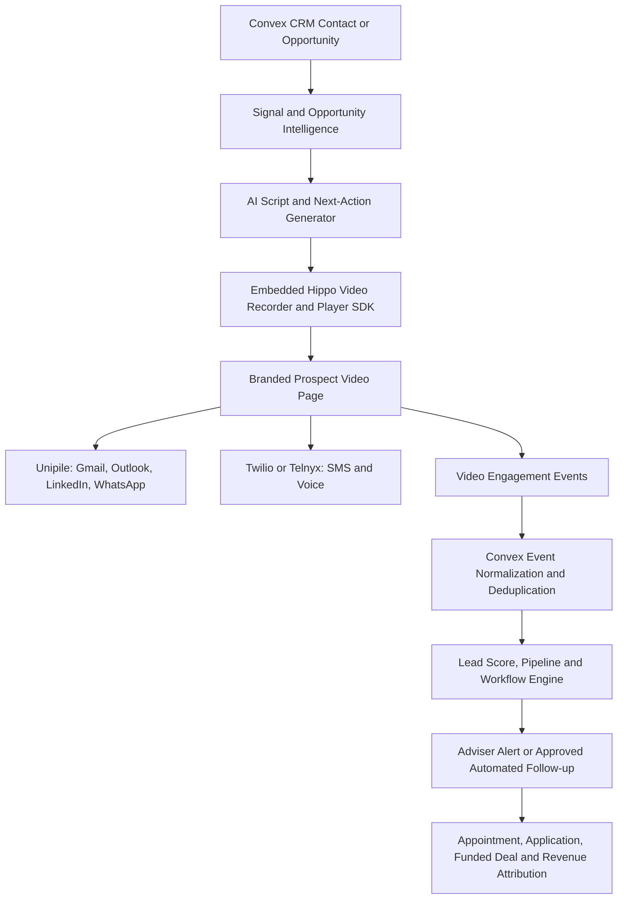
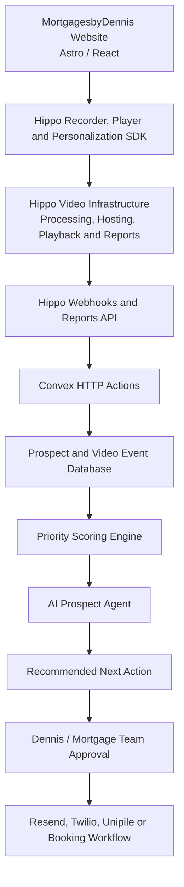
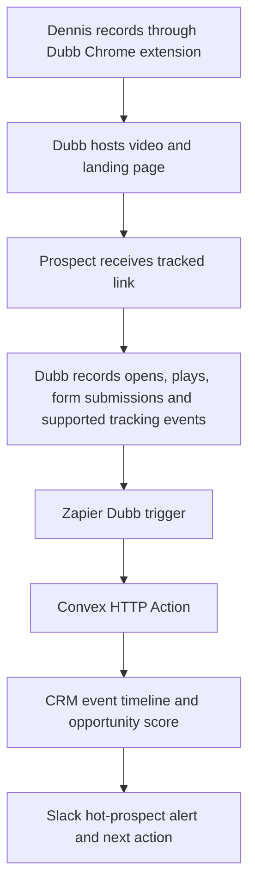
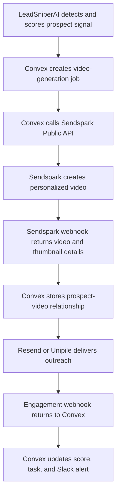
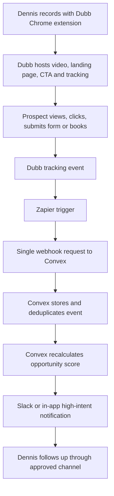

# Source: Notion (page 3ad9e94c-f0a4-816e-9d20-df29f7974b91)

<callout icon="🚀" color="purple_bg">
	**Strategic update — Convex CRM differentiation:** The long-term product direction is now a **native Video Sales Engagement module built into the Convex CRM**, using Hippo Video's SDK/API when commercial terms permit. The differentiator is not basic video recording; it is the combination of growth signals, AI-generated scripts, embedded recording, multichannel delivery, prospect-level viewing intelligence, automated prioritization, workflow actions, and revenue attribution. The Dubb pilot remains useful for validating selling behaviour, but the target architecture is a proprietary Convex-native experience rather than a permanent external video workflow.
</callout>
# Product Differentiation Update — Native Video Sales Engagement
## Strategic Position
GoHighLevel includes video attachments, email video elements, mobile recording, and related communication features, but it does not provide the complete product being designed here: an embedded video sales-engagement system where viewing behaviour becomes CRM intelligence and directly drives lead scoring, pipeline movement, task creation, channel selection, and revenue attribution.
The product should therefore be positioned as:
> **A signal-driven CRM that identifies who to contact, recommends what to say, lets the adviser record personalized video without leaving the CRM, distributes it through the prospect's preferred channel, and prioritizes follow-up based on actual viewing behaviour.**
This is not intended to be a general Loom replacement or a simple hosted-video feature. It is a **Video Sales Agent and Prospect Engagement Engine** built around Convex.
## Differentiated Native Experience
From a contact or opportunity record, the adviser should be able to:
1. Review the prospect's company, mortgage or funding need, growth signals, engagement history, and opportunity score.
2. Generate an AI-assisted video script using the prospect's context and an approved compliance template.
3. Record webcam, screen, or webcam-plus-screen video through the embedded SDK.
4. Select a thumbnail, call to action, supporting document, and booking action.
5. Publish a branded prospect-specific video page.
6. Send the video through Gmail, Outlook, LinkedIn, or WhatsApp using Unipile, or through SMS using Twilio or Telnyx.
7. Capture page opens, plays, watch percentage, repeat views, CTA clicks, document opens, replies, and booked meetings.
8. Recalculate the prospect score and recommend the next best action in real time.
9. Connect video activity to applications, funded deals, commissions, and campaign revenue.
## Revised Product Architecture

## Native Video Sales Agent Module
The module should include six coordinated capabilities.
### 1. Embedded creation
- Webcam recording.
- Screen recording.
- Webcam and screen recording.
- Video upload and import.
- Team video library.
- Mortgage, business-funding, development, and referral templates.
- Teleprompter and script approval.
### 2. AI-assisted personalization
Scripts should use only approved CRM data, including:
- Prospect name and company.
- Lead source and recent growth signal.
- Mortgage, refinance, construction, or funding objective.
- Pipeline stage and unresolved questions.
- Previous messages and meetings.
- Recommended offer and call to action.
- Compliance-approved product language.
The initial mode remains **Adviser Mode**: AI drafts and recommends; a human approves personalized external communication.
### 3. Branded video sales pages
Each prospect should receive a unique tracking page containing:
- Personalized headline.
- Adviser video and profile.
- Company branding.
- Booking CTA.
- Mortgage assessment or funding application CTA.
- Supporting PDF or checklist.
- WhatsApp, email, or telephone reply option.
- Consent, disclosure, and privacy information.
### 4. Multichannel delivery
Use **Unipile** as the connected communication gateway for Gmail, Outlook, LinkedIn, WhatsApp, and supported calendars. Use **Twilio or Telnyx** for SMS, telephone, and voice-AI workflows. Use **Resend** for platform-generated transactional messages rather than personal mailbox conversations.
### 5. Engagement intelligence
Convex should normalize video activity into provider-independent events:
```typescript
videoEvents: {
  tenantId,
  videoId,
  contactId,
  opportunityId,
  campaignId,
  provider,
  providerEventId,
  eventType,
  watchSeconds,
  watchPercentage,
  replayCount,
  ctaType,
  ctaClicked,
  documentOpened,
  bookingStarted,
  bookingCompleted,
  occurredAt,
  receivedAt,
}
```
Recommended event types include page opened, video started, 25 percent watched, 50 percent watched, 75 percent watched, 90 percent watched, completed, replayed, CTA clicked, document opened, reply received, calendar opened, and meeting booked.
### 6. Revenue attribution
The CRM should preserve the complete outcome chain:
```plain text
Video sent → viewed → replied → meeting booked → application started → deal funded → commission received
```
The reporting layer should answer:
- Which videos and templates create meetings?
- Which prospect signals predict video engagement?
- Which advisers generate the strongest completion and conversion rates?
- Which delivery channels perform best by segment?
- Which CTAs and video lengths generate applications?
- What funded volume and revenue can be attributed to video engagement?
## Video-Driven Priority Rules
The first scoring model should remain deterministic and auditable. Example contributions:
<table fit-page-width="true" header-row="true">
<tr>
<td>Event</td>
<td>Illustrative score</td>
<td>Workflow response</td>
</tr>
<tr>
<td>Video started</td>
<td>+3</td>
<td>Record awareness</td>
</tr>
<tr>
<td>25 percent watched</td>
<td>+5</td>
<td>Continue normal nurture</td>
</tr>
<tr>
<td>50 percent watched</td>
<td>+10</td>
<td>Increase engagement score</td>
</tr>
<tr>
<td>90 percent watched</td>
<td>+20</td>
<td>Create priority follow-up recommendation</td>
</tr>
<tr>
<td>Completed</td>
<td>+25</td>
<td>Move to highly engaged when fit is sufficient</td>
</tr>
<tr>
<td>Replayed</td>
<td>+15</td>
<td>Create high-intent adviser task</td>
</tr>
<tr>
<td>CTA clicked</td>
<td>+20</td>
<td>Advance workflow according to CTA</td>
</tr>
<tr>
<td>Document opened</td>
<td>+15</td>
<td>Increase product-intent score</td>
</tr>
<tr>
<td>Meeting booked</td>
<td>+40</td>
<td>Stop active outreach and move pipeline stage</td>
</tr>
</table>
Watch percentage must be interpreted together with video length, recency, prospect fit, opportunity value, and previous engagement. A replay of a detailed three-minute proposal may be more meaningful than completion of a brief introductory clip.
## Competitive Position
<table fit-page-width="true" header-row="true">
<tr>
<td>Platform</td>
<td>Primary role</td>
<td>Strategic limitation or advantage</td>
</tr>
<tr>
<td>GoHighLevel</td>
<td>General CRM and marketing automation</td>
<td>Useful video communication features, but not deeply integrated prospect-level video intelligence and specialized outcome attribution</td>
</tr>
<tr>
<td>Loom</td>
<td>General asynchronous recording</td>
<td>Excellent recording utility, but not a specialized sales-intelligence CRM</td>
</tr>
<tr>
<td>Hippo Video</td>
<td>Video creation and sales-engagement infrastructure</td>
<td>Strong SDK and product foundation; commercial embedding rights require validation</td>
</tr>
<tr>
<td>Convex CRM Video Sales Agent</td>
<td>Signals, CRM, video, workflows, AI prioritization, and attribution</td>
<td>Proprietary business logic and unified customer outcome system</td>
</tr>
</table>
## Defensible Moat
The Hippo Video SDK alone is not the moat because another CRM could license similar infrastructure. Defensibility comes from the proprietary layer surrounding it:
- LeadSniperAI growth and financing signals.
- Mortgage and business-funding qualification data.
- Prospect-specific scripts and approved communication patterns.
- Engagement scoring calibrated against actual sales outcomes.
- Cross-channel conversation and calendar history through Unipile.
- Adviser performance and next-best-action models.
- Marketplace routing and lead entitlements.
- Conversion, funded-volume, and revenue attribution datasets.
- Provider-independent event history retained in Convex.
## Revised Delivery Strategy
### Phase 0 — Commercial validation
- Confirm Hippo SDK and API pricing.
- Confirm embedded SaaS, white-label, custom-domain, multi-tenant, reseller, and data-processing rights.
- Confirm webhook coverage, reports granularity, signature validation, rate limits, storage, bandwidth, exports, and overages.
### Phase 1 — Native video MVP
- Add Record Video to the Convex contact and opportunity screens.
- Store provider video IDs and normalized metadata.
- Generate a branded prospect page and secure tracking token.
- Deliver initially through Unipile email.
- Capture starts, watch percentage, completion, replay, and CTA events.
- Display activity in the unified contact timeline.
- Recalculate engagement and opportunity scores.
### Phase 2 — Sales intelligence
- Generate signal-aware scripts and teleprompter content.
- Add high-intent alerts and priority tasks.
- Automate approved pipeline movements.
- Add Unipile calendar booking and multichannel delivery.
- Compare scripts, video lengths, advisers, channels, and prospect segments.
### Phase 3 — Video Sales Agent
- Add reusable and bulk-personalized templates.
- Add automated next-best-action recommendations.
- Add video sequence orchestration and suppression after response.
- Add A/B testing and team coaching analytics.
- Attribute appointments, applications, funded volume, and revenue to video activity.
## Updated Decision
<callout icon="✅" color="green_bg">
	Use Dubb only as a fast validation path where appropriate. The intended long-term product is a **native Video Sales Engagement and Video Sales Agent module inside the Convex CRM**. Hippo Video is the preferred embedded SDK candidate based on functional fit, conditional on acceptable written pricing and commercial rights. Convex remains the system of record, intelligence layer, workflow engine, and attribution platform; Unipile becomes the connected email, calendar, LinkedIn, and WhatsApp gateway.
</callout>
---
<callout icon="✅" color="green_bg">
	**Current operating decision:** Launch the first MortgagesbyDennis video-sales engagement pilot with **Dubb + Zapier + Convex + Slack**. Dubb handles recording, hosting, landing pages, CTAs, and engagement tracking; Zapier transfers supported Dubb events to Convex; Convex remains the CRM, scoring, prioritization, and workflow system of record; Slack delivers high-intent notifications. Reserve **Sendspark Growth** for later API-driven personalization at scale, and keep Hippo Video conditional on acceptable SDK pricing and embedded-use rights.
</callout>
# Executive Summary
MortgagesbyDennis should launch its first video-sales engagement pilot with **Dubb + Zapier + Convex + Slack**. This combination offers the best balance of low operating cost, authentic one-to-one video selling, rapid implementation, prospect-level engagement tracking, and CRM-driven follow-up. Dubb provides the Chrome recording experience, hosted video pages, calls to action, forms, and viewing activity. Zapier acts only as the initial event bridge. Convex remains the permanent CRM, scoring, prioritization, workflow, and AI-assistance layer. Slack delivers high-intent notifications to the adviser.
The recommended operating sequence is: **record in Dubb → send a trackable video → capture Dubb engagement through Zapier → post one normalized event to Convex → score and prioritize the prospect → notify Dennis in Slack when follow-up is warranted**. Keeping scoring, deduplication, workflow rules, compliance controls, and communication history inside Convex reduces Zapier task consumption and avoids placing core business logic inside a third-party automation tool.
This is a staged platform decision rather than a permanent commitment to one video vendor. **Dubb is recommended for operational validation and relationship-based selling now. Sendspark Growth is the preferred scaling option once a campaign is proven and API-driven personalization is required. Hippo Video remains a future embedded-infrastructure option only if its custom API/SDK pricing, white-label rights, and multi-tenant commercial terms are acceptable. Vidyard remains strongest for enterprise video operations, but its broader API access is concentrated in higher tiers.**
The resulting system is not merely a video recorder. It becomes a **Video Prospect Engagement Engine** that identifies which mortgage or financing prospects are demonstrating intent, ranks them by engagement and opportunity value, and tells Dennis or the team who should be contacted next, why, through which channel, and with what message.
# Business Objective
The proposed system should help MortgagesbyDennis:
- Increase response rates from website and outbound mortgage leads.
- Build trust through short, personalized video explanations.
- Identify high-intent prospects based on actual viewing behaviour.
- Prioritize daily follow-up activity using engagement, fit, urgency, and mortgage opportunity value.
- Reduce manual prospect review and missed follow-up opportunities.
- Give an AI prospect agent enough context to recommend the next best action.
- Maintain a complete prospect engagement timeline inside Convex.
- Create a reusable video-engagement capability that could later support brokers, referral partners, commercial financing, and LeadSniperAI.
# Systems Evaluated
<table fit-page-width="true" header-row="true">
<tr>
<td>Platform</td>
<td>Primary strength</td>
<td>Convex integration fit</td>
<td>MVP assessment</td>
</tr>
<tr>
<td>**Hippo Video**</td>
<td>Embedded sales-video SDK, personalization, reports, webhooks, responses</td>
<td>Strong technically; commercial terms unknown</td>
<td>Future embedded-infrastructure option, subject to pricing and rights</td>
</tr>
<tr>
<td>Mux</td>
<td>Developer-first video upload, encoding, playback, and analytics</td>
<td>Excellent</td>
<td>Best pure video infrastructure alternative</td>
</tr>
<tr>
<td>Cloudflare Stream</td>
<td>Simple and predictable storage and delivery pricing</td>
<td>Excellent</td>
<td>Best cost-focused infrastructure fallback</td>
</tr>
<tr>
<td>Bunny Stream</td>
<td>Low-cost storage and delivery at scale</td>
<td>Good</td>
<td>Useful for later cost optimization</td>
</tr>
<tr>
<td>Vidyard</td>
<td>Mature enterprise sales-video workflows</td>
<td>Moderate</td>
<td>Higher cost and greater platform dependence</td>
</tr>
<tr>
<td>Sendspark</td>
<td>API-driven personalized prospecting videos at scale</td>
<td>Strong through public API and webhooks</td>
<td>Preferred second-stage scaling platform after campaign validation</td>
</tr>
<tr>
<td>**Dubb**</td>
<td>Authentic video messaging, hosted sales pages, CTAs, forms, and engagement tracking</td>
<td>Strong for the pilot through Zapier-to-Convex event transfer</td>
<td>**Recommended immediate operating platform**</td>
</tr>
</table>
# Why Hippo Video Is the Recommended Fit
Hippo Video provides several modular capabilities that can be combined through different API calls and SDK components:
1. **Recorder SDK** — webcam, screen, screen-plus-camera, audio, and uploaded recordings.
2. **Import API** — ingest externally generated or previously recorded video.
3. **Video Library API** — display and manage available videos inside the MortgagesbyDennis application.
4. **Video Details API** — retrieve metadata, thumbnail, share, and playback information.
5. **Personalization API** — create prospect-specific video versions.
6. **Bulk Personalization API** — scale personalized outreach campaigns.
7. **Reports API** — retrieve plays, viewers, watch rate, CTA activity, and response data.
8. **Webhooks** — push engagement events into Convex for real-time scoring and workflow execution.
9. **Guest recording/video response capability** — allow prospects to reply using video without becoming full platform users.
10. **Interactive elements** — CTAs, forms, replies, and booking actions associated with the video experience.
This capability set is closer to the final desired product than a pure hosting service. Mux and Cloudflare Stream are technically cleaner infrastructure providers, but more sales-engagement functionality would need to be built separately.
# Recommended Architecture

## Hippo Video responsibilities
- Embedded recording and uploading.
- Video transcoding and processing.
- Video hosting and playback.
- Thumbnails and video metadata.
- Video personalization and bulk rendering.
- Base viewing analytics and reports.
- Engagement webhooks.
- Prospect video responses and interactive video elements.
## [Convex.dev](http://Convex.dev) responsibilities
- Organizations, users, roles, and tenant isolation.
- Mortgage prospects and lead sources.
- Video-to-prospect and campaign relationships.
- Prospect-specific tracking links.
- Viewing events and engagement history.
- Priority scores and prospect ranking.
- Mortgage-fit and opportunity-value scoring.
- AI prospect-agent analysis.
- Recommended next actions and follow-up drafts.
- Approval workflows and communication history.
- Consent, frequency caps, and do-not-contact controls.
- Integration with Resend, Twilio, Unipile, Slack, and scheduling tools.
# Prospect Prioritization Model
Convex can sort prospects reactively whenever a new Hippo viewing event is received. The first version should use a deterministic scoring system rather than allowing AI to invent the ranking.
## Suggested signals
<table fit-page-width="true" header-row="true">
<tr>
<td>Signal</td>
<td>Suggested contribution</td>
<td>Interpretation</td>
</tr>
<tr>
<td>Video opened</td>
<td>Low</td>
<td>Initial awareness</td>
</tr>
<tr>
<td>Video played</td>
<td>Low to medium</td>
<td>Active interest</td>
</tr>
<tr>
<td>50% watched</td>
<td>Medium</td>
<td>Meaningful engagement</td>
</tr>
<tr>
<td>75% or more watched</td>
<td>High</td>
<td>Strong interest</td>
</tr>
<tr>
<td>Repeat view</td>
<td>High</td>
<td>Reviewing or sharing information</td>
</tr>
<tr>
<td>CTA clicked</td>
<td>Very high</td>
<td>Movement toward action</td>
</tr>
<tr>
<td>Video reply or form submission</td>
<td>Very high</td>
<td>Direct engagement</td>
</tr>
<tr>
<td>Meeting booked</td>
<td>Conversion event</td>
<td>Qualified sales action</td>
</tr>
</table>
The final priority score should combine:
- Video engagement score.
- Mortgage-product fit.
- Prospect urgency and timeline.
- Recency of activity.
- Estimated mortgage or financing opportunity value.
- Communication responsiveness.
- Consent and contactability.
A prospect who watches 75% of a three-minute video twice and clicks a CTA should rank above a prospect who watches 100% of a twenty-second clip once.
# AI Prospect Agent
The AI prospect agent should act as a **prospect analyst and next-action coordinator**, not impersonate the prospect.
For each prospect, the agent should:
- Summarize recent video and communication engagement.
- Explain why the prospect is prioritized.
- Infer the likely mortgage need or unresolved question.
- Identify the likely stage: awareness, consideration, qualification, application, or inactive.
- Recommend the best next action and follow-up timing.
- Select an appropriate channel: email, SMS, phone, WhatsApp, LinkedIn, or human call.
- Draft a personalized message using approved mortgage language.
- Create an internal task or alert.
- Update its recommendation after the prospect responds.
## Recommended initial operating mode
<callout icon="👤" color="blue_bg">
	Use **Adviser Mode** for the MVP: the agent analyzes, prioritizes, and drafts, but Dennis approves external communications. Automated actions should initially be limited to scoring, task creation, internal alerts, and approved nurture sequences.
</callout>
# MVP User Experience
## Website prospect flow
1. Prospect completes a mortgage assessment or requests information.
2. Convex creates the prospect and determines the likely mortgage pathway.
3. Dennis or the system selects an appropriate video template.
4. Hippo creates or presents a personalized video.
5. The prospect receives a secure MortgagesbyDennis tracking link.
6. Hippo captures viewing behaviour and sends engagement events.
7. Convex recalculates the prospect's priority score.
8. The AI prospect agent analyzes intent and recommends the next action.
9. Dennis receives a prioritized alert and suggested follow-up.
10. The approved response is sent and recorded in the prospect timeline.
## Mortgage video use cases
- Welcome and next-step explanation after an online assessment.
- First-time homebuyer education.
- Alternative-lending or B-mortgage explanations.
- Renewal and refinance reviews.
- Document-request explanations.
- Pre-approval status updates.
- Construction and commercial financing introductions.
- Referral-partner introductions.
- Complex-file explanations that are easier to communicate visually.
# MVP Delivery Phases
## Phase 1 — Core proof of concept
- Connect Hippo credentials securely through Convex environment variables.
- Embed one Hippo recorder or import workflow.
- Save Hippo video IDs and metadata in Convex.
- Create secure prospect-specific tracking links.
- Receive viewing webhooks.
- Store plays, view counts, watch rate, and CTA activity.
- Create a ranked prospect dashboard.
## Phase 2 — AI-assisted engagement
- Add deterministic priority scoring.
- Add the AI prospect agent.
- Produce engagement summaries and next-action recommendations.
- Draft follow-up email and SMS messages.
- Add Slack or in-app hot-prospect alerts.
- Require human approval before external personalized messaging.
## Phase 3 — Final MVP capability
- Add personalized video generation.
- Add mortgage-specific video templates.
- Add guest video responses or interactive qualification.
- Integrate Resend, Twilio, and booking workflows.
- Add campaign and referral-partner use cases.
- Add operational reporting and conversion attribution.
# Success Metrics
The final MVP should track:
- Video delivery and landing-page open rate.
- Video play rate.
- Average watch percentage.
- Percentage of prospects watching at least 50% and 75%.
- Repeat-view rate.
- CTA click rate.
- Video-response or form-completion rate.
- Time from high-intent event to human follow-up.
- Assessment-to-booked-call conversion.
- Booked-call-to-application conversion.
- Application-to-funded-mortgage conversion.
- Revenue or funded volume attributed to video-engaged prospects.
- Agent recommendation acceptance rate.
- False-positive rate among prospects classified as hot.
## Initial operational targets
- High-intent prospect alert generated within one minute of the qualifying event.
- Human follow-up to hot prospects within two business hours.
- At least 95% of video events correctly linked to a Convex prospect record.
- No duplicate workflow actions from retried webhook events.
- Full opt-out and do-not-contact enforcement before any automated communication.
# Risks and Required Commercial Validation
Before committing Hippo to the final production MVP, obtain written confirmation on:
- Video SDK and API pricing.
- Monthly minimum commitment.
- Included videos, recording minutes, personalization credits, storage, and bandwidth.
- Overage pricing.
- API rate limits.
- Webhook event coverage and signature verification.
- Multi-user and multi-tenant licensing.
- White-label player, recorder, and custom-domain rights.
- Data residency and Canadian privacy requirements.
- Video export and portability.
- Account provisioning and reseller or embedded-SaaS rights.
- Guest video response limits.
<callout icon="⚠️" color="yellow_bg">
	The recommendation is based on **functional fit**. Hippo remains conditional on acceptable commercial terms, complete webhook coverage, and the right to embed the platform in the MortgagesbyDennis product. If these conditions are not met, **Mux is the preferred technical fallback**, followed by **Cloudflare Stream** for predictable infrastructure costs.
</callout>
# Architecture Principle: Avoid Vendor Lock-In
Convex should use an internal `VideoProvider` abstraction so the CRM and AI workflows do not depend directly on Hippo-specific fields.
```typescript
interface VideoProvider {
  createRecordingSession(input: RecordingInput): Promise<RecordingSession>;
  importVideo(input: ImportVideoInput): Promise<ProviderVideo>;
  getVideo(providerVideoId: string): Promise<ProviderVideo>;
  personalizeVideo(input: PersonalizationInput): Promise<ProviderVideo>;
  getVideoReport(providerVideoId: string): Promise<VideoReport>;
  verifyWebhook(rawBody: string, headers: Headers): Promise<boolean>;
}
```
The first implementation would be `HippoVideoProvider`. Mux, Cloudflare Stream, or another provider could later be added without replacing the prospect database, scoring system, AI agent, or communication workflows.
# Final Recommendation
Proceed with a staged platform strategy.
## Stage 1 — Operational validation
Use **Dubb + Zapier + Convex + Slack** for the initial revenue-focused pilot.
> **Dubb creates and tracks the human video experience. Zapier transports supported events. Convex understands the prospect, ranks the opportunity, and coordinates the next action. Slack alerts the adviser when engagement becomes meaningful.**
This stage minimizes cost and implementation risk while preserving authentic, relationship-based selling for mortgage, business-funding, development, and referral-partner outreach.
## Stage 2 — Automation at scale
Move proven campaigns to **Sendspark Growth** when the requirement becomes API-driven generation of many personalized videos. Sendspark's public API and webhooks make it the clearest current option for direct Convex automation at a published price.
## Stage 3 — Embedded product infrastructure
Reconsider **Hippo Video API/SDK** only after receiving acceptable written commercial terms for API/SDK access, white-label embedding, multi-tenant use, bandwidth, personalization, and reseller rights.
The resulting strategy validates the sales method before paying for deeper infrastructure or enterprise API access.
# Immediate Next Actions
- [ ] Request Hippo's API/SDK commercial proposal and embedded-use terms.
- [ ] Confirm all available webhook events and HMAC verification requirements.
- [ ] Build a one-video Convex proof of concept.
- [ ] Validate prospect-level tracking and viewing attribution.
- [ ] Test deterministic scoring and reactive prospect ranking.
- [ ] Add an AI-generated engagement summary and follow-up draft.
- [ ] Measure assessment-to-call conversion against the current website workflow.
# References
- [Hippo Video API and SDK architecture](https://www.hippovideo.io/products/video-sdk/how-video-api-works.html)
- [Hippo Video SDK documentation](https://docs.hippovideo.io/video-sdk/)
- [Hippo Video support documentation](https://help.hippovideo.io/support/home)
- [Convex documentation](https://docs.convex.dev/)
- [Mux video documentation](https://www.mux.com/docs)
- [Cloudflare Stream documentation](https://developers.cloudflare.com/stream/)
- [Bunny Stream documentation](https://docs.bunny.net/docs/stream-overview)
---
# Commercial and Integration Update — July 31, 2026
<callout icon="🔎" color="blue_bg">
	**New discovery:** The platform comparison changes materially once API access, workflow limits, and connector costs are separated from basic recording features. **Sendspark Growth currently provides the clearest direct Convex integration at a published price**, while **Dubb is the lowest-cost manual selling option** and **Vidyard offers strong Video Agent automation but reserves its broader platform API for Enterprise.**
</callout>
## Revised decision framework
The original Hippo Video recommendation remains conditional on commercial terms. Based on the latest research, the MVP should now evaluate two distinct operating models:
1. **Human-led, high-trust video selling:** Dubb Chrome extension + Dubb tracking + Zapier + Convex.
2. **Automated, API-driven personalized video:** Sendspark Growth + Convex direct API and webhooks.
Vidyard should remain an enterprise-path option unless its sales team confirms that the specialized Video Agent API and all required engagement events are available below Enterprise without additional platform API fees.
## Dubb discovery
Dubb provides a Chrome recording extension, hosted video pages, CTAs, forms, viewer tracking, Slack notifications, and a Zapier connector.
### Practical Dubb architecture

### Dubb operating role
- Best for authentic one-to-one videos recorded by Dennis or an adviser.
- Fastest operational launch without waiting for a private API agreement.
- Dubb remains the recording, hosting, landing-page, CTA, and engagement platform.
- Convex remains the CRM, scoring, prioritization, workflow, and system of record.
- Zapier acts as the initial event bridge.
### Dubb cost model
- Dubb Pro: approximately **\$42 per month when billed annually**.
- Zapier Professional: approximately **\$20 per month at the starting task tier**.
- Convex and Slack may remain on free tiers during the pilot.
- Estimated starting platform cost: approximately **\$62 per month**, excluding messaging, enrichment, and AI-model costs.
### Dubb constraints
- No complete public general-purpose API specification was confirmed.
- A Dubb API token exists for selected integrations, but unrestricted API coverage remains unverified.
- Detailed viewer data available through Zapier's `Get Track` trigger must be tested.
- Generic public links may weaken prospect identity attribution; recipient-specific tracked links or Dubb contacts should be used.
- Zapier task costs can rise with event volume.
## Sendspark Growth discovery
Sendspark Growth is currently the strongest published API-first alternative for automated video personalization.
### Published Growth plan capabilities
- Price: approximately **\$99 per month**, or approximately **\$69 per month equivalent with annual billing**.
- Three included users.
- Public API access.
- Webhook access.
- 250 Dynamic Video Minutes per month.
- 7,500 workflow tasks per month.
- 20,000 stored videos.
- AI voice cloning and name personalization.
- Dynamic prospect website backgrounds.
- Multiple personalization variables.
- Personalized thumbnails.
- Custom logo and custom domain.
- Advanced integrations and agentic workflows.
### Dynamic-minute capacity examples
<table fit-page-width="true" header-row="true">
<tr>
<td>Personalized segment length</td>
<td>Approximate monthly personalized videos from 250 minutes</td>
</tr>
<tr>
<td>15 seconds</td>
<td>1,000</td>
</tr>
<tr>
<td>30 seconds</td>
<td>500</td>
</tr>
<tr>
<td>45 seconds</td>
<td>333</td>
</tr>
<tr>
<td>60 seconds</td>
<td>250</td>
</tr>
<tr>
<td>90 seconds</td>
<td>166</td>
</tr>
</table>
Additional dynamic minutes are currently listed at approximately **\$0.29 per minute**. Additional workflow tasks are listed at approximately **\$7 per 1,000 tasks**.
### Sendspark–Convex architecture

### Why Sendspark is strategically important
- Zapier is not required for the core integration.
- Convex can remain the direct orchestration and CRM layer.
- A proven base video can be personalized across hundreds of prospects.
- The plan supports three users, which improves unit economics for a small team.
- Public pricing and usage limits make the operating model easier to forecast.
- Its personalization style may preserve more authenticity than a fully synthetic avatar because it can begin with Dennis's real recorded video and personalize the intro, voice, background, and thumbnail.
## Vidyard Video Agent discovery
Vidyard has a specialized Video Agent API that can accept prospect variables, a custom script, a campaign ID, a custom correlation ID, and a callback webhook. It can generate an AI-avatar video and return the video UUID and thumbnail to Convex.
### Confirmed specialized Video Agent functions
- Submit prospect and campaign information.
- Pass a complete script of up to approximately 1,000 characters.
- Generate an AI-avatar video.
- Use a `vy_custom_id` to associate the callback with a Convex lead or opportunity.
- Send video-generation results to a Convex webhook.
- Support an optional human approval workflow.
- Published API limits of approximately 25,000 calls per day and 1,000 calls per minute.
### Important Vidyard plan distinction
<callout icon="⚠️" color="yellow_bg">
	Vidyard's pricing comparison lists the broader **Application Programming Interface and API/ingestion-based integrations as Enterprise-only**. The specialized Video Agent workflow/API appears to be documented separately and may be available with the Video Agent add-on, but this does not automatically include the full platform API, broad video-library operations, or direct access to all engagement analytics.
</callout>
The architecture may therefore be asymmetric below Enterprise:
- Convex can potentially request Video Agent generation.
- Vidyard can return generation callbacks.
- Broader asset management and engagement retrieval may still require Enterprise, Zapier, or a supported CRM connector.
### Vidyard commercial question requiring written confirmation
Before selecting Vidyard, obtain written confirmation that Starter or Teams with the Video Agent add-on includes:
- Video Agent API authentication tokens.
- Unlimited API-generated personalized videos.
- Generation callback webhooks.
- Prospect-level play, watch-percentage, replay, CTA-click, and form events.
- Direct delivery of those engagement events to Convex.
- No additional API or enterprise-contract fee.
## Updated platform comparison
<table fit-page-width="true" header-row="true">
<tr>
<td>Platform</td>
<td>Best role</td>
<td>Direct Convex fit</td>
<td>Approximate useful starting cost</td>
<td>Current assessment</td>
</tr>
<tr>
<td>**Dubb + Zapier**</td>
<td>Manual, high-trust one-to-one video selling</td>
<td>Moderate through Zapier/webhooks</td>
<td>About \$62/month</td>
<td>Best low-cost pilot for adviser-recorded videos</td>
</tr>
<tr>
<td>**Sendspark Growth**</td>
<td>Automated personalization from a proven base video</td>
<td>**Strong through public API and webhooks**</td>
<td>\$99 monthly or about \$69/month annual equivalent</td>
<td>**Best current API-first MVP option**</td>
</tr>
<tr>
<td>Vidyard Video Agent</td>
<td>AI-avatar campaigns and enterprise video operations</td>
<td>Potentially strong, but plan-dependent</td>
<td>Requires commercial confirmation</td>
<td>Strong technical option; broader API is Enterprise-only</td>
</tr>
<tr>
<td>Hippo Video</td>
<td>Embedded sales-video SDK and broad engagement features</td>
<td>Strong if commercial API/SDK rights are acceptable</td>
<td>Private proposal required</td>
<td>Functional-fit candidate pending commercial validation</td>
</tr>
</table>
## Revised implementation recommendation
### Immediate pilot — validate the sales motion
Use **Dubb + Zapier + Convex** when the objective is to launch quickly with authentic, manually recorded videos and prove that video engagement predicts mortgage opportunity.
Pilot workflow:
1. Record through the Dubb Chrome extension.
2. Send a prospect-specific tracked Dubb link.
3. Route Dubb tracking and form events through Zapier to one Convex HTTP endpoint.
4. Perform all scoring, deduplication, task creation, and Slack notification inside Convex.
5. Measure play rate, watch percentage, CTA response, booked calls, and funded outcomes.
### Scale phase — automate proven campaigns
Move proven scripts and verticals to **Sendspark Growth + Convex direct API/webhooks** when volume justifies automated personalization.
This creates the sequence:
> **Dubb discovers which message converts. Sendspark scales the proven message. Convex preserves the prospect intelligence and workflow logic across both providers.**
### Enterprise path
Consider Vidyard when LeadSniperAI or MortgagesbyDennis requires:
- AI-avatar campaign generation at enterprise scale.
- Formal governance and team permissions.
- Larger CRM and revenue-operations integrations.
- Broad platform API access.
- Enterprise reporting and video-library management.
## VideoProvider abstraction update
The provider abstraction should support both manually created videos and asynchronous AI-generation jobs.
```typescript
interface VideoProvider {
  createRecordingSession?(input: RecordingInput): Promise<RecordingSession>;
  createPersonalizedVideo(input: PersonalizationInput): Promise<VideoGenerationJob>;
  getGenerationStatus(jobId: string): Promise<VideoGenerationStatus>;
  getVideo(providerVideoId: string): Promise<ProviderVideo>;
  getVideoReport?(providerVideoId: string): Promise<VideoReport>;
  verifyWebhook(rawBody: string, headers: Headers): Promise<boolean>;
  normalizeEvent(rawEvent: unknown): Promise<NormalizedVideoEvent>;
}
```
Recommended implementations:
- `DubbVideoProvider` through Zapier and supported Dubb events.
- `SendsparkVideoProvider` through direct API and webhooks.
- `VidyardVideoAgentProvider` for specialized Video Agent generation.
- `HippoVideoProvider` if commercial SDK/API terms are acceptable.
## Updated immediate actions
- [ ] Start a Dubb pilot using the Chrome extension and recipient-specific tracking links.
- [ ] Inspect the complete payload from Dubb's Zapier `Get Track` trigger.
- [ ] Build a single `/webhooks/video-events` Convex HTTP endpoint with provider normalization.
- [ ] Add idempotency using the provider event ID.
- [ ] Create `videoRecipients`, `engagementEvents`, and `videoGenerationJobs` tables.
- [ ] Test Sendspark Growth API and webhook access during the trial.
- [ ] Confirm how Sendspark counts Dynamic Video Minutes and workflow tasks in a real campaign.
- [ ] Request written Vidyard clarification on Video Agent API versus Enterprise general API access.
- [ ] Obtain Hippo's formal API/SDK commercial proposal.
- [ ] Make the final provider decision using conversion, integration coverage, monthly operating cost, and portability rather than feature claims alone.
## Added references
- [Dubb Chrome extension](https://chromewebstore.google.com/detail/screen-recorder-webcam-re/comhknhgkhbecfolehchaemllofaeppb)
- [Dubb integrations marketplace](https://dubb.com/marketplace)
- [Dubb support centre](https://support.dubb.com/en/)
- [Sendspark pricing](https://www.sendspark.com/pricing)
- [Sendspark Public API and webhooks](https://help.sendspark.com/en/collections/11775404-public-api-and-webhooks)
- [Vidyard pricing comparison](https://www.vidyard.com/pricing.md)
- [Vidyard Video Agent API](https://knowledge.vidyard.com/hc/en-us/articles/42909331296411-Using-the-Vidyard-Video-Agent-API)
---
# Operating Decision Update — Dubb Pilot
<callout icon="🎯" color="green_bg">
	**Recommended pilot:** Use **Dubb + Zapier + Convex + Slack** as the first production workflow for video-sales engagement. This is the best current balance of authenticity, implementation speed, tracking capability, and predictable cost.
</callout>
## Pilot architecture

## Division of responsibility
### Dubb
- Chrome-based screen and webcam recording.
- Video hosting and playback.
- Personalized sales pages.
- Calls to action, forms, and booking links.
- Engagement and response tracking.
- Native Slack activity notifications where supported.
### Zapier
- Receive supported Dubb triggers such as tracking activity, form submissions, new contacts, and new videos.
- Send one normalized event to a Convex HTTP Action.
- Avoid implementing scoring, routing, or multi-step business logic inside Zapier.
### Convex
- Remain the permanent CRM and source of truth.
- Match Dubb activity to the correct prospect and campaign.
- Store raw and normalized engagement events.
- Deduplicate retried events.
- Calculate priority scores.
- Create follow-up tasks and next-best-action recommendations.
- Apply consent, frequency-cap, and do-not-contact controls.
- Send targeted Slack or in-app alerts.
### Slack
- Deliver only meaningful notifications.
- Surface CTA clicks, form submissions, repeat views, strong watch behaviour, and meeting bookings.
- Provide links back to the Convex prospect record.
## Estimated pilot cost
<table fit-page-width="true" header-row="true">
<tr>
<td>Component</td>
<td>Role</td>
<td>Planning cost</td>
</tr>
<tr>
<td>Dubb Pro</td>
<td>Recording, hosting, landing pages, tracking and CTAs</td>
<td>Approximately **\$42/month** with annual billing</td>
</tr>
<tr>
<td>Zapier Professional</td>
<td>Dubb-to-Convex event bridge</td>
<td>Approximately **\$20/month** at the entry paid tier</td>
</tr>
<tr>
<td>Convex</td>
<td>CRM, scoring, workflows and live dashboard</td>
<td>Potentially **\$0** during the initial pilot</td>
</tr>
<tr>
<td>Slack</td>
<td>Notifications and team operating console</td>
<td>Potentially **\$0** during the initial pilot</td>
</tr>
<tr>
<td>Estimated base</td>
<td>Excludes email, SMS, enrichment and AI-model costs</td>
<td>Approximately **\$62/month**</td>
</tr>
</table>
## Notification rules
<table fit-page-width="true" header-row="true">
<tr>
<td>Engagement event</td>
<td>Recommended action</td>
</tr>
<tr>
<td>Single page open</td>
<td>Store only</td>
</tr>
<tr>
<td>Brief video play</td>
<td>Store only</td>
</tr>
<tr>
<td>Meaningful watch threshold</td>
<td>Update dashboard and score</td>
</tr>
<tr>
<td>Repeat view</td>
<td>Medium-priority notification</td>
</tr>
<tr>
<td>CTA clicked</td>
<td>High-priority Slack notification</td>
</tr>
<tr>
<td>Form submitted</td>
<td>Immediate notification and task</td>
</tr>
<tr>
<td>Meeting booked</td>
<td>Immediate notification and CRM stage update</td>
</tr>
</table>
## Stage-gate criteria for Sendspark
Move a campaign from Dubb to Sendspark Growth only when:
- The lead signal is repeatable.
- The script and offer have demonstrated positive response.
- The CTA converts consistently.
- Manual recording has become a throughput constraint.
- The campaign requires hundreds of personalized videos.
- Direct API generation and webhooks will save more than their added subscription cost.
## Updated immediate actions
- [ ] Subscribe to or trial the appropriate Dubb plan.
- [ ] Install and test the Dubb Chrome extension.
- [ ] Confirm the exact payload returned by Zapier's Dubb tracking trigger.
- [ ] Create a secure Convex HTTP Action for Dubb events.
- [ ] Store Dubb video ID, contact ID, campaign ID, recipient email, and Convex lead ID before sending.
- [ ] Configure one Slack high-intent notification.
- [ ] Run a controlled pilot with 20–50 qualified prospects.
- [ ] Measure play rate, meaningful watch rate, CTA clicks, booked calls, applications, and funded outcomes.
- [ ] Reassess Sendspark after a winning campaign is identified.
