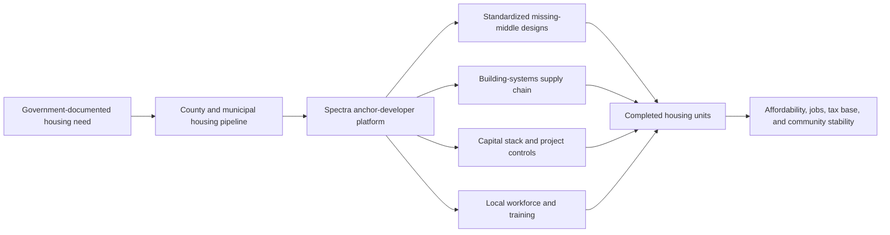

# Source: Notion (page 3af9e94c-f0a4-81b0-9527-f6b398024a00)

<callout icon="🎯" color="blue_bg">
	**Decision objective:** Establish Spectra Holdings Group, Inc. as one of Whatcom County’s anchor developers for a repeatable missing-middle housing delivery platform that integrates housing production, building-systems supply, local employment, capital formation, and measurable community outcomes.
</callout>
<table_of_contents/>
## Executive Decision Brief
**Recommendation:** Proceed with structuring Spectra Holdings as an anchor developer within a multi-developer Whatcom County housing and economic-development platform, subject to confirmation of project sites, municipal roles, infrastructure capacity, capital sources, and executed participation documents.
**Why Spectra:** Spectra brings a vertically integrated operating model spanning design, manufacturing, distribution, construction, technology, workforce development, and capital controls. This allows the company to contribute more than unit delivery: it can help build the regional production infrastructure required to expand missing-middle housing consistently.
**Proposed public outcome:** Increase the supply of duplexes, triplexes, fourplexes, townhouses, courtyard housing, cottage housing, small multifamily buildings, and attainable ownership products while creating family-wage jobs and strengthening Whatcom County’s building-systems supply chain.
**Primary decision:** Authorize a formal anchor-developer validation and implementation process with Spectra Holdings, local governments, public agencies, infrastructure partners, lenders, workforce organizations, and additional qualified developers.
---
## 1. Strategic Context
Whatcom County faces a housing-production challenge that cannot be solved through isolated projects alone. The missing-middle housing gap requires a repeatable delivery system that can:
- Convert vacant, underused, and appropriately zoned land into attainable housing.
- Standardize designs and permitting processes.
- Control construction costs and delivery timelines.
- Expand local access to building components and qualified labor.
- Coordinate infrastructure, workforce, incentives, and financing.
- Deliver both rental and ownership opportunities across a range of household incomes.
Spectra’s role should be positioned within this broader public-purpose framework. The company is a verified participant in the applicable process and maintains supporting government documentation regarding the regional housing need. Those documents should be maintained in a controlled evidence repository and connected to every external claim.
Related thesis: <mention-page url="https://app.notion.com/p/3af9e94cf0a48183af8bd4eaf720247e">Whatcom Building Systems FDI Thesis — Evidence-Backed Executive Summary</mention-page>
---
## 2. Anchor Developer Thesis
> Spectra Holdings can serve as one of Whatcom County’s anchor developers by combining standardized housing delivery with regional manufacturing, distribution, workforce, and capital infrastructure.
An anchor developer is not merely a builder assigned to one parcel. It is an implementation partner capable of supporting a continuing pipeline across multiple sites and project types.
Spectra’s proposed anchor functions are:
1. **Housing delivery:** Develop approved missing-middle and attainable housing projects.
2. **Design standardization:** Maintain repeatable, code-compliant plan sets and product specifications.
3. **Building-systems integration:** Coordinate doors, windows, framing, panels, mechanical systems, cabinetry, concrete, and related components.
4. **Supply-chain development:** Establish distribution, assembly, fabrication, or manufacturing capacity in Whatcom County.
5. **Workforce development:** Build local construction, manufacturing, installation, logistics, and supervisory talent.
6. **Capital coordination:** Structure project-level capital stacks using private capital, debt, incentives, recoverable grants, public infrastructure support, and other approved sources.
7. **Performance reporting:** Report units, affordability, jobs, costs, schedules, capital deployment, and community outcomes.
---
## 3. Proposed Whatcom Anchor-Developer Model

### Operating archetypes
<table fit-page-width="true" header-row="true">
<tr>
<td>Archetype</td>
<td>Purpose</td>
<td>Spectra role</td>
</tr>
<tr>
<td>Infill clusters</td>
<td>Early wins on small groups of lots with existing infrastructure</td>
<td>Standard plans, batch procurement, construction management, homebuyer pipeline</td>
</tr>
<tr>
<td>Subdivision-scale tracts</td>
<td>Material expansion of housing supply</td>
<td>Master planning, phased delivery, landowner partnerships, capital recycling</td>
</tr>
<tr>
<td>Mixed-use nodes</td>
<td>Housing near jobs, retail, services, and transit</td>
<td>Residential delivery, commercial coordination, local business participation</td>
</tr>
<tr>
<td>Building-systems hub</td>
<td>Regional supply, assembly, fabrication, training, and distribution</td>
<td>Manufacturer recruitment, facility planning, product integration, workforce creation</td>
</tr>
</table>
---
## 4. Initial Housing Product Scope
The anchor-developer platform should prioritize housing forms supported by adopted or emerging middle-housing policies and local market evidence:
- Duplexes and triplexes
- Fourplexes
- Townhouses and rowhouses
- Cottage housing and courtyard housing
- Accessory dwelling units where applicable
- Small apartment and condominium buildings
- Senior and workforce housing
- Mixed-income homeownership communities
- Modular or panelized housing configurations where approved
The initial product mix must be validated against land costs, infrastructure, household incomes, achievable sales prices or rents, parking requirements, permitting, financing, and buyer or tenant demand.
---
## 5. Spectra Value Proposition
### Vertical integration
Spectra’s principal strategic advantage is its ability to coordinate multiple stages of the housing-delivery value chain rather than relying entirely on disconnected third parties.
The Whatcom application may include:
- Design and preconstruction
- Construction management
- Material sourcing and distribution
- Door, window, glazing, and envelope systems
- Steel framing, cabinetry, concrete, and related components
- Technology and energy systems
- Workforce training and contractor development
- Project SPVs, restricted accounts, and capital reporting
- Homebuyer education and readiness support
### Capital outcomes
This operating structure is intended to improve:
- Cost-to-build predictability
- Gross margin control
- Construction-cycle time
- Absorption and closing velocity
- DSCR and lender confidence
- Capital recycling
- Local economic retention
- Investor and public-sector reporting
---
## 6. Roles and Responsibilities
<table fit-page-width="true" header-row="true">
<tr>
<td>Participant</td>
<td>Proposed responsibilities</td>
</tr>
<tr>
<td>Whatcom County and participating municipalities</td>
<td>Planning alignment, infrastructure coordination, permitting processes, public land or rights where approved, incentive routing, adopted-plan consistency, public oversight</td>
</tr>
<tr>
<td>Spectra Holdings</td>
<td>Anchor development, project packaging, design coordination, capital planning, construction delivery, supply-chain strategy, workforce systems, reporting</td>
</tr>
<tr>
<td>Additional qualified developers</td>
<td>Local project delivery, land control, specialized development capacity, market diversification</td>
</tr>
<tr>
<td>Port, economic-development, and trade partners</td>
<td>Industrial recruitment, site support, logistics, foreign direct investment coordination, manufacturer introductions</td>
</tr>
<tr>
<td>Financial institutions and CDFIs</td>
<td>Senior and subordinate debt, construction facilities, homebuyer financing, CRA-aligned capital, credit enhancement</td>
</tr>
<tr>
<td>Workforce and education partners</td>
<td>Training, apprenticeships, hiring pipelines, certifications, contractor development</td>
</tr>
<tr>
<td>Legal and compliance advisers</td>
<td>Public finance, land use, securities, immigration, tax, procurement, environmental, and contractual review</td>
</tr>
</table>
---
## 7. Financial Intelligence Framework
### INPUT
- Government housing-need documents
- Spectra participation documents
- Site inventory and land-control status
- Zoning and permitted density
- Infrastructure and utility capacity
- Household income and affordability data
- Comparable rents and sales
- Construction and material costs
- Product certifications
- Incentives, grants, and tax credits
- Debt and equity terms
- Workforce and wage data
### MODEL
Each proposed site should include:
- Base, downside, and upside cases
- Cost-to-build by product type
- Sources and uses
- Capital stack and funding gap
- Development timeline
- Revenue and absorption assumptions
- IRR
- DSCR
- Payback period
- Break-even pricing
- Incentive impact
- Sensitivity to rates, costs, delays, and absorption
### VALIDATION
- Independent market demand review
- Infrastructure confirmation
- Contractor and supplier pricing
- Permit and code review
- Appraisal or valuation support
- Lender underwriting feedback
- Counsel review of public and investment claims
- Customer, buyer, or tenant indications
### DECISION
Each project receives one of four outcomes:
- **Go:** Meets financial, infrastructure, market, and strategic thresholds.
- **Conditional go:** Viable after identified conditions are satisfied.
- **Hold:** Requires additional evidence, site control, infrastructure, or capital.
- **No-go:** Does not meet return, affordability, risk, or strategic requirements.
### OUTPUT
- Project pro forma package
- Market feasibility package
- Capital stack package
- Incentive impact memo
- Risk register
- Public-benefit and economic-impact report
- Executive decision brief
---
## 8. Proposed Pilot Program
### Whatcom Missing-Middle Housing and Building-Systems Pilot
**Pilot objective:** Demonstrate that Spectra can deliver a repeatable missing-middle housing project while establishing the foundation for a regional building-systems platform.
**Suggested pilot scale:** One to three sites representing at least two housing archetypes.
**Target outputs:**
- Site control or formal site designation
- Approved concept plan
- Repeatable housing designs
- Verified infrastructure plan
- Preliminary capital stack
- Construction and operating budget
- Local workforce and contractor plan
- Building-product sourcing strategy
- Buyer or tenant demand evidence
- Public-benefit metrics
- Formal project go/no-go recommendation
### Pilot success metrics
<table fit-page-width="true" header-row="true">
<tr>
<td>Metric</td>
<td>Measurement</td>
</tr>
<tr>
<td>Housing production</td>
<td>Units approved, started, completed, and occupied</td>
</tr>
<tr>
<td>Affordability</td>
<td>Household AMI served and total monthly housing cost</td>
</tr>
<tr>
<td>Financial performance</td>
<td>IRR, DSCR, cost variance, payback, and funding gap</td>
</tr>
<tr>
<td>Delivery performance</td>
<td>Permitting time, construction time, and schedule variance</td>
</tr>
<tr>
<td>Economic impact</td>
<td>Local jobs, wages, procurement, and tax-base contribution</td>
</tr>
<tr>
<td>Supply-chain impact</td>
<td>Local or regional components sourced, assembled, or manufactured</td>
</tr>
</table>
---
## 9. Evidence and Claims Control
<callout icon="⚖️" color="yellow_bg">
	All government, housing, financing, bond, incentive, immigration, securities, guarantee, and public-participation statements must trace to a named source document. No external material should imply government endorsement, repayment protection, immigration approval, or project authorization beyond what executed documents expressly provide.
</callout>
### Evidence repository
- [ ] Spectra participation confirmation
- [ ] Government missing-middle housing documents
- [ ] County and municipal planning documents
- [ ] Site and infrastructure records
- [ ] Public agency correspondence and resolutions
- [ ] Incentive and funding-program documents
- [ ] Capital and lender documentation
- [ ] Legal opinions and counsel-approved language
- [ ] Manufacturer and supplier documentation
- [ ] Market-demand and customer evidence
### Claim status labels
- **Verified:** Supported by an executed or official source document.
- **Documented assumption:** Supported by preliminary evidence but not yet finalized.
- **Management projection:** Internal forecast requiring validation.
- **Prohibited pending counsel:** May not be used externally until formally approved.
---
## 10. Implementation Roadmap
### Phase 1 — Evidence and authority
- Organize government and participation documents.
- Confirm Spectra’s precise role and counterparties.
- Build the evidence-to-claim matrix.
- Identify decisions requiring county, municipal, port, or agency approval.
### Phase 2 — Market and site validation
- Rank candidate sites.
- Quantify missing-middle demand.
- Confirm infrastructure and entitlement constraints.
- Define initial housing products and affordability bands.
### Phase 3 — Pilot underwriting
- Build site-level pro formas.
- Develop base, downside, and upside cases.
- Structure capital stacks and incentives.
- Test affordability and absorption.
### Phase 4 — Operating platform
- Finalize design standards.
- Establish procurement and quality-control systems.
- Build workforce and contractor pipelines.
- Develop the regional building-systems strategy.
### Phase 5 — Formal agreements
- Negotiate development, land, infrastructure, funding, and reporting agreements.
- Establish SPVs, restricted accounts, escrow controls, and project governance.
- Complete legal, environmental, and compliance review.
### Phase 6 — Controlled launch
- Obtain final approvals.
- Begin pilot construction.
- Report performance against agreed milestones.
- Use validated results to expand the pipeline.
---
## 11. Go / No-Go Decision Gate
Proceed with Spectra as an anchor developer when the following conditions are met:
1. Spectra’s role is documented in writing.
2. The initial sites are identified and controllable.
3. Infrastructure capacity is confirmed or funded.
4. Missing-middle demand and affordability are evidenced.
5. The base-case pro forma meets approved thresholds.
6. The downside case remains survivable.
7. The capital stack is complete or has a credible closing plan.
8. Public and private responsibilities are documented.
9. Marketing and investment language is legally approved.
10. Performance reporting and audit controls are operational.
## 12. Executive Conclusion
Spectra Holdings should be advanced as one of Whatcom County’s anchor-developer candidates because its vertically integrated model can connect housing delivery with regional industrial capacity, workforce development, capital formation, and measurable community outcomes.
The recommended structure is not an exclusive single-developer mandate. It is a controlled anchor-developer platform in which Spectra serves as a principal implementation partner alongside public agencies, local developers, financial institutions, workforce organizations, and qualified building-system manufacturers.
The immediate action is to convert Spectra’s verified participation and the government-supported housing need into a formal pilot package containing site evidence, project economics, capital sources, infrastructure requirements, operating responsibilities, and an executive go/no-go recommendation.
