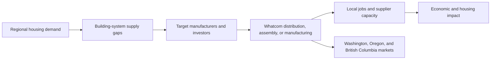
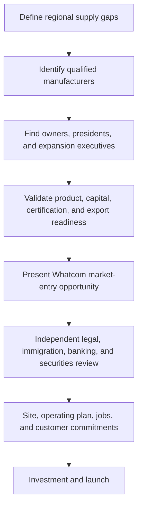

# Source: Notion (page 3af9e94c-f0a4-8183-af8b-d4eaf720247e)

<callout icon="🎯" color="blue_bg">
	**Working thesis:** Whatcom County can develop a regional building-systems cluster that attracts foreign manufacturers, capital, technology, and operating businesses to support missing-middle and affordable housing across Washington, Oregon, and British Columbia. Immigration-linked investment may be one capital pathway, but every immigration, securities, banking, and public-finance claim must be independently documented before it is used in investor marketing.
</callout>
## Executive Summary
The proposed initiative connects four regional objectives:
1. Expand the supply of standardized, energy-efficient building systems required for missing-middle and affordable housing.
2. Attract foreign direct investment and established manufacturers to locate distribution, assembly, engineering, certification, and manufacturing operations in Whatcom County.
3. Create family-wage jobs, supplier capacity, workforce training, and regional market access.
4. Develop a compliant investor-origination and industrial-recruitment GTM system that identifies qualified manufacturers, owners, executives, capital partners, and operating partners.
Washington State is actively supporting middle housing—including duplexes, triplexes, fourplexes, townhouses, courtyard apartments, cottage housing, and related forms—which strengthens the demand thesis for repeatable building components and delivery systems.[\[1\]](https://www.commerce.wa.gov/growth-management/housing-planning/middle-housing/)
Whatcom County's Economic Development Investment Program already prioritizes public infrastructure, business attraction, family-wage employment, private investment, and affordable housing. The program can provide loans, grants, or combinations for qualifying public-purpose facilities, but current official materials do **not** establish that an ordinary \$1 million county bond guarantees immigration status or citizenship.[\[2\]](https://www.whatcomcounty.us/1020/Economic-Development-Investment-Program)
## Core Investment Thesis
> A Whatcom-based building-systems cluster can reduce regional housing-production constraints while attracting job-creating foreign manufacturers that need a credible North American operating platform.
The cluster would focus initially on products with a strong relationship to missing-middle, multifamily, modular, and small commercial construction:
- High-performance doors and windows
- Curtain-wall and façade components
- Prefabricated wall and floor systems
- Light-gauge steel framing
- Structural insulated panels
- Modular kitchens and bathrooms
- Roofing and waterproofing systems
- Heat pumps and mechanical systems
- Energy-efficient glazing
- Fire-rated assemblies
- Installer training and certification systems
## Proposed Regional Operating Model

The initial operating archetypes are:
- **Distribution:** imported finished products, regional warehousing, sales, and installation.
- **Final assembly:** imported components customized and assembled in Whatcom County.
- **Manufacturing:** equipment, technology, and production transferred to a U.S. facility.
- **Joint venture:** foreign manufacturer combined with a U.S. developer, contractor, distributor, or operating partner.
## Immigration and Capital Hypothesis
The user-described structure may involve an EB-5 regional-center investment, escrow or trust arrangements, a project loan or bond, and a job-creating Whatcom County enterprise. This remains a **hypothesis requiring primary documents**.
USCIS states that EB-5 participants may apply for lawful permanent residence when they make the required investment in a U.S. commercial enterprise and create or preserve at least ten permanent full-time jobs for qualified U.S. workers. The program is a pathway to a Green Card, not automatic citizenship upon entry.[\[3\]](https://www.uscis.gov/eb-5)
The thesis must therefore distinguish:
- A county or project bond from the immigration investment security
- A commercial investment from an immigration petition
- Conditional permanent residence from citizenship
- Capital repayment terms from immigration approval
- Direct job creation from regional-center job methodology
- Business-operating requirements from passive investment structures
<callout icon="⚖️" color="yellow_bg">
	**Required language control:** Do not use “guaranteed citizenship,” “buy citizenship,” “risk-free EB-5,” or “county-guaranteed immigration approval” unless the exact statement is supported by current offering documents and written opinions from qualified immigration and securities counsel.
</callout>
## Evidence Already Supporting the Broader Thesis
### 1. Whatcom economic-development alignment
Whatcom County's EDI program supports public facilities that enable business growth, attract private investment, create or retain family-wage jobs, and produce affordable housing. It operates as a revolving fund and generally prioritizes loans.[\[2\]](https://www.whatcomcounty.us/1020/Economic-Development-Investment-Program)
The County's Comprehensive Economic Development Strategy is the recognized regional roadmap for infrastructure investment, living-wage job creation, economic diversification, and resilience. Projects generally need alignment with an adopted planning document or the CEDS project list to qualify for traditional EDI support.[\[4\]](https://www.whatcomcounty.us/2091/CEDS-Report)
### 2. Washington middle-housing demand
Washington Commerce provides model ordinances, guidance, checklists, and pro-forma tools for middle-housing implementation. This creates a policy-supported basis for assessing demand for repeatable construction systems.[\[1\]](https://www.commerce.wa.gov/growth-management/housing-planning/middle-housing/)
### 3. Foreign-manufacturing recruitment precedent
SelectUSA is the federal investment-promotion program supporting job-creating foreign direct investment. Its current resources include manufacturing FDI analysis, workforce-program information, and value-proposition tools for economic-development organizations.[\[5\]](https://www.trade.gov/selectusa-reports-and-publications)
### 4. Whatcom public-investment capacity
The EDI program explicitly lists business attraction, infrastructure, commercial facilities, buildings, utilities, transportation, and housing-related investment among eligible or potentially eligible economic-development purposes, subject to program requirements and County Council approval.[\[6\]](https://www.whatcomcounty.us/1024/Key-Points)
## Claims Requiring Primary Evidence
- [ ] Exact name and legal status of the immigration-linked Whatcom program
- [ ] Current USCIS regional-center approval and geographic scope
- [ ] Identity of the bond issuer, borrower, investment entity, and project entity
- [ ] Whether the investor buys a bond directly or subscribes to a fund that makes a loan
- [ ] Current minimum investment amount and administrative fees
- [ ] Escrow and attorney trust-account mechanics
- [ ] Any bank, JPMorgan, custody, collateral, or credit-facility involvement
- [ ] Lawful-source and lawful-path-of-funds requirements for Chinese nationals
- [ ] Job-creation methodology and economic-impact report
- [ ] Refund terms following immigration denial
- [ ] Capital repayment, security, collateral, maturity, and default provisions
- [ ] Whether the investor must operate or work in the U.S. business
- [ ] County resolutions, contracts, guarantees, or obligations
- [ ] Securities exemptions, offering restrictions, and broker-dealer requirements
- [ ] China foreign-exchange and outbound-investment requirements
## Required Document Package
1. USCIS regional-center designation and current compliance evidence
2. Private-placement memorandum
3. Subscription agreement
4. Limited-partnership or operating agreement
5. Bond, note, or project-loan agreement
6. Escrow and trust agreements
7. Business plan
8. Economic and job-creation report
9. County resolution, development agreement, or public-project contract
10. Source-of-funds checklist
11. Immigration counsel memorandum
12. Securities counsel memorandum
13. Bank, custody, collateral, or credit documentation
14. Repayment and immigration-denial provisions
15. Current project performance and job-creation reporting
## GTM Thesis
The GTM motion should recruit **operating manufacturers first**, with immigration investment treated as a professionally reviewed capital and residency pathway—not the primary product promise.

### GTM technology stack
- **Convex:** permanent CRM, investment-case management, approvals, pipeline, evidence, and attribution
- **Happenstance:** relationship paths to manufacturers, executives, investors, and advisors
- **Unipile:** LinkedIn identity resolution, unified communications, and relationship events
- **Deepline:** company, executive, email, phone, and firmographic enrichment
- **Smartlead:** approved B2B manufacturer and investor outreach
- **GTM Skills:** market mapping, account research, signal discovery, campaign design, and workflow execution
## Target Candidate Profile
A qualified candidate should demonstrate:
- An established operating manufacturing company
- Product relevance to regional housing demand
- Financial capacity and documented source of wealth
- Export or international expansion experience
- Management depth
- Certification readiness
- A credible U.S. operating commitment
- Job-creation capacity
- Willingness to establish distribution, assembly, or manufacturing
- Acceptance of independent legal and immigration review
## Recommended Pilot
### Whatcom High-Performance Door, Window, and Building-Envelope Initiative
**Pilot objective:** recruit one established manufacturer to launch a Whatcom-based showroom, warehouse, engineering and certification function, final assembly operation, and installer network.
**Initial recruitment universe:** 20–30 qualified manufacturers, narrowed to 5–10 executive-level targets.
**Desired pilot outputs:**
- One qualified operating partner
- One preliminary facility and workforce plan
- Ten or more planned U.S. jobs
- One demonstration project
- Contractor, developer, and distributor purchase indications
- Verified legal pathway and offering structure
- Regional expansion plan covering Washington, Oregon, and British Columbia
## Evidence Development Plan
### Phase 1 — Legal and program verification
Confirm the immigration, securities, bond, escrow, trust, bank, and source-of-funds structure from primary documents.
### Phase 2 — Regional demand validation
Quantify housing production, product demand, supplier gaps, lead times, installed cost, certification requirements, and potential local buyers.
### Phase 3 — Manufacturer landscape
Build a ranked database of manufacturers by product fit, export readiness, ownership, financial capacity, certifications, North American activity, and executive accessibility.
### Phase 4 — Operating and economic-impact model
Model facility requirements, capital expenditure, employment, local procurement, tax base, housing impact, and regional sales.
### Phase 5 — Stakeholder validation
Interview Whatcom County, the Port of Bellingham, developers, builders, workforce organizations, certification professionals, immigration counsel, securities counsel, banks, and SelectUSA-related investment-promotion contacts.
### Phase 6 — Controlled GTM pilot
Launch relationship-led outreach to a small, qualified group after the legal proposition and regional value proposition have been approved.
## Decision Gate
Proceed to international investor or manufacturer marketing only when all five conditions are met:
1. The immigration and investment structure is documented.
2. Marketing language is approved by immigration and securities counsel.
3. Regional demand and customer interest are evidenced.
4. A credible operating, facility, certification, and job plan exists.
5. County and economic-development roles are accurately represented in writing.
## Preliminary Conclusion
The broader industrial-development thesis is supported by current public evidence: Whatcom County seeks business attraction, family-wage jobs, infrastructure, private investment, and affordable housing, while Washington's middle-housing policy supports expanded housing forms. The unverified component is the specific claim that a \$1 million Whatcom County bond guarantees entry, permanent residence, or citizenship. That claim must remain outside GTM materials until the underlying program and offering documents establish the exact structure.
The strongest defensible proposition is:
> **Build a Whatcom County building-systems cluster that recruits established foreign manufacturers, deploys investment into genuine job-creating operations, and connects independently qualified immigration capital with documented regional housing and economic-development needs.**
<page url="https://app.notion.com/p/3af9e94cf0a481b09527f6b398024a00">Spectra Holdings as an Anchor Developer for Whatcom County Missing-Middle Housing</page>
