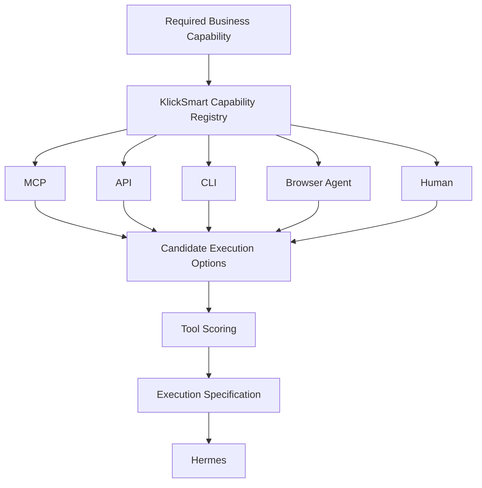
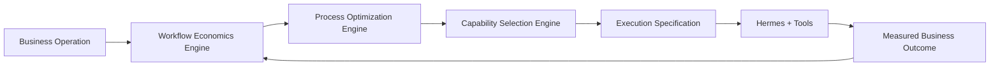
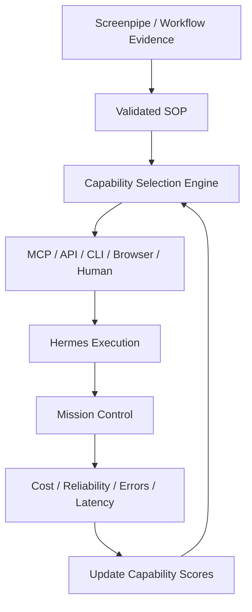
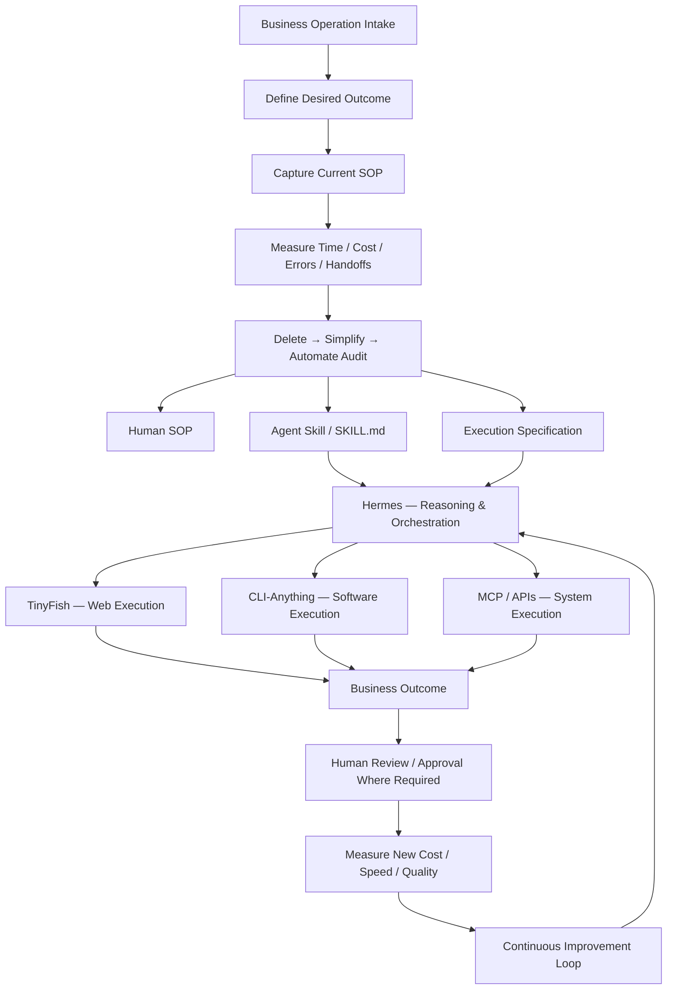
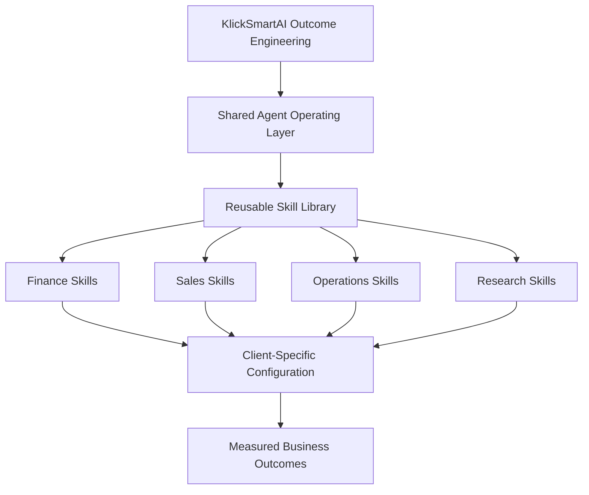
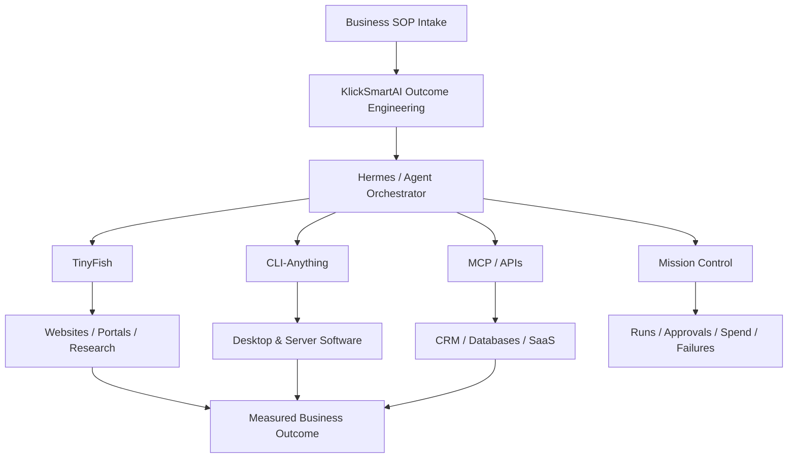
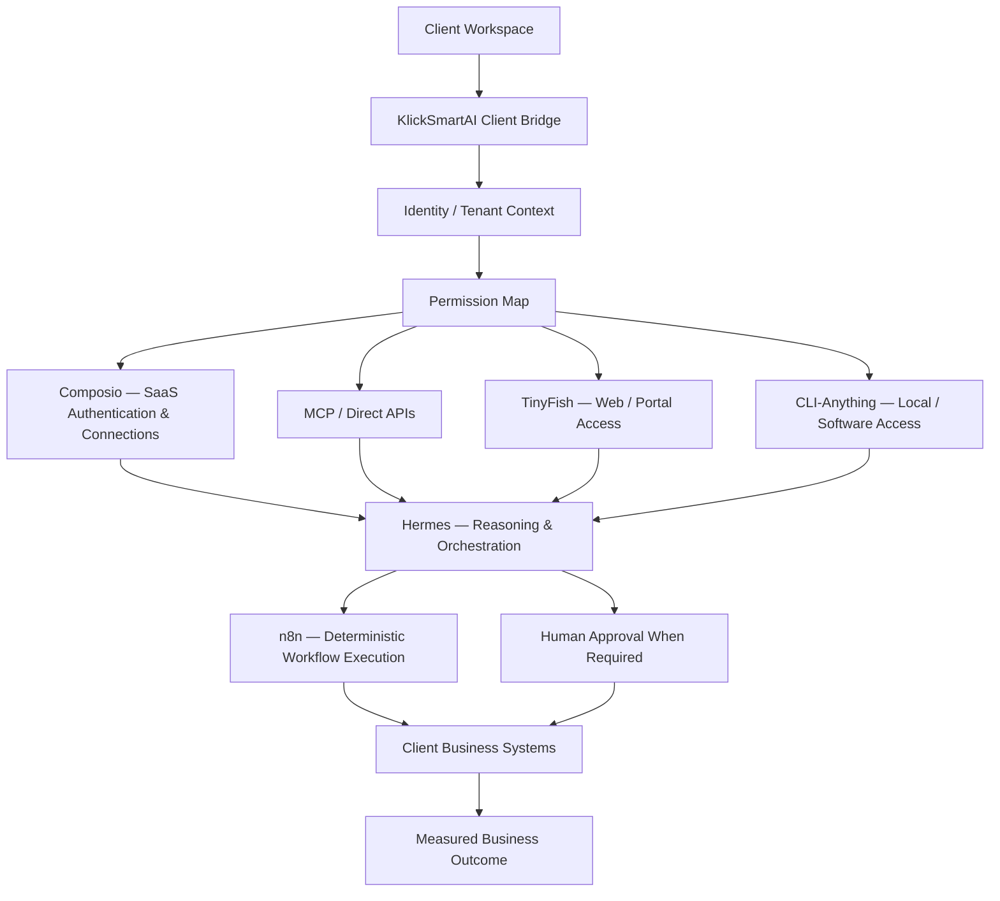
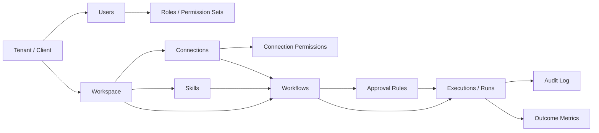
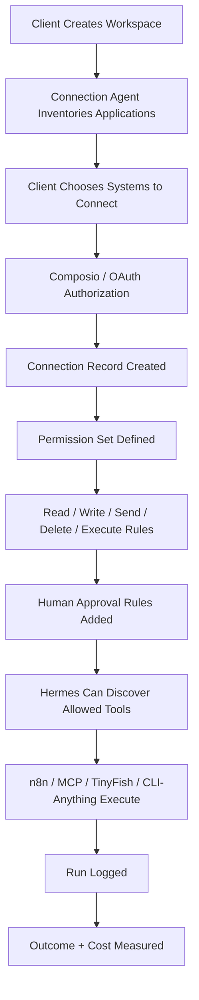
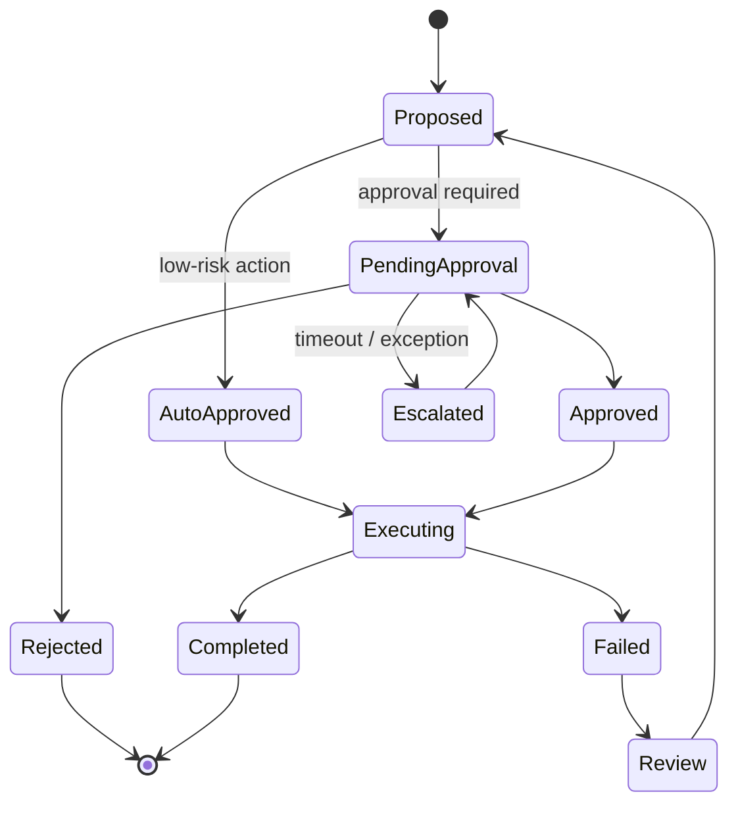

# ⚙️ KlickSmartAI Outcome Engineering — AI Operations Intake & Automation Service

> Mirrored from Notion page `3c69e94cf0a4818eb7dcdb22dc64fff2` on 2026-09-07. Source: https://app.notion.com/p/3c69e94cf0a4818eb7dcdb22dc64fff2?pvs=204

{"type":"emoji","emoji":"⚙️"}

> 
	**Service concept:** KlickSmartAI reverse-engineers a business operation, captures the current SOP, measures its cost and friction, redesigns the process around AI agents + automation + human judgment, and proves the resulting savings, speed, and capacity gain.

## Executive Summary
KlickSmartAI will offer a new service category: **Outcome Engineering**.
The client brings a real business operation — for example client onboarding, lead qualification, proposal preparation, project intake, purchasing, reporting, finance administration, website audits, capital package preparation, or other repeatable operational work.
KlickSmartAI then:
1. Defines the desired business result.
2. Captures how the work is currently performed.
3. Measures time, labor, cost, errors, delays, and handoffs.
4. Audits the workflow using a **Delete → Simplify → Automate** sequence.
5. Converts the redesigned process into a human SOP, an agent skill, and an execution specification.
6. Deploys the workflow using the appropriate execution layer.
7. Measures the new operating economics and continuously improves the system.
> **Give us an existing business operation. We document how it works, calculate what it costs, redesign it, and deploy an AI-assisted operating process that produces the same or better outcome at lower cost and faster cycle time.**
## Strategic Positioning
### Category
**Outcome Engineering / AI Operations Optimization**
### Core value proposition
**Reduce the cost and cycle time required to produce a defined business outcome without sacrificing quality, governance, or control.**
Traditional automation often starts with tools. KlickSmartAI starts with the **business outcome and operating economics**.
```plain text
Outcome
  ↓
Current process
  ↓
Current cost
  ↓
Process audit
  ↓
Redesigned SOP
  ↓
Agent + automation execution
  ↓
Measured outcome
```
## Business Operations Intake
Every engagement begins with a structured operating intake.
### Five mandatory intake dimensions
1. **Outcome** — What result is the process supposed to produce?
2. **Trigger** — What event starts the workflow?
3. **Current Steps** — What does the team actually do today?
4. **Systems & Data** — Which websites, applications, files, databases, and communications are involved?
5. **Operating Economics** — How much time, labor, cost, rework, delay, and error does the process create?
### Additional discovery inputs
- Process owner
- Frequency / monthly volume
- SLA or required turnaround time
- Required approvals
- Compliance or regulatory controls
- Common exceptions
- Known bottlenecks
- Upstream dependencies
- Downstream dependencies
- Current software stack
- Current SOPs and policy documents
- Screenshots / recordings / sample outputs
## SOP Capture Layer
Where appropriate, KlickSmartAI can use Screenpipe or equivalent process-capture tooling to observe the actual workflow and create an evidence-backed process record.
```plain text
Human performs process
        ↓
Screen / workflow capture
        ↓
AI extracts actions + decisions
        ↓
Process map
        ↓
SOP candidate
        ↓
Human validation
```
## Process Audit Method
### 1. Delete
Remove steps, approvals, reports, data entry, and handoffs that do not materially contribute to the required outcome.
### 2. Simplify
Reduce complexity, duplicate systems, redundant forms, unnecessary decision points, and excessive exception paths.
### 3. Automate
Only after the process has been simplified should AI agents, integrations, or scripts execute the remaining work.
### 4. Govern
Identify which decisions must remain human-controlled because of financial, legal, compliance, reputational, or operational risk.
## Three Deliverables Per Workflow
### Human SOP
Defines the intended outcome, process rules, responsibilities, required inputs, decision points, exceptions, approvals, and escalation paths.
### Agent Skill
Defines how an AI orchestrator such as Hermes should reason about the process: when to initiate it, prerequisites, decision logic, tool selection, validation rules, stop conditions, escalation conditions, and expected output schema.
### Execution Specification
Defines which systems perform the work: TinyFish, CLI-Anything, MCP tools, APIs, n8n, databases, Frappe CRM, local/cloud applications, document systems, and spreadsheet systems.
## Capability Registry & Tool Selection Engine
The **KlickSmart Capability Registry** is the decision layer between the redesigned SOP and the final execution specification. Its job is to identify the capabilities required by a workflow, discover available implementation options, compare them objectively, and select the lowest-cost reliable execution path that satisfies the client's security, governance, integration, and outcome requirements.
> 
	**Operating principle:** Do not build a new tool when a reliable existing capability can produce the required outcome at lower total cost and acceptable risk.

### Capability-first design
KlickSmartAI should not begin automation design by choosing vendors. The sequence should be:
```plain text
Redesigned SOP
      ↓
Required Capabilities
      ↓
Capability Registry
      ↓
Candidate Tools / Interfaces
      ↓
Cost + Reliability + Security + Client Fit
      ↓
Execution Specification
      ↓
Hermes Orchestration
```
A capability describes **what the workflow must be able to do**, independently of the software used to perform it.
Typical capability categories include:
- search and research
- browser navigation
- scraping and extraction
- lead enrichment
- CRM read/write
- email and messaging
- voice and video communication
- document generation and extraction
- data transformation
- analytics
- approvals
- local application execution
- cloud SaaS execution
- monitoring and alerting
- persistent storage and memory
### Execution interface hierarchy
For each capability, the registry should identify the available execution interfaces:
1. **MCP** — preferred where a mature, permissioned MCP server exists.
2. **API** — preferred for stable structured system-to-system execution.
3. **CLI** — preferred for local/server applications and deterministic agent execution.
4. **Browser agent** — used when systems do not expose a suitable structured interface.
5. **Human execution / approval** — retained where judgment, risk, authorization, or compliance requires it.

### Tool scoring model
Candidate tools should be scored against a standard decision framework rather than selected ad hoc.

Dimension
Evaluation question

Capability Fit
Can the tool reliably complete the required action?

Execution Cost
What is the per-call, per-record, monthly, infrastructure, and support cost?

Reliability
How consistently does it produce the required outcome?

Security
Does its data handling meet the client's sensitivity and residency requirements?

Integration
Does it expose MCP, API, CLI, webhook, OAuth, or another agent-readable interface?

Governance
Can permissions, approvals, audit trails, and stop conditions be enforced?

Latency
Can it meet the required turnaround time?

Self-hosting
Can it be deployed locally or on the KlickSmartAI/client VPS when required?

Replaceability
Can the workflow switch providers without redesigning the entire SOP?

Client Fit
Does it fit the client's existing stack, skills, budget, and operating constraints?

### Capability Registry data model
The long-term goal is to move this registry from documentation into a structured database that Hermes can query programmatically.
Suggested fields:
```plain text
tool_name
vendor
capability_category
capability_description
mcp_available
api_available
cli_available
browser_required
oauth_available
webhook_available
self_hostable
cost_per_call
cost_per_record
monthly_cost
infrastructure_cost
data_sensitivity
security_notes
human_approval_required
reliability_score
latency_score
client_fit_score
preferred_use_cases
known_limitations
replacement_tools
source_repository
last_verified
```
### Initial discovery sources
The registry should ingest and periodically review external catalogs rather than relying entirely on manual tool discovery.
#### AI Agent Tools — general discovery catalog
Repository: [https://github.com/cporter202/ai-agent-tools](https://github.com/cporter202/ai-agent-tools)
Role in KlickSmartAI:
- discover emerging AI applications and services
- identify possible alternatives before custom development
- maintain awareness of specialist tools across operational categories
- feed candidate tools into the Capability Registry for verification and scoring
This repository should be treated as a **discovery source**, not an execution framework.
#### Agentic AI APIs — agent, API and MCP discovery
Repository: [https://github.com/cporter202/agentic-ai-apis](https://github.com/cporter202/agentic-ai-apis)
Role in KlickSmartAI:
- discover agent-compatible APIs
- identify MCP servers
- identify execution-ready services
- discover replacement providers for existing capabilities
- expand the number of capabilities Hermes can potentially access
This repository should be treated as a higher-priority technical discovery source because it is organized around agent execution interfaces.
### Capability selection example
A client may require the following outcome:
> Identify businesses matching an ICP, detect buying signals, enrich decision-makers, qualify opportunities, write validated records into the CRM, and initiate personalized outreach.
The capability engine decomposes the requirement before selecting software:
```plain text
Find companies
      ↓
Detect signals
      ↓
Enrich entities
      ↓
Score / qualify
      ↓
Persist structured record
      ↓
Update CRM
      ↓
Personalize outreach
      ↓
Send / monitor
```
A possible execution specification could then be assembled from interchangeable modules such as:
```plain text
TinyFish / Serper / Exa
      ↓
LeadSniper signal logic
      ↓
Deepline or enrichment provider
      ↓
Hermes qualification skill
      ↓
DuckDB working dataset
      ↓
Supabase system of record
      ↓
Frappe CRM
      ↓
Smartlead / Mystrika
```
The important KlickSmartAI intellectual property is not the specific vendor chain. It is the **capability decomposition, selection logic, scoring framework, execution specification, and accumulated performance data** that determine which chain should be used for each client.
### Three proprietary decision engines
Outcome Engineering should ultimately contain three connected decision engines:
1. **Workflow Economics Engine — Is this worth automating?**
	Measures labor cost, cycle time, rework, errors, implementation cost, operating cost, savings, and capacity gain.
2. **Process Optimization Engine — What should the optimized workflow be?**
	Applies Delete → Simplify → Automate → Govern and converts the validated process into a human SOP and agent skill.
3. **Capability Selection Engine — What is the best way to execute it?**
	Maps SOP requirements to capabilities, evaluates implementation options, and produces the execution specification.

### Continuous capability learning loop
The registry should improve from actual execution data rather than remain a static software directory.

Over time, this creates a proprietary **KlickSmart Capability Graph** containing not simply a catalog of tools, but evidence about which combinations produce the best business outcomes under specific client constraints.
## Agent Operating Layer

## Core Technology Roles

Component
Role

Screenpipe
Observe and capture how humans currently perform workflows

Hermes
Reason, plan, select skills, and orchestrate the workflow

TinyFish
Web research, browser interaction, portal navigation, and external website execution

CLI-Anything
Operate software and command-line-enabled applications through agent-readable harnesses

MCP / APIs
Direct structured access to SaaS systems and internal services

Supabase / databases
Persistent structured operational data and intelligence

Frappe CRM
Operational workflow, relationship management, tasks, and client records

Mission Control
Governance, approvals, run monitoring, cost visibility, and agent oversight

## Workflow Economics Model
```plain text
Current Annual Cost
=
Hours per occurrence
× Occurrences per year
× Loaded hourly rate
```
```plain text
Automation Cost
=
AI / software usage
+ human review
+ infrastructure
+ support
```
```plain text
Annual Savings
=
Current Annual Cost
− New Automation Cost
```
```plain text
Capacity Gain
=
Old cycle time ÷ New cycle time
```
```plain text
ROI
=
(Annual Savings − Implementation Cost)
÷ Implementation Cost
```
## Example Business Case
Assume a workflow runs 100 times per month.
**Current state**
```plain text
2.5 hours × $55/hour × 100
= $13,750/month
```
**AI-assisted state**
```plain text
Human review:
20 minutes × $55 × 100
≈ $1,833/month

AI / software:
≈ $700/month

Total:
≈ $2,533/month
```
**Potential savings**
```plain text
≈ $11,217/month
≈ $134,604/year
```
## Service Product Ladder

Offer
Primary Outcome

Operations Intake
Identify and qualify the highest-value automation opportunity

AI Operations Audit
Document the workflow, calculate economics, and produce the redesign plan

Automation Build
Deploy the redesigned process and required integrations

AI Employee
Operate the recurring workflow through an agent-assisted execution model

Optimization Retainer
Monitor exceptions, quality, cost, and additional automation opportunities

## Candidate Processes
- lead intake and qualification
- CRM enrichment
- client onboarding
- proposal generation
- project intake
- document preparation
- recurring reporting
- purchasing / PO workflows
- finance administration
- web research
- competitor intelligence
- website audits
- capital source research
- capital package preparation
- recruiting intake
- field-service administration
- review and reputation workflows
## Human-in-the-Loop Governance
The target is not to remove humans everywhere. The goal is to remove unnecessary human execution while preserving human judgment where it creates value or controls risk.
Human checkpoints should remain where there is legal or regulatory responsibility, material financial commitment, safety risk, reputational risk, ambiguous exceptions, sensitive personnel decisions, or final client approval.
```plain text
AI Suggests
    ↓
Human Approves when required
    ↓
System Executes
    ↓
Outcome Logged
```
## Reusable Skill Library Strategy
Every successful implementation should create reusable IP.
```plain text
Client Workflow
     ↓
Validated SOP
     ↓
Reusable Agent Skill
     ↓
Shared KlickSmartAI Skill Library
```
Over time, implementation should shift from custom development toward approximately **80% reusable modules + 20% client-specific workflow logic** where appropriate.
## Long-Term Platform Model

## Technical Foundations & Source Repositories
The service design above is KlickSmartAI's proprietary operating model. The implementation can leverage open-source projects as infrastructure components rather than reinventing the execution layer.
### TinyFish — web-agent execution layer
**Repository:** [https://github.com/tinyfish-io/tinyfish-cookbook](https://github.com/tinyfish-io/tinyfish-cookbook)
Use case in the service:
- live web research
- page extraction
- multi-step browser workflows
- interaction with sites without APIs
- evidence collection for business workflows
- browser-agent execution as part of a Hermes-orchestrated SOP
TinyFish describes its cookbook as a collection of apps and automations built on a web layer for AI agents, including search, fetch, browser automation, and agent workflows.
### CLI-Anything — software execution layer
**Repository:** [https://github.com/HKUDS/CLI-Anything](https://github.com/HKUDS/CLI-Anything)
Use case in the service:
- convert software into agent-callable CLI harnesses
- expose application functions to AI agents
- generate agent-readable [SKILL.md](http://SKILL.md) definitions
- let Hermes operate desktop or server software through structured commands
- turn manually operated applications into repeatable execution components
CLI-Anything's core purpose is to make existing software agent-native by generating and validating CLI harnesses around applications and source code.
### Mission Control — orchestration governance layer
**Repository:** [https://github.com/builderz-labs/mission-control](https://github.com/builderz-labs/mission-control)
Use case in the service:
- dispatch and monitor agent tasks
- inspect runs and failures
- coordinate multiple runtimes
- track spend
- apply review gates and governance
- provide an operating dashboard above Hermes and execution tools
Mission Control positions itself as a self-hosted control plane for operating AI agents, including task dispatch, workflow coordination, run inspection, and spend monitoring.
### TinyFish GitHub Organization
**Organization:** [https://github.com/tinyfish-io](https://github.com/tinyfish-io)
Relevant supporting repositories include AgentQL and TinyFish web-agent integrations, which can be evaluated where lower-level web interaction or extraction capabilities are required.
## Reference Architecture

## Related KlickSmartAI Documentation
This service should be used together with the existing **KlickSmartAI Workflow Economics Model — AI Automation ROI Audit**, which establishes the financial justification layer for workflow automation engagements.
## Commercial Principle
KlickSmartAI should sell the **economic improvement and business outcome**, not the underlying software stack.
TinyFish, CLI-Anything, Hermes, MCP tools, databases, and Mission Control are implementation components. The defensible KlickSmartAI IP is the combination of:
- operating intake methodology
- process audit framework
- workflow economics
- reusable SOPs
- reusable agent skills
- execution specifications
- domain-specific decision logic
- governance model
- implementation knowledge
- continuous optimization data
That turns the service from one-off automation work into a repeatable **AI Operations Optimization System**.
## Client Intake Questionnaire & Automation Qualification Score
The purpose of the intake is to decide quickly whether a workflow is worth auditing and automating before committing implementation resources.
### Intake Questionnaire
#### A. Business Outcome
- What specific result must this process produce?
- Who receives or depends on the result?
- What defines a successful outcome?
- What happens financially or operationally when the process is late, inaccurate, or incomplete?
#### B. Trigger & Volume
- What event starts the process?
- How many times does it occur per day, week, or month?
- Is the volume stable, seasonal, or growing?
- Are there service-level or turnaround-time requirements?
#### C. Current Process
- Who performs the work today?
- How many people touch one transaction or case?
- Approximately how many steps are involved?
- Which steps require judgment versus repetitive execution?
- Where does rekeying, copy/paste, searching, document handling, or duplicate entry occur?
- Where does the workflow wait for another person or system?
#### D. Systems & Information
- Which websites, portals, SaaS applications, desktop tools, spreadsheets, documents, databases, email accounts, or messaging systems are involved?
- Which systems expose APIs or MCP access?
- Which tasks require browser interaction or websites without APIs?
- Which tasks require local or desktop software?
- Is the required data structured, semi-structured, or unstructured?
#### E. Operating Economics
- Average human time per occurrence?
- Loaded hourly cost of the people doing the work?
- Occurrences per month or year?
- Estimated rework rate?
- Estimated error rate?
- Cost of errors, delays, missed opportunities, or SLA failures?
- Current software or outsourcing cost?
#### F. Standardization & Exceptions
- Does the process generally follow the same path?
- What percentage of cases are normal versus exceptions?
- Can exceptions be categorized into known types?
- Are decision rules documented or primarily held in employees' experience?
- Is there an existing SOP, checklist, template, or policy?
#### G. Risk & Governance
- Does the process involve regulated decisions?
- Does it create financial commitments?
- Does it involve safety-critical work?
- Does it affect employment or personnel decisions?
- Does it handle sensitive client or company information?
- Which steps require human approval regardless of automation capability?
#### H. Evidence Available
- Can KlickSmartAI observe the workflow using Screenpipe or equivalent capture?
- Are representative files, emails, reports, forms, recordings, screenshots, and completed examples available?
- Can a subject-matter expert validate the reconstructed SOP?
## Automation Qualification Score — 100 Points
Score each dimension before proceeding to a full AI Operations Audit.

Dimension
Weight
High Score Characteristics

Volume / Frequency
15
Recurring frequently enough that small per-case savings compound materially

Labor Cost / Time
15
Significant employee or contractor time is consumed by the workflow

Process Repeatability
15
Most cases follow recognizable steps and rules

Digital Executability
15
Work happens through websites, software, files, databases, email, or APIs accessible to agents

Economic Impact
15
Automation materially reduces cost, cycle time, errors, or lost revenue

Data Availability
10
Inputs and outputs can be reliably accessed and represented digitally

Exception Manageability
5
Exceptions are limited, identifiable, and can be routed to humans

Risk / Governance Fit
5
High-risk decisions can remain human-controlled while low-risk execution is automated

Evidence / SOP Capture
5
The current workflow can be observed, documented, and validated

### Scoring Guidance
For each category, assign a percentage of the available points:
- **100% of weight:** strong automation candidate
- **75%:** good candidate with manageable limitations
- **50%:** mixed candidate; likely partial automation
- **25%:** significant constraints
- **0%:** unsuitable in the current state
### Go / No-Go Thresholds

Score
Classification
Recommended Action

80–100
Priority Automation Candidate
Proceed directly to paid AI Operations Audit and prototype plan

65–79
Strong Candidate
Proceed to audit; focus on exceptions, integrations, and governance constraints

50–64
Selective / Partial Automation
Identify one high-value sub-process rather than automating the entire operation

Below 50
Not Yet Ready
Standardize, simplify, digitize, or improve data availability before automation

> 
	**Commercial rule:** Do not sell automation simply because it is technically possible. Advance opportunities where the measured value of the improved outcome materially exceeds implementation and operating cost.

## Fast Qualification Economics
Before a full audit, calculate a rough annual opportunity value:
```plain text
Annual Human Process Cost
=
Average Minutes per Case ÷ 60
× Annual Case Volume
× Loaded Hourly Rate
```
Then estimate the addressable automation value:
```plain text
Addressable Value
=
Annual Human Process Cost
× Estimated Automatable Percentage
+
Estimated Avoidable Error / Delay Cost
```
A candidate should generally advance when there is a credible path to recovering implementation cost within an acceptable client payback period while also improving speed, quality, capacity, or control.
## Intake Output
Every completed intake should produce a one-page decision record containing:
1. Process name and owner
2. Desired outcome
3. Current workflow summary
4. Current annual process cost
5. Primary bottlenecks
6. Automation Qualification Score
7. Estimated automatable percentage
8. Primary execution path: TinyFish, CLI-Anything, MCP/API, workflow automation, or hybrid
9. Human approval requirements
10. Recommended next step: Audit, partial prototype, process redesign, or no-go
## Qualification Decision Flow
```mermaid
flowchart TD
    A["Business Operation Submitted"] --> B["Outcome + Workflow Intake"]
    B --> C["Calculate Current Economics"]
    C --> D["Automation Qualification Score"]
    D --> E{"Score"}
    E -->|"80–100"| F["Priority Audit"]
    E -->|"65–79"| G["Audit with Constraints Review"]
    E -->|"50–64"| H["Automate High-Value Subprocess"]
    E -->|" J["SOP Capture + Outcome Engineering"]
    G --> J
    H --> J
```
## Sales Discovery Principle
The intake conversation should focus on the cost of producing the current outcome rather than leading with AI technology. The core discovery question is:
> **What business result does this process produce, and what does it currently cost you in people, time, delay, errors, and lost capacity to produce it?**
The technology recommendation follows only after the economics and process constraints are understood.
## KlickSmartAI Client Bridge — Connection Agent
> 
	**Purpose:** Connect the client's existing software stack to the KlickSmartAI agent operating layer without forcing the client to replace their systems. The Client Bridge manages authentication, permissions, connection status, and the boundary between client-owned systems and AI-driven execution.

### Design Principle
KlickSmartAI should use **Composio + n8n**, not Composio versus n8n.
- **Composio** is the preferred connection and authentication layer for client SaaS applications, including OAuth, per-client connections, permission boundaries, and agent-safe access.
- **n8n** is the preferred deterministic workflow engine for repeatable, predefined automation sequences.
- **Hermes** decides what should happen, selects the correct skill or workflow, and handles reasoning, exceptions, and escalation.
- **TinyFish** handles web systems and portals that do not expose suitable APIs.
- **CLI-Anything** handles local, desktop, and command-line-capable software.
### Client Bridge Architecture

### Client Onboarding Flow
1. Create a unique KlickSmartAI client workspace.
2. Ask which applications are used to perform the target operation.
3. Classify each application as read-only, write-enabled, approval-gated, or prohibited.
4. Connect supported SaaS applications through Composio or direct MCP/API access.
5. Document websites or portals requiring TinyFish browser execution.
6. Document local or desktop software requiring CLI-Anything.
7. Record all permissions, approvals, and escalation rules.
8. Validate that the agent can access only the systems and actions required for the approved SOP.
9. Run a controlled test transaction.
10. Promote the workflow to production only after human validation.
### Connection Agent Intake Questions
- What applications are used to complete this operation?
- Which systems contain information the agent must read?
- Which systems should the agent be allowed to create or update records in?
- Which actions must always require human approval?
- Which actions should never be automated?
- Are there separate user roles, business units, or environments that must remain isolated?
- Does the workflow depend on a website or portal with no API?
- Does the workflow require desktop or local software?
- Which system is the source of truth for each important data field?
- Who owns the credentials and authorization for each connected application?
### Permission Matrix
Each client workflow should produce an explicit permission matrix.

System
Read
Create
Update
Send / Commit
Delete
Approval Rule

Gmail
Allowed
Draft
N/A
Approval required
Prohibited
Human approval before external send

CRM
Allowed
Allowed
Allowed
N/A
Prohibited
Approval for material record changes where required

Accounting
Allowed
Limited
Limited
Approval required
Prohibited
Human approval before financial commitment

### Multi-Tenant Isolation Model
Every connected client should have a distinct logical tenant boundary.
```plain text
tenant_id
client_id
workspace_id
agent_id
connection_id
workflow_id
skill_id
permission_set
approval_policy
```
Conceptually:
```plain text
KlickSmartAI
│
├── Client A
│   ├── SaaS connections
│   ├── Hermes agent context
│   ├── Skills
│   ├── n8n workflows
│   ├── Permission policies
│   └── operational data namespace
│
├── Client B
│   ├── SaaS connections
│   ├── Hermes agent context
│   ├── Skills
│   ├── n8n workflows
│   ├── Permission policies
│   └── operational data namespace
│
└── Client C
```
### Workflow Governance Schema
Every production automation should explicitly define:
```plain text
OUTCOME
PROCESS
TOOLS
PERMISSIONS
DECISIONS
APPROVALS
EXCEPTIONS
ESCALATIONS
METRICS
```
### Commercial Positioning
> **Keep the software you already use. KlickSmartAI connects an AI operating layer to it, automates the repeatable work, preserves required approvals, and measures the economic improvement.**
This is an important differentiator: KlickSmartAI does not need to replace the client's CRM, email, accounting, project-management, or document systems. The Client Bridge connects those existing systems to the Outcome Engineering operating model.
### Recommended Role of Each Technology

Technology
Primary Responsibility

Composio
Client SaaS authentication, OAuth, connection management, and agent-safe app access

n8n
Deterministic multi-step workflows, triggers, scheduled jobs, and repeatable execution

Hermes
Reasoning, planning, tool selection, SOP execution, exceptions, and escalation

TinyFish
Websites, portals, browser actions, and external web systems without suitable APIs

CLI-Anything
Desktop, local, and command-line software execution

Mission Control
Run governance, approvals, failures, cost visibility, and agent oversight

Supabase / Data Layer
Tenant-aware state, connection metadata, workflow state, audit records, and operational intelligence

### Client Bridge Product Opportunity
The Client Bridge can become a reusable KlickSmartAI platform capability rather than a one-off integration task. Once standardized, each new Outcome Engineering client can be onboarded into the same pattern: **connect systems → capture permissions → deploy skills → execute workflows → measure outcomes**.
## Client Bridge Technical Schema — Foundation for PRD
The Client Bridge should be implemented as a multi-tenant connection and execution layer that securely maps each client workspace to its authenticated applications, allowed agent skills, workflows, approval requirements, and audit history.
### Core Entity Model

### Recommended Logical Schema

Entity
Purpose
Key Fields

tenant
Top-level client isolation boundary
tenant_id, name, status, plan, created_at

workspace
Operational environment for one client or department
workspace_id, tenant_id, name, business_unit, environment

user
Human identity associated with the client
user_id, tenant_id, role_id, email, status

role
Reusable access profile
role_id, tenant_id, name, approval_authority

connection
Authenticated link to an external application or service
connection_id, workspace_id, provider, external_account_ref, auth_status, owner_user_id

permission_set
Defines what the agent can do through a connection
permission_set_id, connection_id, read, create, update, delete, send, execute, approval_required

skill
Agent-readable business capability
skill_id, workspace_id, name, version, risk_level, status

workflow
Executable business process
workflow_id, workspace_id, name, trigger_type, outcome_definition, orchestration_mode, active

workflow_step
Individual action or decision inside a workflow
step_id, workflow_id, sequence, action_type, skill_id, connection_id, requires_approval

approval_rule
Human checkpoint policy
approval_rule_id, workflow_id, step_id, approver_role_id, threshold, timeout, escalation_path

execution
One run of a workflow
execution_id, workflow_id, tenant_id, status, started_at, completed_at, cost, outcome_status

audit_log
Immutable history of actions and decisions
audit_id, execution_id, actor_type, actor_id, action, target, timestamp, before_state, after_state

outcome_metric
Measures operational and financial impact
metric_id, workflow_id, execution_id, cycle_time, human_minutes, automation_cost, error_flag, savings_estimate

### Multi-Tenant Isolation Principle
Every operational record should carry a tenant or workspace boundary. Agents must never discover or invoke another client's connections, skills, workflows, credentials, execution history, or data.
```plain text
KlickSmartAI Platform
    ↓
tenant_id
    ↓
workspace_id
    ↓
user / agent identity
    ↓
connection permissions
    ↓
workflow permissions
    ↓
execution
    ↓
audit log
```
### Client Connection Lifecycle

### Execution Routing Model
The Connection Agent should not itself perform every business action. It should establish the secure context and then route execution according to the type of task.

Task Type
Preferred Execution Layer

Authenticated SaaS action
Composio / direct MCP / API

Repeatable deterministic workflow
n8n

Reasoning, planning, exception handling
Hermes

Website or portal without reliable API
TinyFish

Desktop or server software operation
CLI-Anything

Human sign-off or material decision
Approval layer / Mission Control

### Permission Model
Each connection should define action-level controls rather than a single all-or-nothing access flag.
```plain text
Example: Gmail
READ      allowed
DRAFT     allowed
SEND      approval_required
DELETE    denied

Example: CRM
READ      allowed
CREATE    allowed
UPDATE    allowed
DELETE    denied

Example: Accounting
READ      allowed
CREATE    approval_required
PAY       denied
```
### Agent Identity and Scope
An agent invocation should carry a context envelope similar to:
```json
{
  "tenant_id": "tenant_123",
  "workspace_id": "ws_ops",
  "agent_id": "hermes_ops_01",
  "user_id": "user_456",
  "workflow_id": "wf_client_onboarding",
  "allowed_connection_ids": ["conn_gmail", "conn_crm", "conn_drive"],
  "allowed_skill_ids": ["skill_onboarding", "skill_document_generation"],
  "approval_policy_id": "approval_standard"
}
```
This context should be checked before every tool invocation and every write action.
### Approval State Machine

### Audit Requirements
Every material run should record:
- who or what initiated the workflow
- which tenant and workspace were active
- which skill made the decision
- which connection was used
- which external action was requested
- whether approval was required
- who approved or rejected it
- the execution result
- before/after state where practical
- cost and token/tool usage where available
- resulting business outcome
### PRD Epics
1. **Tenant & Workspace Management** — create isolated client operating environments.
2. **Connection Agent** — inventory applications and guide clients through secure authorization.
3. **Connection Registry** — store provider metadata, status, ownership, and scope without exposing raw credentials to agents.
4. **Permission Engine** — action-level allow / deny / approval-required controls.
5. **Skill Registry** — assign validated skills to specific client workspaces.
6. **Workflow Registry** — model triggers, steps, connections, skills, and expected outcomes.
7. **Approval Engine** — human checkpoints, thresholds, escalation, and timeouts.
8. **Execution Router** — choose Composio, n8n, MCP/API, TinyFish, or CLI-Anything based on step requirements.
9. **Audit & Observability** — immutable run history, exceptions, failures, approvals, and spend.
10. **Outcome Economics** — compare baseline human cost with actual automated operating cost and realized savings.
### Minimum Viable Client Bridge
The MVP does not need every integration. The first version should prove the architecture with a small set of common business systems.
Recommended initial scope:
- one client tenant
- multiple workspaces
- user and role records
- 3–5 connected SaaS applications
- Composio authentication
- one Hermes runtime
- n8n deterministic workflows
- one TinyFish fallback workflow
- action-level permissions
- human approval queue
- execution log
- workflow cost tracking
- before/after outcome metrics
### Definition of Done
The Client Bridge MVP is successful when a new client can:
1. create an isolated workspace;
2. connect approved business applications without sharing passwords with KlickSmartAI;
3. assign read/write/approval permissions;
4. select or enable a business skill;
5. trigger a workflow;
6. have Hermes route the work through approved execution tools;
7. pause for human approval where required;
8. complete the business outcome;
9. show a complete audit trail; and
10. quantify the cost, time, and savings versus the original SOP.
### Architecture Principle
> **Connection is not automation.** The Client Bridge establishes identity, scope, permissions, and safe access. Hermes decides what should happen; n8n and execution tools perform the approved work; Mission Control and the audit layer prove what happened.
Prototype — Veritas Development BOS → Reusable Business Operating System