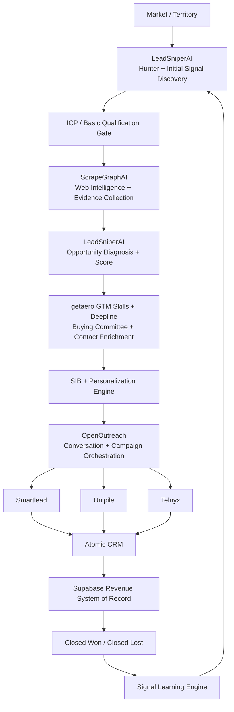

# 🎯 Executive Summary — GTM Revenue Hunt

> Mirrored from Notion page `3b79e94cf0a481e18680c11fe507a7ae` on 2026-09-07. Source: https://app.notion.com/p/3b79e94cf0a481e18680c11fe507a7ae?pvs=204

{"type":"emoji","emoji":"🎯"}

> 
	**GTM Revenue Hunt** is a signal-to-revenue operating module for [KlickSmartAI.com](http://KlickSmartAI.com) / [Klick2Client.com](http://Klick2Client.com). Its purpose is to identify companies with a real reason to buy now, resolve the right buying committee, generate evidence-based sales intelligence, activate personalized multichannel outreach, and learn from closed-won / closed-lost outcomes so future prospecting continuously improves.

# Executive Objective
Traditional lead generation begins with contact lists. GTM Revenue Hunt begins with **business signals**.
The module is designed to answer six questions in sequence:
1. **Which companies should we pursue?**
2. **Why should we pursue them now?**
3. **Who inside the company owns the problem and budget?**
4. **What evidence supports the sales hypothesis?**
5. **What should we say and through which channel?**
6. **Which signals actually produce revenue?**
The result is a closed-loop revenue intelligence system rather than a static lead-generation workflow.
# Strategic Architecture

# Core Components
## 1. LeadSniperAI — Hunter and Opportunity Intelligence
LeadSniperAI determines **who is worth pursuing and why now**.
Primary signal classes include:
- Google Maps / Google Business Profile discovery
- Reviews, review velocity and sentiment
- Website and SEO weaknesses
- Hiring and staffing activity
- Expansion and new-location signals
- News and company events
- Advertising and demand-generation activity
- Technology changes
- Mystery-shopping evidence
- Lead-response and operational friction
The output is an **opportunity record**, not merely a company name.
## 1A. ScrapeGraphAI — Web Intelligence and Evidence Collection Layer
ScrapeGraphAI is now a formal component of the **GTM Revenue Hunt protocol**. It operates **after business discovery / initial ICP filtering and before paid contact enrichment**. Its job is not simply to scrape leads; it turns a company website, directory listing, careers page, association page, project page or other public web source into structured, auditable company intelligence that LeadSniperAI can use to determine whether a real revenue opportunity exists.
The protocol principle is:
**Do not enrich people until the account has earned the right to be enriched.**
ScrapeGraphAI provides the evidence required for that qualification decision.
The operating sequence is:
**Discover → Basic ICP Filter → ScrapeGraphAI Inspect → Detect Signals → LeadSniperAI Diagnose + Score → Build Evidence / SIB → Deepline / getaero Enrich → Personalize → OpenOutreach → Convert → Atomic CRM + Supabase → Learn**
ScrapeGraphAI is used for:
- Structured extraction from company and local-business websites
- Multi-page crawling across services, about, team, projects, locations, careers, case studies and contact pages
- Extracting service areas, commercial/residential focus, vertical focus and industries served
- Identifying leadership and team information visible on public sources
- Capturing hiring, expansion, new-service, new-location and project signals
- Detecting conversion friction such as weak CTAs, contact-form-only flows, missing scheduling, missing quote flows, weak lead capture and other observable revenue leaks
- Extracting recent projects, certifications, capabilities and market-positioning evidence
- Scraping local directories, chambers, trade associations and relevant industry listings
- Using job postings as growth, capacity and operational-change signals
- Capturing technology and workflow clues where publicly observable
- Preserving source URLs so opportunity scoring, SIBs and personalization remain auditable
The output should distinguish **observations** from **inferences**. For example: `24/7 emergency service advertised` is an observation; `after-hours lead leakage may exist` is an inference that requires scoring and validation by LeadSniperAI.
### Local Lead Hunt Pattern
1. **Discover** local businesses through Google Maps, Serper Maps, Google grounding, local directories, associations and ScrapeGraphAI Search where appropriate.
2. **Deduplicate and basic-filter** businesses by geography, category, website availability, rating/review profile and ICP fit.
3. **Research the website** with ScrapeGraphAI using a defined output schema.
4. **Generate signals** from the structured website intelligence.
5. **Score the account** in LeadSniperAI based on ICP fit, growth signals, operational friction, revenue opportunity and evidence quality.
6. **Enrich only qualified accounts** using Deepline / getaero and email/contact verification.
7. **Generate the personalization hook** from verified evidence rather than generic company facts.
8. **Activate outreach** and persist outcomes in Atomic CRM + Supabase.
### Recommended Local-Business Intelligence Schema
```json
{
  "company": "",
  "website": "",
  "city": "",
  "state": "",
  "phone": "",
  "category": "",
  "services": [],
  "service_areas": [],
  "industries_served": [],
  "commercial": false,
  "residential": false,
  "leadership": [],
  "signals": {
    "hiring": [],
    "expansion": [],
    "new_projects": [],
    "new_services": [],
    "technology": [],
    "operational_friction": []
  },
  "evidence_urls": [],
  "opportunity_score": 0,
  "recommended_offer": "",
  "personalization_hook": ""
}
```
### Opportunity List Principle
The goal is not to maximize scraped contacts. GTM Revenue Hunt should progressively narrow the market:
**Large discovered universe → plausible ICP accounts → ScrapeGraphAI-inspected accounts → evidence-backed opportunities → enriched decision-makers → personalized outreach → conversations → qualified pipeline**
Illustrative operating model:
**10,000 discovered → 1,000 plausible → 200 researched → 50 strong opportunities → targeted outreach**
This transforms the product from a conventional lead list into an **Opportunity List**: each prioritized account includes observable signals, evidence, a commercial hypothesis, the relevant buying committee and a defensible reason to contact the company now.
## 2. getaero GTM Skills + Deepline — GTM Engineering Layer
The `getaero-io/gtm-eng-skills` repository becomes the execution and enrichment layer between LeadSniperAI and personalization.
Its role is to determine **who the relevant people are and how to reach them reliably**, while routing enrichment work across appropriate data providers.
Priority capabilities include:
- `deepline-gtm`
- `build-tam`
- `small-business-prospecting`
- `niche-signal-discovery`
- `portfolio-prospecting`
- `account-orgchart`
- `find-qualified-titles`
- `linkedin-url-lookup`
- `clay-to-deepline`
This reduces the need for LeadSniperAI to maintain many direct enrichment integrations and supports provider waterfalls, validation and cost controls.
## 3. Company-First Prospecting
The operating rule is:
**Company → Initial Signal → Web Investigation → Evidence → Opportunity Score → Buying Committee → Contact**
This is intentionally different from buying or scraping large contact lists and then attempting to qualify them afterward. Enrichment costs are concentrated on accounts that have already demonstrated potential commercial relevance.
## 4. Buying Committee Intelligence
For qualified accounts, the module maps the people likely to influence or approve a purchase.
Typical roles may include:
- Economic buyer
- Operational pain owner
- Revenue owner
- Functional workflow owner
- Demand-generation owner
- Technical or systems influencer
The exact committee is vertical-specific. For a construction company, for example, the relevant group could include the President, COO, VP Business Development, Preconstruction Director, Sales Manager and Marketing Director.
## 5. Strategic Intelligence Briefing — SIB
High-value opportunities can be converted into a Strategic Intelligence Briefing containing:
- Company snapshot
- Confirmed business signals
- Opportunity diagnosis
- Review and market intelligence
- Mystery-shopping / friction evidence
- Company intelligence
- Decision-maker / buying-committee information
- Ranked recommendations
- Recommended next action
The SIB becomes the evidence package used by a human seller or personalization agent.
## 6. Personalization and Outreach
The messaging engine transforms signals into commercially relevant outreach using the sequence:
**Signal → Business Problem → Revenue Consequence → Recommended Solution → Personalized Message**
OpenOutreach can then orchestrate campaign content and hand off activation to:
- **Smartlead** — cold email
- **Unipile** — LinkedIn / messaging
- **Telnyx** — calling and voice workflows
- Human-in-the-loop outreach where appropriate
# CRM and Data Layer
## Atomic CRM
Atomic CRM is the operational CRM layer for companies, contacts, activities, tasks, opportunities and seller workflow.
## Supabase
Supabase acts as the durable revenue-intelligence system of record for objects such as:
- Accounts
- Contacts
- Signals
- Opportunities
- Enrichment records
- SIBs
- Campaigns
- Messages
- Meetings
- Activities
- Revenue outcomes
- Signal history
This keeps GTM intelligence separate from but connected to the CRM user experience.
# Revenue Learning Loop
The central differentiator is the feedback loop.
Every pursued opportunity produces an outcome such as:
- No reply
- Reply
- Positive reply
- Meeting
- Qualified opportunity
- Proposal
- Closed Won
- Closed Lost
Those outcomes feed a **Signal Learning Engine** that evaluates which individual signals and signal combinations correlate with pipeline creation and revenue.
Example learning pattern:

Signal Pattern
Illustrative Revenue Propensity

Hiring only
Medium

Poor reviews only
Low

New location
Medium

Hiring + new location
High

Hiring + callback complaints
Very High

Expansion + weak SEO
High

Over time, LeadSniperAI hunts for more companies exhibiting the combinations that have actually generated meetings, opportunities and closed revenue.
# Business Value
GTM Revenue Hunt is designed to create five compounding advantages:
1. **Higher prospect relevance** — outreach starts from observable commercial conditions rather than generic ICP matching.
2. **Lower data waste** — expensive contact enrichment happens after account qualification.
3. **Better personalization** — sales messaging is based on verified evidence and a specific business hypothesis.
4. **Multichannel execution** — the same opportunity intelligence can activate email, LinkedIn, calling and human follow-up.
5. **Continuous improvement** — revenue outcomes improve future signal selection and prioritization.
# Product Positioning
The module should not be positioned as a Clay clone, a list-building tool or a cold-email automation product.
Its stronger positioning is:
> **GTM Revenue Hunt is an AI-enabled revenue intelligence and opportunity hunting system that discovers companies showing evidence of buying need, identifies the right buying committee, creates an evidence-backed sales hypothesis, activates personalized outreach, and learns which market signals create revenue.**
# Division of Responsibilities

Layer
Primary Question

LeadSniperAI
Who should we pursue, what signals matter, and is there a commercially meaningful opportunity?

ScrapeGraphAI
What observable evidence exists on the public web to support or reject the sales hypothesis?

getaero / Deepline
Who are the right people and how do we reach them?

SIB
What is actually happening inside the account?

Personalization / OpenOutreach
What should we say?

Smartlead / Unipile / Telnyx
How do we activate the outreach?

Atomic CRM + Supabase
What happened?

Revenue Learning
Which signals actually create revenue?

# Recommended Implementation Sequence
1. Standardize LeadSniperAI account, signal, evidence and opportunity schemas.
2. Add ScrapeGraphAI as the web-intelligence adapter with structured output, evidence URLs and observation/inference separation.
3. Create the qualification gate that determines which discovered accounts are worth web investigation and which inspected accounts are worth paid enrichment.
4. Add Deepline / getaero enrichment routing and one-row pilot workflows.
5. Implement buying-committee discovery and qualified-title resolution.
6. Connect the SIB and personalization engines so they consume verified ScrapeGraphAI evidence.
7. Connect OpenOutreach as the conversation/orchestration layer with human-in-the-loop escalation for positive intent, pricing, proposals and meetings.
8. Persist signals, evidence, contacts, campaigns, conversations and outcomes in Supabase.
9. Connect Atomic CRM for seller workflow and pipeline visibility.
10. Activate Smartlead, Unipile and Telnyx channels.
11. Capture outcome attribution at signal and evidence-pattern level.
12. Build the closed-won / closed-lost signal-learning loop and use learned patterns to drive future LeadSniperAI hunts.
# Strategic Conclusion
The defensibility of GTM Revenue Hunt does not come from any individual enrichment provider, data source or outbound channel. It comes from the **closed-loop operating model** that connects market signals to account selection, evidence, buying committees, personalized activation and verified revenue outcomes.
As the system accumulates outcome data, it can progressively answer a more valuable question than conventional lead-generation platforms:
> **What observable conditions predict that this specific kind of company is likely to buy this specific service now?**
That learning loop is the foundation for turning GTM Revenue Hunt from an outbound automation module into a reusable revenue-intelligence engine across local services, construction, real estate development, business finance and other verticals.
# GitHub References
- [getaero-io/gtm-eng-skills](https://github.com/getaero-io/gtm-eng-skills) — GTM engineering and Deepline execution layer used for TAM building, enrichment routing, buying-committee discovery, qualified-title resolution, contact verification, niche-signal analysis, portfolio prospecting, and Clay workflow replacement.
- [zubair-trabzada/ai-sales-team-claude](https://github.com/zubair-trabzada/ai-sales-team-claude) — AI sales-team reference architecture for prospect research, qualification, decision-maker discovery, outreach sequencing, meeting preparation, proposals, and pipeline reporting; used as a complementary orchestration model for GTM Revenue Hunt.
LeadSniperAI — Local Service Business Opportunity List Playbook