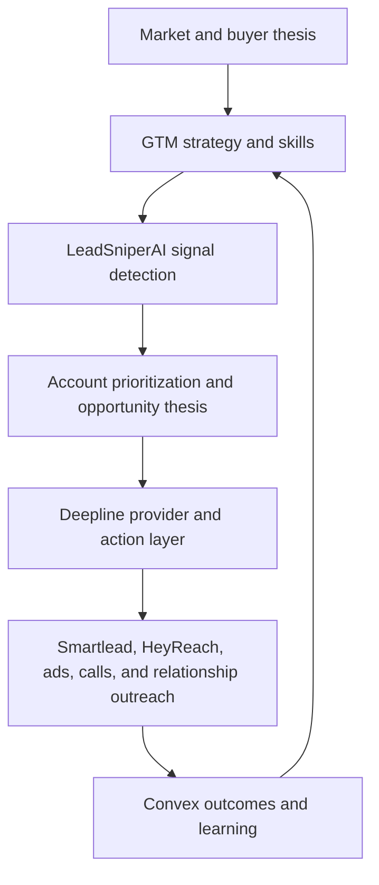

# 🎯 LeadSniperAI CLI — Pre-M&A Signal Engine Executive Summary

> Mirrored from Notion page `3b39e94cf0a4818f9130e7d4046ba8ab` on 2026-09-07. Source: https://app.notion.com/p/3b39e94cf0a4818f9130e7d4046ba8ab?pvs=204

{"type":"emoji","emoji":"🎯"}

> 
	**Executive thesis:** LeadSniperAI CLI is an off-market M&A origination engine that identifies businesses entering the pre-M&A stage before they are formally listed for sale. It combines Google Business Profile breadcrumbs, time-series change detection, Deepline enrichment, ownership intelligence, relationship mapping, and explainable scoring to surface companies likely to consider succession, partnership, recapitalization, merger, or acquisition.

## Strategic opportunity
Traditional M&A databases concentrate on companies already represented by brokers, intermediaries, or private-equity processes. LeadSniperAI targets the earlier window—approximately 12 to 36 months before a formal transaction—when owners may be experiencing succession pressure, operational fatigue, growth constraints, management transition, or increasing interest in liquidity.
The system does not claim that a business is for sale. It develops an evidence-based acquisition hypothesis and prioritizes companies for human verification and relationship-based outreach.
> **Operating model:** GMB universe → change detection → Deepline enrichment → ownership inference → acquisition hypothesis → human verification → relationship outreach → diligence → transaction.
## Core customer outcomes
- Identify off-market acquisition and succession candidates earlier than conventional databases.
- Prioritize targets using explainable pre-M&A signals rather than unverified assumptions.
- Produce decision-ready M&A Opportunity Briefs for buyers, advisors, lenders, and roll-up sponsors.
- Discover founders, decision-makers, trusted advisors, and potential warm introduction paths.
- Monitor target companies over time and alert users when signals strengthen or weaken.
- Support acquisition, merger, minority investment, recapitalization, growth partnership, and seller-financed transaction strategies.
## Pre-M&A stages

Stage
Definition
Recommended action

0 — Stable operator
No meaningful transition, succession, or ownership-change evidence.
Archive or monitor selectively.

1 — Latent transition
Long ownership tenure, founder concentration, or weak modernization suggests possible future transition.
Add to periodic watchlist.

2 — Emerging readiness
Multiple signals suggest succession, partnership, recapitalization, or reduced owner involvement.
Begin relationship development.

3 — Pre-market opportunity
Visible management, operating, branding, location, hiring, or ownership changes warrant direct investigation.
Human diligence and targeted outreach.

4 — Active transaction likelihood
Public evidence of sale, strategic alternatives, restructuring, closure, consolidation, or ownership transfer.
Immediate transaction review.

**Primary target zone:** Stage 2 and early Stage 3, before broad broker and buyer competition develops.
## GMB breadcrumb signal framework
### Ownership and succession
- Founder or family name embedded in the brand.
- Long operating history and legacy language.
- Reviews repeatedly mentioning the owner personally.
- No visible next-generation or professional management successor.
- New general manager, president, or operations leader appears.
- Language shifts from founder-led messaging toward institutional branding.
### Founder dependency
LeadSniperAI analyzes reviews, responses, biographies, and public content for evidence that customers, decisions, and operations remain concentrated around one individual.
**Illustrative metric:** Founder Dependency Ratio = sampled reviews mentioning the owner or founder ÷ total sampled reviews.
### Operational transition
- Reduced operating hours or service availability.
- Slower owner responses and falling response rates.
- Customer complaints involving unanswered calls, staffing, delays, or management inconsistency.
- Services removed, locations contracted, or listings temporarily closed.
- Senior operating and succession-type hiring activity.
### Reputation trajectory
- Recent sentiment declining despite a strong historical rating.
- Review velocity slowing materially.
- Older reviews praising the founder while newer reviews criticize staff or new management.
- Increasing mentions of turnover, delays, new ownership, or policy changes.
### Digital value-creation gap
- Strong local reputation paired with an outdated website.
- Weak local SEO, no online booking, broken forms, or inconsistent branding.
- Multi-location business without standardized marketing and customer-management systems.
- Strong demand but limited CRM, automation, analytics, or review-management capability.
### Footprint and consolidation
- Location openings, closures, relocations, or rebrands.
- Uneven performance across branches.
- Duplicate listings or inconsistent category structures.
- Increasing multi-location competitor activity in a fragmented local market.
## Deepline enrichment role
Deepline acts as the headless enrichment and workflow layer. It orchestrates data providers, runs validation waterfalls, normalizes results, scores data confidence, and writes enriched records into Convex or an owned Postgres environment.
### Enrichment waterfall
1. **Business identity resolution** — legal entity, operating names, founding date, corporate registration, parent relationships, and industry classification.
2. **Owner and leadership resolution** — founder, president, general manager, operations leader, finance contact, family involvement, and former executives.
3. **Digital and GTM assessment** — technology stack, website maturity, traffic, paid media, SEO coverage, booking tools, CRM indicators, hiring activity, and communication infrastructure.
4. **Financial and operating proxies** — employees, locations, reviews, service mix, fleet, licences, permits, contracts, property, and financing indicators. These remain labelled estimates until verified through diligence.
5. **Event intelligence** — leadership changes, litigation, liens, licence changes, financing, acquisitions, partnerships, relocation, property listings, retirement language, and strategic hiring.
Happenstance or a similar relationship-intelligence layer can identify warm paths through accountants, lawyers, lenders, suppliers, customers, industry associations, and shared professional connections.
## Explainable Pre-M&A score

Dimension
Weight

Succession probability
20

Founder dependency
10

Operational transition
15

Digital value-creation gap
10

Reputation trajectory
10

Market attractiveness
15

Strategic buyer fit
10

Owner accessibility
5

Data confidence
5

### Classification
- **80–100:** Pre-market priority — human diligence and warm introduction.
- **65–79:** Emerging opportunity — relationship campaign.
- **50–64:** Watchlist — monitor monthly or quarterly.
- **35–49:** Weak hypothesis — enrich further.
- **Below 35:** Low priority unless strategically important.
A company should require at least three independent signal families before receiving a pre-M&A classification. This reduces false positives and prevents one negative review, temporary closure, or outdated website from being interpreted as acquisition readiness.
## Opportunity classification
LeadSniperAI separates attractive succession opportunities from ordinary distress.
- **Healthy succession candidate:** strong reputation, loyal customers, long history, weak succession planning, and limited modernization.
- **Growth-constrained company:** strong demand but inadequate capital, systems, management depth, or staffing.
- **Distressed company:** severe reputation decline, licence issues, litigation, closures, or persistent operating failures.
- **Post-founder-transition company:** founder has stepped back, new management is underperforming, but brand goodwill remains valuable.
The system then recommends an appropriate pathway: founder partnership, phased buyout, minority investment, seller financing, recapitalization, merger, tuck-in acquisition, asset purchase, or growth partnership with an acquisition option.
## Time-series data advantage
The defensible asset is not a static GMB record. It is the accumulated history of changes across ratings, reviews, operating hours, business status, locations, websites, owner responses, management mentions, and digital infrastructure.
Core calculated changes include:
- Review velocity over 30, 90, and 180 days.
- Rating and sentiment trajectory.
- Opening-hour and service-category changes.
- Owner-response rate and response-time changes.
- Location openings, closures, and rebrands.
- Website, phone, address, and management changes.
As the historical dataset grows, LeadSniperAI can identify patterns that commonly precede succession, sale, merger, recapitalization, or operating decline.
## M&A Opportunity Brief
Every qualified target generates a structured brief containing:
- Executive acquisition thesis.
- Estimated pre-M&A stage and confidence.
- Strongest supporting and disconfirming signals.
- Business quality and local-market position.
- Ownership, founder-dependency, and succession hypothesis.
- Strategic-fit and consolidation analysis.
- Digital, operational, and GTM value-creation opportunities.
- Likely decision-makers and relationship paths.
- Recommended transaction structures.
- Key risks and next diligence actions.
## Relationship-first outreach
The initial message should not ask whether the owner wants to sell. The preferred progression is:
1. Recognize the company’s history, reputation, and market contribution.
2. Introduce a relevant strategic issue such as succession, growth capacity, staffing, financing, modernization, or regional consolidation.
3. Offer a confidential Business Value and Growth Options Review.
4. Develop the relationship through useful introductions, financing options, operating support, or strategic partnerships.
5. Discuss valuation and transaction structure only after owner interest is verified.
## Veritas Development integration profile
LeadSniperAI should operate as the **pre-M&A origination and signal layer** inside the Veritas Development Operating System, not as a separate CRM or transaction-management platform.
**Division of responsibility:**
- LeadSniperAI discovers companies, captures longitudinal market changes, enriches owners and firms, scores pre-M&A readiness, generates M&A Opportunity Briefs and monitors watchlists.
- Frappe stores qualified `M&A Candidate` records and owns relationship management, human verification, NDA, financial review, valuation, LOI, diligence, capital stack and closing.
- Hermes / ChatGPT / OpenRouter interpret evidence and generate acquisition theses and next-action recommendations.
- n8n schedules CLI jobs and synchronizes approved LeadSniper outputs into Frappe.
- OKF stores verified patterns, decisions, transaction outcomes and lessons used to improve future scoring.
### Two-score rule
Do not collapse transaction readiness and buyer fit into a single score.
1. **LeadSniper Transaction Readiness Score:** Does the evidence justify investigating a potential succession, partnership, recapitalization, merger or sale?
2. **Veritas Acquisition Fit Score:** Is the company strategically, financially and operationally attractive for Veritas?
A candidate should become a Veritas Priority Acquisition only when both scores are strong and a human reviewer validates the thesis.
### Frappe synchronization gate
Push a company into the Veritas M&A pipeline when:
- LeadSniper score is 65 or higher; or
- Veritas marks it strategically important; or
- a human reviewer validates a compelling acquisition thesis.
Require at least three independent signal families before assigning a pre-M&A classification. Scores of 80+ should trigger human diligence, not automatic outreach.
### Kansas City pilot profile
For Veritas, the first production pilot should be **Kansas City Metro commercial HVAC**, followed by plumbing, electrical, roofing, restoration, excavation/site services and property management. The objective is a proprietary top-25 acquisition watchlist refreshed monthly, with the top 10 human-verified before relationship outreach.
## CLI module concept
```bash
leadsniper gmb discover --category "commercial HVAC contractor" --region "British Columbia"
leadsniper gmb snapshot --market-id bc-hvac
leadsniper gmb changes --market-id bc-hvac --since 180d
leadsniper gmb breadcrumbs --place-id PLACE_ID
leadsniper founder-dependency --place-id PLACE_ID
leadsniper enrich company --place-id PLACE_ID --workflow ma-prestage-v1
leadsniper ma score --company-id COMPANY_ID
leadsniper ma brief --company-id COMPANY_ID
leadsniper relationships find --company-id COMPANY_ID --via happenstance
leadsniper watch add --company-id COMPANY_ID --frequency monthly
```
## US-first market strategy
The United States should be the primary launch market because it offers stronger business-location coverage, richer state-level corporate and licensing records, more visible buyer activity, deeper private-equity and search-fund participation, and better access to permits, property, financing, employment, and transaction signals.
LeadSniperAI should expand **state by state and vertical by vertical**, beginning where four conditions overlap:
- A large population of independent businesses.
- Strong buyer and consolidator activity.
- High-quality public and commercial data.
- Clear operational and digital value-creation opportunities.
### Priority launch regions
1. **Texas Triangle:** Dallas–Fort Worth, Houston, Austin, and San Antonio.
2. **Florida:** Tampa, Orlando, Jacksonville, and Miami–Fort Lauderdale.
3. **Southeast growth corridor:** Atlanta, Charlotte, Raleigh–Durham, and Nashville.
4. **Pacific Northwest:** Seattle, Tacoma, Spokane, and Portland.
5. **Midwest industrial corridor:** Chicago, Indianapolis, Columbus, Cincinnati, Detroit, and Cleveland.
### Recommended initial vertical
The first US pilot should focus on **commercial HVAC contractors**, followed by plumbing, electrical, roofing, restoration, commercial maintenance, building-products distribution, and light industrial services.
Commercial HVAC is attractive because it combines fragmented ownership, recurring maintenance revenue, emergency-service demand, technician scarcity, strong GMB signal density, meaningful private-equity and strategic-buyer interest, and clear opportunities for centralized GTM, administration, procurement, and cross-selling.
## Minimum viable US pilot
- **Market:** Texas.
- **Cities:** Dallas–Fort Worth, Houston, Austin, and San Antonio.
- **Vertical:** Commercial HVAC.
- **Initial universe:** 2,000–5,000 GMB company records.
- **Enriched candidates:** Approximately 300.
- **High-priority targets:** Approximately 50.
- **Human-verified opportunities:** At least 10.
- **Active buyer profiles:** 20–30 strategic buyers, PE-backed platforms, search funds, family offices, independent sponsors, and operators.
- **Monitoring cadence:** Monthly snapshots with event-driven rescoring.
- **Campaign:** One relationship-first owner campaign and one buyer-validation campaign.
### Primary success metric
> **Number of verified owners willing to discuss succession, growth capital, strategic partnership, merger, recapitalization, or acquisition—not merely the number of businesses identified.**
## Buyer Geography Intelligence
LeadSniperAI should score not only which businesses may be approaching a transaction, but also where buyer liquidity is deepest and which buyers are most likely to pursue each target.
The module should maintain three connected geographic maps:
1. **Target Supply Map** — independent-business density, founder ownership, company age, succession signals, review strength, fragmentation, and proximity between potential tuck-ins.
2. **Buyer Demand Map** — strategic acquirers, PE-backed platforms, search funds, independent sponsors, family offices, holding companies, recent transactions, broker mandates, and acquisition-financing activity.
3. **Buyer–Target Fit Map** — industry, revenue and EBITDA range, geography, platform versus tuck-in preference, customer type, recurring revenue, licences, workforce, service territory, and integration capacity.
### Buyer Liquidity Score

Dimension
Weight

Active buyers in the industry
20

Recent transaction volume
15

Strategic acquirer presence
15

Private-equity portfolio density
10

Search-fund and independent-sponsor activity
10

Financing availability
10

Industry fragmentation
10

Broker-confirmed mandates
5

Cross-border buyer accessibility
5

### Broker and intermediary intelligence
Public data can reveal buyer patterns, but qualified M&A brokers and lower-middle-market advisors are needed to validate information that is rarely visible in databases, including:
- Active buyer mandates.
- Preferred geographies and travel radii.
- Minimum and maximum revenue or EBITDA.
- Platform versus tuck-in appetite.
- Current valuation expectations.
- Financing conditions.
- Deal structures clearing the market.
- Reasons recent transactions failed.
- Which buyers are credible and currently funded.
LeadSniperAI should build an **M&A Market Intelligence Council** consisting of selected US regional brokers, industry-specialist intermediaries, SBA acquisition lenders, search-fund representatives, transaction lawyers, and accountants. Their observations should be captured as structured, time-stamped mandate data rather than informal notes.
### Buyer intelligence CLI concept
```bash
leadsniper buyers discover --industry "commercial HVAC" --region "Texas"
leadsniper buyers map --industry "commercial HVAC" --target-region "Texas"
leadsniper ma match-buyers --company-id COMPANY_ID
leadsniper geography score --industry "commercial HVAC" --regions "TX,FL,GA,NC,TN,WA,OR"
leadsniper broker-intel import --broker-id BROKER_ID --region "Texas" --industry "commercial HVAC"
leadsniper broker-intel validate --market-id texas-hvac
```
The complete operating sequence becomes:
> GMB target signals → Deepline enrichment → buyer geography intelligence → broker validation → buyer–target matching → relationship intelligence → M&A Opportunity Brief → owner and buyer outreach.
## Monetization
- M&A intelligence subscriptions.
- Target-list and acquisition-thesis reports.
- Buy-side origination retainers.
- Roll-up campaign management.
- Qualified introductions and success fees where legally permitted.
- Commercial-financing and recapitalization referrals.
- Technology and growth-improvement engagements.
- Equity participation in selected opportunities.
## Strategic conclusion
LeadSniperAI can evolve from a lead-generation tool into an **M&A origination operating system**. Its competitive advantage will come from detecting pre-transaction change, combining public business breadcrumbs with high-quality enrichment, maintaining longitudinal company intelligence, and converting signals into trusted owner relationships before a formal sale process begins.
## Approved strategic architecture — two-sided M&A market intelligence
> 
	**Decision:** LeadSniperAI will be developed as a two-sided M&A intelligence and origination system. It will identify pre-market sellers, map credible buyers and capital sources, validate market liquidity through broker intelligence, and recommend the most executable transaction pathway.

### Sell-side intelligence
LeadSniperAI identifies privately owned businesses showing evidence of succession pressure, founder dependency, operational transition, recapitalization needs, partnership readiness, or emerging acquisition interest before a formal sale process begins.
### Buy-side intelligence
LeadSniperAI identifies strategic acquirers, private-equity-backed platforms, search funds, independent sponsors, family offices, holding companies, industry operators, and acquisition lenders with relevant mandates.
### Market matching
The system connects target quality with buyer demand across:
- Industry and service category.
- Revenue and EBITDA range.
- Geography and buyer travel radius.
- Platform versus tuck-in preference.
- Customer type and recurring-revenue profile.
- Licences, workforce, territory, and operating capabilities.
- Integration capacity and financing requirements.
### Core product question
> **Which business, in which market, is most likely to attract multiple credible buyers—and what transaction pathway has the highest probability of execution?**
## Buyer-supply and demand matrix

Market condition
Low target supply
High target supply

High buyer demand
Seller-friendly market; sourcing is the primary constraint.
Priority roll-up market.

Low buyer demand
Avoid unless a specific strategic buyer exists.
Build the buyer syndicate before approaching owners.

## Broker-validation principle
M&A brokers and lower-middle-market advisors should not be treated as the only data source. They serve as the qualitative validation layer for buyer mandates, valuation conditions, financing appetite, preferred deal structures, geographic boundaries, failed-deal reasons, and buyer credibility.
Every broker-supplied insight should be:
- Structured into standardized mandate fields.
- Assigned a source and confidence level.
- Time-stamped and given an expiry date.
- Revalidated before being used in owner outreach or buyer matching.
## US-first implementation decision
The United States is the approved primary market because of its stronger business-location data, state corporate records, contractor licensing, permits, property and financing signals, buyer-network depth, transaction activity, and acquisition-finance ecosystem.
The approved MVP remains:
- **Region:** Texas Triangle.
- **Cities:** Dallas–Fort Worth, Houston, Austin, and San Antonio.
- **Vertical:** Commercial HVAC.
- **Expansion sequence:** Plumbing, electrical, roofing, restoration, commercial maintenance, building-products distribution, and industrial services.
## Final operating architecture
> **GMB target signals → time-series change detection → Deepline enrichment → Pre-M&A scoring → Buyer Geography Intelligence → broker validation → buyer–target matching → Happenstance relationship paths → M&A Opportunity Brief → owner and buyer outreach → diligence and transaction.**
## Approved positioning
> **LeadSniperAI finds businesses before they formally enter the market, identifies the buyers most likely to acquire them, and recommends the highest-probability transaction pathway.**
This architecture makes LeadSniperAI more than a target-list generator. It becomes a data-driven, relationship-enabled M&A market-making system capable of supporting proprietary deal origination, buyer mandate execution, roll-up development, financing, and selected equity participation.
---
## JT Foxx M&A methods — reusable operating model
> 
	**Research conclusion:** JT Foxx’s public M&A material describes a founder-partnered buy-and-build model rather than a fully disclosed technical transaction playbook. The reusable method is to source founder-led platform companies, align the founder through retained equity or partnership, acquire competitors and complementary businesses, improve EBITDA and management quality, and exit or recapitalize the larger platform at an institutional valuation.

### Reconstructed deal process
1. Build a distributed network of connectors, operators, advisors, investors, and founders.
2. Source established founder-led companies before a formal sale process begins.
3. Classify each company as a platform, tuck-in, scale-first opportunity, or distressed asset.
4. Select one of three entry paths: **Scale First**, **Acquire Around the Founder**, or **Deal Origination**.
5. Establish founder alignment, governance, decision rights, and economic participation.
6. Secure an appropriate capital stack.
7. Acquire competitors and complementary businesses sequentially.
8. Integrate reporting, systems, management, sales, procurement, and customer operations.
9. Increase organic revenue, margins, recurring revenue, and management depth.
10. Reduce founder dependency and produce reliable consolidated financial reporting.
11. Reach a predetermined EBITDA threshold.
12. Sell, recapitalize, or refinance with a larger strategic or institutional buyer.
### Three entry models

Model
Purpose
LeadSniperAI workflow

Scale First
Improve a company before committing to an acquisition or equity partnership.
Diagnose growth constraints, deliver GTM and operational improvements, validate management quality, and monitor performance.

Acquire Around the Founder
Use the founder’s company as the platform and complete acquisitions around it.
Score platform readiness, map tuck-ins, model geographic density, and identify buyer and capital pathways.

Deal Origination
A connector or advisor introduces a qualified company or founder.
Capture referrals, attribute the source, screen the opportunity, and manage qualification and relationship development.

### Founder-partnered platform strategy
The distinguishing feature is not simply purchasing a founder’s company. The model seeks to preserve the founder’s knowledge, relationships, operating credibility, and future upside while adding capital, management resources, acquisitions, and institutional discipline.
LeadSniperAI should therefore score:
- Founder credibility and willingness to remain involved.
- Management depth below the founder.
- Customer and employee dependence on the founder.
- Transferability of licences, relationships, contracts, and goodwill.
- Ability to integrate acquired competitors.
- Governance compatibility with outside investors and operators.
- Potential for rollover equity and a future second liquidity event.
### Platform versus tuck-in classification
**Platform candidates** should demonstrate strong reputation, recurring or repeat revenue, credible management, reliable financial reporting, defensible market position, and capacity to integrate acquisitions.
**Tuck-in candidates** may offer valuable customers, technicians, licences, territories, service capabilities, or contracts but may lack the management depth required to lead a group.
LeadSniperAI should reject the assumption that every attractive local company is a viable platform.
### Fragmented-industry screening
The strongest roll-up sectors generally combine:
- Numerous small independent operators.
- Founder ownership and weak succession planning.
- Recurring or repeat customer demand.
- Duplicated back-office expenses.
- Geographic density between targets.
- Clear cross-selling, procurement, and technology synergies.
- Limited institutional management and reporting.
- Larger strategic buyers willing to pay for scaled platforms.
This supports the current focus on HVAC, plumbing, electrical, roofing, restoration, commercial maintenance, specialty contractors, building-products distribution, light manufacturing, accounting, insurance, and AI implementation agencies.
### Value-creation model
The economic model relies on both **EBITDA improvement** and potential **multiple expansion**.
Key value levers include:
- Centralized lead generation and sales conversion.
- Pricing optimization and recurring service agreements.
- Cross-selling between acquired companies.
- Shared procurement, insurance, administration, and finance.
- Better workforce scheduling and technician utilization.
- Unified CRM, field-service, ERP, communications, and reporting systems.
- Professional controllers, CFO support, regional operating leaders, and standardized KPIs.
- Reduced founder dependency and improved customer retention.
Multiple expansion should never be assumed. A larger group earns a higher valuation only when it produces reliable consolidated reporting, stable margins, organic growth, integration discipline, management depth, and a credible future growth plan.
### Acquisition sequencing
The preferred sequence is:
1. Select and stabilize the platform.
2. Standardize financial reporting and governance.
3. Complete one strategically adjacent tuck-in.
4. Prove integration and management capacity.
5. Codify the integration playbook.
6. Add further geographic or capability acquisitions.
7. Build management below the founder.
8. Prepare institutional-quality consolidated financials.
9. Approach larger buyers or recapitalization partners.
This is safer than completing several acquisitions before the platform has demonstrated integration capacity.
### Capital and transaction structures
A realistic transaction may combine:
- Senior bank or SBA-backed acquisition debt.
- Private credit.
- Seller financing.
- Earnouts.
- Founder rollover equity.
- Sponsor or family-office equity.
- Independent-sponsor capital.
- Strategic-investor capital.
- Joint venture, equity exchange, or majority recapitalization structures.
The phrase “no money down” should not be interpreted as a transaction requiring no capital. It usually means that the individual originator may not personally provide the purchase capital. Purchase consideration, working capital, transaction costs, and integration still require funding.
### Exit-backward planning
LeadSniperAI should model the roll-up backward from a credible buyer and target exit.
```plain text
Target exit value
÷ expected exit multiple
= required EBITDA

Required EBITDA
− current platform EBITDA
= EBITDA gap
```
The EBITDA gap can then be divided between organic improvement, margin expansion, and acquisition contributions. Buyer Geography Intelligence should identify which strategic buyers, PE-backed platforms, family offices, and consolidators are likely to value the finished platform.
### LeadSniperAI modules derived from the method
- **Connector Network:** referral capture, attribution, qualification, and deal status.
- **Platform Readiness Score:** management, reputation, recurring revenue, reporting, integration capacity, and founder alignment.
- **Tuck-In Finder:** geographic and capability-adjacent acquisition targets.
- **Scale-First Diagnostic:** GTM, technology, pricing, staffing, and margin improvement opportunities.
- **Capital Fit Score:** match the transaction with SBA debt, senior debt, private credit, seller financing, and equity sources.
- **EBITDA Gap Model:** quantify the path from current performance to target exit economics.
- **Integration Readiness Score:** systems, reporting, leadership, cultural, customer, and operational compatibility.
- **Exit Buyer Map:** identify future strategic and institutional purchasers before the first acquisition.
### Required diligence and risk controls
LeadSniperAI should add controls that are not visible in promotional M&A materials:
- Quality-of-earnings review and normalized EBITDA.
- Working-capital analysis and cash-conversion requirements.
- Customer and supplier concentration.
- Debt capacity and downside-case modelling.
- Management succession and founder-dependency reduction.
- Legal, regulatory, licence, environmental, tax, and employment diligence.
- Cybersecurity, privacy, data, and technology diligence.
- Integration cost and timeline estimation.
- Governance, dilution, voting, and exit-right analysis.
- Disconfirming evidence and no-exit scenarios.
### Compliance boundary
LeadSniperAI should remain primarily an intelligence, research, scoring, workflow, and diligence-support platform. US legal advice is required before receiving transaction-based compensation, soliciting buyers or sellers, negotiating securities-related terms, or operating in a role that may require broker-dealer or M&A intermediary registration.
### Strategic interpretation
> **The reusable JT Foxx method is a relationship-driven, founder-partnered roll-up strategy built on distributed sourcing, platform selection, equity alignment, sequential acquisitions, operational improvement, capital matching, EBITDA growth, and an institutional exit.**
LeadSniperAI’s role is to automate the most difficult intelligence layer beneath that model: finding the platform, detecting founder readiness, locating tuck-ins, mapping buyers, matching capital, quantifying the EBITDA gap, and maintaining an evidence-backed path from first signal to transaction.
## Management Buyout pathway
LeadSniperAI should treat a management buyout as a distinct succession and transaction pathway. Its role is to detect whether a founder-owned business appears suitable for an internal management acquisition, not to identify people directly from LinkedIn.
### MBO opportunity logic
A credible management buyout requires four conditions:
- **Owner readiness:** the founder appears willing to reduce involvement, preserve legacy, or transition ownership.
- **Management capability:** the company has a credible internal leadership team capable of operating the business.
- **Business financeability:** cash flow, margins, customer stability, and debt-service capacity appear sufficient for acquisition financing.
- **Capital availability:** seller financing, SBA-backed debt, independent-sponsor capital, family-office capital, or other funding sources may be available.
### LeadSniperAI MBO signals
LeadSniperAI should generate company-level indicators such as:
- Long founder tenure and no visible family successor.
- Founder visibility declining while a president, COO, general manager, or operations leader becomes more prominent.
- Long-tenured management team with increasing responsibility.
- Strong reputation and customer continuity despite reduced founder involvement.
- Stable operating history and recurring or repeat revenue.
- Management hiring that suggests succession planning or professionalization.
- Seller-financing potential and sufficient estimated cash flow to support acquisition debt.
- Strong internal continuity combined with weak external succession planning.
### MBO Readiness Score

Dimension
Weight

Owner transition likelihood
20

Management depth
20

Management tenure and continuity
10

Financial-management capability
10

Business cash-flow quality
15

Customer and supplier continuity
10

Financing feasibility
10

Relationship accessibility
5

### MBO classifications
- **80–100:** Strong MBO candidate.
- **65–79:** Potential MBO; management verification required.
- **50–64:** Succession candidate with a management gap.
- **Below 50:** External buyer, management recruitment, or another transaction path is likely required.
### Potential MBO structures
LeadSniperAI should recommend suitable structures for professional review, including:
- Seller-financed management buyout.
- SBA-financed management buyout.
- Sponsor-backed management buyout.
- Gradual management buy-in.
- Management-led recapitalization.
- Founder rollover with management incentive equity.
## LinkedIn search module boundary
The LinkedIn component should operate as a separate people-discovery module using its own search methodology. LeadSniperAI remains the company-level signal and decision engine.
> **LeadSniperAI finds the opportunity. The LinkedIn search module finds the people. Happenstance finds the relationship path. Convex manages the deal.**
### LeadSniperAI responsibilities
- Detect succession, MBO, recapitalization, platform, and tuck-in signals.
- Classify the probable transaction pathway.
- Identify the roles that should be researched.
- Generate a structured contact-search brief.
- Score opportunity confidence and management-depth indicators.
### LinkedIn search module responsibilities
- Identify the owner, founder, president, COO, general manager, controller, CFO, operations leaders, branch managers, and other potential management buyers.
- Validate titles, tenure, geography, and career progression.
- Map internal management candidates and relevant external advisors.
- Return validated contact records to Convex.
### Contact-search handoff
```json
{
  "company_id": "cmp_123",
  "company_name": "ABC Mechanical",
  "domain": "abcmechanical.com",
  "location": "Dallas, Texas",
  "transaction_signal": "MANAGEMENT_BUYOUT",
  "target_roles": [
    "Founder",
    "Owner",
    "President",
    "General Manager",
    "VP Operations",
    "Controller",
    "CFO"
  ],
  "search_objective": "Identify the owner, potential internal management buyers, and trusted advisors",
  "signal_confidence": 82
}
```
### Revised MBO workflow
> GMB and public-business signals → LeadSniperAI MBO detection → transaction-path classification → contact-search brief → separate LinkedIn search module → Happenstance warm-path discovery → Convex opportunity management → human verification and financing review.
### MBO CLI concept
```bash
leadsniper ma analyze --company-id COMPANY_ID
leadsniper mbo detect --company-id COMPANY_ID
leadsniper contacts search-brief --company-id COMPANY_ID --transaction-path mbo
leadsniper contacts import --company-id COMPANY_ID --source linkedin-module --file contacts.json
leadsniper mbo build-team-map --company-id COMPANY_ID
leadsniper mbo capital-match --company-id COMPANY_ID --region Texas
leadsniper mbo brief --company-id COMPANY_ID
```
### Expanded transaction classifications
```plain text
EXTERNAL_PLATFORM_ACQUISITION
TUCK_IN_ACQUISITION
FOUNDER_PARTNERSHIP
MANAGEMENT_BUYOUT
MANAGEMENT_BUY_IN
MANAGEMENT_LED_RECAP
SELLER_FINANCED_SUCCESSION
EMPLOYEE_OWNERSHIP
GROWTH_PARTNERSHIP_WITH_OPTION
```
The management-buyout pathway expands LeadSniperAI beyond external buyer matching. It can identify businesses where internal succession may preserve customers, employees, operating continuity, and founder legacy while still creating a financeable ownership transition.
---
## GTM Strategy and Skills Layer
> 
	**Architectural principle:** Deepline integrations provide capabilities and execution endpoints. LeadSniperAI GTM skills provide the decision logic that determines which market to pursue, which account matters, what signal means, which offer fits, who should be approached, through which channel, and what should happen next.

### Role within the operating system


Layer
Primary question

GTM strategy
Who should we pursue, why now, and with which commercial motion?

LeadSniperAI
Which companies are showing actionable M&A, succession, financing, or growth signals?

Hermes
What evidence supports the opportunity, and what is the account or acquisition thesis?

Deepline
Which data, enrichment, research, audience, or execution connector should be called?

Convex
What happened, what is the current lifecycle state, and what should happen next?

## Core GTM skills
### 1. Market selection
Identify markets with favorable acquisition and commercialization conditions:
- Industry fragmentation and independent-business density.
- Founder demographics and succession pressure.
- Recurring or repeat revenue.
- Customer retention and local-market defensibility.
- Regulatory, licence, workforce, and geographic barriers.
- Buyer and consolidator activity.
- Financing availability.
- Strategic-buyer demand.
- Potential for AI, digital, operational, and GTM improvement.
**Output:** a market thesis describing the target sector, target geography, why the timing is favorable, primary buyer groups, value-creation levers, and disqualifying conditions.
### 2. Ideal Acquisition Profile design
Traditional GTM uses an Ideal Customer Profile. The M&A engine requires an **Ideal Acquisition Profile** for each transaction strategy.
```yaml
industry: commercial HVAC
geography: Texas Triangle
revenue_range: 2M-15M
employee_range: 10-75
ownership: founder_led
years_in_business: 15+
review_rating: 4.0+
locations: 1-4
digital_maturity: low_to_medium
recurring_revenue: preferred
succession_signals: required
```
Separate profiles should be maintained for:
- Platform companies.
- Tuck-in acquisitions.
- Healthy succession candidates.
- Distressed or turnaround opportunities.
- Founder growth partnerships.
- Financing and recapitalization opportunities.
- Strategic buyers and funded acquisition mandates.
### 3. Trigger-based GTM
Outbound should be initiated by a relevant signal rather than generic list membership.

Detected signal
Recommended GTM motion

Long founder tenure with no visible successor
Confidential succession and continuity conversation.

Location closure or service contraction
Turnaround, recapitalization, or tuck-in assessment.

Competitor acquired by a consolidator
Regional consolidation and strategic-options outreach.

Hiring contraction or technician shortage
Operating-capacity, recruiting, capital, or platform-support offer.

Strong reviews paired with a weak website
Growth partnership or value-creation assessment.

New permit, facility, equipment, or location
Expansion and financing outreach.

New president, general manager, or operating executive
Management-transition and strategic-partnership conversation.

Advertising, website, or review activity deteriorating
Modernization, revenue-recovery, or acquisition-option proposal.

### 4. Account research and personalization
Combine GMB history, ownership records, local reputation, corporate filings, hiring, technology, competitor activity, buyer activity, and relationship intelligence to create an account-specific approach.
The account brief should identify:
- The strongest verified signal.
- The probable commercial or owner-level issue.
- Supporting and disconfirming evidence.
- The most relevant value proposition.
- A credible reason to initiate contact now.
- The appropriate decision-maker and possible warm introduction path.
- The level of sensitivity required in the initial message.
The preferred opening recognizes the company’s history and market position and introduces a relevant strategic issue. It should not begin with an unsupported claim that the owner intends to sell.
### 5. Offer architecture
Each signal family should map to a defined offer and conversion pathway.
#### Succession offer
- Confidential succession readiness assessment.
- Business continuity and owner-dependency review.
- Partial liquidity, phased buyout, or complete-exit pathways.
- Legacy, employee, customer, and brand-preservation options.
#### Growth partnership offer
- AI, operations, CRM, and GTM modernization.
- Revenue-share or performance-based engagement.
- Minority investment or operating partnership.
- Acquisition option after an agreed performance period.
#### Roll-up participation offer
- Join a larger operating platform.
- Preserve local brand or founder involvement where appropriate.
- Retain rollover equity.
- Centralize administration, technology, procurement, and marketing.
- Expand geography, service coverage, and cross-selling.
#### Financing and recapitalization offer
- Acquisition financing.
- Working capital and equipment financing.
- Commercial real-estate financing.
- Owner liquidity or balance-sheet recapitalization.
- Growth capital linked to an operating plan.
#### Buyer-side origination offer
- Market mapping and Ideal Acquisition Profile design.
- Proprietary off-market target sourcing.
- Target and owner research.
- Relationship outreach and pipeline management.
- Acquisition thesis and buyer–target matching.
### 6. Signal-to-conversation skill
The reusable decision chain is:
> Signal → interpretation → likely owner or operating problem → relevant offer → personalized conversation → verified intent.
Every generated message should reference a defensible observation, avoid overclaiming, and provide a useful first step such as a confidential strategic-options review, market briefing, financing assessment, or growth-value analysis.
### 7. Research-led outbound
Use insight as the lead offer rather than immediately requesting a transaction discussion. Appropriate assets include:
- Local consolidation report.
- Confidential succession-readiness assessment.
- Competitive market and buyer map.
- Digital and operational maturity analysis.
- Estimated growth and value-creation opportunity.
- Financing and recapitalization readiness review.
- Business Value and Growth Options Review.
### 8. Founder education funnel
Many owners will not respond to direct acquisition language. A longer educational funnel should be available:
> Market insight or report → vertical briefing or webinar → confidential assessment → strategic-options meeting → partnership, financing, recapitalization, or transaction discussion.
This adapts the JT Foxx acquisition funnel into a vertical-specific and evidence-led process without relying on exaggerated transaction claims.
### 9. Relationship-first acquisition
Higher-value targets should be managed as long-duration relationships:
> Identify → monitor → engage → provide value → diagnose → establish trust → verify owner objectives → discuss structure.
Convex should retain relationship history, signal changes, introductions, advisor relationships, preferences, and follow-up dates across months or years.
### 10. Multi-threaded account strategy
Where appropriate, map the complete decision and influence network:
- Founder or controlling shareholder.
- President or general manager.
- CFO or finance lead.
- Operating manager.
- Accountant.
- Lawyer.
- Wealth advisor.
- Lender or commercial banker.
- Supplier, customer, association contact, or strategic partner.
The objective is not indiscriminate outreach. It is to understand the trusted-advisor network and identify the most credible path to a confidential conversation.
### 11. Lookalike expansion
Once a target or completed transaction validates the model, identify similar companies using industry, location, revenue, ownership, review profile, technology, hiring patterns, customer type, service mix, and operating model.
This produces a repeatable roll-up or buy-side origination pipeline rather than an isolated target list.
### 12. Buyer-first origination
The preferred commercial sequence for a mandate-led M&A motion is:
1. Define the strategic buyer, sponsor, platform, or funded mandate.
2. Capture industry, geography, size, service, margin, customer, licence, and integration criteria.
3. Build the Ideal Acquisition Profile.
4. Identify matching off-market companies.
5. Generate an evidence-backed target thesis.
6. Validate fit with the buyer before expensive enrichment.
7. Approach owners through the most credible relationship or outbound channel.
8. Feed verified interest into diligence, financing, and transaction workflows.
This approach reduces the risk of finding companies without a credible buyer or transaction pathway.
## Reusable GTM skill packages
```plain text
/skills
  /market-mapping
  /ideal-acquisition-profile
  /buyer-mandate-design
  /signal-to-message
  /account-research
  /offer-design
  /buyer-matching
  /succession-outreach
  /rollup-campaign
  /financing-trigger
  /founder-education-funnel
  /relationship-path
  /database-remarketing
  /lookalike-expansion
  /next-best-action
```
Each skill should be vertical-agnostic at the framework level and configured by vertical-specific files containing:
- Signal weights and thresholds.
- Ideal Acquisition Profile criteria.
- Buyer criteria and market assumptions.
- Message language and prohibited claims.
- Offer structure.
- Compliance and human-approval rules.
- Preferred providers and enrichment budget.
- Channel selection.
- Conversion events and outcome definitions.
## CLI expansion
```bash
leadsniper market map --industry "commercial HVAC" --region "Texas"
leadsniper ma define-iap --strategy "regional rollup" --output texas-hvac-iap.yaml
leadsniper ma find-targets --iap texas-hvac-iap.yaml
leadsniper account thesis --company-id COMPANY_ID
leadsniper gtm recommend-motion --company-id COMPANY_ID
leadsniper gtm generate-offer --company-id COMPANY_ID --motion succession
leadsniper gtm create-campaign --segment "high-succession-high-reputation"
leadsniper gtm next-best-action --company-id COMPANY_ID
leadsniper gtm find-lookalikes --company-id COMPANY_ID --region "Texas"
leadsniper buyers validate-fit --company-id COMPANY_ID --buyer-id BUYER_ID
```
## GTM workflow state in Convex
Convex should retain the decision trail that produced each action:
- Market thesis and version.
- Ideal Acquisition Profile and version.
- Detected signals and supporting evidence.
- Recommended GTM motion.
- Selected offer.
- Selected contact and channel.
- Human approval.
- Message and campaign version.
- Engagement, response, and verified intent.
- Opportunity stage and next-best action.
- Transaction, financing, partnership, or rejection outcome.
This creates an auditable learning loop:
> Signal pattern → GTM decision → owner response → verified intent → transaction outcome → improved signal and strategy weights.
## GTM success metrics
The GTM layer should optimize for decision quality and verified commercial progression rather than list size or raw email volume.
Primary measures include:
- Verified owner conversations per 100 qualified targets.
- Percentage of outreach tied to a current, evidence-backed signal.
- Positive response rate by signal family and GTM motion.
- Strategic-options meetings booked.
- Owners willing to discuss succession, partnership, financing, recapitalization, or acquisition.
- Buyer-confirmed target fit.
- Opportunities entering diligence.
- Qualified transaction value and financing value created.
- Cost per verified opportunity.
- Time from signal detection to qualified conversation.
- False-positive rate by signal type.
## GTM operating principle
> **Integrations are capabilities; GTM skills are decision logic.** Apollo may find a founder, Smartlead may send a message, PredictLeads may expose an event, and Exa may research a market. LeadSniperAI’s proprietary GTM layer decides whether the market is attractive, whether the company fits the thesis, what the event means, which offer is appropriate, whom to approach, when to act, which channel to use, and what should happen after the response.
LeadSniperAI — Pre-M&A Search Thesis & Research Playbook