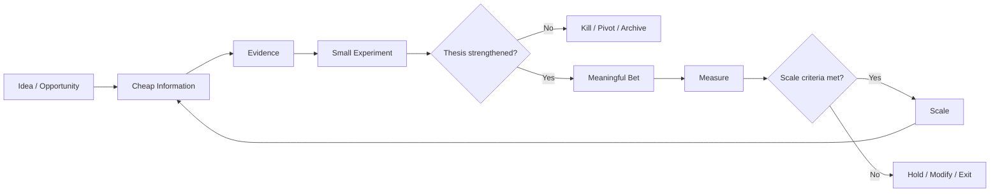
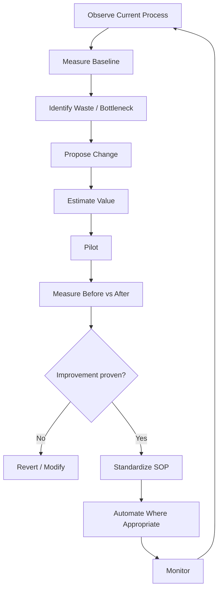
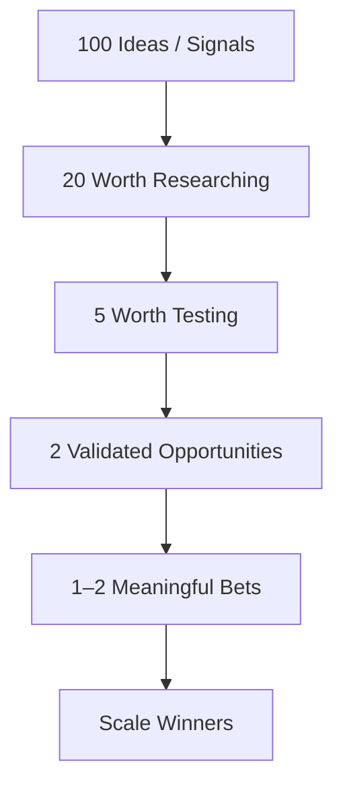

# 🎯 Swiss Axioms — Decision & Implementation Operating System

> Mirrored from Notion page `3c69e94cf0a4810680deda3d49a61c2a` on 2026-09-07. Source: https://app.notion.com/p/3c69e94cf0a4810680deda3d49a61c2a?pvs=204

{"type":"emoji","emoji":"🎯"}

> 
	**Purpose:** Convert new ideas, processes, investments, automations, partnerships, and business opportunities into disciplined decisions under uncertainty. The system is inspired by the Zurich Axioms, but adapted into a modern operating framework built around evidence, asymmetric upside, controlled downside, mobility, and rapid learning.

# 1. Core Operating Principle
> **Buy information cheaply before buying risk expensively.**
The objective is not to eliminate uncertainty. It is to make increasingly meaningful commitments only as evidence improves.

# 2. The 13 Decision Axioms

Principle
Decision Rule

1. Risk
Accept risk only where the potential upside is meaningful and the downside is survivable.

2. Meaningful Stakes
Once evidence is strong, commit enough resources that success materially matters.

3. Greed
Define what a successful outcome looks like before entering; harvest value rather than endlessly extending targets.

4. Hope
Predefine failure conditions. Exit when the thesis breaks instead of defending sunk costs.

5. Forecasts
Treat forecasts as hypotheses, not facts. Use them to design experiments.

6. Patterns
Demand evidence for causal claims. Separate signals from stories and coincidence.

7. Mobility
Preserve the ability to redeploy capital, people, technology, and attention.

8. Intuition
Use intuition when it comes from deep experience; force it to explain what signals produced the judgment.

9. Narrative
Do not substitute destiny, enthusiasm, reputation, or persuasive narratives for evidence.

10. Confidence
Confidence means knowing what to do if the decision fails, not simply expecting success.

11. Consensus
Do not equate popularity with correctness. Look for valuable opportunities before consensus forms.

12. Stubbornness
Never add resources merely because prior resources have already been spent.

13. Optionality
Plan direction strongly but preserve flexibility in the path.

# 3. Idea Intake — Before Any Work Begins
Every new idea should enter the system as a hypothesis, not a project.
## Idea Definition
- **Idea / Opportunity:** What are we considering?
- **Problem:** What real problem does it solve?
- **Beneficiary / ICP:** Who benefits enough to care?
- **Current alternative:** How is the problem handled today?
- **Proposed advantage:** Why might this approach be materially better?
- **Value created:** Revenue, cost reduction, time savings, risk reduction, strategic advantage, or new capability.
- **Meaningful upside:** What happens if this works exceptionally well?
- **Maximum acceptable downside:** What are we willing to lose in money, time, reputation, and opportunity cost?
# 4. The Evidence Ladder
Do not move directly from idea to full implementation.

Stage
Evidence Required
Capital / Effort Rule

0 — Idea
Logical hypothesis
Research only

1 — Signal
External evidence that the problem exists
Small discovery effort

2 — Validation
Customers/users confirm problem and willingness to act
Prototype / pilot

3 — Proof
Measured outcome demonstrates value
Meaningful investment

4 — Repeatability
Outcome can be reproduced
Process investment

5 — Scale
Unit economics and operational capacity are proven
Concentrate resources

# 5. Meaningful Stakes Test
Before making a large commitment, answer all of the following:
- [ ] If this succeeds, is the outcome strategically or financially meaningful?
- [ ] Is the downside survivable?
- [ ] Do we have evidence beyond enthusiasm?
- [ ] Is there a plausible asymmetric payoff?
- [ ] Have we identified the variables most likely to make the thesis wrong?
- [ ] Can we exit without catastrophic damage?
- [ ] Are we concentrating because evidence improved—not because we are emotionally committed?
> 
	**Rule:** Small bets are appropriate for learning. Meaningful bets are appropriate after validation. Never confuse testing with scaling.

# 6. Decision Scorecard
Score each factor from 1–5.

Factor
Question
Weight

Problem Severity
Is the problem expensive, urgent, frequent, or strategically important?
15%

Evidence
How strong is the evidence that the opportunity is real?
20%

Strategic Fit
Does it fit existing capabilities, relationships, IP, distribution, or technology?
10%

Asymmetric Upside
Is upside substantially larger than downside?
15%

Speed to Learning
How quickly can the thesis be tested?
10%

Capital Efficiency
Can we obtain meaningful information inexpensively?
10%

Repeatability
Can the successful process be standardized?
10%

Optionality
Does the opportunity create additional future options?
5%

Exitability
Can we stop or redeploy resources easily?
5%

## Decision Bands
- **80–100:** Priority candidate — move toward meaningful validation or scale.
- **65–79:** Promising — run targeted experiments.
- **50–64:** Weak evidence — research before committing.
- **Below 50:** Archive unless new evidence changes the thesis.
# 7. Pre-Mortem — Assume the Idea Failed
Before implementation ask:
1. It is 12 months from now and this failed. Why?
2. Which assumption was wrong?
3. What did we know early but ignore?
4. What external dependency failed?
5. What cost or complexity did we underestimate?
6. What customer behavior did we assume without evidence?
7. What would have told us to exit six months earlier?
Turn those answers into measurable **kill criteria**.
# 8. Kill, Hold, Scale Rules
## Kill
Stop when one or more predefined thesis-breaking conditions occur.
Examples:
- Customer demand does not appear after a defined number of conversations.
- The required acquisition cost exceeds viable economics.
- Automation cannot reliably achieve the required accuracy.
- Regulatory, operational, or reputational risk becomes unacceptable.
- The solution saves too little time or money to justify adoption.
## Hold / Modify
Continue experimenting when the problem remains valid but the current solution, channel, pricing, workflow, or implementation is wrong.
## Scale
Increase capital, automation, people, marketing, or infrastructure only when:
- [ ] Problem is validated.
- [ ] Outcome is measurable.
- [ ] Success has been repeated.
- [ ] Unit economics are acceptable.
- [ ] Delivery can handle increased volume.
- [ ] Failure risk remains survivable.
# 9. The Reinvestment Test
At every major review ask:
> **If we had not already invested time or money, knowing everything we know today, would we choose to invest in this now?**
If the answer is no, continuing requires explicit justification.
This protects against sunk-cost bias and organizational stubbornness.
# 10. Process Improvement Decision Loop
Use the same framework for new processes and automation.

## Baseline Metrics
Before modifying a process capture:
- Time required
- People involved
- Loaded hourly cost
- Error/rework rate
- Wait time
- Number of handoffs
- Customer impact
- Revenue generated or protected
- Compliance/risk exposure
- Frequency
## Improvement Value Formula
**Annual Process Cost = Frequency × Labour Time × Loaded Labour Rate + Error/Rework Cost + Technology Cost**
**Annual Improvement Value = Time Saved + Error Reduction + Incremental Revenue + Avoided Risk − New Operating Cost**
# 11. AI & Automation Gate
Automation should not be the first response to a broken process.
Use this sequence:
1. **Question** — Why does this activity exist?
2. **Delete** — Can the activity be eliminated?
3. **Simplify** — Can steps, approvals, or inputs be reduced?
4. **Standardize** — Can the correct process be documented?
5. **Automate** — Can software or AI execute it reliably?
6. **Delegate** — Should humans remain in the loop for judgment or exceptions?
7. **Measure** — Did the automation actually improve the outcome?
Related operating framework: 
# 12. Decision Journal
For every material decision record:
- **Date**
- **Decision**
- **Decision owner**
- **What we believe**
- **Evidence available**
- **Key assumptions**
- **Expected outcome**
- **Expected probability**
- **Maximum downside**
- **Kill criteria**
- **Scale criteria**
- **Next evidence required**
- **Review date**
- **Actual outcome**
- **What we learned**
- **What should become organizational knowledge / SOP?**
This creates a feedback loop where decision quality can be evaluated separately from outcome luck.
# 13. Portfolio Rule — Explore Broadly, Concentrate Narrowly
Use broad discovery to generate options, but do not allocate equal resources to every idea.

The purpose of AI, search, enrichment, market intelligence, and agents is therefore not simply to generate more ideas. It is to **increase the quality and speed of evidence used to determine where resources should be concentrated**.
# 14. Implementation Cadence
## Weekly — Opportunity Review
- Review new ideas and incoming signals.
- Eliminate low-value ideas quickly.
- Select the cheapest next experiment for promising opportunities.
- Review projects approaching kill or scale thresholds.
## Monthly — Capital Allocation Review
- Rank active opportunities by current evidence score.
- Reapply the Reinvestment Test.
- Move resources toward improving opportunities.
- Reduce exposure where the thesis weakened.
## Quarterly — Strategic Mobility Review
- Which activities would we not start again today?
- Which opportunities now deserve substantially more resources?
- Which capabilities or IP have become strategic assets?
- Which previously attractive opportunities should now be abandoned?
- What new information changes our assumptions about the next quarter?
# 15. Application to Existing Operating Systems
This framework can sit above individual projects as the decision layer.
-  — use the Swiss framework as the gate before committing to MVP development and scaling.
-  — use signal generation to buy information cheaply before concentrating sourcing, diligence, and outreach resources.
-  — use the audit framework for elimination and optimization; use this decision system to determine whether an improvement deserves implementation and scale.
# 16. One-Page Decision Gate
Before approving any meaningful new initiative, answer:
1. **What problem are we solving?**
2. **What evidence proves it matters?**
3. **What is the asymmetric upside?**
4. **What is the maximum acceptable downside?**
5. **What is the cheapest experiment that could materially change our confidence?**
6. **What outcome kills the thesis?**
7. **What outcome justifies increasing the bet?**
8. **What are we assuming about the future?**
9. **Are we mistaking correlation, enthusiasm, or consensus for evidence?**
10. **Can we exit and redeploy resources quickly?**
11. **If we were starting today, would we still choose this?**
12. **What new capability, data, IP, relationship, or option remains even if the experiment fails?**
> 
	**Operating philosophy:** Explore broadly. Validate cheaply. Define failure early. Preserve mobility. Concentrate only after evidence improves. Scale winners aggressively while maintaining survivability.