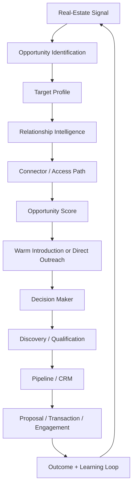
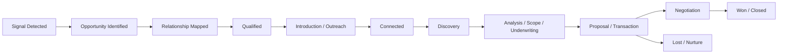
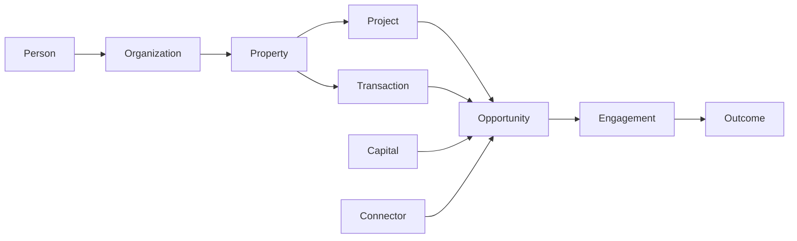
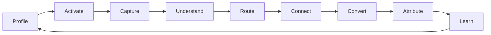
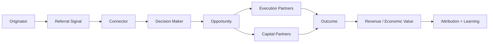

# 📡 The Opportunity Radar

> Mirrored from Notion page `3cc9e94cf0a48107ab89d2357628dfae` on 2026-09-07. Source: https://app.notion.com/p/3cc9e94cf0a48107ab89d2357628dfae?pvs=204

{"type":"emoji","emoji":"📡"}

> 
	**The Opportunity Radar** is a vendor-neutral, real-estate opportunity intelligence framework for discovering, qualifying, and converting opportunities by combining market signals, relationship intelligence, connector networks, structured scoring, outreach, and a learning loop.
	Core principle: **Signal → opportunity → connector → relationship path → decision maker → engagement → outcome → learning loop.**

# 1. Purpose
The Opportunity Radar is designed for real-estate businesses that want to identify opportunities earlier and convert them through the right relationships rather than relying only on inbound leads, bid invitations, or broad cold outreach.
It can be adapted to developers, contractors, mortgage and capital advisors, commercial brokers, property managers, investors, asset managers, consultants, and other real-estate operators.
The framework asks:
- What market, property, project, transaction, financing, or operational signal has appeared?
- What real-estate opportunity does that signal imply?
- Which people and organizations influence that opportunity?
- Who can provide a trusted introduction?
- What is the right reason to engage now?
- What outcome resulted, and what should the system learn from it?
# 2. Core Operating Method

**Operating sequence:**
1. Detect a relevant real-estate signal.
2. Identify the property, project, transaction, company, owner, developer, manager, broker, consultant, lender, investor, or other entity connected to it.
3. Determine the most relevant connector class.
4. Map existing relationships and potential warm-introduction paths.
5. Research only qualified targets.
6. Enrich contact or company data only when additional information is required.
7. Calculate Opportunity and Connector scores.
8. Create or update the opportunity in the chosen CRM or operating system.
9. Execute outreach tied to the specific trigger.
10. Record the outcome and feed it into the learning loop.
# 3. Vendor-Neutral Architecture
The Opportunity Radar is a **business method, not a software stack**.
Any implementation may use different providers for each capability:

Capability
Purpose

Signal Intelligence
Detect property, permit, transaction, financing, ownership, leasing, development, or operational events.

Relationship Intelligence
Discover people, companies, mutual relationships, warm paths, and network strength.

Research / Enrichment
Build qualified person, company, property, or project profiles.

Reasoning / Agent Layer
Interpret signals, score opportunities, determine next actions, and orchestrate workflows.

CRM / Pipeline
Track relationships, opportunities, stages, tasks, meetings, and outcomes.

Canonical Data Store
Maintain durable records for people, firms, properties, projects, relationships, and outcomes.

Analytics
Measure conversion, connector value, signal quality, revenue attribution, and learning.

Communications
Execute permissioned email, phone, messaging, social, or other outreach.

**Design rule:** software vendors should remain replaceable. The enduring asset is the real-estate data model, relationship graph, scoring logic, operating workflow, and accumulated outcomes.
# 4. Real-Estate Connector Network
The Opportunity Radar should support multiple connector classes because different relationships reveal different types of opportunities.

Connector Class
Primary Opportunity
Typical Trigger

Architects
Development, renovation, redevelopment, preconstruction
Development application, rezoning, design appointment, permit activity

Property Managers
Repairs, maintenance, capital improvements, turnovers, portfolio services
Budget cycle, deferred maintenance, tenant turnover, management change

Commercial Realtors
Acquisitions, dispositions, leasing, tenant improvements, redevelopment
Sale, lease, acquisition, new tenant, vacancy, repositioning

Strata / Community Managers
Common-area projects, remediation, upgrades
Depreciation study, reserve-fund project, AGM decision, building issue

Civil / Structural / MEP Engineers
Site works, servicing, remediation, development
Feasibility, design engagement, permit activity, technical issue

Developers / Owners
Direct development, renovation, acquisition, repositioning
Land acquisition, approvals, financing, budgeting

Asset Managers
Capital programs, portfolio repositioning, operating improvements
Asset-plan update, acquisition, refinancing, underperformance

Commercial Lenders / Mortgage Professionals
Acquisition, refinance, construction, renovation, redevelopment
Financing request, maturity, refinance, construction loan

Investors / Capital Partners
Equity, debt, JV, co-investment
Capital raise, acquisition, development, recapitalization

Owner's Representatives / Project Managers
Procurement, project formation, contractor or consultant selection
Scope development, tender, project launch

Lawyers / Planners / Entitlement Consultants
Development and transaction intelligence
Rezoning, entitlement, acquisition, restructuring

Insurance / Risk Professionals
Repair, restoration, risk mitigation
Loss event, claim, inspection, renewal requirement

# 5. Signal Layer — Why Now?
The signal layer answers **why should we investigate this opportunity now?**
## Development Signals
- Rezoning or entitlement activity
- Development application
- Building permit
- Land acquisition
- Design-team appointment
- Construction financing
- Public project announcement
- Tender / procurement activity
- New development partnership
## Property / Asset Signals
- Deferred maintenance
- Capital plan or reserve study
- Building-system replacement
- Renovation requirement
- Management change
- Portfolio acquisition
- Insurance loss or remediation need
- Asset underperformance
## Transaction Signals
- New listing
- Sale or acquisition
- Lease signing
- Tenant relocation
- Vacancy
- Change of use
- Repositioning
- Refinancing
- Loan maturity
## Capital Signals
- Equity raise
- Debt requirement
- Refinance
- Maturity wall
- Recapitalization
- Distress
- Partnership formation
# 6. Opportunity Scoring
A generic scoring model can be adapted to any real-estate business.

Factor
Suggested Weight

Opportunity / service fit
20%

Economic value
20%

Timing / urgency
15%

Decision-maker accessibility
10%

Relationship strength
10%

Strategic / recurring value
10%

Warm-introduction strength
5%

Signal confidence
5%

Geographic / mandate fit
5%

**Opportunity Score = weighted assessment of fit, value, timing, access, relationship, and confidence.**
# 7. Connector Scoring
Connector scores measure the economic and strategic value of a relationship rather than simply counting contacts.
## Architect Connector
- Relevant project volume
- Developer / owner access
- Asset-class fit
- Geography
- Current project signals
- Relationship strength
- Introduction strength
- Recent engagement
## Property Manager Connector
- Portfolio size
- Asset types
- Recurring work potential
- Capital program exposure
- Decision authority
- Relationship strength
- Current trigger
## Commercial Realtor Connector
- Transaction volume
- Owner / landlord / developer network
- Asset-class relevance
- Geography
- Leasing / redevelopment exposure
- Relationship strength
- Recent transactions
## Capital Connector
- Capital type
- Check size / lending capacity
- Asset-class fit
- Geography
- Investment / lending history
- Relationship strength
- Introduction strength
- Recent engagement
# 8. Standard Opportunity Record
```plain text
OPPORTUNITY

Signal:
What changed?

Property / Project / Transaction:
What is the real-estate event?

Opportunity Type:
Development / Construction / Property Management / Brokerage / Financing / Capital / Advisory / Other

Target Organization:
Company / owner / developer / investor / manager / tenant

Decision Maker:
Name + role

Connector:
Name + role + company

Connector Class:
Architect / Property Manager / Realtor / Lender / Investor / etc.

Opportunity Score:
0–100

Relationship Path:
Originator → Connector → Decision Maker

Intro Strength:
1–5

Reason to Engage Now:
Specific trigger

Recommended Action:
Introduction / call / meeting / site visit / underwriting / proposal

Expected Outcome:
Specific commercial objective
```
# 9. Outreach Principle
The Opportunity Radar is not designed around generic messages such as **"Do you have any work for us?"**
Outreach should be tied to a current real-estate event and a useful business outcome.
Examples:
- Provide early budgeting or feasibility input
- Solve a property or building problem
- Support acquisition due diligence
- Assist with financing or capital planning
- Evaluate redevelopment potential
- Prepare a tenant-improvement or renovation scope
- Introduce relevant capital, consultants, contractors, operators, or buyers
- Provide market or transaction intelligence
# 10. Generic Pipeline

# 11. Real-Estate Opportunity Graph
The durable competitive asset is the graph connecting people, companies, properties, projects, transactions, capital, and outcomes.

The graph should eventually reveal:
- Super-connectors
- Highest-value organizations
- Most productive relationship paths
- Network gaps
- Relationship bottlenecks
- Highest-converting signal types
- Highest-value properties, markets, and asset classes
- Best timing for engagement
- Recurring opportunity patterns
# 12. Connector Economic Value
A useful strategic metric is:
**Connector Economic Value = Relevant Opportunity Volume × Average Opportunity Value × Introduction Probability × Conversion Probability**
This prioritizes relationships according to expected economic influence rather than contact volume.
# 13. Learning Loop
```plain text
Signal
  ↓
Opportunity
  ↓
Connector
  ↓
Introduction / Outreach
  ↓
Conversation
  ↓
Qualified Engagement
  ↓
Proposal / Transaction
  ↓
Won / Lost / Nurture
  ↓
Economic Outcome
  ↓
Update Scores + Targeting Rules
```
The analytics layer should eventually answer:
- Which signal types produce the highest-value opportunities?
- Which connector classes create the most revenue?
- Which relationship paths convert most frequently?
- Which asset classes are most attractive?
- Which geographies are producing the best opportunities?
- What is the average time from signal to outcome?
- Which opportunities should be investigated earlier?
- Which relationships are underutilized?
- What is the expected economic value of each connector?
# 14. Agent / Automation Layer
An optional agent layer can translate business-level questions into research, relationship mapping, scoring, CRM actions, and recommended next steps.
Example commands:
> **Find the strongest relationship paths into this property owner.**
> **Find property managers whose portfolios match our target profile.**
> **Which commercial real-estate transactions this month may create downstream opportunities?**
> **Build the relationship map for this development.**
> **Show the 20 relationships most likely to produce a real-estate opportunity in the next 90 days.**
> **Find financing, construction, leasing, or capital opportunities associated with this property.**
The implementation may use any compatible AI agent, workflow engine, relationship platform, CRM, database, analytics platform, or communications provider.
# 15. Exception-Based Opportunity Intelligence
A recurring operating loop can evaluate:
```plain text
New property signals
New development signals
New transaction signals
New financing / capital signals
New relationships
Relationship changes
Recent engagement
Stale high-value relationships
Dormant opportunities resurfacing
        ↓
Evaluate relevance + economic value
        ↓
Create an action only when warranted
```
The goal is **exception-based business development** rather than indiscriminate alerts and reminders.
# 16. Implementation Principles
1. **Vendor neutral** — capabilities matter more than specific applications.
2. **Real-estate native** — the core entities are people, firms, properties, projects, transactions, capital, relationships, and outcomes.
3. **Signal first** — investigate because something meaningful changed.
4. **Relationships before enrichment** — determine access before purchasing or gathering unnecessary data.
5. **Progressive research** — deepen research only as opportunity confidence rises.
6. **One canonical data model** — avoid fragmented systems of record.
7. **Outcome attribution** — connect revenue and closed outcomes back to signals and connectors.
8. **Learning loop** — every outcome improves future scoring and prioritization.
9. **Human governance** — important outreach, underwriting, legal, financial, and transaction decisions remain subject to appropriate human review.
10. **Portable business logic** — scoring rules, target profiles, workflows, and graph models should survive any future technology change.
# 17. Framework Summary
**The Opportunity Radar = Real-Estate Signals + Relationship Intelligence + Connector Networks + Opportunity Scoring + Pipeline Execution + Outcome Learning.**
The framework can support construction, development, property management, brokerage, mortgage origination, capital raising, asset management, investment sourcing, leasing, redevelopment, and other real-estate opportunity workflows without depending on a particular vendor or software ecosystem.
# 18. Network Seeding Protocol — Professional Relationship Platforms
A professional relationship network is the practical starting point for the Opportunity Radar because relationship intelligence becomes more useful once there is a credible base of first-degree connections, professional identities, firms, and role history.
LinkedIn is a strong example of such a platform, but the framework should remain vendor neutral. Any professional network, industry association directory, CRM contact base, alumni network, brokerage network, trade group, or relationship database can serve as a network source.
## 18.1 Objective
The purpose of network seeding is **not** to maximize connection count. It is to create a high-quality initial relationship graph around the real-estate ecosystem the operator wants to access.
The first network should prioritize people who can repeatedly expose downstream opportunities, not only people who may become immediate customers.
## 18.2 Initial Connector Mix
A useful first 100-connection model is:

Connector Type
Initial Target

Commercial Realtors / Brokers
20

Property Managers / Asset Managers
20

Architects
15

Developers / Owners
15

Commercial Mortgage / Lending Professionals
10

Engineers / Technical Consultants
5

General Contractors / Construction Executives
5

Real Estate Lawyers / Planners
5

Investors / Private Capital
5

This mix should be adapted to the operator's geography, asset class, service offering, and mandate.
## 18.3 Target Titles
Prioritize roles with decision authority, client access, or repeat project exposure.
**Commercial Brokerage**
- Managing Director
- Vice President
- Investment Sales
- Leasing
- Industrial Broker
- Multifamily Broker
- Development Land Broker
**Property / Asset Management**
- President
- Regional Manager
- Senior Property Manager
- Asset Manager
- Director of Property Management
- Director of Operations
**Architecture / Design**
- Principal
- Partner
- Managing Principal
- Director
- Project Architect
- Business Development Director
**Development / Ownership**
- Founder
- President
- VP Development
- Director of Development
- Development Manager
- Acquisitions Director
**Capital / Lending**
- Commercial Mortgage Broker
- Relationship Manager
- Commercial Banker
- Private Lender
- Debt Fund Principal
- Investment Director
## 18.4 Profile Positioning
The profile used to seed the network should communicate a clear reason for relevant real-estate professionals to connect.
A suitable positioning pattern is:
> **Real Estate Opportunity Development \| Commercial Property \| Construction \| Development \| Capital \| Strategic Partnerships**
The profile should make it clear that the operator works across real-estate opportunities and relationship development rather than appearing to be a generic lead-generation account.
A simple positioning statement can explain that the operator helps identify opportunities early and connect the right owners, developers, brokers, managers, consultants, operators, lenders, and capital partners around them.
## 18.5 Connection Strategy
The first interaction should establish professional relevance, not ask for business.
The desired progression is:
```plain text
Relevant Professional
   ↓
Connection
   ↓
Relationship Context
   ↓
Mutual Network Visibility
   ↓
Signal Appears
   ↓
Opportunity Radar Evaluates Fit
   ↓
Warm Introduction / Relevant Conversation
```
The network should be built gradually and selectively. Avoid indiscriminate mass connection activity because it reduces network quality and can create platform-risk or account-quality issues.
## 18.6 Three-Wave Network Build
**Wave 1 — Core Seed Network**
- Build the first 100 high-relevance relationships.
- Prioritize target connector classes.
- Establish geographic and asset-class relevance.
**Wave 2 — Connector Expansion**
- Expand through second-degree relationships around the strongest connectors.
- Prioritize people connected to multiple relevant firms, owners, developments, portfolios, or transactions.
- Begin scoring connector value.
**Wave 3 — Signal-Driven Growth**
- Let opportunity signals determine who should be added next.
- Add people because they are connected to a specific property, project, transaction, financing event, portfolio, or development signal.
- Shift from manual networking toward agent-assisted relationship intelligence.
## 18.7 Network Quality Metrics
Useful network metrics include:
- Percentage of connections within target connector classes
- Percentage within target geography
- Percentage with decision authority or direct owner/client access
- Number of second-degree paths into target organizations
- Number of active opportunities connected to seeded relationships
- Connector Economic Value
- Introductions generated
- Meetings generated
- Qualified opportunities generated
- Closed revenue attributable to the network
## 18.8 Transition to Relationship Intelligence
Once the network has sufficient density, the Opportunity Radar should stop thinking primarily in terms of adding contacts and instead ask:
- Who already knows this target?
- Which connector provides the strongest path?
- What property, project, transaction, or financing event makes the relationship relevant now?
- Which relationship is underused?
- Which connector repeatedly produces valuable introductions?
- Which network gap should be filled next?
At that stage, professional relationship platforms become **identity and access sources**, while the Opportunity Radar remains the business logic that decides where to focus.
## 18.9 Design Rule
**Network first, signal second, relationship path third, enrichment last.**
The system should avoid building large unqualified contact databases. It should progressively deepen the relationship graph as evidence of opportunity increases.
# 19. Opportunity & Referral Intelligence Engine
> 
	The **Opportunity & Referral Intelligence Engine** adds a deliberate referral-activation layer to the Opportunity Radar. It converts customers, partners, connectors, and trusted relationships into a distributed opportunity-sensing network.
	Core principle: **Do not teach partners everything the business does. Teach them what to notice, when to refer, and how to make the introduction easy.**

## 19.1 Operating Model

The engine combines four operating loops:
1. **Referral Activation** — Profile → Motivate → Ask → Equip
2. **Opportunity Radar** — Capture → Enrich → Score → Classify
3. **Relationship Engine** — Find → Connect → Introduce → Nurture
4. **Commercial Loop** — Route → Convert → Attribute → Reward → Learn
## 19.2 Referrer Profiler
Referral programs should not be designed for everyone. Identify the small number of personas most likely to produce relevant introductions.
For each persona, capture:
- Referrer persona
- Typical role / organization
- Network reach
- Opportunity visibility
- Primary motivation
- Expected referral frequency
- Average opportunity quality
- Relationship strength
- Preferred introduction channel
- Referral potential score: 1–10
Common real-estate referrer personas include:
- Commercial Realtors
- Property managers
- Mortgage professionals and commercial lenders
- Architects and engineers
- Contractors and builders
- Attorneys, planners, and entitlement consultants
- CPAs / accountants
- Asset managers
- Owners and developers
- Capital connectors and investors
## 19.3 Motivation & Incentive Engine
Not every referral relationship should use a cash reward. Select the incentive based on persona motivation and unit economics.
Potential motivations:
- Reciprocal referrals
- Professional reputation
- Status / preferred-partner recognition
- Access to opportunities
- Co-marketing
- Exclusive intelligence or research
- Client service enhancement
- Financial referral fee where lawful and appropriate
- Charitable contribution
- Milestone / performance recognition
**Design rule:** financial incentives must comply with applicable licensing, securities, mortgage, brokerage, legal, professional, anti-kickback, and disclosure requirements. Where compensation is restricted, use compliant non-financial value creation instead.
## 19.4 Referral Trigger Engine
A referral request should occur at a meaningful moment instead of through generic periodic asking.
High-value trigger moments include:
1. Immediately after a successful transaction or engagement.
2. After solving a difficult or high-value problem.
3. After receiving strong positive feedback.
4. After providing a valuable introduction or insight to the partner.
5. When relationship intelligence indicates strong engagement and trust.
Each trigger should define:
- Trigger event
- Referrer persona
- Channel
- Message / ask
- Expected referral type
- Follow-up interval
- Owner
- Attribution code or relationship path
## 19.5 Referrer Toolkit
Priority referrers should receive a low-friction toolkit that makes it easy to recognize and introduce opportunities.
Toolkit components:
- 20-second explanation of the business
- "What a good opportunity looks like" checklist
- Observable trigger list
- Email introduction template
- LinkedIn / direct-message introduction template
- Referral form or intake link
- One-page capability sheet
- Frequently asked questions
- Qualification guidelines
- Named contact / owner for handoff
## 19.6 Teach Partners What to Notice
The strongest referral instruction is not **"Do you know anyone who needs us?"** It is **"When you see X, send it to us."**
### Property Manager Triggers
**Call us when:**
- An owner is becoming tired of managing the asset.
- Significant deferred maintenance appears.
- Refinancing becomes difficult.
- Occupancy or NOI deteriorates.
- Ownership begins discussing a sale.
- The property has unused land, parking, or density potential.
- Major renovations or capital replacements are approaching.
### Commercial Realtor Triggers
**Call us when:**
- A parcel is difficult to sell conventionally.
- An owner may consider a joint venture rather than a sale.
- Zoning or density may create hidden development value.
- A project has stalled.
- A buyer requires development expertise.
- A seller needs a creative capital structure.
- An off-market ownership transition appears likely.
### Lender / Mortgage Professional Triggers
**Call us when:**
- A good project does not fit conventional credit policy.
- Sponsor equity is insufficient.
- Construction financing needs restructuring.
- A borrower requires subordinate or preferred capital.
- Refinancing requires an equity or JV partner.
- A maturity event may force recapitalization or sale.
### Architect / Engineer Triggers
**Call us when:**
- A client has land but lacks a development execution plan.
- Feasibility reveals redevelopment potential.
- A project requires construction, financing, or operating partners.
- Approvals are advancing but the capital or execution team is incomplete.
- A stalled project requires a new sponsor, builder, investor, or strategy.
## 19.7 Structured Referral Capture
Every inbound referral should be converted into a structured opportunity signal.
```plain text
REFERRAL SIGNAL

Referrer:
Name / Company / Role

Referrer Persona:
Realtor / Property Manager / Lender / Architect / Investor / etc.

Person / Company Referred:

Property / Project:

Observed Trigger:
What did the referrer notice?

Evidence:
What supports the signal?

Likely Need:
Development / Construction / Sale / Refinance / Capital / JV / Renovation / Other

Urgency:
Low / Medium / High / Immediate

Relationship Path:
Originator → Referrer → Decision Maker

Consent / Introduction Status:
Permission requested / Warm intro available / Direct outreach appropriate
```
## 19.8 Opportunity Intelligence Handoff
Once a referral is captured, the existing Opportunity Radar takes over:
```plain text
Referral Signal
  ↓
Entity Resolution
  ↓
Property / Company / Person Research
  ↓
Opportunity Classification
  ↓
Opportunity Score
  ↓
Routing Thesis
  ↓
Relationship Path
  ↓
CRM Opportunity
```
Possible routing theses:
- Acquire
- Sell
- Develop
- Renovate
- Reposition
- Refinance
- Raise capital
- Form a joint venture
- Add a co-sponsor
- Introduce a specialist
- Nurture / monitor
## 19.9 Relationship Path Before Cold Outreach
Preferred access sequence:
```plain text
Direct Relationship
  ↓
Referral Partner
  ↓
Warm Introduction
  ↓
Relationship-Graph / Mutual-Connection Path
  ↓
Permissioned Direct Outreach
```
The system should preserve the originator and introduction chain so relationship value and revenue can be attributed correctly.
## 19.10 Partner & Capability Matching
After the opportunity is understood, identify which capabilities are required.
Possible matches include:
- Developer / operator
- Lender
- Equity investor
- Preferred-equity provider
- Co-sponsor / GP
- Architect
- Engineer
- General contractor
- Specialty contractor
- Commercial broker
- Property manager
- Attorney
- Planner / entitlement specialist
- Appraiser / consultant
- Buyer / seller
The system should distinguish between the **opportunity originator**, **connector**, **decision maker**, **execution partner**, and **capital provider**.
## 19.11 Attribution & Referral Graph
Track the complete graph rather than a single "lead source" field.

Measure:
- Referrals per partner
- Qualified-opportunity rate
- Referral-to-meeting rate
- Referral-to-deal conversion
- Average opportunity value
- Attributed revenue
- Time from signal to opportunity
- Time from referral to first engagement
- Introduction acceptance rate
- Relationship strength
- Partner lifetime value
- Downstream referral-tree value
- Opportunity value by trigger type
## 19.12 Referrer Economic Value
A useful expanded metric is:
**Referrer Economic Value = Referral Frequency × Qualified Opportunity Rate × Average Opportunity Value × Conversion Probability × Attribution Factor**
This can be supplemented with a strategic score for access, reputation, recurrence, and network reach.
## 19.13 Example — Development Opportunity
A commercial Realtor learns that an owner controls a 7-acre parcel but does not want to sell outright.
```plain text
Observed Signal: Owner open to alternatives to an outright disposition
  ↓
Referral Capture: Realtor submits owner + parcel + context
  ↓
Research: Ownership, zoning, density, market, development feasibility
  ↓
Classification: Land + JV Development
  ↓
Routing Thesis: Sponsor / development JV
  ↓
Relationship Path: Realtor → Owner
  ↓
Opportunity Workspace: Create CRM opportunity
  ↓
Capability Match: Developer + architect + capital + lender
  ↓
Engagement / Underwriting
  ↓
Outcome
  ↓
Attribute value to originating Realtor and relationship path
```
The Realtor does not need to understand development finance. The partner only needs to recognize the trigger and make a trusted handoff.
## 19.14 AI / Agent Responsibilities
An agent implementing this framework may:
- Identify likely referrer personas from CRM history.
- Detect referral-trigger moments.
- Recommend the best ask and channel.
- Generate personalized referral toolkit material.
- Interpret inbound referral signals.
- Resolve people, company, property, and project entities.
- Score referrals and opportunities.
- Search the relationship graph for introduction paths.
- Recommend a routing thesis.
- Match execution and capital partners.
- Create/update CRM opportunities.
- Monitor follow-ups and stale referrals.
- Attribute outcomes to originators and connectors.
- Update referral and opportunity scoring from closed-loop results.
Important introductions, outreach, compensation, underwriting, legal, securities, mortgage, and transaction decisions remain subject to human review.
## 19.15 30-Day Referral Activation Sprint
### Week 1 — Profile
- Identify top 3 referrer personas.
- Select one priority persona.
- Analyze historical referrals and outcomes.
- Define 5–10 observable triggers.
- Establish baseline referral metrics.
### Week 2 — Equip
- Create referral positioning.
- Create introduction scripts.
- Build the opportunity checklist.
- Create referral intake.
- Define compliant incentive / reciprocity model.
### Week 3 — Activate
- Select the first 10–25 priority relationships.
- Trigger personalized asks at appropriate moments.
- Record responses and introductions.
- Route each referral into the Opportunity Radar.
### Week 4 — Learn
- Review referral volume and quality.
- Review partner engagement.
- Measure conversions and opportunity value.
- Improve triggers, scripts, routing, and scoring.
- Expand only after the first persona works consistently.
## 19.16 Framework Summary
**Referral activation:** Profile → Motivate → Ask → Equip
**Opportunity intelligence:** Capture → Enrich → Score → Classify
**Relationship intelligence:** Find → Connect → Introduce → Nurture
**Commercial intelligence:** Route → Convert → Attribute → Reward → Learn
Combined operating sequence:
**PROFILE → ACTIVATE → CAPTURE → UNDERSTAND → ROUTE → CONNECT → CONVERT → ATTRIBUTE → LEARN**
The result is a vendor-neutral **Opportunity & Referral Intelligence Engine** that turns trusted relationships into distributed market sensors while preserving structured qualification, relationship paths, economic attribution, and continuous learning.