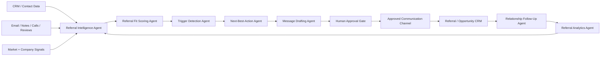

# 🤝 SOP — AI Referral Engine Agents (B2B + Customer-to-Business)

> Mirrored from Notion page `3c29e94cf0a4812db3ccc93d0edebd47` on 2026-09-07. Source: https://app.notion.com/p/3c29e94cf0a4812db3ccc93d0edebd47?pvs=204

{"type":"emoji","emoji":"🤝"}

> 
	**Purpose:** Build Hermes Agents or other AI agents that identify, qualify, activate, manage, and measure professional B2B and customer-to-business referral opportunities without turning referral relationships into spam or automated solicitation.

## 1. Outcome
The system should create a repeatable referral engine that can:
- Identify high-fit referral sources.
- Detect referral-ready moments and observable trigger events.
- Match the right referral source to the right client problem.
- Draft highly specific outreach and warm-introduction messages.
- Maintain partner/customer relationships over time.
- Track referrals, opportunities, revenue, reciprocity, and partner productivity.
- Recommend the next best action to a human operator.
- Learn which referral sources and triggers consistently generate qualified opportunities.
The agent system should optimize for **qualified introductions and trust**, not raw outreach volume.
## 2. Supported Referral Modes
### Mode A — Professional B2B Referral Engine
Referral sources may include accountants, lawyers, mortgage professionals, bankers, commercial realtors, consultants, wealth advisors, insurance advisors, developers, contractors, associations, vendors, and strategic partners.
Core logic:
**Partner Fit → Trust → Trigger Recognition → Warm Introduction → Opportunity Handling → Feedback → Reciprocity → Strategic Partnership**
### Mode B — Customer-to-Business Referral Engine
Referral sources are existing or former customers who have experienced a positive outcome and may know another suitable buyer.
Core logic:
**Success Event → Referral Readiness → Trigger → Specific Referral Persona → Ask → Introduction → Follow-Up → Thank You → Repeat**
### Mode C — Hybrid Ecosystem
A mature implementation should allow both systems to coexist. A single contact can potentially be a customer, professional partner, investor, vendor, or strategic connector. The CRM must therefore store **relationship roles separately from the person record**.
## 3. Design Principle — Own the Trigger
Agents should never teach a referral source everything the business does.
They should teach the source to remember a small number of client situations.
Target outcome:
> **When X happens, think of us.**
Examples:
- "The bank approved part of the deal, but not enough."
- "We're purchasing another commercial property."
- "The legal transaction is ready but financing is incomplete."
- "Our client wants to expand but lacks sufficient capital."
- "This deal falls outside our normal lender box."
- "We need a specialist for a problem outside our core service."
## 4. Recommended Agent Architecture

### Recommended Functional Agents
1. **Referral Intelligence Agent** — researches and enriches potential referral sources.
2. **Partner Fit Agent** — scores professional partners.
3. **Customer Referral Readiness Agent** — scores customers for referral readiness.
4. **Trigger Detection Agent** — monitors notes, CRM events, emails, reviews, and business signals for referral moments.
5. **Problem-to-Partner Matching Agent** — determines which partner category is most likely to encounter or solve a particular client problem.
6. **Next-Best-Action Agent** — recommends whether to connect, nurture, ask, follow up, thank, re-engage, or deprioritize.
7. **Referral Copy Agent** — creates channel-specific drafts.
8. **Relationship Steward Agent** — maintains cadence and prevents over-contact.
9. **Referral Analytics Agent** — measures conversion, revenue, and network productivity.
10. **Orchestrator / Hermes Supervisor** — coordinates all sub-agents and applies policy/approval rules.
For an MVP, combine functions 1–5 into one **Referral Intelligence Agent**, functions 6–8 into one **Referral Engagement Agent**, and retain one **Analytics Agent** plus the Hermes supervisor.
## 5. Core Data Model
### Contact
- Contact ID
- Name
- Company
- Title
- Email
- Phone
- LinkedIn
- Geography
- Industry
- Relationship owner
- Relationship roles
### Referral Source Profile
- Source type: Professional / Customer / Strategic Connector
- Professional category
- Partner tier
- ICP overlap
- Relationship strength
- Trust score
- Partner Fit Score
- Customer Referral Readiness Score
- Client/customer base description
- Referral triggers
- Problems they commonly encounter
- Problems we can refer back to them
- Preferred introduction method
- Last interaction
- Next relationship action
- Compliance notes
### Referral Opportunity
- Referrer
- Referred prospect
- Referral persona
- Referral trigger
- Introduction date
- Opportunity owner
- Status
- Estimated value
- Qualified value
- Outcome
- Revenue generated
- Referrer thanked
- Reward/compensation if applicable
- Next follow-up
## 6. Professional Partner Fit Score
Score each factor from 1–10:
- ICP overlap
- Access to relevant decision-makers
- Client influence
- Referral-frequency potential
- Relationship strength
- Reputation
- Complementary service fit
- Ability to recognize referral triggers
- Reciprocity potential
Recommended classifications:
- **8.0–10:** Strategic Partner Candidate
- **6.0–7.9:** Active Referral Partner Candidate
- **4.0–5.9:** Network Relationship
- **Below 4.0:** Low Priority
Do not let the AI automatically downgrade a human-designated strategic relationship solely because quantitative activity is temporarily low.
## 7. Customer Referral Readiness Score
Score customers using:
- Satisfaction
- Measurable result achieved
- Unsolicited praise/testimonial
- Relationship strength
- Trust
- Frequency of interaction
- Network relevance
- Likelihood they know similar buyers
- Recency of positive outcome
Recommended default referral-ask threshold: **7.5/10**, subject to business-specific tuning.
An agent should prefer a recent observable success event over generic historical satisfaction.
## 8. Trigger Detection Rules
The Trigger Detection Agent should continuously evaluate CRM activity and available communication data.
### High-Signal Customer Triggers
- Positive review received
- Customer reports a measurable result
- Renewal or repeat purchase
- Upgrade
- Unsolicited compliment
- Successful closing/completion
- Customer introduces someone spontaneously
### High-Signal Professional B2B Triggers
- Partner mentions a client issue matching our service
- Partner asks for advice outside their specialty
- Client transaction is stalled by a problem we solve
- Bank/lender decline or credit-box mismatch
- Commercial acquisition or expansion
- Business acquisition or succession
- Development or project-capital requirement
- Client liquidity or investment event
### Negative / Suppression Triggers
Do not recommend an ask when:
- Complaint is unresolved
- Project is late or under dispute
- Customer has not received a meaningful outcome
- Professional relationship is new and untested
- Recent communication indicates frustration
- Consent/communication restrictions exist
- Regulatory or professional rules make the proposed arrangement questionable
## 9. Client Problem Matrix
The AI should maintain a searchable matrix:

Client Problem
Likely Referral Source
Observable Trigger
Our Response

Commercial financing gap
CPA, realtor, lawyer, banker, broker
Transaction cannot close under current financing
Financing/capital review

Tax or accounting requirement
Our client network
Tax, reporting, restructuring question
Refer to CPA/accountant

Legal structure / transaction issue
Our client network
Agreement, structure, closing or dispute issue
Refer to lawyer

Property acquisition
Business owners / investors
Client needs property search or representation
Refer to commercial realtor

Capital / investment opportunity
Wealth advisors, family offices, investors
Liquidity event or portfolio allocation
Human-reviewed opportunity discussion

The matrix should be expanded for each client vertical.
## 10. Agent Operating Workflow — B2B
### Step 1 — Discover
Agent identifies professional referral candidates from approved sources.
Output:
- Contact
- Profession
- Firm
- ICP overlap
- Reason they may encounter our target client
- Preliminary Fit Score
- Evidence/source
### Step 2 — Qualify
Agent determines:
- What clients they serve
- Which client problems they encounter
- Whether services complement ours
- Possible conflicts
- Potential reciprocity
- Recommended relationship tier
### Step 3 — Recommend Outreach
The agent recommends a relationship-first approach.
Forbidden default framing:
> "Can you send me referrals?"
Preferred framing:
> "We serve similar clients from different angles. I would like to understand the situations where our work overlaps and where we may be useful to each other's clients."
### Step 4 — Human Approval
Before first-contact outreach, a human approves:
- Target
- Reason for outreach
- Personalization facts
- Communication channel
- Draft
### Step 5 — Relationship Discovery
After a meeting or reply, the AI converts notes into:
- Ideal client
- Referral triggers
- Problems they solve
- Problems we solve
- Referral-back opportunities
- Preferred introduction process
- Follow-up cadence
### Step 6 — Activate
Partner becomes "Activated" only when the agent can answer:
1. Who do they serve?
2. What should make them think of us?
3. What should make us think of them?
4. How should an introduction occur?
5. Who owns the relationship?
### Step 7 — Referral Processing
When a referral arrives:
- Create opportunity
- Link referrer
- Capture trigger
- Assign owner
- Acknowledge introduction
- Start SLA timer
- Record outcome
- Trigger partner feedback/thank-you workflow
### Step 8 — Steward Relationship
Agent recommends meaningful touches based on context, not arbitrary frequency.
Examples:
- Send useful market intelligence
- Congratulate milestone
- Refer a relevant opportunity
- Share an educational resource
- Invite to relevant event
- Revisit referral triggers
## 11. Agent Operating Workflow — Customer Referral
### Step 1 — Detect Success Event
The agent identifies a positive outcome.
### Step 2 — Calculate Referral Readiness
If score is below threshold, nurture rather than ask.
### Step 3 — Define Referral Persona
The AI must name a specific referral target.
Bad:
> "Anyone who needs our services."
Good:
> "Another owner of a 10–50 employee business who is expanding and finding that their bank will not provide enough capital."
### Step 4 — Draft the Ask
Draft must:
- Reference the success event
- Name the specific person/problem
- Explain why an introduction may help
- Make the introduction easy
- Avoid pressure
### Step 5 — Human Approval or Approved Automation Policy
First implementation should use human approval. Mature implementations may auto-send only low-risk, pre-approved customer communications that meet explicit policy rules.
### Step 6 — Process Introduction
Create linked referral opportunity and maintain attribution to the customer.
### Step 7 — Thank and Close the Loop
Thank the referrer regardless of whether the opportunity closes, subject to communication preferences.
## 12. Hermes Supervisor Prompt
```plain text
You are the Referral Engine Supervisor.

Your objective is to generate qualified, trust-preserving referral relationships and introductions for this business.

You coordinate research, fit scoring, trigger detection, relationship management, referral messaging, CRM updates, and analytics.

Rules:
1. Optimize for qualified introductions, not outreach volume.
2. Never ask generically for "anyone who needs us." Define a specific referral persona or trigger.
3. Never invent relationship history, results, testimonials, mutual contacts, or personalization facts.
4. Professional referrals carry reputational risk. Protect the referring professional's relationship.
5. Do not automatically send first-contact outreach, referral asks, financial claims, regulated-service claims, compensation offers, or sensitive messages without explicit policy authorization or human approval.
6. Flag licensing, securities, mortgage, legal, privacy, anti-spam, referral-fee, or other compliance concerns for human review.
7. Respect opt-outs and channel preferences.
8. Record every meaningful action and source in the CRM.
9. Prefer a useful relationship touch over an unnecessary follow-up.
10. Before recommending an ask, explain the evidence that the source is referral-ready.

For each recommended action output:
- Contact/referral source
- Relationship type
- Fit/readiness score
- Trigger/evidence
- Recommended action
- Draft message if appropriate
- Risk/compliance flags
- Required human approval
- CRM update
- Next review date
```
## 13. Referral Engagement Agent Prompt
```plain text
You are a Referral Engagement Agent.

Given a referral-source profile, relationship history, CRM notes, trigger events, and business ICP:

1. Determine whether the person should be nurtured, activated, asked for an introduction, thanked, re-engaged, or deprioritized.
2. Identify the exact trigger supporting the recommendation.
3. Define the exact type of person they could logically introduce.
4. Draft a concise message appropriate to the relationship and channel.
5. Never use generic referral language.
6. Never imply reciprocity, compensation, endorsement, exclusivity, or a business relationship unless supported by CRM evidence.
7. State whether human approval is required.
8. Propose the next CRM status and follow-up date.
```
## 14. Human-in-the-Loop Rules
### Mandatory Human Approval
- First outbound contact to a high-value professional
- Referral-fee or compensation discussions
- Investor/capital-raise introductions
- Mortgage or securities-related solicitation
- Claims about returns, rates, approvals, performance, or legal/tax outcomes
- Sensitive customer situations
- Complaints/disputes
- Messages sent under an executive's personal identity unless explicitly delegated
- Changes to strategic-partner status
### Potential Future Auto-Approval
After enough validated history, limited automation may be permitted for:
- CRM reminders
- Internal research
- Scoring
- Draft creation
- Thank-you drafts
- Low-risk follow-up reminders
- Internal relationship summaries
## 15. CRM Stages — Professional Referral Partners
**Prospect → Qualified → Meeting Scheduled → Trigger Aligned → Activated → First Referral → Productive → Strategic → Dormant**
Agent rules:
- Never mark "Activated" merely because a contact replied.
- "Productive" requires at least one qualified introduction within the defined measurement window.
- "Strategic" requires strong trust plus meaningful recurring value, not merely revenue.
## 16. CRM Stages — Customer Referrals
**Customer → Success Event → Referral Ready → Ask Approved → Ask Sent → Introduction Received → Opportunity → Outcome → Thanked**
## 17. Communication Guardrails
The system must:
- Respect consent and communication preferences.
- Avoid mass personalized-looking spam.
- Avoid scraping or using private information in a way that feels intrusive.
- Never fabricate why a person was selected.
- Avoid repeated referral asks to the same person without new context.
- Avoid manipulating customers based on private or sensitive information.
- Avoid claims that a partner "recommends" or "endorses" the business without evidence.
- Keep a clear audit trail of AI-generated drafts and human approvals.
## 18. Compliance Layer
Before using referral compensation or regulated services, define rules by business and jurisdiction.
Potential areas requiring review include:
- Mortgage brokerage referral rules
- Securities / capital-raising rules
- Real estate licensing
- Legal and accounting professional conduct rules
- Anti-spam / electronic messaging legislation
- Privacy and consent
- Referral fees and fee-sharing
- Investor accreditation and solicitation rules
The agent must **flag rather than interpret away** uncertain regulatory issues.
## 19. Referral Analytics
### Core Network Metrics
- Total qualified referral sources
- Active referral partners
- Referral-ready customers
- New sources activated
- Dormant sources
### Funnel Metrics
- Referral asks approved
- Referral asks sent
- Introductions received
- Qualified introductions
- Meetings booked
- Opportunities created
- Closed opportunities
### Financial Metrics
- Referral pipeline value
- Qualified pipeline value
- Revenue from referrals
- Revenue per active partner
- Average referred opportunity value
### Relationship Metrics
- Referrals received
- Referrals given
- Reciprocity ratio
- Partner response rate
- Time to respond to referred client
- Partner concentration risk
### Primary KPIs
1. **Active Productive Referral Sources**
2. **Qualified Opportunities per Active Referral Source**
3. **Revenue per Active Referral Source**
4. **Introduction-to-Opportunity Conversion Rate**
## 20. Agent Learning Loop
At least monthly, the Analytics Agent should identify:
- Which partner categories create the most qualified opportunities
- Which trigger phrases correlate with successful referrals
- Which customer success events produce introductions
- Which outreach messages produce meetings
- Which partners are becoming dormant
- Which relationships are over-contacted
- Which sources generate low-quality referrals
- Which referred opportunities close faster or at higher value
The AI may recommend changes, but business rules, compliance rules, compensation, and strategic relationship status remain human-controlled.
## 21. MVP Build Sequence
### Phase 1 — Intelligence Only
- Connect/read CRM
- Define ICP
- Create Client Problem Matrix
- Score referral sources
- Detect referral-ready contacts
- Produce weekly recommended-action report
No autonomous outreach.
### Phase 2 — Drafting + Human Approval
- Generate personalized drafts
- Create approval queue
- Human approves, edits, or rejects
- Store decision and outcome
### Phase 3 — CRM Automation
- Create/update referral opportunities automatically
- Set next actions
- Create reminders
- Track attribution and outcomes
### Phase 4 — Limited Agentic Engagement
Only automate pre-approved low-risk communications under documented rules.
### Phase 5 — Referral Intelligence Flywheel
Use historical referral outcomes to improve prioritization, trigger detection, and relationship recommendations.
## 22. Suggested Technical Stack
The SOP is platform-neutral. A Hermes implementation may use:
- **Hermes Agent:** orchestration and specialist agents
- **CRM:** Frappe CRM, Attio, or another system of record
- **Notion:** SOPs, partner playbooks, human-readable knowledge
- **Memory layer:** approved persistent agent memory
- **Workflow automation:** n8n or equivalent
- **Email / LinkedIn / communications:** approved connected tools and channels
- **Analytics:** CRM reporting, database queries, or BI layer
Principle: **CRM owns operational truth; Notion owns the SOP/knowledge; agent memory helps continuity but should not replace the system of record.**
## 23. Weekly Agent Run
Every week the Referral Engine should produce:
### A. Priority Referral Sources
Top professional partners and customers worth engaging.
### B. Why Now
Observable evidence supporting each recommendation.
### C. Recommended Action
One specific next action per source.
### D. Drafts Requiring Approval
Draft only where an action is justified.
### E. Dormant Partner Opportunities
High-fit relationships needing thoughtful re-engagement.
### F. Referral Outcomes
New introductions, pipeline value, wins/losses, and attribution.
### G. Risks
Over-contact, weak evidence, compliance issues, relationship conflicts, or data-quality problems.
## 24. Definition of Done
The MVP is operational when:
- [ ] ICP and referral personas are documented.
- [ ] B2B partner categories are defined.
- [ ] Customer referral readiness criteria are configured.
- [ ] Client Problem Matrix exists.
- [ ] CRM fields and stages are implemented.
- [ ] Referral-source scoring works.
- [ ] Trigger detection produces evidence-backed recommendations.
- [ ] Human approval queue exists.
- [ ] Approved drafts can be converted into communications through authorized channels.
- [ ] Referral opportunities retain attribution to the source.
- [ ] Weekly analytics report is generated.
- [ ] Compliance/opt-out rules are documented.
- [ ] Every action is logged.
## 25. North-Star Principle
> **The AI agent is not a referral spam bot. It is a relationship intelligence and orchestration system.**
Its job is to help humans recognize the right person, the right problem, the right moment, and the right introduction — then make sure no trusted relationship or qualified opportunity is lost through poor follow-up.