# 🧠 Executive Summary — KlickSmartAI.com + Klick2Client.com Agentic OS

> Mirrored from Notion page `3b59e94cf0a481099eebfd747a0ce2ad` on 2026-09-07. Source: https://app.notion.com/p/3b59e94cf0a481099eebfd747a0ce2ad?pvs=204

{"type":"emoji","emoji":"🧠"}

> 
	**Proposal:** Build a unified, multi-tenant Agentic Business Operating System for [**KlickSmartAI.com**](http://KlickSmartAI.com) and [**Klick2Client.com**](http://Klick2Client.com) that combines persistent business context, agent orchestration, signal intelligence, GTM execution, human approval, and continuous learning in one operating environment.

## Executive Summary
[KlickSmartAI.com](http://KlickSmartAI.com) and [Klick2Client.com](http://Klick2Client.com) should be developed as two tightly integrated layers of a single Agentic OS rather than as separate collections of AI tools.
[**KlickSmartAI.com**](http://KlickSmartAI.com) is the **agency/operator layer**. It is the internal operating company and agency environment used to design client GTM strategy, manage vertical playbooks, operate LeadSniperAI, run Hermes research and enrichment, oversee campaigns, manage service delivery, and monitor performance across client accounts.
[**Klick2Client.com**](http://Klick2Client.com) is the **client-facing service platform** delivered by KlickSmartAI to businesses. Each client receives a secure workspace built on Atomic CRM where signals, research, GTM recommendations, outreach activity, conversations, opportunities, reporting, and revenue attribution are surfaced according to the client's subscribed vertical and service package.
Together they form a continuous commercial operating loop centered on revenue execution:
> **Signal → Diagnose → Strategic Intelligence Briefing → GTM Strategy → Execute → Attribute → Opportunity → Revenue → Learn**
The **Strategic Intelligence Briefing (SIB)** is the canonical handoff artifact between KlickSmartAI intelligence and Klick2Client execution. It packages the confirmed signal, diagnosis, ranked service recommendations, proof hooks, live friction evidence, decision-maker intelligence, next-best action, confidence, and attribution metadata into one auditable object.
The proposed system adopts the **Brain → Build → Ship** methodology from the Agentic OS framework and extends it for a production, multi-tenant commercial platform with **Operate → Measure → Learn**.
---
## Strategic Objective
The objective is to create a persistent operating environment where humans and specialized AI agents can collaboratively execute revenue-generating workflows without depending on fragmented prompts, disconnected applications, or the temporary context window of a single LLM session.
The OS should:
- centralize customer, company, contact, signal, campaign, workflow, and outcome data;
- maintain persistent development and business state outside of the LLM;
- orchestrate specialized agents and reusable skills;
- turn proprietary business signals into GTM actions;
- support multi-tenant client delivery;
- preserve human-in-the-loop approval at important decision points;
- provide deterministic handoffs between agents, models, and sessions;
- measure outcomes and feed production evidence back into the next development or GTM cycle.
## Core Architectural Principle
> 
	**The LLM must never be the sole holder of system state.** Business state, engineering state, code state, agent execution state, evidence, decisions, and outcomes must be persisted externally so any authorized model or agent can resume the work reliably.

---
## The Agentic OS Model
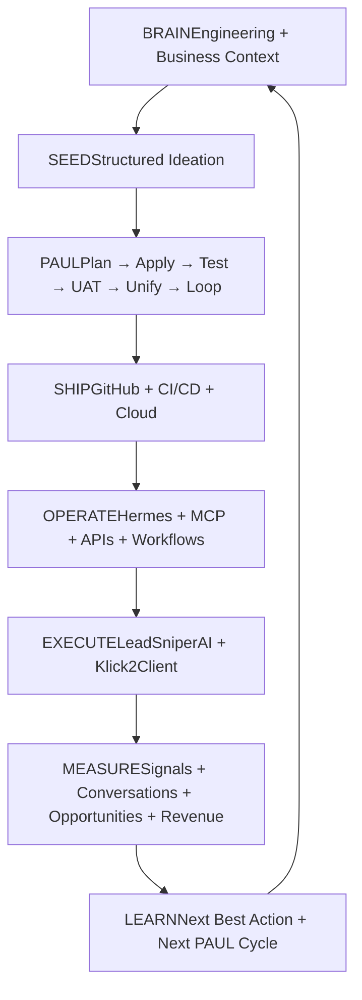
## 1. BRAIN — Persistent Knowledge and Operational Context
The Brain should be divided into two complementary systems.
### Engineering Brain
**Primary components:** Obsidian, Graphify, GitHub, architecture documents, PAUL state files.
Purpose:
- understand the codebase and application architecture;
- map relationships among components and project assets;
- preserve design decisions and development history;
- give Claude Code, Codex, and other engineering agents reliable context before modifying the system.
### Business Brain
**Primary CRM and commercial system of record:** Atomic CRM using its native CRM architecture, with Supabase/PostgreSQL as the primary operational database and shadcn/ui as the modular component layer for Klick2Client extensions.
This is the default production architecture for Klick2Client. [Convex.dev](http://Convex.dev) is no longer the native CRM backend; Atomic CRM + Supabase/PostgreSQL is the default production CRM stack.
Atomic CRM should own the mature CRM functions we do not need to rebuild:
- organizations/users and CRM access patterns;
- companies and contacts;
- opportunities/deals and pipeline stages;
- tasks, notes, activities, and relationship history;
- CRM navigation, record views, filters, and lifecycle progression.
Klick2Client then extends Atomic CRM with proprietary revenue-intelligence modules rather than replacing its CRM core. New capabilities should be implemented as modular shadcn/ui components, service adapters, and Supabase-backed data structures wherever practical:
- LeadSniperAI signals and evidence;
- ICP, signal, contactability, and opportunity scoring;
- GTM playbooks and strategy selection;
- research and enrichment;
- personalization;
- campaign orchestration;
- agent jobs and agent runs;
- next-best-action recommendations;
- revenue attribution and learning.
Convex is **not part of the default Klick2Client CRM architecture**. The default production stack is Atomic CRM + Supabase/PostgreSQL + shadcn/ui. A separate specialized service may be introduced only when a bounded capability cannot be implemented cleanly within this stack and produces a measurable advantage.
**Architectural distinction:** Atomic CRM provides the native CRM architecture and customer/revenue lifecycle; Supabase/PostgreSQL provides the primary database and persistence layer; shadcn/ui provides the modular interface for adding Signal Intelligence, GTM Playbooks, Outreach, AI Copilot, Reporting, Integrations, and vertical-specific modules. Klick2Client adds the signal, GTM strategy, execution, and learning layers around this foundation.
---
## 2. BUILD — SEED + PAUL Development Lifecycle
### SEED — Structured Ideation
Every major application or module should begin with a structured SEED interview rather than an informal coding prompt.
SEED defines:
- business objective;
- target users;
- problem statement;
- MVP;
- success metrics;
- non-goals;
- core data model;
- integrations;
- agent requirements;
- security and tenant requirements;
- human approval points;
- deployment target.
**Operating rule:** **SEED determines what should be built. PAUL determines how it gets built.**
### PAUL — Controlled Agentic Engineering
PAUL stands for **Plan, Apply, Unify, Loop**. For KlickSmartAI, the recommended production lifecycle is:
> **Plan → Apply → Test → UAT → Unify → Loop**
#### Plan
Define one bounded development phase with explicit scope, exclusions, dependencies, acceptance criteria, and human approval requirements.
#### Apply
Claude Code or Codex executes autonomously within the approved phase boundary, installs dependencies, writes code, runs tests, and self-corrects until the defined checkpoint is reached.
#### Test
Machine verification confirms technical correctness before human review.
#### UAT
A human validates UI/UX, business logic, data correctness, integrations, tenant isolation, and intended outcomes.
#### Unify
The system reconciles code, tests, UAT, roadmap, documentation, and state into a new authoritative project state.
#### Loop
Only after approval and Unify does the project advance to the next bounded phase.
---
## Development State Standard
Each major application should maintain a consistent external project-memory structure:
```plain text
/apps//

SEED.md
PROJECT.md
ROADMAP.md
ARCHITECTURE.md
STATE.json
DECISIONS.md
SCHEMA.md
INTEGRATIONS.md
UAT.md
HANDOFF.md
README.md
```

Artifact
Purpose

[PROJECT.md](http://PROJECT.md)
Defines what the application is.

[ROADMAP.md](http://ROADMAP.md)
Defines where the project is going.

STATE.json / Paul.json
Records the exact current development state.

[ARCHITECTURE.md](http://ARCHITECTURE.md)
Explains how the system works.

[DECISIONS.md](http://DECISIONS.md)
Records why major choices were made.

[SCHEMA.md](http://SCHEMA.md)
Defines the application's data model.

[UAT.md](http://UAT.md)
Records human acceptance and unresolved issues.

[HANDOFF.md](http://HANDOFF.md)
Allows another model, agent, or session to resume immediately.

---
## 3. Context Continuity — Deterministic Resumability
Long-running agentic development cannot depend on ever-growing context windows. The proposed system therefore uses external state extraction and structured handoffs.
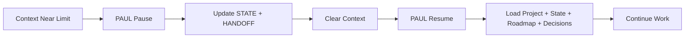
The objective is not literal infinite memory. It is **infinite resumability**: the ability for a new model, new session, or authorized agent to reconstruct the required working state reliably.
A handoff should capture:
- current phase;
- objective;
- completed work;
- work in progress;
- files changed;
- architectural decisions;
- schema changes;
- pending UAT;
- known issues;
- external dependencies;
- next actions;
- recommended resume instruction.
---
## 4. SHIP — Production Infrastructure
Deployment should be cloud-agnostic rather than tied to a single hosting provider.
### Proposed Infrastructure

Layer
Recommended Role

GitHub
Authoritative code repository and CI/CD source.

Vercel
Customer-facing web applications and dashboards.

Atomic CRM
Native CRM application foundation and customer/revenue system of record, extended with Klick2Client modules rather than rebuilt.

Supabase / PostgreSQL
Primary operational database for Atomic CRM, CRM relationships, tenant data, signals, GTM execution records, and revenue attribution.

shadcn/ui
Modular component layer used to add Signal Intelligence, GTM Playbooks, Outreach, AI Copilot, Reporting, Integrations, and vertical-specific functionality inside the Atomic CRM experience.

Railway / Cloud Run
Workers, integration services, and specialist runtimes.

Hermes VPS
Persistent 24/7 autonomous research and execution environment.

Railway remains a useful deployment target, but it should not define the architecture.
---
## 5. Hermes — Research & Enrichment Module
Hermes should act as the 24/7 **deep research and investigative enrichment module**, rather than the primary database, CRM, or general-purpose orchestrator. LeadSniperAI handles discovery, diagnosis, standardized enrichment, scoring, recommendations, and learning; Hermes is invoked selectively for higher-value accounts that require deeper evidence, company intelligence, decision-maker research, competitive context, project investigation, or mystery-shop synthesis.
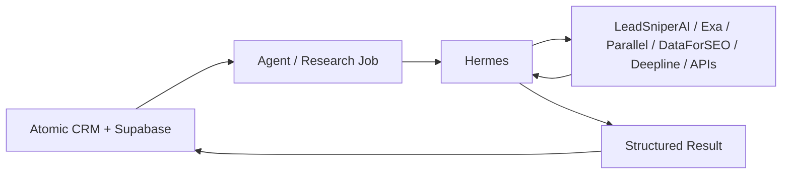
Hermes receives a bounded research or enrichment job, invokes authorized tools, synthesizes evidence, returns structured findings, and persists the resulting intelligence back through the Atomic CRM/Supabase application layer. In the SIB workflow, Hermes is normally invoked **after LeadSniperAI qualification**, so expensive deep research and mystery-shop work is reserved for accounts with sufficient opportunity score, lifecycle posture, or evidence quality.
### Agent Job Contract
Every asynchronous job should contain a deterministic contract including:
- tenant and client context;
- job type;
- business objective;
- target entity;
- permitted tools;
- execution constraints;
- human-approval requirement;
- callback destination.
Returned results should contain:
- execution status;
- findings;
- evidence;
- confidence;
- artifacts;
- recommended actions;
- next-best-action candidates.
---
## 6. MCP — Agent Integration Fabric
MCP should become the common tool interface between orchestrators, coding agents, research agents, business applications, and external systems.
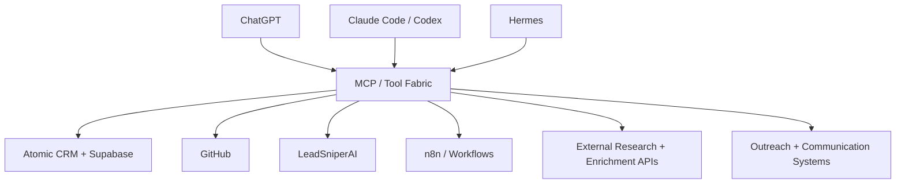
Agents should work through business-level functions wherever practical, for example:
- `search_companies()`
- `get_company_signals()`
- `enrich_company()`
- `find_decision_makers()`
- `score_opportunity()`
- `generate_research_report()`
- `create_campaign()`
- `request_approval()`
- `launch_outreach()`
- `record_outcome()`
This keeps provider-specific implementation details behind a stable operating interface.
---
## 7. [KlickSmartAI.com](http://KlickSmartAI.com) — Agency / Operator Layer
KlickSmartAI is the **agency operating company and control plane** behind the service. It owns strategy, service delivery, cross-client administration, vertical playbook design, research operations, signal configuration, campaign oversight, and continuous optimization.
Core responsibilities:
- acquire and onboard business clients;
- define each client's ICP, offer, market, vertical, and GTM strategy;
- configure proprietary LeadSniperAI signal taxonomies and scoring;
- operate Hermes as the research and enrichment module;
- manage reusable vertical GTM skills and playbooks;
- supervise personalization and campaign strategy;
- approve or monitor email, LinkedIn, calling, and other execution channels;
- oversee all client workspaces from an agency-level view;
- monitor usage, subscriptions, performance, opportunities, and revenue attribution;
- continuously improve playbooks using results across client accounts while preserving tenant isolation.
KlickSmartAI therefore answers:
> **How does the agency configure, operate, optimize, and deliver repeatable signal-to-revenue services across multiple business clients?**
---
## 8. [Klick2Client.com](http://Klick2Client.com) — Client-Facing Revenue Service Platform
Klick2Client is the **service platform KlickSmartAI delivers to its business clients**. It gives each subscribed client a secure, role-based workspace for the signal-to-revenue lifecycle without exposing the agency's internal operating environment.
Core responsibilities:
- provide the client-facing Atomic CRM workspace;
- surface LeadSniperAI signals and opportunity scores relevant to the subscribed vertical;
- display Hermes research and enrichment results;
- present GTM recommendations, account briefs, next-best actions, and approved messaging;
- execute or surface approved cold email, LinkedIn, human outbound calling, AI-assisted/inbound voice, SMS/WhatsApp, and follow-up workflows;
- track appointments, conversations, tasks, pipeline stages, and opportunity progression;
- provide reporting and signal-to-revenue attribution;
- expose only the modules, features, and usage permitted by the client's Clerk subscription and vertical entitlements.
Klick2Client therefore answers:
> **What opportunities should this business act on now, what should it do next, and how are those actions converting into pipeline and revenue?**
## Signal-to-Revenue Execution Summary
> 
	**Core product loop:** Signal → GTM Strategy → Research & Enrichment → Prioritize → Personalize → Execute → Engage → Opportunity → Revenue → Learn.

### Product Objective
Klick2Client should be optimized for **speed to revenue and adaptability**, not for rebuilding commodity CRM infrastructure. Atomic CRM provides the production-ready CRM chassis; Klick2Client focuses engineering effort on the proprietary functions that shorten the distance between a business signal and revenue.
### Core Signal-to-Revenue Functions
1. **Signal Feed** — ingest actionable company events such as hiring growth, permits, expansion, funding, ownership changes, technology changes, property activity, negative review patterns, and other vertical-specific triggers.
2. **ICP + Signal + Contactability Scoring** — score account fit, urgency/intent, and whether the correct decision-maker can be reached; combine these into an opportunity priority.
3. **One-Click Enrichment** — enrich companies and contacts through providers such as Deepline and other verification/enrichment services while keeping providers behind modular adapters.
4. **AI Account Brief** — turn evidence into a concise GTM thesis: what happened, why it matters, likely pain, who to contact, recommended offer, and supporting evidence.
5. **GTM Playbook Engine** — apply reusable vertical skills for ICP definition, segmentation, signal interpretation, pain hypotheses, persona mapping, offer matching, value propositions, channel selection, CTA, qualification, objection handling, and follow-up strategy.
6. **Personalization Engine** — convert signal + account research + persona + offer into account-specific email, LinkedIn, and calling angles rather than generic AI personalization.
7. **Campaign Launcher** — launch approved prospects into execution providers such as Smartlead/Aerosend for email, Unipile for LinkedIn/messaging, and Telnyx for calling while Atomic CRM retains the activity and opportunity history.
8. **Unified Engagement Timeline** — maintain signal, research, outbound touches, replies, calls, meetings, opportunity movement, and outcomes against the existing Atomic CRM company/contact record.
9. **Reply & Intent Classification** — classify positive interest, questions, referrals, not-now responses, objections, bounces, and other reply types; create the correct CRM task, opportunity, or follow-up automatically.
10. **Next Best Action** — continuously surface the highest-value human or automated action based on signals, engagement, pipeline state, GTM playbook logic, and elapsed time.
11. **Signal-to-Revenue Attribution** — preserve the original signal, playbook, persona, offer, channel, campaign, meetings, opportunity value, and realized revenue so the system learns what actually produces commercial outcomes.
### GTM Skills as the Strategy Layer
The signal alone is not the product. GTM skills interpret the signal and determine what action should follow.
**Reusable GTM skills include:**
- ICP Builder;
- Market Segmentation;
- Signal Interpretation;
- Pain Hypothesis;
- Persona Mapping;
- Offer Matching;
- Value Proposition;
- Account Research;
- Competitive Research;
- Personalization;
- Email Strategy;
- LinkedIn Strategy;
- Calling Strategy;
- Qualification;
- Objection Handling;
- Follow-Up Strategy;
- Deal Strategy;
- Re-engagement;
- Revenue Attribution.
The operating sequence becomes:
> **Signal → Vertical Playbook → Persona → Pain Hypothesis → Offer → Message → Channel → Sequence → Conversation → Opportunity → Revenue.**
### Vertical Playbook Model
Each vertical should have a reusable playbook containing:
- priority signals;
- ICP rules;
- target personas;
- pain hypotheses;
- matching offers;
- value propositions;
- email strategies;
- LinkedIn strategies;
- calling strategies;
- qualification questions;
- objections and responses;
- conversion CTAs;
- attribution metrics.
This allows the same Klick2Client platform to support commercial financing, HVAC, construction, manufacturing, M&A, capital raising, hiring/HR, SaaS, professional services, and other verticals without rebuilding the CRM.
### Fastest Commercial MVP
The initial commercial release should focus on eight proprietary capabilities on top of Atomic CRM:
1. Signal Feed
2. ICP/Signal/Opportunity scoring
3. One-click enrichment
4. AI Account Brief
5. GTM Playbook + personalization
6. Smartlead campaign launch
7. Reply classification + opportunity creation
8. Signal-to-revenue attribution
Everything else can be layered in after the complete loop works end-to-end.
### Architecture Rule
> **Extend Atomic CRM; do not rewrite Atomic CRM.**
Atomic CRM owns contacts, companies, opportunities, pipeline, activities, tasks, notes, and core CRM relationships. Klick2Client owns signals, research, GTM intelligence, personalization, execution orchestration, agents, next-best actions, and attribution.
### Commercial Promise
> **Klick2Client detects companies with a reason to buy, applies the correct vertical GTM strategy, identifies who to contact, generates and executes the outreach, converts engagement into opportunities, and learns which signals and strategies produce revenue.**
---
## 9. Core Multi-Tenant Object Model
The system should share one durable business hierarchy rather than creating isolated databases for every module.
```plain text
Organization
 └── Workspace
      └── Client
           ├── Strategy / ICP
           ├── Companies
           │    ├── Contacts
           │    ├── Signals
           │    └── Opportunities
           ├── Campaigns
           │    ├── Sequences
           │    ├── Messages
           │    └── Outcomes
           ├── AgentRuns
           │    ├── ToolCalls
           │    ├── Evidence
           │    └── Artifacts
           ├── Approvals
           ├── Reports
           ├── Workflows
           └── Revenue
```
This common schema provides the foundation for cross-module intelligence, lifecycle visibility, and attribution.
---
## 10. Proposed OS Modules
The platform should expose bounded modules on top of the shared architecture rather than build each function as an isolated application.

Module
Primary Purpose

Tenant OS
Organizations, users, permissions, plans, billing.

Signal OS
LeadSniperAI signals, triggers, scoring, opportunity detection.

Research OS
Hermes research, competitive intelligence, theses, evidence.

Prospect OS
Company/contact enrichment and entity resolution.

GTM OS
ICP, positioning, campaign strategy, next-best action.

Outreach OS
Email, LinkedIn, calling, SMS, sequences.

Calling OS
Human outbound calling plus AI-assisted/inbound voice workflows.

Content OS
SEO, AEO, social, ads, landing pages.

CRM OS
Lead → opportunity → deal → customer lifecycle.

Capital OS
Investor discovery, fundraising, financing workflows.

M&A OS
Pre-M&A signals, acquisition candidates, opportunity theses.

Report OS
Client intelligence and Hermes-generated deliverables.

Workflow OS
Event-driven and scheduled business automation.

Agent OS
Agent registry, skills, tools, permissions, agent jobs and runs.

Memory OS
Evidence, decisions, state snapshots, knowledge, artifacts.

Revenue OS
Usage, attribution, client ROI, billing, commercial outcomes.

---
## 11. Vertical Agents + Reusable Skills
The recommended approach is **not** to create dozens of rigid agents. Instead, build a compact set of reusable skills and instantiate agents with vertical-specific context, signal taxonomies, rules, and knowledge.
### Reusable Skills
- company research;
- market research;
- signal analysis;
- enrichment;
- contact discovery;
- opportunity scoring;
- GTM strategy;
- cold email;
- meeting preparation;
- proposal generation;
- executive reporting.
### Potential Vertical Agents
- Commercial Finance Agent;
- Construction Intelligence Agent;
- Mortgage Agent;
- M&A Acquisition Agent;
- Capital Raise Agent;
- AI Agency Growth Agent;
- Local Business Growth Agent.
The competitive advantage should remain in KlickSmartAI's proprietary **signal taxonomy, scoring models, opportunity theses, workflow intelligence, entity resolution, and next-best-action logic** rather than in any single external model or data provider.
---
## 12. Human Governance Layer
Human-in-the-loop approval should be designed as a reusable platform primitive.
Potential approval states:
- pending;
- approved;
- rejected;
- revision requested;
- expired.
Examples:
**Prospect workflow:** LeadSniperAI → scoring → shortlist → human approval → enrichment → campaign.
**M&A workflow:** Hermes thesis → analyst review → approval → decision-maker discovery → Klick2Client outreach.
**Development workflow:** Apply → tests → [localhost](http://localhost) → UAT → approval → Unify → next PAUL phase.
This creates controlled autonomy rather than uncontrolled autonomous execution.
---
## 13. Continuous Learning and Recursive Improvement
The original Brain → Build → Ship model should be extended with **Operate → Measure → Learn**.
Production evidence should include:
- signal effectiveness;
- response and positive-response rates;
- meetings generated;
- opportunities created;
- conversion rates;
- revenue attribution;
- workflow latency;
- tool failures;
- agent performance;
- human overrides;
- client ROI.
The OS can then convert observed problems and opportunities into candidate improvements:
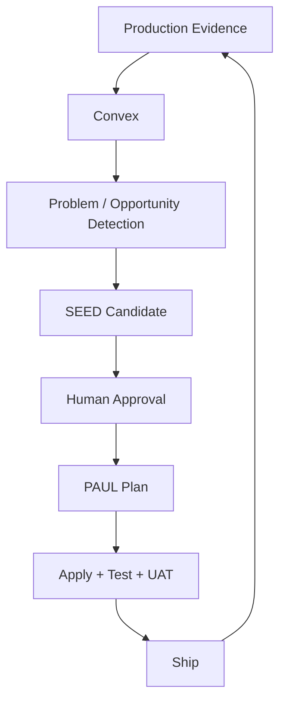
This is the point where the platform becomes genuinely recursive: the system produces evidence that informs the next version of itself.
---
## Recommended Implementation Priorities
### Phase 1 — OS Foundation
- [ ] Define the canonical multi-tenant Convex schema.
- [ ] Establish organization, workspace, client, company, contact, signal, campaign, agent-run, approval, and outcome objects.
- [ ] Standardize SEED + PAUL project conventions.
- [ ] Implement project state and handoff standards.
- [ ] Establish authentication, tenant isolation, and role permissions.
### Phase 2 — Agent Control Plane
- [ ] Create Agent Job and Agent Run contracts.
- [ ] Connect Convex to Hermes.
- [ ] Establish MCP/tool registry standards.
- [ ] Implement evidence, artifact, confidence, and next-action return structures.
- [ ] Build generic approval checkpoints.
### Phase 3 — Intelligence Layer
- [ ] Connect LeadSniperAI signal generation.
- [ ] Add research and enrichment provider abstractions.
- [ ] Implement ICP matching and opportunity scoring.
- [ ] Add Hermes research/report generation.
- [ ] Persist all findings and evidence to Convex.
### Phase 4 — Klick2Client Execution
- [ ] Cold-email orchestration.
- [ ] LinkedIn workflows.
- [ ] Human outbound calling module.
- [ ] Telnyx voice integration.
- [ ] SMS / WhatsApp follow-up.
- [ ] Landing page and CTA orchestration.
- [ ] CRM lifecycle and outcome tracking.
### Phase 5 — Revenue and Learning
- [ ] Attribution and ROI reporting.
- [ ] Usage metering and billing.
- [ ] Signal-performance analytics.
- [ ] Agent-performance analytics.
- [ ] Next-best-action engine.
- [ ] Production evidence → SEED/PAUL feedback loop.
---
## Success Criteria
The Agentic OS should ultimately demonstrate measurable improvement in four dimensions:
1. **Speed:** Reduce time from market signal to executable GTM action.
2. **Leverage:** Increase the volume of high-quality research, analysis, and outreach each human operator can supervise.
3. **Continuity:** Allow projects and workflows to continue across sessions, agents, and models without losing critical state.
4. **Commercial Outcomes:** Attribute signals and agent actions to conversations, opportunities, clients, and revenue.
---
## Proposed Positioning
> 
	[**KlickSmartAI.com**](http://KlickSmartAI.com)** + **[**Klick2Client.com**](http://Klick2Client.com)** should be positioned as Vertical Intelligence + GTM Infrastructure as a Service:** a persistent Agentic Business OS that discovers commercial opportunities, understands why they matter, determines the next best action, executes multi-channel GTM workflows, and learns from the resulting business outcomes.

### Operating Model in One Line
> **KlickSmartAI discovers and decides. Klick2Client executes and converts. Convex remembers. Hermes works. Humans govern. PAUL improves the system.**
---
## Recommended Development Doctrine
All major KlickSmartAI and Klick2Client applications should follow the same lifecycle:
> **SEED → Brain → Plan → Apply → Test → UAT → Unify → Loop → Ship → Observe → Learn**
This provides a repeatable framework for developing the Cold Email OS, Outbound Calling OS, LeadSniperAI Signal Engine, M&A Intelligence, Capital Raise OS, Commercial Financing Intelligence, vertical Hermes agents, and future client-facing operating systems.
---
## Technical Implementation Baseline — Atomic CRM + Supabase/PostgreSQL Project
> 
	**Refactor:** The Agentic OS is now defined as a concrete implementation architecture for the Atomic CRM + Supabase/PostgreSQL project. The conceptual Brain → Build → Ship model remains, but each layer is mapped to the actual technical tools [KlickSmartAI.com](http://KlickSmartAI.com) and [Klick2Client.com](http://Klick2Client.com) will use.

## 11. Core Backend — Atomic CRM + Supabase/PostgreSQL
**Atomic CRM + Supabase/PostgreSQL is the primary operational backend, durable system of record, and workflow control plane.**
Convex owns:
- multi-tenant organizations and workspaces;
- clients;
- companies and contacts;
- signals and evidence;
- opportunity scores;
- campaigns and sequences;
- agent jobs and agent runs;
- approvals;
- tasks and workflow state;
- reports and artifacts;
- conversations, calls, and meetings;
- usage, attribution, and revenue outcomes.
Convex should **store, orchestrate, trigger, observe, authorize, and persist**. Specialist providers remain responsible for search, enrichment, communications, and agent execution.
### Proposed Core Convex Objects
```plain text
organizations
users
memberships
workspaces
clients
companies
contacts
relationships
signals
signalEvidence
signalScores
opportunities
opportunityScores
campaigns
sequences
messages
agentJobs
agentRuns
toolCalls
artifacts
reports
approvals
tasks
workflowRuns
events
conversations
calls
meetings
deals
revenueEvents
attribution
usageEvents
subscriptions
```
Where appropriate, tenant-aware records should carry:
```plain text
organizationId
workspaceId
clientId
createdAt
updatedAt
createdBy
```
## 12. Frontend and Web Layer — Astro + Vercel
**Astro** is the preferred frontend framework for SEO-heavy public experiences and modular client-facing applications.
Use Astro for:
- [KlickSmartAI.com](http://KlickSmartAI.com) marketing pages;
- [Klick2Client.com](http://Klick2Client.com) marketing pages;
- SEO landing pages;
- vertical pages;
- lead-generation funnels;
- assessments;
- campaign landing pages;
- client portal shells;
- interactive application components where required.
**Vercel** is the preferred frontend deployment target, while Convex remains the operational backend.
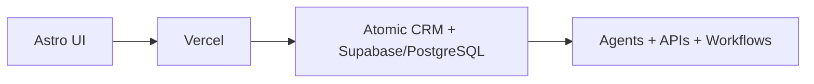
## 13. Authentication and Multi-Tenancy — Clerk
**Clerk** should manage identity, authentication, sessions, organization membership, and role-aware user access.
```plain text
Clerk Organization
        ↓
Convex Organization
        ↓
Workspace
        ↓
Client
```
Convex remains authoritative for business objects and tenant-specific application state.
## 14. Billing — Stripe
**Stripe** should support:
- subscriptions;
- usage-based billing;
- add-ons;
- service packages;
- payment links;
- future consumption-based pricing.
Convex should retain normalized billing state such as:
```plain text
stripeCustomerId
stripeSubscriptionId
plan
status
usageAllowance
billingPeriod
```
Potential billable services include Signal Intelligence, Cold Email, LinkedIn, Research, Calling, Reporting, Capital Raise, M&A Intelligence, and vertical-specific managed services.
## 15. Persistent Agent Runtime — Hermes
**Hermes is the 24/7 autonomous worker and research runtime.** It should operate independently from Convex, on a VPS or persistent worker environment.
Hermes responsibilities:
- receive structured agent jobs;
- invoke external tools;
- manage longer-running research;
- synthesize evidence;
- create reports and artifacts;
- return normalized outputs to Convex.
Hermes is **not** the CRM or primary database.
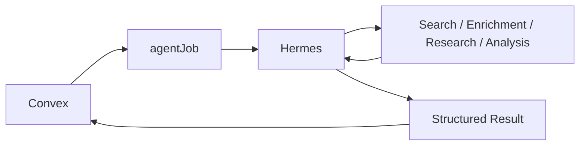
## 16. Engineering Agents — Claude Code + Codex
**Claude Code** is the primary agentic engineering environment for:
- architecture implementation;
- repository-wide refactoring;
- CLI workflows;
- integration development;
- debugging;
- PAUL lifecycle execution.
**Codex** serves as an additional implementation and review agent for:
- targeted code generation;
- tests;
- code review;
- implementation support;
- repository tasks.
Neither agent should be the sole holder of project state. Project state remains external through PAUL artifacts, GitHub, and documented architecture.
## 17. Engineering Lifecycle — SEED + PAUL
The official KlickSmartAI software-development lifecycle is:
> **SEED → PLAN → APPLY → TEST → UAT → UNIFY → LOOP → SHIP**
### Standard Project Memory
```plain text
/apps//

SEED.md
PROJECT.md
ROADMAP.md
ARCHITECTURE.md
STATE.json
DECISIONS.md
SCHEMA.md
INTEGRATIONS.md
UAT.md
HANDOFF.md
README.md
```
No major phase advances automatically after implementation. Human UAT precedes Unify and progression.
## 18. Engineering Brain — Graphify + Obsidian + GitHub
**Obsidian** stores human-readable architecture notes, product intelligence, SOPs, research, vertical playbooks, and project documentation.
**Graphify** maps repositories, modules, functions, schemas, dependencies, and architectural relationships.
**GitHub** is the canonical code and technical-state repository.
Architectural distinction:
> **Graphify understands code relationships. Convex understands business relationships.**
## 19. Proprietary Signal Engine — LeadSniperAI CLI
**LeadSniperAI** remains the proprietary signal-intelligence engine and should be callable from Hermes, Claude Code, Convex workers, CLI flows, or MCP.
Responsibilities include:
- website analysis;
- growth signals;
- local-business signals;
- GTM triggers;
- vertical-specific opportunity signals;
- opportunity scoring.
Convex stores normalized signal objects and evidence after analysis.
```plain text
External business data
        ↓
LeadSniperAI
        ↓
Signal + Evidence + Score
        ↓
Convex
```
## 20. Local Business Intelligence — Google Maps + DataForSEO
Use **Google Maps / Google Business grounding** for local-business discovery and **DataForSEO Business Data API** for structured local-business intelligence.
DataForSEO can supply business profiles, ratings, reviews, categories, locations, competitor context, local SERP information, and other structured local signals.
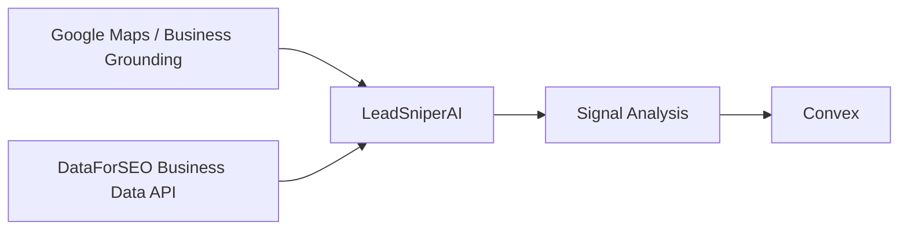
## 21. Research and Enrichment Layer
The research stack should remain modular and provider-agnostic.
### Exa
Semantic and company/web discovery.
### Parallel
Deeper structured research and evidence gathering.
### Serper
Lightweight search and discovery.
### Explorium
Use as a standing catalog/provider for company enrichment, business characteristics, event signals, entity matching, prospect intelligence, and enrichment workflows.
### Deepline
Use as the **provider-abstraction and GTM action layer**, not the permanent database.
```plain text
Agent / Workflow
      ↓
Deepline
      ↓
External provider
      ↓
Normalized result
      ↓
Convex
```
Provider-specific logic should remain replaceable wherever possible.
## 22. CRM and Entity Resolution
Convex maintains the canonical Company, Contact, Relationship, Opportunity, and Client records.
External services enrich these canonical entities rather than creating competing databases.
```plain text
Raw Company
   ↓
Entity Resolution
   ↓
Canonical Atomic CRM Company
   ↓
Supabase/PostgreSQL Persistence
   ↓
Signal Enrichment
   ↓
Contact Discovery
   ↓
Canonical Atomic CRM Contact
   ↓
Opportunity Scoring
```
## 23. Klick2Client Execution Stack
KlickSmartAI determines **who, why, when, what offer, what message, and what channel**. Klick2Client executes the conversion workflow.
### Cold Email — Smartlead
Use Smartlead for outbound sequencing and sending operations.
### Transactional Email — Postmark
Use Postmark for application-generated email such as verification, notifications, reports, client alerts, system notices, and transactional communication.
Cold outbound and transactional email should remain separate infrastructure.
### LinkedIn — HeyReach
Use HeyReach for LinkedIn campaign execution.
### Unified Communications — Unipile
Use Unipile for unified account-level communications and calendar access where supported, including Gmail, LinkedIn, WhatsApp, and calendar workflows.
### Voice / SMS / MMS — Telnyx
Use Telnyx for telephony, phone numbers, call routing, SMS/MMS, inbound AI-assisted voice, and human outbound calling support.
The calling architecture should preserve human-in-the-loop outbound calling where required while enabling AI handling for appropriate inbound and automated workflows.
## 24. Workflow Automation — Convex First, n8n Where Appropriate
**Convex owns workflow truth.** Core application events and business state should live in Convex.
Use **n8n** for:
- external SaaS orchestration;
- integration-heavy flows;
- rapid workflow prototyping;
- existing connectors;
- integration execution that does not need to own durable business state.
Operating rule:
> **n8n executes integrations; Convex owns workflow state.**
## 25. MCP — Agent Tool Interface
MCP becomes the common agent-facing tool fabric.
Potential MCP servers include:
```plain text
Convex MCP
Hermes MCP
Telnyx MCP
GitHub MCP
n8n MCP
Graphify MCP
LeadSniperAI MCP
```
Agents should ideally see business-level capabilities rather than vendor-specific implementation details:
```plain text
find_companies()
analyze_company()
get_signals()
enrich_company()
find_contacts()
score_opportunity()
research_company()
generate_report()
create_campaign()
request_approval()
launch_outreach()
initiate_call()
record_outcome()
```
## 26. Agent Job Architecture
Convex should expose a standard `agentJobs` model for asynchronous execution.
Example lifecycle:
```plain text
queued
 ↓
claimed
 ↓
running
 ↓
waiting_for_tool
 ↓
completed
```
or `failed` when necessary.
Each job should carry tenant context, client context, objective, target entity, permitted tools, execution constraints, and approval requirements.
Each result should return findings, evidence, artifacts, confidence, recommended actions, and next-best-action candidates.
## 27. Human Approval System
`approvals` should become a reusable platform primitive with states such as:
```plain text
pending
approved
rejected
revision_required
expired
```
Approvals can gate:
- campaign launch;
- M&A outreach;
- capital-raise outreach;
- mass email;
- AI-generated proposals;
- major agent actions;
- client deliverables.
## 28. Deployment Topology
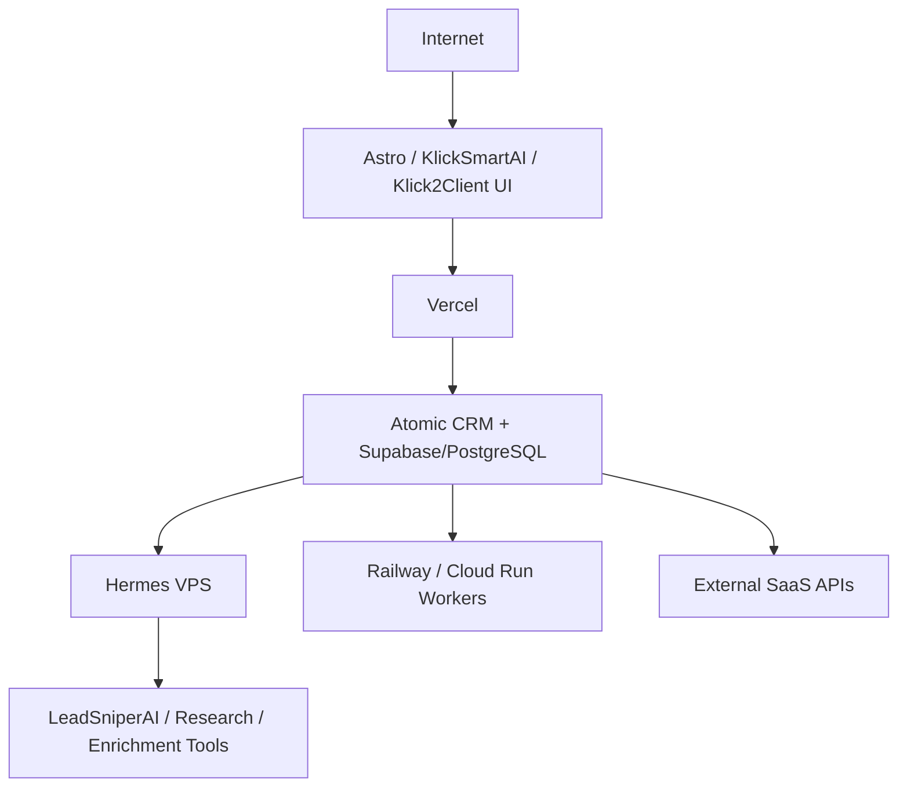
### Deployment Responsibilities

Layer
Technology
Primary Responsibility

Frontend
Astro
SEO, applications, landing pages, portals

Frontend Hosting
Vercel
Web deployment

Backend / State
[Atomic CRM + Supabase/PostgreSQL](http://Atomic CRM + Supabase/PostgreSQL)
Multi-tenant data, business state, workflow control

Authentication
Clerk
Identity, organizations, roles

Billing
Stripe
Subscriptions and usage billing

Persistent Agent Runtime
Hermes
24/7 agent jobs and research

Workers
Railway / Cloud Run
Specialist services and integrations

Code
GitHub
Canonical repository and CI/CD source

## 29. Recommended Repository Structure
```plain text
/apps
  /klicksmartai
  /klick2client
  /admin
  /client-portal

/convex
  /schema
  /organizations
  /clients
  /companies
  /contacts
  /signals
  /opportunities
  /campaigns
  /agents
  /workflows
  /approvals
  /messages
  /calls
  /reports
  /billing
  /analytics

/agents
  /hermes
  /commercial-finance
  /ma
  /construction
  /growth
  /capital-raise

/skills
  /company-research
  /signal-analysis
  /contact-discovery
  /gtm-strategy
  /cold-email
  /proposal
  /reporting

/tools
  /leadsniper
  /deepline
  /dataforseo
  /exa
  /parallel
  /telnyx
  /unipile
  /postmark

/mcp
  /convex
  /leadsniper
  /hermes

/docs
  /architecture
  /decisions
  /integrations
  /playbooks

/paul
  STATE.json
  ROADMAP.md
  HANDOFF.md
```
## 30. Technical Responsibility Matrix

Layer
Primary Technology
Responsibility

Frontend
Astro
Web UI + SEO

Hosting
Vercel
Frontend deployment

Operational Backend
[Atomic CRM + Supabase/PostgreSQL](http://Atomic CRM + Supabase/PostgreSQL)
Core state + workflows

Authentication
Clerk
Users + organizations

Billing
Stripe
Plans + payments

Agent Execution
Hermes
Persistent autonomous jobs

Coding
Claude Code + Codex
Software development

Development Lifecycle
SEED + PAUL
Controlled agentic engineering

Engineering Knowledge
Graphify + Obsidian
Architecture and code context

Signal Engine
LeadSniperAI CLI
Proprietary signals

Local Intelligence
Google Maps + DataForSEO
Local-business data

Research
Exa + Parallel + Serper
Discovery and research

Provider Abstraction
Deepline
External provider normalization

Enrichment
Explorium + external providers
Company/contact intelligence

Cold Email
Smartlead
Outbound sequencing

LinkedIn
HeyReach
LinkedIn execution

Unified Communications
Unipile
Messaging + calendar

Voice / SMS
Telnyx
Communications

Transactional Email
Postmark
Platform email

External Workflow
n8n
Integration automation

Tool Interface
MCP
Agent-to-tool abstraction

Source Control
GitHub
Code + technical state

## 31. Final Technical Operating Model
> 
	**Convex remembers. LeadSniperAI detects. Hermes researches and executes agent jobs. KlickSmartAI decides what opportunity to pursue. Klick2Client executes the GTM motion. Telnyx, Unipile, Smartlead, HeyReach, and Postmark communicate. Deepline abstracts external providers. Claude Code and Codex build the platform. SEED + PAUL govern how the platform evolves. Humans approve high-impact actions.**

This technical baseline should be treated as the current implementation architecture for the Atomic CRM + Supabase/PostgreSQL project and should supersede generic tool references where the two conflict.
---
## Knowledge Resilience — Obsidian + Graphify + GitHub Wiki
> 
	The Agentic OS should use a layered knowledge architecture rather than rely on a single repository. **Obsidian captures working knowledge, Graphify maps relationships, GitHub preserves and publishes approved knowledge, and Convex operates on live business state.**

### Role of Each Knowledge System

System
Primary Responsibility

Obsidian
Working knowledge, research notes, ideas, vertical playbooks, SOPs, and human-readable project intelligence.

Graphify
Machine-readable relationship intelligence across repositories, modules, functions, schemas, documentation, and architecture assets.

GitHub Wiki
Durable, curated architecture documentation, runbooks, product references, agent documentation, integration guides, and institutional knowledge.

GitHub `/docs`
Version-controlled technical specifications and code-near documentation consumed directly by Claude Code, Codex, and engineering workflows.

PAUL State
Current development state, roadmap, handoff, decisions, and deterministic resumability.

Convex
Live operational truth: tenants, clients, companies, contacts, signals, opportunities, campaigns, agent runs, workflows, approvals, outcomes, and revenue.

### Knowledge Architecture
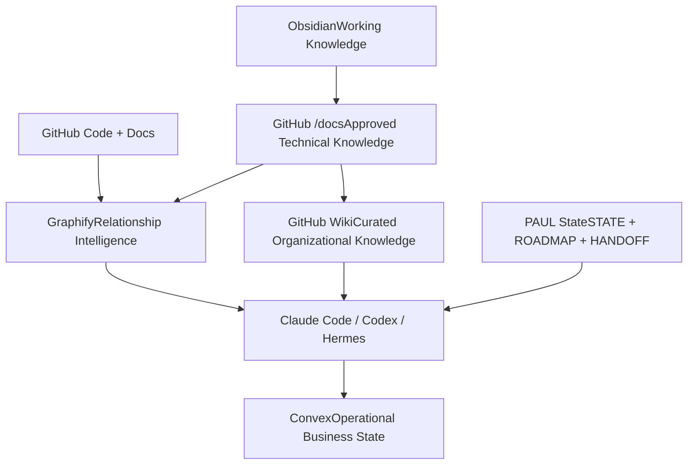
### Source-of-Truth Hierarchy
The systems should not compete for authority. Each layer has a defined role:
- **Code-near technical truth → GitHub repository and ****`/docs`****.**
- **Development state → PAUL state artifacts.**
- **Curated organizational reference → GitHub Wiki.**
- **Exploratory and human knowledge → Obsidian.**
- **Relationship intelligence → Graphify.**
- **Live operational truth → Convex.**
This keeps the GitHub Wiki as a resilient publishing and backup layer without turning it into a competing application database.
### Proposed GitHub Wiki Structure
```plain text
KlickSmartAI Agentic OS Wiki

Home
├── Architecture
│   ├── System Overview
│   ├── Convex Architecture
│   ├── Agent Architecture
│   ├── MCP Architecture
│   ├── Data Architecture
│   └── Deployment Architecture
├── Products
│   ├── KlickSmartAI
│   ├── Klick2Client
│   ├── LeadSniperAI
│   └── Client Portal
├── Agents
│   ├── Hermes
│   ├── Commercial Finance Agent
│   ├── M&A Agent
│   ├── Capital Raise Agent
│   └── Growth Agent
├── Skills
│   ├── Company Research
│   ├── Signal Analysis
│   ├── Enrichment
│   ├── GTM Strategy
│   └── Outreach
├── Integrations
│   ├── Telnyx
│   ├── Unipile
│   ├── Smartlead
│   ├── HeyReach
│   ├── Postmark
│   ├── DataForSEO
│   ├── Deepline
│   └── Research Providers
├── Development
│   ├── SEED
│   ├── PAUL
│   ├── UAT
│   ├── Pause / Resume
│   └── Coding Standards
├── Operations
│   ├── Deployment
│   ├── Monitoring
│   ├── Troubleshooting
│   ├── Backup / Recovery
│   └── Incident Runbooks
└── Decisions
    └── Architecture Decision Records
```
### Publishing and Backup Workflow
The preferred model is one-way publication from working knowledge into approved technical knowledge and then into the Wiki:
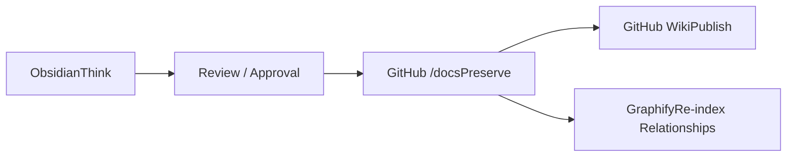
After an approved **PAUL Unify** cycle, the documentation pipeline should be able to:
1. update `STATE`, `ROADMAP`, `ARCHITECTURE`, and Architecture Decision Records;
2. commit those updates to GitHub;
3. publish selected approved documentation into the GitHub Wiki;
4. refresh the Graphify index so agents can query the latest architecture relationships.
The GitHub Wiki itself should be treated as a Git-backed repository so it can be cloned, backed up, versioned, and restored independently.
### Operating Principle
> **Obsidian = Think → Graphify = Understand → GitHub = Preserve & Publish → Convex = Operate.**
This layered approach strengthens the Brain portion of the Agentic OS and reduces dependence on any single knowledge tool.
Telnyx + Atomic CRM + Supabase/PostgreSQL Communications Integration — Architecture & Implementation Plan