# 🧭 ConvexPreMandA — Reference Index & Canonical Architecture

> Mirrored from Notion page `3b59e94cf0a481c59a64c916a423a02d` on 2026-09-07. Source: https://app.notion.com/p/3b59e94cf0a481c59a64c916a423a02d?pvs=204

{"type":"emoji","emoji":"🧭"}

> 
	**Purpose:** Canonical reference index for the ConvexPreMandA project. This page links the existing Notion strategy, architecture, research, data, GTM, and implementation documents that should guide development rather than duplicating their logic inside the project.

# 1. Canonical source-of-truth documents
## Pre-M&A strategy
-  — primary business and product specification for the off-market M&A origination engine, scoring model, GMB breadcrumbs, buyer geography intelligence, monitoring, opportunity briefs, and US-first commercial HVAC pilot.
-  — canonical research operating model for vertical selection, grounded company universes, signal taxonomy, provider hierarchy, evidence objects, scoring, verification, and M&A thesis production.
> 
	**Project rule:** These two pages are the canonical specifications for ConvexPreMandA. Product code and schemas should reference their concepts rather than redefine competing taxonomies or scoring systems.

# 2. Platform architecture references
> 
	**Current implementation decision:** [Convex.dev](http://Convex.dev) has been removed from the implementation path. The application will use **Atomic CRM + shadcn/ui + Clerk + Supabase** as the practical product stack, with **LeadSniperAI CLI** supplying the proprietary Pre-M&A intelligence and Signal-to-Opportunity logic.

-  — retained as a strategic Agentic OS reference only; any Convex-specific implementation guidance is superseded for this project by the current Atomic CRM / Supabase architecture.
-  — implementation reference for the LeadSniperAI CLI, signal engine, workflows, and product boundaries.
-  — crawling, search quality, retrieval, and evidence-improvement reference.
# 3. Data, search, and enrichment references
-  — reference catalog for DataForSEO, Exa, Serper, Deepline, Happenstance, government APIs, websites, job boards, CRM signals, and GTM tooling.
-  — enrichment and owner/decision-maker resolution reference.
## Provider responsibility baseline

Layer
Primary role

Google Maps Grounding / Places
Grounded local-business universe and canonical place identity

DataForSEO Business Data API
Scaled local-business, review, competitor, visibility, and time-series signals

Serper
Exact company, owner, news, indexed social, and event mentions

Exa
Semantic discovery of indirect succession, strategic-change, and capacity signals

Tavily
Recent-page retrieval and extraction

Parallel
High-confidence verification, counter-evidence, citations, and structured research

Deepline
Provider abstraction, enrichment orchestration, waterfalls, normalization, and validation

Happenstance
Relationship paths and warm-introduction intelligence

Hermes
Research orchestration and tool execution; does not independently search

LeadSniperAI
Entity resolution, proprietary signal taxonomy, scoring, evidence weighting, and next-best action

Supabase
Primary application database and backend data layer: Postgres, proprietary M&A intelligence objects, storage, realtime where useful, evidence lineage, historical snapshots, monitoring state, and integration persistence

Clerk
Authentication, users, organizations, sessions, roles, and multi-tenant access control

Atomic CRM + shadcn/ui
Human operating interface plus modular custom Pre-M&A panels, workflows, dashboards, approvals, buyer matching, research views, and opportunity management

# 4. M&A intelligence objects
ConvexPreMandA should implement the following bounded intelligence objects while preserving the definitions in the canonical documents:
- **Vertical Attractiveness Thesis** — determines whether a vertical/geography merits a dedicated acquisition campaign.
- **Grounded Company Universe** — verified businesses with canonical identities and location records.
- **Evidence Object** — dated, source-backed evidence tied to a resolved company and signal taxonomy.
- **Pre-M&A Signal Profile** — supporting and disconfirming evidence across succession, founder dependency, operations, reputation, growth, digital maturity, strategic activity, and distress.
- **Pre-M&A Score** — explainable classification with data-confidence controls and minimum independent signal-family requirements.
- **Buyer Liquidity Score** — measures buyer depth, transaction activity, capital availability, sponsor density, and strategic demand by vertical/geography.
- **Buyer-Target Fit** — target-to-buyer matching by vertical, geography, company size, service mix, recurring revenue, licence/workforce requirements, and integration capacity.
- **M&A Opportunity Thesis** — commercial interpretation of the evidence without representing inference as fact.
- **M&A Opportunity Brief** — decision-ready output for buyers, advisors, lenders, sponsors, and operators.
- **Watchlist / Monitoring State** — tracks score changes and longitudinal signals over time.
# 5. GTM and relationship-conversion references
-  — converts validated signals into qualified conversations and includes buyer-acquisition workflows.
-  — operational outreach SOP after a signal or opportunity thesis has been validated.
-  — opportunity thesis, recommended offer, sales progression, and next-best-action reference.
-  — broader product and commercial operating context.
# 6. ConvexPreMandA logical project structure
```plain text
ConvexPreMandA/
├── 00-STRATEGY/
│   ├── Pre-M&A Signal Engine Executive Summary
│   └── Pre-M&A Search Thesis & Research Playbook
├── 01-APPLICATION/
│   ├── Atomic CRM
│   ├── shadcn-ui
│   ├── Clerk
│   └── Supabase
├── 02-DATA-AND-SIGNALS/
│   ├── discovery
│   ├── entity-resolution
│   ├── evidence
│   ├── enrichment
│   └── time-series
├── 03-MA-INTELLIGENCE/
│   ├── vertical-attractiveness
│   ├── pre-ma-score
│   ├── buyer-liquidity
│   ├── buyer-target-fit
│   └── opportunity-thesis
├── 04-SIGNAL-TO-OPPORTUNITY/
│   ├── LeadSniperAI-CLI
│   ├── qualification-rules
│   ├── CRM-opportunity-creation
│   └── next-best-action
├── 05-SUPABASE/
│   ├── companies
│   ├── contacts
│   ├── company-signals
│   ├── signal-evidence
│   ├── company-snapshots
│   ├── pre-ma-scores
│   ├── opportunity-theses
│   ├── buyers
│   ├── buyer-mandates
│   ├── buyer-target-matches
│   ├── watchlists
│   ├── research-jobs
│   └── reports
└── 06-GTM/
    ├── relationship-outreach
    ├── buyer-validation
    └── sales-os
```
# 7. Canonical operating sequence

```mermaid
flowchart LR
    A["Business Universe"] --> B["Canonical Identity"]
    B --> C["Historical + Current Signals"]
    C --> D["Mention Research"]
    D --> E["Enrichment"]
    E --> F["Evidence Objects"]
    F --> G["Pre-M&A Scoring"]
    G --> H["Buyer Liquidity"]
    H --> I["Buyer-Target Matching"]
    I --> J["Opportunity Thesis"]
    J --> K["Human Verification"]
    K --> L["Relationship Outreach"]
    L --> M["Monitoring + Outcomes"]
    M --> C
```

# 8. Ownership of responsibilities
> 
	**Canonical architecture:** **Atomic CRM + shadcn/ui + Clerk + Supabase** form the application foundation. **LeadSniperAI CLI + Atomic CRM form the Signal-to-Opportunity Conversion Module.** LeadSniperAI detects, explains, and scores signals; Atomic CRM turns qualified signals into actionable companies, opportunities, stages, tasks, activities, and human relationship workflows.

Component
Owns

Supabase
Primary Postgres backend and canonical application data: CRM-linked entities, proprietary M&A intelligence, signals, evidence, scores, snapshots, buyer intelligence, watchlists, research state, reports, storage, and integration persistence

Clerk
Authentication, users, organizations, sessions, permissions, and multi-tenant identity

Atomic CRM
Human-facing CRM foundation: companies, contacts, opportunities, stages, tasks, activities, notes, relationship development, qualification, and pipeline progression

shadcn/ui
Custom application modules layered around Atomic CRM: Pre-M&A score panels, evidence timelines, buyer matching, research views, approvals, dashboards, watchlists, reports, and specialized workflows

LeadSniperAI CLI
Signal discovery, entity resolution, signal taxonomy, evidence scoring, Pre-M&A scoring, opportunity detection, opportunity thesis, recommended next action, and structured handoff into Atomic CRM / Supabase

LeadSniperAI CLI + Atomic CRM
**Signal-to-Opportunity Conversion Module** — converts evidence-backed business signals into a qualified, assigned, staged, and actionable M&A opportunity for human review and follow-up

Hermes
Optional bounded deep-research jobs, external tool calls, synthesis, and reports

Deepline
External-data provider abstraction and enrichment workflows

[KlickSmartAI.com](http://KlickSmartAI.com)
Intelligence, strategy, orchestration, reporting, and client context

[Klick2Client.com](http://Klick2Client.com)
Relationship development and outbound execution after opportunity qualification, including email, calling, LinkedIn, follow-up, and conversion

## Signal-to-Opportunity Conversion Contract
The core handoff should be explicit and deterministic:
```plain text
LeadSniperAI Signal
→ Evidence Package
→ Pre-M&A Score + Confidence
→ Opportunity Thesis
→ CRM Qualification Rule
→ Supabase persistence
→ Atomic CRM Opportunity
→ Assigned Owner
→ Pipeline Stage
→ Next-Best Action / Task
→ Human Verification
→ Relationship Development
→ Outcome written back to Supabase
```
**Supabase is authoritative for proprietary Pre-M&A intelligence and application persistence. Atomic CRM is the operational workspace where humans work the opportunity.** Standard CRM objects should remain close to Atomic CRM conventions, while specialized intelligence objects should live in Supabase and be surfaced through shadcn/ui modules.
# 9. Development guardrails
1. Store **observed evidence** separately from **commercial inference**.
2. Never classify a company as a sale candidate from a single weak signal.
3. Preserve timestamp, source, entity confidence, signal confidence, and evidence lineage.
4. Separate healthy succession opportunities from distress/turnaround cases.
5. Design for longitudinal change detection rather than static enrichment alone.
6. Keep provider-specific implementation behind stable domain-level functions.
7. Maintain human verification before sensitive owner outreach or transaction assertions.
8. Make scoring explainable and versioned so historical decisions can be reconstructed.
9. Keep Supabase/Postgres authoritative for proprietary M&A intelligence and persistent application data; keep external research/enrichment providers replaceable.
10. Measure success by verified owner/buyer conversations and qualified opportunities, not raw target counts.
# 10. Recommended implementation order
1. Deploy **stock Atomic CRM** with minimal customization and verify the basic Company → Contact → Opportunity → Task workflow.
2. Configure **Supabase/Postgres** as the primary application database and proprietary M&A intelligence store.
3. Configure **Clerk** for authentication, organizations, users, roles, and tenant boundaries.
4. Establish the minimum Atomic CRM ↔ Supabase integration and stable IDs for companies, contacts, and opportunities.
5. Define the **LeadSniperAI CLI → Signal-to-Opportunity payload contract**.
6. Implement company identity resolution, evidence, source lineage, signal taxonomy, snapshots, and versioned Pre-M&A scores in Supabase.
7. Create the Atomic CRM qualification flow: signal → company/contact → opportunity → stage → task → assigned owner.
8. Build the first **shadcn/ui Pre-M&A Opportunity panel** showing score, strongest signals, evidence, thesis, confidence, and next-best action.
9. Add buyer, buyer-mandate, Buyer Liquidity, Buyer-Target Fit, watchlists, research jobs, and Opportunity Brief generation.
10. Add deeper Hermes research, alerts, rescoring, reporting, and finally Klick2Client outbound workflows after the core conversion loop is stable.
> 
	**MVP north-star:** LeadSniperAI finds and scores a company → persists the intelligence in Supabase → creates a qualified opportunity in Atomic CRM → assigns the next action to a human. The proprietary asset is the **Pre-M&A Signal-to-Opportunity engine**, not custom CRM plumbing.