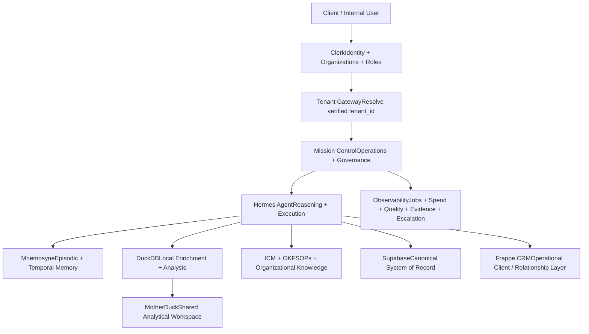
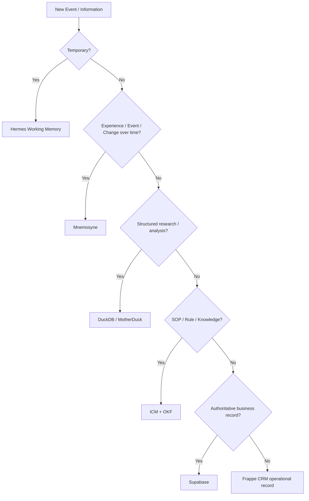
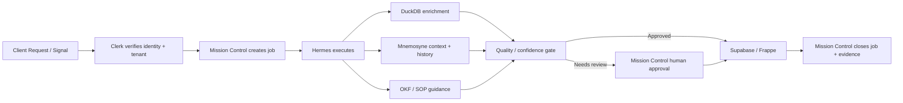

# 🧭 Executive Summary — Multi-Tenant Hermes Agent Platform + Mission Control

> Mirrored from Notion page `3cc9e94cf0a48118a540f1964fb0b6ce` on 2026-09-07. Source: https://app.notion.com/p/3cc9e94cf0a48118a540f1964fb0b6ce?pvs=204

{"type":"emoji","emoji":"🧭"}

> 
	**Executive Positioning**
	A secure, multi-tenant AI operations platform where each client receives an isolated Hermes Agent workspace, while a central Mission Control module governs orchestration, observability, approvals, cost, quality, and agent activity across the portfolio.

## 1. Executive Summary
The proposed platform is a **multi-tenant agent operating environment** designed to support multiple client organizations from a shared infrastructure without mixing client data, memory, workflows, or permissions.
Each tenant receives a private operational workspace powered by **Hermes Agent**. Hermes acts as the execution and reasoning layer, combining tools, workflows, client knowledge, structured data, episodic memory, and business systems to complete work on behalf of authorized users.
A centralized **Mission Control** module sits above the individual tenant environments. Mission Control is not the system of record and should not become another database. Its role is to coordinate and govern agent operations: dispatch work, assign agents, observe jobs, track status and spend, enforce approval gates, record evidence, evaluate quality, and escalate exceptions to humans.
The platform therefore separates **identity, execution, memory, enrichment, business records, CRM activity, and governance** into specialized layers.
## 2. Target Architecture

## 3. Core Platform Layers

Layer
Technology
Primary Responsibility

Identity & Tenancy
Clerk
Authentication, organizations, invitations, roles, tenant membership

Governance & Orchestration
Mission Control
Dispatch, job state, approvals, budgets, quality gates, evidence, escalation

Execution
Hermes Agent
Reasoning, tool use, workflows, agent execution, tenant-aware decisions

Episodic & Temporal Memory
Mnemosyne
Experiences, prior tasks, decisions, outcomes, entity history, facts over time

Enrichment Workspace
DuckDB
Scraped data, joins, scoring, deduplication, enrichment, temporary analytical work

Shared Analytics
MotherDuck
Cloud/shared analytical datasets and historical research accessible to authorized agents

Organizational Knowledge
ICM + Open Knowledge Framework
SOPs, operating rules, playbooks, policies, reusable business knowledge

Canonical Data
Supabase
Durable business objects, application state, authoritative tenant records

Operational CRM
Frappe CRM
Contacts, companies, opportunities, pipeline, follow-up and user-facing workflows

## 4. Multi-Tenant Design Principle
The platform follows a simple rule:
> **One shared platform, many isolated client workspaces.**
Clerk Organizations define the front-door organizational boundary. After authentication, the backend verifies the active organization and maps it to an internal `tenant_id`. Hermes never trusts a browser-supplied tenant identifier without server-side verification.
Every downstream operation inherits tenant context. This tenant identifier must be included in memory retrieval, data queries, tool authorization, CRM operations, analytical workloads, logs, evidence, and Mission Control jobs.
Typical tenant context:
```json
{
  "user_id": "user_xxx",
  "clerk_org_id": "org_xxx",
  "tenant_id": "tenant_xxx",
  "role": "tenant_admin",
  "agent_id": "hermes_primary",
  "workspace_id": "workspace_xxx"
}
```
## 5. Tenant Isolation Model
Each client workspace should maintain logical isolation across all major components.
- **Clerk:** organization membership and role-based access.
- **Hermes:** tenant-scoped sessions, tool permissions, context and workflows.
- **Mnemosyne:** every episodic/temporal memory tagged with `tenant_id`.
- **DuckDB:** separate tenant working databases or controlled tenant schemas.
- **MotherDuck:** tenant-specific databases/schemas and service permissions.
- **ICM / OKF:** separate client knowledge namespaces layered over shared platform methodology.
- **Supabase:** `tenant_id` on business records with Row Level Security as a hard enforcement boundary.
- **Frappe CRM:** tenant/client workspace permissions and role-aware operational views.
- **Mission Control:** tenant-aware job queues, budgets, approvals, agents and audit logs.
## 6. Mission Control Module
Mission Control should function as the **operations layer for the agent platform**.
It answers five executive questions:
1. **What is running?** — jobs, agents, workflows and queues.
2. **For which tenant?** — organization, workspace and authorized user.
3. **What is it costing?** — model usage, tokens, tool costs and budget consumption.
4. **Is the output trustworthy?** — quality gates, confidence, citations, evidence and validation status.
5. **Does a human need to intervene?** — approvals, exceptions, failures, risk or escalation.
### Recommended Mission Control Objects
- Tenant
- User / Requestor
- Job / Opportunity / Task
- Agent assigned
- Workflow
- Priority
- Status
- Model / provider
- Budget
- Token / API spend
- Input sources
- Evidence / receipts
- Confidence score
- Quality gate
- Approval status
- Escalation reason
- Output destination
- Audit trail
Mission Control should store enough operational metadata to govern work, but canonical client data should remain in Supabase/Frappe and analytical data should remain in DuckDB/MotherDuck.
## 7. Memory Architecture
Hermes should use a layered memory model rather than treating one database as universal memory.
### Working Memory — Hermes Runtime
Current objective, conversation, active task, tool results and temporary execution state.
### Episodic + Temporal Memory — Mnemosyne
What happened, when it happened, why a decision was made, what outcome occurred, how an entity or fact changed over time, and what Hermes learned from prior experiences.
### Analytical Memory — DuckDB / MotherDuck
Structured research, enrichment datasets, scoring outputs, historical datasets and analytical features.
### Organizational Knowledge — ICM + OKF
How the organization works: SOPs, standards, playbooks, rules, decision frameworks and reusable methodologies.
### Canonical Business Memory — Supabase
What the application considers officially true.
### Relationship / Operational Memory — Frappe CRM
What the business and its people are doing: opportunities, conversations, pipeline stages, follow-up and activities.
> 
	**Design Principle:** Mnemosyne remembers experiences. DuckDB understands datasets. OKF remembers how the organization works. Supabase records what is officially true. Frappe records what the business is doing.

## 8. Memory Promotion Rules
Hermes should decide where information belongs instead of automatically persisting every observation.

Memory and inferred facts should also carry metadata such as source, observed date, confidence, validity range and provenance so Hermes can distinguish verified facts from interpretations.
## 9. Platform Knowledge vs. Tenant Knowledge
A scalable design separates reusable platform intelligence from private client intelligence.
### Platform Knowledge
Reusable methodology that may be shared across tenants, subject to permissions:
- Opportunity Radar framework
- CRM operating procedures
- SEO audit methodology
- capital-raising workflows
- enrichment methods
- research templates
- quality-control standards
- OKF templates
### Tenant Knowledge
Strictly isolated client-specific information:
- contacts and relationships
- private documents
- project history
- client decisions
- opportunities
- research
- communications
- episodic agent history
- internal policies unique to the client
The operating principle is:
> **Hermes can learn the methodology globally while learning each client privately.**
## 10. Example Job Lifecycle

## 11. Strategic Benefits
### Client Isolation Without Duplicate Infrastructure
One platform can support many organizations while maintaining explicit tenant boundaries.
### Better Agent Continuity
Mnemosyne gives Hermes episodic memory so it can learn from prior jobs and outcomes rather than repeatedly starting from zero.
### Cleaner Business Data
DuckDB becomes the enrichment and experimentation layer so incomplete or low-confidence research does not automatically pollute the system of record.
### Human Governance
Mission Control gives operators a single place to inspect agent work, intervene, approve high-impact actions and control spending.
### Reusable Intellectual Property
ICM + OKF allows proven workflows and SOPs to become reusable platform knowledge while preserving tenant-specific customization.
### Model and Tool Flexibility
Hermes can remain the orchestration/execution runtime while model providers, enrichment tools and business systems evolve independently.
## 12. Recommended MVP
The first production version should prioritize isolation, observability and reliable workflow execution over excessive automation.
**Phase 1 — Foundation**
- Clerk authentication and Organizations
- Tenant resolver and authorization middleware
- Hermes tenant-aware session
- Supabase tenant schema + RLS
- Frappe CRM integration
**Phase 2 — Agent Memory & Enrichment**
- Mnemosyne episodic/temporal memory
- DuckDB enrichment workspace
- MotherDuck shared analytics where useful
- ICM / OKF client knowledge structure
**Phase 3 — Mission Control**
- job dispatch
- status and queue monitoring
- tenant filtering
- spend tracking
- evidence / receipts
- quality gates
- human approvals
- escalation workflow
**Phase 4 — Scale**
- agent teams by workflow
- per-tenant model/tool policies
- configurable budgets
- reusable workflow marketplace/templates
- learning loops based on job outcomes
- executive analytics across authorized tenants
## 13. Executive Recommendation
Build the platform around **Hermes as the execution engine and Mission Control as the governance plane**.
Do not force one database to perform every function. Maintain clear responsibility boundaries:
**Clerk → identity and tenancy**  
**Mission Control → orchestration and governance**  
**Hermes → reasoning and execution**  
**Mnemosyne → episodic and temporal memory**  
**DuckDB / MotherDuck → enrichment and analytics**  
**ICM + OKF → organizational knowledge**  
**Supabase → canonical system of record**  
**Frappe CRM → client operations and relationship workflow**
This architecture creates a practical foundation for a managed AI platform that can serve multiple businesses from shared infrastructure while preserving client isolation, auditability, operational control and reusable intelligence.