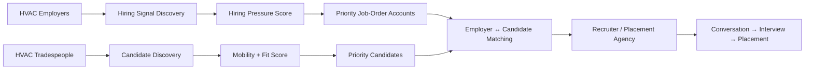
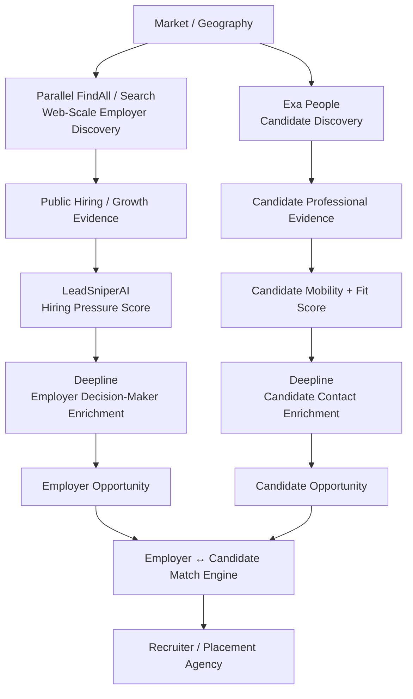
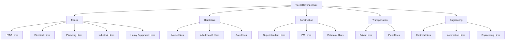

# 🧰 HVAC Hires — Executive Summary & Operating Model

> Mirrored from Notion page `3b99e94cf0a481db95d1e6cc129ff639` on 2026-09-07. Source: https://app.notion.com/p/3b99e94cf0a481db95d1e6cc129ff639?pvs=204

{"type":"emoji","emoji":"🧰"}

> 
	**HVAC Hires** is a two-sided recruiting intelligence and sourcing service designed to help staffing, recruiting, and placement agencies identify **HVAC employers with urgent hiring demand** and **qualified tradespeople who may be willing to change jobs**. The goal is to replace generic lead lists and resume databases with prioritized, evidence-backed hiring opportunities and candidate matches.

# Executive Objective
HVAC recruiting has two separate problems:
1. **Employer demand** — which contractors actually need people now?
2. **Candidate supply** — which technicians are qualified, reachable, and realistically open to moving?
HVAC Hires connects both sides into one operating system:

The product is not positioned as cold email, scraping, or list building. It is positioned as:
> **A recruiting opportunity intelligence service that continuously identifies HVAC companies under hiring pressure, surfaces qualified technicians likely to consider a move, and prioritizes the best employer-candidate matches for recruiters to pursue.**
# Primary Customer
The initial customer is a **specialist recruiting or placement agency** serving HVAC, refrigeration, mechanical services, construction, skilled trades, or adjacent field-service industries.
Best initial customer profile:
- 2–25 recruiters
- Specialist rather than generalist agency
- Already places technicians, installers, service managers, supervisors, or skilled trades
- Needs more job orders, more candidates, or both
- Has placement economics high enough to justify recurring sourcing/intelligence spend
- Can act quickly on qualified opportunities
# The Two-Sided HVAC Hires Model
## Engine 1 — Employer Demand / Hiring Pressure
**Primary system:** LeadSniperAI
LeadSniperAI answers:
> **Which HVAC companies have the strongest evidence that they need recruiting help right now?**
### Employer Discovery Sources
- Google Maps / Google Business Profiles
- Company websites
- Careers pages
- Job boards
- Local directories
- Trade associations
- Chambers of commerce
- Contractor directories
- Company news
- Expansion / new-location announcements
- Public project and service-area changes
### High-Value Hiring Signals
- Active HVAC technician openings
- Multiple technician openings
- Refrigeration mechanic openings
- Installer / helper / apprentice openings
- Service manager or operations-manager openings
- Jobs reposted repeatedly
- Vacancies persistent for 30–60+ days
- Hiring across multiple locations
- New service territories
- New branch or location
- Fleet / service-area expansion
- Acquisition or merger
- New large contracts / projects
- Careers page updated repeatedly
- Sudden hiring acceleration
### Hiring Pressure Score
Illustrative scoring model:

Category
Illustrative Weight

Active hiring intent
35%

Vacancy persistence / difficulty
25%

Hiring acceleration
15%

Expansion / growth pressure
15%

Evidence quality / recency
10%

Recommended priority bands:
- **80–100:** recruiter should pursue immediately
- **65–79:** high-priority account
- **50–64:** monitor / nurture
- **Below 50:** database only
### Example Employer Opportunity
> **ABC Mechanical — Hiring Pressure: 92/100**3 HVAC service technician openings1 refrigeration mechanic vacancyService Manager opening addedJobs reposted within 45 daysHiring across Surrey and LangleyLikely requirement: 4–6 field hires**Recommended action:** recruiter job-order outreach now
# Engine 2 — Candidate Talent Radar
**Primary systems:** Exa + Scrapling / web intelligence + Deepline
The candidate engine answers:
> **Who has the right HVAC skills, who is reachable, and who is more likely than average to consider another job?**
## Candidate Discovery Sources
### Exa / semantic people discovery
Use Exa to discover:
- HVAC service technicians
- Refrigeration mechanics
- Red Seal technicians
- Journeypersons
- Apprentices
- HVAC installers
- Controls / BAS technicians
- Commercial-service technicians
- Service supervisors
- Technicians currently or formerly employed by target HVAC companies
Recommended search pattern:
**Role + skill + geography + experience + specialization**
Example queries:
- Commercial HVAC service technicians in Metro Vancouver with refrigeration experience
- Red Seal refrigeration mechanics in Surrey or Langley
- HVAC technicians with 3–10 years experience in British Columbia
- Former technicians from known regional HVAC contractors
## Candidate Signal Research
Scrapling or other compliant public-web research tools can inspect job-relevant public sources for changes and events such as:
- Recent professional-profile update
- New certification
- Red Seal completion
- Apprenticeship level completion
- Training graduation
- Recent employer departure
- Job-search / availability indication
- Relocation
- Professional post asking about jobs or compensation
- Public career-transition signal
- Current-employer layoffs or restructuring
The system should use **job-relevant professional signals**, not indiscriminate personal-social-media profiling.
# Candidate Mobility Score
Candidate scoring should separate **fit** from **likelihood to move**.
## A. Role Fit — 40 points
- Correct HVAC / refrigeration occupation
- Required certification
- Relevant years of experience
- Commercial / residential specialization
- Service / installation / controls fit
- Correct geography
## B. Mobility Signals — 40 points
- Explicit job-search or availability signal
- Recently updated professional profile
- New certification
- Apprenticeship completion
- Employer departure
- Relocation
- Public professional dissatisfaction with pay, progression, schedule, or job conditions
- Current employer layoffs / restructuring
## C. Reachability — 20 points
- Verified email
- Verified telephone
- Valid professional profile
- Permission / opt-in where required
Priority bands:
- **80–100:** human review + outreach
- **65–79:** enrich + pursue / watch
- **50–64:** nurture
- **Below 50:** retain for future monitoring
# Candidate 360 Profile
The objective is not simply a resume. Each qualified candidate should become a structured Candidate 360 record:
```plain text
Name
Current role
Current employer
Location
Years of experience
Certifications
HVAC specialization
Residential / commercial / industrial
Service / install / controls / refrigeration
Current compensation range if voluntarily provided
Desired compensation
Maximum commute
Desired territory
On-call preference
Company-truck preference
Career goals
Availability / mobility signal
Verified contact details
Source evidence
Mobility score
Fit score
Consent / relationship status
```
The highest-value first-party question is:
> **What would an employer have to offer for you to seriously consider changing jobs?**
This converts a passive worker into an actionable recruiting profile without requiring them to become an active job seeker.
# Deepline — Enrichment and Verification Layer
Deepline should operate after a candidate or employer has earned the right to be enriched.
For employers:
**Qualified employer → owner / president / service manager / operations / HR / recruiting contact → email / phone validation**
For candidates:
**Qualified candidate → identity resolution → contact waterfall → verification → recruiter-ready record**
Operating principle:
> **Do not spend enrichment credits on an unqualified universe. Discover → score → enrich → verify → contact.**
# Employer ↔ Candidate Matching Engine
Once both sides are scored, HVAC Hires calculates an employer-candidate Match Score.
Illustrative match dimensions:

Dimension
Illustrative Weight

Skill / role fit
30%

Certification
15%

Geography / commute
15%

Experience
10%

Compensation compatibility
10%

Candidate mobility
10%

Employer hiring pressure
10%

Example:
> **Employer:** ABC Heating — Hiring Pressure 91/100**Role:** Commercial HVAC Service Technician**Candidate:** Mike R. — Mobility 87/100**Skills Match:** 96%**Geography:** 100%**Compensation Match:** 90%**Overall Match Score:** **94/100****Recommended action:** recruiter calls candidate and employer now
# Recruiting Opportunity Feed
The core deliverable for a placement agency should be a prioritized daily or weekly feed rather than a static spreadsheet.
Each opportunity should include:
- Employer
- Hiring Pressure Score
- Hiring evidence
- Open roles
- Vacancy age
- Geography
- Estimated hiring requirement
- Relevant hiring decision-maker
- Best outreach angle
- Number of matching candidates
- Top candidate Match Scores
- Recommended next action
Example:
> **High-Priority Recruiting Opportunity**Employer: ABC MechanicalHiring Pressure: 92Need: 3–5 commercial HVAC techniciansCandidate pool: 14High-mobility candidates: 4Best match: 94/100Decision-maker: Service Manager**Action:** pursue employer today; contact top 4 candidates if job order confirmed
# Candidate Acquisition Engine
Public-data discovery should be supplemented by first-party candidate acquisition.
## Candidate Ad Funnel
Potential message:
> **HVAC Techs — Curious What You're Worth?**Privately compare current HVAC opportunities in your area. You do not need to be actively looking for a job.
Or:
> **Not looking for another HVAC job? That's fine. Tell us what an employer would have to offer for you to consider one.**
Capture:
- Trade
- Certification
- Experience
- Postal code / geography
- Specialization
- Desired role
- Current / desired pay ranges when volunteered
- Commute tolerance
- Schedule preferences
- On-call preferences
- Truck / tool requirements
- Willingness to interview
This builds a proprietary, permissioned passive-candidate pool.
# Additional Candidate Supply Channels
HVAC Hires should gradually develop multiple candidate channels:
- Trade schools
- Apprenticeship programs
- Newly certified workers
- Red Seal progression
- Referral programs
- Technician ambassador network
- Industry associations
- Trade communities
- Search-engine inbound
- Salary / compensation lead magnets
- Social content
- Former-employer mapping
- Adjacent-trade conversion
Adjacent talent pools may include:
- Automotive technicians
- Industrial mechanics
- Millwrights
- Electricians
- Building-maintenance technicians
- Controls technicians
- Appliance technicians
- Mechanically trained veterans
Maintain separate categories for:
**Ready Now** and **Trainable Talent**.
# Recommended Commercial Offers
## Offer 1 — Employer Hiring Opportunity Feed
For agencies that have candidate capacity but need more job orders.
Deliver:
- High-pressure HVAC employers
- Hiring evidence
- Decision-makers
- Prioritized recruiter outreach recommendations
## Offer 2 — HVAC Talent Radar
For agencies with job orders but insufficient candidate supply.
Deliver:
- Qualified candidate discovery
- Mobility scoring
- Candidate enrichment
- Priority candidate queue
## Offer 3 — HVAC Match Feed
Two-sided employer-candidate opportunities.
Deliver:
- High-pressure employer
- Matching candidate pool
- Ranked Match Scores
- Recommended recruiter action
## Offer 4 — Managed Recruiting Pipeline
HVAC Hires manages:
- Employer hunting
- Candidate sourcing
- Enrichment
- Qualification
- Appointment / conversation generation
- Recruiter handoff
# Initial Pricing Hypothesis
Validate manually before standardizing pricing.

Offer
Initial Hypothesis

2-week pilot
\$750–\$1,000

Employer Opportunity Feed
\$1,500–\$2,000/month

Talent Radar
\$1,500–\$2,500/month

Matched Recruiting Pipeline
\$2,500–\$4,000+/month

Candidate sourcing / appointment layer
Add-on or performance component

Pricing should be justified against the agency's placement economics rather than the cost of emails, scraping, or software.
# 30-Day MVP
Do **not** build a full recruiting platform first.
## Market
Start with one narrow wedge:
**HVAC / Refrigeration — Metro Vancouver**
## Employer Target
- Discover 100 HVAC / mechanical contractors
- Research 50
- Identify 25 with meaningful hiring pressure
- Enrich decision-makers for qualified accounts only
## Candidate Target
- Discover 250 technicians / refrigeration mechanics / apprentices
- Deep-review 100
- Identify 50 credible high-fit or high-mobility candidates
- Enrich 25–50 selectively
- Obtain permission / conversations wherever practical
## Match Target
Produce:
- 25 high-pressure employer opportunities
- 25 recruiter-ready candidates
- 10 strong employer-candidate matches
## Validation Questions
1. Will agencies pay for employer hiring intelligence?
2. Will agencies pay for candidate intelligence?
3. Which side is the bigger bottleneck: job orders or candidates?
4. Can the process create real recruiter conversations?
5. Can one recruiter turn the feed into interviews and placements?
6. Which signals correlate with successful placements?
# Key KPIs
Track outcomes through the entire funnel.
## Employer KPIs
- Employers discovered
- Employers researched
- High-pressure employers
- Decision-makers verified
- Recruiter outreach attempts
- Employer conversations
- Job orders created
## Candidate KPIs
- Candidates discovered
- Candidates qualified
- Candidates enriched
- Candidate conversations
- Candidates willing to interview
- Interviews generated
## Revenue KPIs
- Matches delivered
- Interviews
- Placements
- Placement revenue influenced
- Recruiter subscription revenue
- Cost per employer opportunity
- Cost per qualified candidate
- Cost per placement
# Privacy and Operating Guardrails
- Use job-relevant professional information and legitimate public sources.
- Respect source terms, access restrictions, applicable privacy rules, anti-spam rules, and recruiting regulations.
- Avoid indiscriminate scraping of private or personal social activity.
- Do not infer sensitive personal characteristics.
- Separate observable evidence from AI inference.
- Store source URLs and timestamps for important signals.
- Human-review high-mobility scores before outreach.
- Move candidates into a permission-based first-party relationship as early as possible.
- Do not imply that a person is actively job seeking unless there is evidence or the candidate confirms it.
# Proposed Technology Roles

System
Primary Role

LeadSniperAI
Employer discovery, hiring signals, Hiring Pressure scoring and prioritization

Exa
Candidate / people discovery and public-web professional discovery

Scrapling / web intelligence
Targeted public-source crawling, change detection and candidate/employer evidence

Deepline
Employer and candidate enrichment, provider waterfalls and verification

Hermes
Research, monitoring and signal classification

CRM
Employer, candidate, activity, relationship and placement workflow

Human recruiter
Qualification, relationship, job-order negotiation, interviews and placement

# Strategic Positioning
HVAC Hires should avoid competing directly as another job board, resume database, or generic recruitment lead provider.
Its differentiated position is:
> **Traditional recruiting databases tell you who exists. HVAC Hires tells you which employers appear to need people now, which tradespeople are most worth approaching now, and which employer-candidate combinations deserve recruiter attention first.**
The defensible asset becomes the accumulated data around:
- Hiring-pressure signals
- Candidate mobility signals
- Compensation and move conditions
- Technician career movement
- Employer talent demand
- Recruiter outcomes
- Interview outcomes
- Successful placements
Over time, the system can learn which signal combinations predict both **job-order creation** and **successful placement**, creating a recruiting-intelligence advantage that a static lead list cannot reproduce.
# Recommended Next Decision
Run the first HVAC Hires experiment manually before building automation:
**One trade + one geography + one agency customer + one measurable placement pipeline.**
Initial wedge:
**HVAC / Refrigeration technicians in Metro Vancouver.**
Success is not measured by the number of scraped companies or candidates. Success is measured by:
> **qualified employer conversations → job orders → candidate conversations → interviews → placements → recruiter revenue.**
# [Parallel.ai](http://Parallel.ai) — Web-Scale Discovery & Validation Layer
[Parallel.ai](http://Parallel.ai) should be added as a complementary research engine inside HVAC Hires, especially for **web-scale employer discovery, signal validation, and structured evidence collection**.
## Strategic Role
Parallel is not a replacement for LeadSniperAI. The recommended division of labor is:
**Parallel / Exa / Google = retrieval and discovery**  
**LeadSniperAI = HVAC-specific scoring, prioritization, matching, and revenue intelligence**
This keeps LeadSniperAI focused on proprietary decision logic instead of recreating a general-purpose web search engine.
## Employer-Demand Use Case
Parallel can be used to discover HVAC contractors that match a natural-language hiring thesis such as:
> Find commercial HVAC contractors in British Columbia showing evidence of active technician, refrigeration, installer, apprentice, service-manager, or operations hiring. Prioritize multiple openings, repeated postings, persistent vacancies, hiring across several locations, service-area expansion, new branches, acquisitions, or other growth signals.
Recommended structured output:
```plain text
company
website
location
services
open_roles
number_of_openings
posting_dates
repeat_posting
locations_hiring
management_roles
expansion_signals
evidence_urls
source_recency
```
LeadSniperAI then converts those observations into an HVAC-specific **Hiring Pressure Score** and recruiter recommendation.
## Candidate-Supply Use Case
Parallel can also complement Exa on candidate discovery by locating public professional evidence around people who match an HVAC talent thesis, including:
- HVAC service technicians
- Refrigeration mechanics
- Journeypersons and Red Seal tradespeople
- Apprentices completing training
- Controls / BAS technicians
- Former employees of target HVAC companies
- Public professional career-transition or availability signals
For candidate discovery, **Exa People remains the preferred first-pass professional index**, while Parallel is useful for broader web research and evidence validation around each candidate.
## Recommended HVAC Hires Architecture

## Revised Technology Responsibilities

System
Primary HVAC Hires Role

LeadSniperAI
Vertical orchestration, HVAC signal taxonomy, Hiring Pressure scoring, candidate/employer prioritization, matching, and revenue learning

[Parallel.ai](http://Parallel.ai)
Web-scale employer discovery, natural-language entity search, hiring/growth-signal validation, and structured evidence collection

Exa People
Professional-person and candidate discovery

Scrapling
Targeted crawling, recurring monitoring, page-change detection, and evidence extraction from selected public sources

Deepline
Employer and candidate contact enrichment, provider waterfalls, identity resolution, and verification

Hermes
Research orchestration, monitoring, signal classification, and evidence synthesis

## Core Architectural Principle
Do not attempt to make LeadSniperAI the search engine, scraper, enrichment database, and CRM all at once.
The stronger moat is:
> **HVAC-specific signal taxonomy + Hiring Pressure Score + Candidate Mobility Score + Match Score + placement outcome learning.**
External retrieval systems can change over time. The proprietary layer should remain the intelligence that determines **which employer needs help now, which technician is most likely to move, and which employer-candidate combination is most likely to produce a placement.**
# Expansion Verticals — Beyond HVAC
> 
	The HVAC Hires operating model is intentionally reusable. Once the employer-demand, candidate-mobility, matching, and recruiter-delivery workflows are validated in HVAC, the same system can be verticalized into other sectors where talent scarcity, vacancy cost, placement economics, and observable hiring signals are all strong.

## Vertical Selection Principle
Prioritize industries using the following formula:
> **Talent Scarcity × Vacancy Cost × Placement Fee × Detectable Employer Signals × Discoverable Candidate Supply**
The stronger all five dimensions are, the more attractive the vertical is for a recruiter-intelligence and placement-support service.
## Priority Vertical Ranking

Rank
Vertical
Recruiting Pain
Placement Economics
Fit for Model

1
Skilled Trades / Mechanical
Very High
High
Excellent

2
Healthcare
Extreme
Very High
Excellent

3
Industrial Maintenance / Manufacturing
High
High
Excellent

4
Construction
High
High
Excellent

5
Transportation / Trucking
High
Medium-High
Strong

6
Engineering / Specialized Technical
High
Very High
Strong

7
Automotive / Heavy Equipment
High
High
Strong

8
Home Care / Senior Care
Extreme Volume
Lower Per Placement
Strong for Volume Model

9
Hospitality / Food Service
High Turnover
Lower
Moderate

10
Warehousing / Logistics
High Volume
Lower
Moderate

## 1. Skilled Trades / Mechanical
Natural adjacencies to HVAC include:
- Electricians
- Plumbers
- Refrigeration mechanics
- Millwrights
- Industrial electricians
- Heavy-duty mechanics
- Elevator technicians
- Pipefitters
- Instrumentation technicians
- Building controls / BAS technicians
- Machinists
The advantage is architectural reuse: employer hiring signals, candidate certification, geography, compensation, and mobility indicators are all similar to HVAC.
Potential vertical products:
- **Electrical Hires**
- **Plumbing Hires**
- **Industrial Hires**
- **Heavy Equipment Hires**
## 2. Healthcare
High-value roles include:
- Registered Nurses
- Licensed Practical Nurses
- Nurse Practitioners
- Radiology technologists
- Sonographers
- Respiratory therapists
- Medical laboratory technologists
- Physiotherapists
- Occupational therapists
Employer signals may include:
- Multiple vacancies
- Long vacancy age
- Hiring bonuses
- Agency-worker usage
- Overtime pressure
- Rural / remote staffing difficulty
- Expansion of beds, clinics, or service lines
Healthcare can support high placement economics, but credentialing, licensing, and compliance complexity are materially higher than HVAC.
Potential vertical products:
- **Nurse Hires**
- **Allied Health Hires**
- **Care Hires**
## 3. Industrial Maintenance / Manufacturing
Priority roles:
- Millwrights
- Industrial electricians
- Maintenance mechanics
- Controls technicians
- PLC technicians
- CNC machinists
- Robotics technicians
- Welders
- Industrial engineers
This vertical is particularly attractive because an unfilled maintenance role can directly affect uptime, production capacity, and revenue.
High-value employer signals include:
- New production line
- Second or third shift expansion
- New plant / facility
- Maintenance backlog
- Repeated technical vacancies
- Plant modernization
- Automation investment
- Maintenance supervisor hiring
Potential product: **Industrial Hires**.
## 4. Construction
Priority roles:
- Superintendents
- Project Managers
- Estimators
- Site Supervisors
- Project Coordinators
- Safety Managers
- Civil construction supervisors
- Equipment operators
High-value hiring signals include:
- New project award
- Permit activity
- Geographic expansion
- Multiple simultaneous projects
- Superintendent or PM vacancy
- New branch / regional office
- Backlog growth
Potential vertical products:
- **Superintendent Hires**
- **PM Hires**
- **Estimator Hires**
## 5. Transportation / Trucking
Priority roles:
- Class 1 / AZ drivers
- Long-haul drivers
- Regional / local drivers
- Owner operators
- Heavy-duty fleet mechanics
- Dispatchers
- Fleet managers
Signals may include:
- Multiple driver openings
- New terminal
- Fleet expansion
- New distribution contract
- Sign-on bonus
- Repeated recruitment advertising
- Route expansion
Candidate matching should incorporate route preference, home-daily requirements, pay structure, equipment, geography, and long-haul versus regional preference.
Potential products:
- **Driver Hires**
- **Fleet Hires**
## 6. Engineering / Specialized Technical
Priority roles:
- Civil engineers
- Electrical engineers
- Controls engineers
- Automation engineers
- Manufacturing engineers
- Data-centre engineers
- Specialized infrastructure engineers
The appeal is strong placement economics. Higher compensation can support substantial contingency placement fees, making recruiter-intelligence spend easier to justify.
Potential vertical products:
- **Controls Hires**
- **Automation Hires**
- **Engineering Hires**
## 7. Automotive / Heavy Equipment
Priority roles:
- Heavy-duty mechanics
- Diesel mechanics
- Automotive technicians
- Equipment technicians
- Agricultural-equipment technicians
This vertical resembles HVAC because technicians are locally concentrated, employers compete on compensation and work conditions, service revenue depends directly on technician capacity, and technicians often refer other technicians.
Potential product: **Heavy Equipment Hires**.
## 8. Home Care / Senior Care
Priority roles:
- Personal support workers
- Home health aides
- Care aides
- Community support workers
This is a different operating model: lower placement value per worker, but much higher hiring volume and turnover.
The preferred offer would likely be **continuous candidate acquisition** rather than high-touch opportunity intelligence.
Example flow:
**Paid Ads → Candidate Application → Screening → Geography / Availability → Employer Match**
Potential product: **Care Hires**.
## 9. Hospitality / Food Service
Examples:
- Chefs
- Kitchen managers
- Restaurant managers
- Hotel operations staff
- Skilled culinary roles
The hiring pain can be real, but lower placement economics and high turnover make this less attractive for the initial intelligence-led model.
## 10. Warehousing / Logistics
Examples:
- Warehouse supervisors
- Forklift operators
- Distribution leads
- Logistics coordinators
- Operations supervisors
This sector may work best as a higher-volume staffing and candidate-acquisition service rather than the premium intelligence model.
# Long-Term Platform Concept — Talent Revenue Hunt
HVAC Hires can serve as the first vertical implementation of a broader reusable operating system:

# Reusable Technology Model Across Verticals
The core technical architecture remains largely unchanged:
**Parallel / LeadSniperAI → Employer Hiring Pressure**
**Exa / Parallel / Scrapling → Candidate Discovery + Mobility Signals**
**Deepline → Enrichment + Verification**
**Hiring Pressure Score + Candidate Mobility Score → Match Score**
**Recruiter / Placement Agency → Job Order → Interview → Placement → Revenue Attribution**
Only the vertical-specific signal taxonomy, credentials, candidate attributes, and matching logic need to change.
# Recommended Expansion Order
1. **HVAC / Refrigeration** — validate the base model.
2. **Industrial Maintenance** — millwrights, industrial electricians, controls, and maintenance technicians.
3. **Healthcare** — nurses and allied health professionals.
4. **Construction Management** — superintendents, project managers, and estimators.
5. **Heavy Equipment / Automotive Technical** — technicians and mechanics.
6. **Transportation** — drivers, fleet mechanics, and dispatch.
7. **Engineering / Automation** — specialized high-value professional placements.
> 
	**Strategic rule:** do not launch every vertical at once. Validate HVAC first, then reuse the proven sourcing, scoring, enrichment, matching, and recruiter-delivery infrastructure in the next highest-value vertical.

# Opportunity Matrix — Expansion Verticals
> 
	Use this matrix to prioritize which recruiting verticals should be tested after HVAC. Scores are directional MVP scores, not audited market-size estimates. The objective is to identify verticals where **talent scarcity, vacancy pain, placement economics, discoverable hiring signals, and candidate reachability** combine to create an attractive agency-facing service.

## Scoring Framework
Score each category from **1–10** and apply the following weights:

Factor
Weight

Talent scarcity
15%

Vacancy cost / urgency
15%

Placement economics
15%

Employer hiring-signal visibility
10%

Candidate discoverability
10%

Candidate mobility-signal visibility
10%

Ease of enrichment / contact
5%

Low regulatory / compliance complexity
5%

Low competitive intensity
5%

Ease of 30-day MVP
10%

## 10-Vertical Opportunity Matrix

Rank
Vertical
Scarcity
Vacancy Cost
Placement Economics
Employer Signals
Candidate Discovery
Mobility Signals
Enrichment
Compliance
Competition
MVP Ease
Overall /100

1
HVAC / Refrigeration / Mechanical Trades
9
9
8
9
8
8
8
8
7
10
86

2
Industrial Maintenance — Millwrights / Industrial Electricians / Controls
9
10
9
8
7
7
8
8
7
8
84

3
Heavy Equipment / Diesel / Fleet Technicians
9
9
8
8
8
8
8
8
7
8
82

4
Construction Management — PMs / Superintendents / Estimators
8
9
10
9
8
7
9
8
6
8
82

5
Healthcare — Nursing / Allied Health
10
10
10
9
8
8
8
4
5
6
81

6
Electricians / Plumbing / Adjacent Skilled Trades
9
8
8
8
8
8
8
8
7
8
81

7
Engineering / Controls / Automation
8
9
10
8
9
7
9
8
5
7
80

8
Trucking / Transportation
8
8
7
9
8
9
8
7
6
9
79

9
Home Care / Senior Care
10
8
5
9
8
9
7
5
6
8
76

10
Warehousing / Logistics
7
6
5
9
9
9
8
8
5
10
74

## Interpretation
### Tier 1 — Launch / Validate First
- **HVAC / Refrigeration / Mechanical Trades — 86**: already designed, high pain, highly visible hiring signals, strong fit with LeadSniperAI and Talent Radar.
- **Industrial Maintenance — 84**: millwrights, industrial electricians, PLC / controls and maintenance technicians create expensive production downtime when vacancies persist.
- **Heavy Equipment / Diesel — 82**: similar technician economics to HVAC, localized labor pools, and repeat demand from dealers, fleets and equipment operators.
- **Construction Management — 82**: project awards, expansion and staffing requirements create excellent employer-side signals; PM and superintendent placement fees can be substantial.
### Tier 2 — High-Value Expansion
- **Healthcare — 81**: extraordinary scarcity and placement value, but credentialing, privacy, licensing and compliance make the MVP more complex.
- **Electrical / Plumbing / Adjacent Trades — 81**: straightforward extension of the HVAC operating system with largely reusable sourcing and scoring logic.
- **Engineering / Controls / Automation — 80**: high-value placements and excellent digital candidate discoverability, though recruiter competition is stronger.
- **Trucking / Transportation — 79**: strong mobility signals and visible employer demand, but placement economics vary substantially by role and segment.
### Tier 3 — Volume Models
- **Home Care / Senior Care — 76**: exceptional hiring volume but lower revenue per placement; best suited to continuous candidate acquisition and staffing models.
- **Warehousing / Logistics — 74**: easy sourcing and high volume but lower placement economics and heavy competition make it less attractive for a premium intelligence product.
## Recommended Expansion Sequence
1. **HVAC / Refrigeration** — prove the two-sided model.
2. **Industrial Maintenance** — millwrights, industrial electricians, maintenance and controls technicians.
3. **Heavy Equipment / Diesel** — dealer, fleet, mining, construction and equipment-service markets.
4. **Construction Management** — superintendents, project managers and estimators.
5. **Electrical / Plumbing Trades** — reuse the field-service talent architecture.
6. **Engineering / Automation** — pursue higher-fee technical placements.
7. **Healthcare** — enter once credentialing and compliance workflows are ready.
## Vertical Selection Rule
A new vertical should generally score **80+** before receiving dedicated automation investment. A score below 80 can still be attractive when a specific recruiting partner already has strong distribution, exclusive job orders, or unusually favorable placement economics.
The core decision formula is:
> **Talent scarcity × vacancy cost × placement economics × detectable employer signals × identifiable candidates = vertical attractiveness.**
## Strategic Recommendation
Keep **HVAC Hires** as the initial wedge, but design the underlying data model and scoring engine as a reusable **Talent Revenue Hunt** platform. Employer Hiring Pressure, Candidate Mobility and Employer-Candidate Match Scores should remain configurable by vertical so each new market can inherit the same infrastructure while using industry-specific signals, certifications, titles and economics.
# Implementation Playbook — 30-Day HVAC Hiring Intelligence Pilot
> 
	**Implementation target:** prove a repeatable employer-to-candidate matching workflow with an estimated **75% probability of producing a commercially useful recruiting pipeline**. The pilot does not require multiple placements in Month 1. Success means the system consistently produces verified hiring opportunities, recruiter-ready candidates, strong matches, and recruiting conversations.

## Pilot Success Definition
Treat the pilot as successful when at least 75% of the following operating milestones are achieved:
- [ ] 25 high-pressure HVAC employers identified and verified.
- [ ] 20+ priority employers have a verified economic buyer / hiring decision-maker.
- [ ] 200+ plausible HVAC candidates identified.
- [ ] 150+ candidates contain enough job-relevant evidence to score.
- [ ] 50+ employer-candidate matches score above 75/100.
- [ ] 15+ priority employers receive evidence-led personalized outreach.
- [ ] 5+ employer replies are generated.
- [ ] 3+ recruiting conversations occur.
- [ ] At least one employer agrees to review candidates, discuss a job order, or explore a recruiting relationship.
## Operating Principle
**Do not build the full software platform first.** Run the first cycle as a research-assisted service:

```mermaid
flowchart LR
    A["200 employers discovered"] --> B["50 signal-qualified"]
    B --> C["25 priority employers"]
    C --> D["200+ candidates discovered"]
    D --> E["150 scored candidates"]
    E --> F["50+ strong matches"]
    F --> G["Human review"]
    G --> H["Employer + candidate outreach"]
    H --> I["Recruiting conversations"]
    I --> J["Job order / candidate review"]
    J --> K["Interview / placement feedback"]
    K --> L["Improve signal weights"]
```

Automate only the steps that prove they contribute to job orders, interviews, or placements.
# Week 1 — Employer Radar
## Objective
Build a verified list of companies experiencing meaningful HVAC hiring pressure.
## Step 1 — Select One Market
Initial recommended wedge: **HVAC / Refrigeration — Metro Vancouver**. If signal density is weak, test one high-demand U.S. metro before expanding further.
## Step 2 — Discover Employer Universe
Target: **200 companies discovered**.
Sources:
- Google Maps / Google Business Profiles
- Contractor and trade directories
- Company websites
- Careers pages
- Indeed / LinkedIn Jobs / ZipRecruiter and other appropriate job sources
- Chambers and associations
- Company news and expansion announcements
## Step 3 — Detect Hiring Events
For each employer collect evidence for:
- Technician openings
- Number of simultaneous openings
- Refrigeration / controls / installer openings
- Dispatcher + technician hiring
- Service Manager / Operations Manager opening
- Job reposting
- Vacancy age
- Multi-location hiring
- New territory / branch / service area
- Expansion, acquisition or major contract
- Reviews suggesting service delays or scheduling pressure
## Step 4 — Score Hiring Pressure
Use the existing Hiring Pressure Score.
Priority bands:
- **80–100:** immediate recruiter action
- **65–79:** high priority
- **50–64:** monitor
- **Below 50:** database only
## Week 1 Output
Target funnel:
**200 discovered → 50 signal-qualified → 25 priority employers**.
Each priority employer record must contain:
- Company
- Website
- Geography
- Open roles
- Vacancy age
- Hiring-pressure evidence
- Source URLs + timestamps
- Hiring Pressure Score
- Estimated hiring requirement
- Decision-maker role
- Recommended next action
## Week 1 Gate
If the team cannot identify **25 convincing high-pressure employers**, stop candidate scaling and change geography, source mix, or scoring thresholds first.
# Week 2 — Candidate Radar V1
## Objective
Identify plausible technicians around the employer demand already proven in Week 1.
## Candidate Discovery Rule
Search from employer demand outward rather than building a giant generic talent database.
For each priority employer, identify approximately 8–12 plausible candidates within the appropriate geographic radius.
## Discovery Stack
**Exa / Parallel** — open-web and structured candidate discovery.
**Trade schools / apprenticeship programs** — emerging supply events.
**Public professional sources** — role, employer, experience and credentials.
**Scrapling** — recurring monitoring of known sources.
**Hermes / ScrapeGraphAI** — evidence extraction and deeper research.
**Deepline** — enrichment only after candidates qualify.
## Candidate Record
Every usable candidate should contain:
```plain text
Name
Current role
Current employer
Metro / geography
Years of relevant experience
Residential / commercial / industrial
Service / install / controls / refrigeration
Certifications
Public professional evidence
Candidate Qualification Score
Candidate Mobility Score
Evidence confidence
Source URLs
Last verified date
Contact enrichment status
Consent / relationship status
```
## Candidate Evidence Standard
Never record unsupported statements such as:
> John wants to leave ABC Heating.
Use:
> Observable signal: recently completed certification. Mobility confidence: moderate.
The system records **evidence + inference + confidence separately**.
## Week 2 Output
Target:
**200–250 candidate observations → 150+ scoreable candidates → 50+ priority candidates**.
# Candidate Scoring Model
## Candidate Qualification Score — CQS
Illustrative weighting:

Dimension
Weight

Role / trade fit
25%

Relevant experience
20%

Specialty / equipment fit
15%

Certification
15%

Residential / commercial fit
10%

Geography
15%

## Candidate Mobility Score — CMS
Illustrative weighting:

Dimension
Weight

Explicit job-seeking intent
35%

Career transition event
25%

Professional activity
15%

Career timing
10%

Current-employer disruption
15%

Keep qualification and mobility separate. A highly qualified technician may have low observable mobility, while a slightly less experienced candidate may be far more reachable and receptive.
# Week 3 — Match Engine
## Employer Requirement Record
Normalize every employer role into:
```plain text
Company
Role
Location
Required years experience
Required certifications
Residential / commercial / industrial
Service / installation / controls specialty
Compensation if public
Schedule / on-call requirements
Hiring urgency
Hiring Pressure Score
```
## Employer Match Score — EMS
Illustrative weights:

Dimension
Weight

Role compatibility
30%

Geography
20%

Experience
20%

Specialty
15%

Certification
10%

Other explicit requirements
5%

## Placement Opportunity Score — POS
Initial formula:
```plain text
POS =
0.30 × Hiring Pressure Score
+ 0.25 × Candidate Qualification Score
+ 0.25 × Employer Match Score
+ 0.20 × Candidate Mobility Score
```
Example:
```plain text
HPS = 92
CQS = 88
EMS = 94
CMS = 70
POS = 87.1 / 100
```
Priority rule:
- **85–100:** immediate human review
- **75–84:** priority match
- **65–74:** monitor / enrich
- **Below 65:** do not spend outreach effort yet
# Human Review Gate
AI may:
**discover → research → extract → score → rank → recommend.**
A person approves:
**candidate contact → employer contact → representation → submission.**
Reviewer verifies:
- Evidence quality
- Correct role and trade
- Geography
- Credential relevance
- Match rationale
- Candidate mobility language
- Outreach wording
- No protected or irrelevant personal data used
# Week 3 — Employer Activation
## Outreach Principle
Do not sell generic recruiting. Sell **capacity recovery**.
First-touch message should reference observable hiring pressure and offer a useful next step.
Operational CTA:
> Would it be useful if I sent you a short summary of the 2–3 strongest local matches?
Avoid in first touch:
- Calendar links
- Attachments
- Fee discussion
- Claims that candidates are definitely looking
- Long agency pitch
## Outreach Volume
Initial target: **15–25 highly qualified employer touches per week**, not 150 generic emails per day.
# Candidate Activation
Candidate outreach should test interest without claiming private knowledge.
Operating approach:
> I came across your HVAC background while researching technicians in the local market. I'm working with employers looking for similar experience. Would you be open to hearing about a role if the compensation, schedule and opportunity were materially better than your current situation?
Move responsive candidates into a first-party permissioned relationship and complete Candidate 360 fields directly with them.
# Week 4 — Closed-Loop Validation
## Employer Funnel
```plain text
Employer detected
→ Hiring pressure verified
→ Decision-maker enriched
→ Contacted
→ Reply
→ Vacancy confirmed
→ Candidate brief requested
→ Job order / recruiting conversation
→ Candidate submitted
→ Interview
→ Placement
```
## Candidate Funnel
```plain text
Candidate discovered
→ Qualification verified
→ Mobility evidence reviewed
→ Enriched
→ Contacted
→ Responded
→ Open to opportunity
→ Screened
→ Submitted
→ Interview
→ Offer
→ Accepted
```
## Required Outcome Capture
For every touch record:
- Signal(s) that triggered research
- HPS / CQS / CMS / EMS / POS at time of outreach
- Outreach channel
- Reply outcome
- Employer interest
- Candidate interest
- Interview
- Offer
- Placement
- Reason lost / rejected when known
This becomes the dataset used to recalibrate the scoring system.
# Technology Implementation Sequence
## Stage 1 — Manual / Research-Assisted MVP
Use:
- LeadSniperAI — orchestration + scoring
- Google Maps / Serper — employer discovery
- ScrapeGraphAI — company / careers evidence
- Hermes — deeper research + monitoring
- Exa / Parallel — candidate discovery
- Scrapling — recurring known-source monitoring
- Deepline — selective enrichment + verification
- Mystrika or Smartlead — employer outbound actuator
- Atomic CRM — system of record
## Stage 2 — CRM Objects
Create or configure three core objects:
### Employer Opportunity
- Employer
- Role
- Hiring Pressure Score
- Evidence
- Decision-maker
- Outreach status
### Candidate
- Candidate 360
- Candidate Qualification Score
- Candidate Mobility Score
- Evidence
- Enrichment status
- Consent / relationship status
### Placement Opportunity
- Employer
- Role
- Candidate
- Employer Match Score
- Placement Opportunity Score
- Recruiter / owner
- Stage
Recommended stages:
**Detected → Verified → Matched → Approved → Contacted → Interested → Submitted → Interview → Offer → Placement**.
## Stage 3 — Automation
Automate only after manual validation identifies useful bottlenecks:
1. Employer monitoring
2. Signal extraction
3. Scoring
4. Candidate discovery queries
5. Evidence normalization
6. Enrichment routing
7. Match generation
8. Daily recruiter opportunity feed
9. CRM updates
10. Reporting and score recalibration
# 30-Day Pilot Funnel
```plain text
200 HVAC companies discovered
        ↓
50 hiring-signal accounts
        ↓
25 high-pressure employers
        ↓
200+ candidate profiles
        ↓
150+ scored candidates
        ↓
50+ matches >75
        ↓
15–25 employer activations
        ↓
5+ employer replies
        ↓
3+ recruiting conversations
        ↓
1+ job-order / candidate-review opportunity
```
# Daily Operating Cadence
## Research Block
- Detect new employer hiring events.
- Re-score priority accounts.
- Research candidate supply around high-pressure employers.
- Review stale evidence.
## Qualification Block
- Human-review top employer accounts.
- Human-review top candidate mobility events.
- Approve high-POS matches.
## Activation Block
- Send employer first touches.
- Contact approved candidates.
- Follow up on prior conversations.
## Feedback Block
- Log outcomes.
- Update CRM stages.
- Record objections and candidate motivations.
- Flag false-positive signals.
# Weekly Operating Review
Review these metrics every week:

Category
Primary KPI

Employer intelligence
High-pressure employers / researched employers

Candidate intelligence
Scoreable candidates / discovered candidates

Matching
Matches above 75 / candidates scored

Employer GTM
Positive replies / employer touches

Candidate GTM
Interested candidates / candidate contacts

Commercial
Job orders / recruiting conversations

Recruiting
Interviews / submissions

Revenue
Placements + influenced placement revenue

# 75% Success-Rating Rationale
Initial implementation confidence by component:

Component
Initial Confidence

Employer hiring-pressure detection
90%+

Decision-maker discovery
\~85%

Candidate discovery
\~80%

Candidate qualification
\~80%

Candidate mobility prediction
\~55–65% initially

Employer-candidate matching
\~80%

Creating qualified recruiting conversations
\~70–80%

The largest unknown is **candidate mobility prediction**. The pilot is intentionally structured to collect the response, interview and placement outcomes needed to replace assumed mobility weights with empirically observed weights.
# Expansion Gate
Do not expand into Plumbing, Electrical or other trades until the HVAC pilot demonstrates:
- Repeatable high-pressure employer identification
- Reliable candidate discovery
- Recruiter acceptance of match quality
- At least one job-order / candidate-review opportunity
- Clear learning on which candidate signals correlate with responses
Once proven, clone the architecture and replace the trade-specific qualification ontology, credential sources and signal weights.
> 
	**Long-term moat:** the proprietary dataset is not a list of HVAC technicians. It is the accumulated relationship between **observable hiring signals + candidate signals + match scores + actual recruiter outcomes**. Over time HVAC Hires can learn which combinations most strongly predict recruiter conversations, interviews and placements.